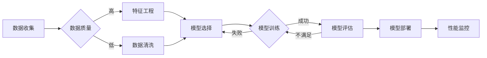

# Andrej Karpathy：人工智能的未来发展挑战

> 关键词：人工智能，深度学习，自动驾驶，自然语言处理，伦理问题，技术突破

## 1. 背景介绍

人工智能（AI）领域近年来取得了飞速发展，特别是在深度学习技术的推动下，AI在图像识别、自然语言处理、自动驾驶等领域取得了突破性的进展。Andrej Karpathy，作为深度学习领域的知名专家，曾在OpenAI工作，并在推特上发表了关于人工智能未来发展挑战的系列文章。本文将基于Karpathy的观点，深入探讨人工智能领域面临的挑战，以及对未来的展望。

## 2. 核心概念与联系

### 2.1 核心概念原理和架构的 Mermaid 流程图



### 2.2 关键概念解释

- **数据收集**：收集用于训练和评估AI模型的数据。
- **数据质量**：数据的质量直接影响模型的性能和泛化能力。
- **特征工程**：从原始数据中提取有用的特征，以帮助模型学习。
- **模型选择**：选择合适的模型架构和算法。
- **模型训练**：使用数据训练模型。
- **模型评估**：评估模型的性能。
- **模型部署**：将训练好的模型部署到实际应用中。
- **性能监控**：监控模型在应用中的性能，确保其稳定性和可靠性。

## 3. 核心算法原理 & 具体操作步骤

### 3.1 算法原理概述

人工智能的核心算法包括机器学习、深度学习、强化学习等。其中，深度学习是目前AI领域最热门的技术，它通过模拟人脑神经网络结构，实现复杂的模式识别和预测。

### 3.2 算法步骤详解

1. 数据收集：收集大量标注数据。
2. 特征工程：从原始数据中提取有用的特征。
3. 模型选择：选择合适的模型架构和算法。
4. 模型训练：使用数据训练模型。
5. 模型评估：评估模型的性能。
6. 模型部署：将训练好的模型部署到实际应用中。
7. 性能监控：监控模型在应用中的性能。

### 3.3 算法优缺点

- **优点**：
  - 高效的模型：能够处理大量数据，快速学习复杂模式。
  - 泛化能力强：在未见过的数据上也能取得不错的效果。
- **缺点**：
  - 计算量大：需要大量计算资源和时间进行训练。
  - 可解释性差：难以解释模型的决策过程。

### 3.4 算法应用领域

- 图像识别：如人脸识别、物体检测等。
- 自然语言处理：如机器翻译、文本分类等。
- 自动驾驶：如车辆识别、路径规划等。

## 4. 数学模型和公式 & 详细讲解 & 举例说明

### 4.1 数学模型构建

深度学习模型通常由多层神经网络组成，每层包含多个神经元。每个神经元通过加权求和和激活函数进行计算。

### 4.2 公式推导过程

以多层感知机（MLP）为例，其计算过程如下：

$$
z_i = \sum_{j=1}^{n} w_{ij}x_j + b_i
$$

其中，$z_i$ 表示第 $i$ 个神经元的输入，$w_{ij}$ 表示第 $j$ 个神经元到第 $i$ 个神经元的权重，$x_j$ 表示第 $j$ 个输入特征，$b_i$ 表示第 $i$ 个神经元的偏置。

### 4.3 案例分析与讲解

以图像识别任务为例，使用卷积神经网络（CNN）进行图像分类。首先，使用卷积层提取图像特征，然后使用池化层降低特征的空间维度，最后使用全连接层进行分类。

## 5. 项目实践：代码实例和详细解释说明

### 5.1 开发环境搭建

1. 安装Python环境。
2. 安装深度学习框架，如TensorFlow或PyTorch。
3. 准备数据集。

### 5.2 源代码详细实现

以下是一个使用PyTorch实现卷积神经网络进行图像分类的简单示例：

```python
import torch
import torch.nn as nn
import torch.optim as optim
from torch.utils.data import DataLoader
from torchvision import datasets, transforms

# 定义卷积神经网络
class CNN(nn.Module):
    def __init__(self):
        super(CNN, self).__init__()
        self.conv1 = nn.Conv2d(1, 32, kernel_size=3, stride=1, padding=1)
        self.conv2 = nn.Conv2d(32, 64, kernel_size=3, stride=1, padding=1)
        self.fc1 = nn.Linear(64 * 6 * 6, 128)
        self.fc2 = nn.Linear(128, 10)
        self.relu = nn.ReLU()

    def forward(self, x):
        x = self.relu(self.conv1(x))
        x = self.relu(self.conv2(x))
        x = x.view(-1, 64 * 6 * 6)
        x = self.relu(self.fc1(x))
        x = self.fc2(x)
        return x

# 加载数据集
transform = transforms.Compose([transforms.ToTensor()])
train_dataset = datasets.MNIST(root='./data', train=True, transform=transform, download=True)
test_dataset = datasets.MNIST(root='./data', train=False, transform=transform, download=True)

train_loader = DataLoader(train_dataset, batch_size=64, shuffle=True)
test_loader = DataLoader(test_dataset, batch_size=64, shuffle=False)

# 实例化模型
model = CNN()

# 设置优化器和损失函数
optimizer = optim.Adam(model.parameters(), lr=0.001)
criterion = nn.CrossEntropyLoss()

# 训练模型
for epoch in range(10):
    model.train()
    for batch_idx, (data, target) in enumerate(train_loader):
        optimizer.zero_grad()
        output = model(data)
        loss = criterion(output, target)
        loss.backward()
        optimizer.step()
        if batch_idx % 100 == 0:
            print(f"Train Epoch: {epoch} [{batch_idx * len(data)}/{len(train_loader.dataset)} ({100. * batch_idx / len(train_loader):.0f}%)]\tLoss: {loss.item():.6f}")

# 测试模型
model.eval()
test_loss = 0
correct = 0
with torch.no_grad():
    for data, target in test_loader:
        output = model(data)
        test_loss += criterion(output, target).item()  
        pred = output.argmax(dim=1, keepdim=True)
        correct += pred.eq(target.view_as(pred)).sum().item()

test_loss /= len(test_loader.dataset)
print(f'
Test set: Average loss: {test_loss:.4f}, Accuracy: {correct}/{len(test_loader.dataset)} ({100. * correct / len(test_loader.dataset):.0f}%)
')
```

### 5.3 代码解读与分析

1. 定义CNN模型，包括卷积层、池化层、全连接层和ReLU激活函数。
2. 加载MNIST数据集，并进行数据增强。
3. 实例化模型、优化器和损失函数。
4. 训练模型，并计算训练损失和准确率。
5. 测试模型，并计算测试损失和准确率。

## 6. 实际应用场景

### 6.1 自动驾驶

自动驾驶是AI领域的热门应用场景。通过使用深度学习技术，自动驾驶汽车能够识别道路上的障碍物、交通标志、行人等，并做出相应的决策。

### 6.2 自然语言处理

自然语言处理技术可以应用于机器翻译、智能客服、文本摘要等场景。通过使用深度学习模型，可以实现对自然语言的准确理解和生成。

### 6.3 医疗诊断

深度学习技术在医学图像识别、疾病诊断等方面具有巨大潜力。通过使用深度学习模型，可以实现对医学图像的准确识别和疾病诊断。

## 7. 工具和资源推荐

### 7.1 学习资源推荐

- 《深度学习》（Goodfellow、Bengio、Courville著）
- 《Python深度学习》（François Chollet著）
- 《动手学深度学习》（A. G. Howard等著）

### 7.2 开发工具推荐

- TensorFlow：Google推出的开源深度学习框架。
- PyTorch：Facebook AI Research推出的开源深度学习框架。
- Keras：Python深度学习库。

### 7.3 相关论文推荐

- "ImageNet Classification with Deep Convolutional Neural Networks"（Alex Krizhevsky等）
- "A Neural Algorithm of Artistic Style"（Gatys等）
- "Attention is All You Need"（Vaswani等）

## 8. 总结：未来发展趋势与挑战

### 8.1 研究成果总结

本文基于Andrej Karpathy的观点，探讨了人工智能领域面临的挑战，以及未来发展趋势。随着深度学习技术的不断发展，人工智能在各个领域都取得了突破性的进展。然而，人工智能领域仍面临诸多挑战，如数据质量、模型可解释性、安全性等。

### 8.2 未来发展趋势

1. 模型小型化：为了降低计算成本和功耗，模型小型化将成为重要趋势。
2. 模型可解释性：提高模型的可解释性，使其决策过程更加透明。
3. 安全性：确保人工智能系统的安全性，防止恶意利用。
4. 泛化能力：提高模型的泛化能力，使其能够在未见过的数据上取得不错的效果。

### 8.3 面临的挑战

1. 数据质量：数据质量直接影响模型的性能和泛化能力。
2. 模型可解释性：难以解释模型的决策过程。
3. 安全性：人工智能系统的安全性问题日益突出。
4. 泛化能力：模型在未见过的数据上难以取得理想的效果。

### 8.4 研究展望

随着深度学习技术的不断发展，人工智能在各个领域都取得了突破性的进展。未来，人工智能技术将更加成熟，并在更多领域得到应用。同时，人工智能领域仍面临诸多挑战，需要持续投入研究和探索。

## 9. 附录：常见问题与解答

### 9.1 常见问题

1. 人工智能是什么？
   人工智能（AI）是研究、开发用于模拟、延伸和扩展人的智能的理论、方法、技术及应用系统的一门新的技术科学。
2. 深度学习是什么？
   深度学习是机器学习的一个分支，它通过模拟人脑神经网络结构，实现复杂的模式识别和预测。
3. 人工智能的应用领域有哪些？
   人工智能的应用领域广泛，包括图像识别、自然语言处理、自动驾驶、医疗诊断等。
4. 人工智能有哪些挑战？
   人工智能领域面临诸多挑战，如数据质量、模型可解释性、安全性、泛化能力等。

### 9.2 解答

1. 人工智能是什么？
   人工智能（AI）是研究、开发用于模拟、延伸和扩展人的智能的理论、方法、技术及应用系统的一门新的技术科学。它旨在使计算机能够像人类一样思考和学习，从而解决各种复杂问题。
2. 深度学习是什么？
   深度学习是机器学习的一个分支，它通过模拟人脑神经网络结构，实现复杂的模式识别和预测。深度学习模型通常由多层神经网络组成，每层包含多个神经元，通过加权求和和激活函数进行计算。
3. 人工智能的应用领域有哪些？
   人工智能的应用领域广泛，包括图像识别、自然语言处理、自动驾驶、医疗诊断、智能客服、智能家居等。
4. 人工智能有哪些挑战？
   人工智能领域面临诸多挑战，如数据质量、模型可解释性、安全性、泛化能力、伦理问题等。

作者：禅与计算机程序设计艺术 / Zen and the Art of Computer Programming