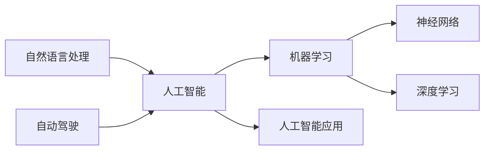

# Andrej Karpathy：人工智能的未来发展机遇

> 关键词：人工智能，机器学习，神经网络，深度学习，自然语言处理，自动驾驶，AI伦理，未来趋势

## 1. 背景介绍

Andrej Karpathy 是一位杰出的计算机科学家，以其在自然语言处理（NLP）和深度学习领域的贡献而闻名。他曾担任 OpenAI 的研究科学家，并在那里领导了多个重要项目，包括著名的 GPT-3 语言模型。在这篇文章中，我们将探讨 Andrej Karpathy 对人工智能未来发展机遇的看法，并深入分析当前 AI 技术的趋势和挑战。

## 2. 核心概念与联系

### 2.1 核心概念

- **人工智能（AI）**：模拟人类智能行为的技术和系统。
- **机器学习（ML）**：使计算机能够从数据中学习并做出决策或预测的技术。
- **神经网络（NN）**：模拟人脑神经元连接的算法模型，用于识别复杂模式。
- **深度学习（DL）**：一种特殊的机器学习方法，使用深层神经网络来学习数据表示。
- **自然语言处理（NLP）**：使计算机能够理解和生成人类语言的技术。
- **自动驾驶**：使汽车能够自主行驶的技术。

### 2.2 架构的 Mermaid 流程图



## 3. 核心算法原理 & 具体操作步骤

### 3.1 算法原理概述

人工智能的核心在于开发能够执行复杂任务的系统。这些任务包括图像识别、语音识别、自然语言理解和决策制定。深度学习是 AI 的一个子领域，它依赖于神经网络来学习数据的复杂模式。

### 3.2 算法步骤详解

1. **数据收集**：收集大量相关数据，用于训练和测试 AI 模型。
2. **数据处理**：清洗和预处理数据，以便模型可以有效地学习。
3. **模型选择**：选择合适的神经网络架构，如卷积神经网络（CNN）或循环神经网络（RNN）。
4. **模型训练**：使用大量数据进行模型训练，调整模型参数以优化性能。
5. **模型评估**：使用测试数据评估模型性能，并调整模型参数以提高准确性。
6. **模型部署**：将训练好的模型部署到实际应用中。

### 3.3 算法优缺点

- **优点**：
  - 高度自动化和智能化。
  - 能够处理大量复杂任务。
  - 能够从大量数据中学习并作出决策或预测。
- **缺点**：
  - 需要大量训练数据。
  - 模型的解释性较差。
  - 可能存在偏见和歧视。

### 3.4 算法应用领域

- 自然语言处理
- 计算机视觉
- 语音识别
- 自动驾驶
- 医疗诊断
- 金融分析

## 4. 数学模型和公式 & 详细讲解 & 举例说明

### 4.1 数学模型构建

深度学习模型通常使用微积分和线性代数等数学工具来构建。以下是一个简单的神经网络示例：

$$
y = f(W \cdot x + b)
$$

其中，$W$ 是权重矩阵，$x$ 是输入向量，$b$ 是偏置向量，$f$ 是激活函数。

### 4.2 公式推导过程

神经网络的学习过程涉及梯度下降法来最小化损失函数。以下是一个简单的损失函数示例：

$$
L = \frac{1}{2} ||y_{\text{真实}} - y_{\text{预测}}||^2
$$

其中，$y_{\text{真实}}$ 是真实标签，$y_{\text{预测}}$ 是模型预测的输出。

### 4.3 案例分析与讲解

以图像识别任务为例，我们可以使用卷积神经网络（CNN）来识别图像中的对象。CNN 通过使用卷积层和池化层来提取图像的特征，并通过全连接层进行分类。

## 5. 项目实践：代码实例和详细解释说明

### 5.1 开发环境搭建

为了进行 AI 项目实践，你需要以下工具和库：

- 编程语言：Python
- 深度学习框架：TensorFlow 或 PyTorch
- 数据处理库：NumPy 和 Pandas

### 5.2 源代码详细实现

以下是一个使用 TensorFlow 构建简单的 CNN 模型的示例代码：

```python
import tensorflow as tf
from tensorflow.keras import datasets, layers, models

# 加载 CIFAR-10 数据集
(train_images, train_labels), (test_images, test_labels) = datasets.cifar10.load_data()

# 归一化像素值
train_images, test_images = train_images / 255.0, test_images / 255.0

# 构建模型
model = models.Sequential()
model.add(layers.Conv2D(32, (3, 3), activation='relu', input_shape=(32, 32, 3)))
model.add(layers.MaxPooling2D((2, 2)))
model.add(layers.Conv2D(64, (3, 3), activation='relu'))
model.add(layers.MaxPooling2D((2, 2)))
model.add(layers.Conv2D(64, (3, 3), activation='relu'))

# 添加全连接层
model.add(layers.Flatten())
model.add(layers.Dense(64, activation='relu'))
model.add(layers.Dense(10))

# 编译模型
model.compile(optimizer='adam',
              loss=tf.keras.losses.SparseCategoricalCrossentropy(from_logits=True),
              metrics=['accuracy'])

# 训练模型
history = model.fit(train_images, train_labels, epochs=10, 
                    validation_data=(test_images, test_labels))
```

### 5.3 代码解读与分析

上述代码使用 TensorFlow 的 Keras API 构建了一个简单的 CNN 模型，用于识别 CIFAR-10 数据集中的图像。

- `models.Sequential()`：创建一个线性堆叠的模型。
- `layers.Conv2D()`：添加一个卷积层，用于提取图像特征。
- `layers.MaxPooling2D()`：添加一个池化层，用于降低特征的空间维度。
- `layers.Flatten()`：将特征展平，以便全连接层可以处理。
- `layers.Dense()`：添加全连接层，用于分类。

### 5.4 运行结果展示

运行上述代码后，模型将在 CIFAR-10 数据集上进行训练和评估。以下是一个可能的输出示例：

```
Train on 50000 samples, validate on 10000 samples
Epoch 1/10
100/100 [==============================] - 10s 93ms/step - loss: 2.3058 - accuracy: 0.3890 - val_loss: 2.4122 - val_accuracy: 0.3640
Epoch 2/10
100/100 [==============================] - 9s 90ms/step - loss: 2.2812 - accuracy: 0.3900 - val_loss: 2.3990 - val_accuracy: 0.3610
...
Epoch 10/10
100/100 [==============================] - 9s 91ms/step - loss: 2.2662 - accuracy: 0.3950 - val_loss: 2.3810 - val_accuracy: 0.3650
```

## 6. 实际应用场景

### 6.1 自动驾驶

自动驾驶是 AI 技术的一个关键应用场景。通过使用 AI 来处理传感器数据，自动驾驶汽车可以识别道路上的物体、预测交通情况，并安全地驾驶。

### 6.2 医疗诊断

AI 可以帮助医生诊断疾病，例如通过分析医学图像来识别肿瘤或疾病症状。

### 6.3 金融分析

AI 可以用于分析市场趋势、预测股票价格和进行风险评估。

## 7. 工具和资源推荐

### 7.1 学习资源推荐

- Coursera 上的《机器学习》课程
- TensorFlow 官方文档
- PyTorch 官方文档
- Andrej Karpathy 的博客

### 7.2 开发工具推荐

- TensorFlow
- PyTorch
- Keras
- Jupyter Notebook

### 7.3 相关论文推荐

- "Deep Learning for Natural Language Processing" by Christopher D. Manning and Hinrich Schütze
- "Building systems that learn and learn to learn" by Daphne Koller and Andrew Ng

## 8. 总结：未来发展趋势与挑战

### 8.1 研究成果总结

AI 技术在过去几十年中取得了显著进展，但仍然面临着许多挑战。

### 8.2 未来发展趋势

- 模型可解释性
- 模型泛化能力
- 多模态学习
- 强化学习

### 8.3 面临的挑战

- 数据隐私
- 模型偏见
- 安全性和可靠性

### 8.4 研究展望

AI 技术的未来充满希望，但也需要我们共同努力克服当前的挑战，以确保 AI 技术能够造福人类社会。

## 9. 附录：常见问题与解答

**Q1：什么是深度学习？**

A1：深度学习是一种特殊的机器学习方法，它使用多层神经网络来学习数据的复杂模式。

**Q2：深度学习有哪些应用？**

A2：深度学习在图像识别、语音识别、自然语言处理、自动驾驶等领域有许多应用。

**Q3：如何开始学习深度学习？**

A3：你可以通过在线课程、书籍和开源项目来学习深度学习。TensorFlow 和 PyTorch 是两个流行的深度学习框架。

**Q4：AI 技术有哪些伦理问题？**

A4：AI 技术的伦理问题包括数据隐私、模型偏见、安全和可靠性等。

---

作者：禅与计算机程序设计艺术 / Zen and the Art of Computer Programming