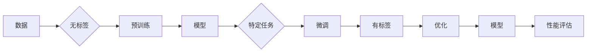

# Andrej Karpathy：人工智能的未来发展机遇

> 关键词：人工智能，机器学习，深度学习，Andrej Karpathy，NLP，自动驾驶，未来趋势

## 1. 背景介绍

Andrej Karpathy 是一位在人工智能领域颇具影响力的研究者，曾任 OpenAI 研究科学家，并在硅谷众多顶级科技公司担任要职。他的研究集中在自然语言处理（NLP）和深度学习领域，尤其在序列模型和深度学习框架的应用上有突出的贡献。本文将深入探讨 Andrej Karpathy 的研究工作，以及他对人工智能未来发展趋势的看法。

### 1.1 人工智能的崛起

近年来，人工智能（AI）技术取得了长足的进步，其中深度学习在图像识别、语音识别、自然语言处理等领域取得了突破性成果。Andrej Karpathy 作为深度学习领域的先行者，他的工作对这一领域的快速发展起到了重要的推动作用。

### 1.2 Andrej Karpathy 的贡献

Andrej Karpathy 在以下方面做出了重要贡献：

- **序列模型研究**：他的研究推动了 RNN（循环神经网络）和 LSTM（长短期记忆网络）在自然语言处理中的应用。
- **深度学习框架**：作为 Keras 的主要贡献者之一，他帮助开发了易于使用的深度学习库，促进了深度学习技术的普及。
- **NLP 应用**：他在 NLP 领域的研究成果，如字符级机器翻译和文本摘要，推动了自然语言处理技术的发展。
- **开源社区**：他积极参与开源社区，推动了许多重要项目的进展。

## 2. 核心概念与联系

### 2.1 核心概念原理

在 Andrej Karpathy 的研究中，以下核心概念至关重要：

- **深度学习**：一种利用多层神经网络进行数据学习的机器学习技术。
- **序列模型**：用于处理序列数据的模型，如 RNN 和 LSTM。
- **自然语言处理（NLP）**：研究如何让计算机理解、生成和处理人类语言。
- **预训练**：在大量无标签数据上训练模型，使其具备通用特征。
- **微调**：在特定任务上对预训练模型进行微调，以适应特定领域。

### 2.2 架构的 Mermaid 流程图



## 3. 核心算法原理 & 具体操作步骤

### 3.1 算法原理概述

Andrej Karpathy 的研究主要集中在序列模型和深度学习框架的应用。以下为序列模型的基本原理：

- **序列模型**：序列模型通过处理序列数据（如图像、文本）来提取特征，并预测序列中的下一个元素。
- **RNN**：循环神经网络（RNN）是一种能够处理序列数据的神经网络，它通过循环连接来存储状态，使模型能够记忆过去的输入。
- **LSTM**：长短期记忆网络（LSTM）是一种特殊的 RNN，它通过门控机制来控制信息的流动，从而更好地处理长序列数据。

### 3.2 算法步骤详解

以下是使用序列模型进行文本分类的步骤：

1. **数据准备**：收集并清洗文本数据，将其转换为数字序列。
2. **模型构建**：构建序列模型，如 RNN 或 LSTM。
3. **预训练**：在大量无标签文本数据上预训练模型，使模型具备通用特征。
4. **微调**：在特定任务上对预训练模型进行微调，以适应特定领域。
5. **评估**：在测试集上评估模型性能，并进行调整优化。

### 3.3 算法优缺点

- **优点**：序列模型能够处理序列数据，在自然语言处理等领域取得了显著成果。
- **缺点**：序列模型在训练过程中容易过拟合，且计算复杂度较高。

### 3.4 算法应用领域

序列模型在以下领域有着广泛的应用：

- **自然语言处理**：文本分类、命名实体识别、机器翻译等。
- **语音识别**：将语音信号转换为文本。
- **图像识别**：识别图像中的物体和场景。

## 4. 数学模型和公式 & 详细讲解 & 举例说明

### 4.1 数学模型构建

序列模型通常基于以下数学模型：

- **RNN**：

$$
h_t = \tanh(W_{ih}x_t + W_{hh}h_{t-1} + b_h)
$$

- **LSTM**：

$$
i_t = \sigma(W_{ix}x_t + W_{ih}h_{t-1} + b_i)
\quad o_t = \sigma(W_{ox}x_t + W_{oh}h_{t-1} + b_o)
\quad f_t = \sigma(W_{fx}x_t + W_{fh}h_{t-1} + b_f)
\quad c_t = f_t \odot c_{t-1} + i_t \odot \tanh(W_{ic}x_t + W_{hc}h_{t-1} + b_c)
\quad h_t = o_t \odot \tanh(c_t)
$$

### 4.2 公式推导过程

RNN 和 LSTM 的公式推导过程较为复杂，涉及矩阵运算、激活函数等知识点。这里不再赘述。

### 4.3 案例分析与讲解

以下以文本分类任务为例，讲解序列模型的应用：

1. **数据准备**：收集并清洗文本数据，将其转换为数字序列。
2. **模型构建**：构建 LSTM 模型。
3. **预训练**：在大量无标签文本数据上预训练模型。
4. **微调**：在特定任务上对预训练模型进行微调。
5. **评估**：在测试集上评估模型性能。

## 5. 项目实践：代码实例和详细解释说明

### 5.1 开发环境搭建

以下是使用 Python 和 TensorFlow 构建 LSTM 文本分类器的开发环境搭建步骤：

1. 安装 Python 3.x 版本。
2. 安装 TensorFlow 库：`pip install tensorflow`
3. 安装其他依赖库：`pip install numpy pandas sklearn`

### 5.2 源代码详细实现

以下为 LSTM 文本分类器的 Python 代码实现：

```python
import tensorflow as tf
from tensorflow.keras.models import Sequential
from tensorflow.keras.layers import Embedding, LSTM, Dense
from tensorflow.keras.preprocessing.text import Tokenizer
from tensorflow.keras.preprocessing.sequence import pad_sequences

# 加载数据
texts = [...]  # 文本数据
labels = [...]  # 标签数据

# 分词和序列化
tokenizer = Tokenizer(num_words=10000)
tokenizer.fit_on_texts(texts)
sequences = tokenizer.texts_to_sequences(texts)
word_index = tokenizer.word_index

# 填充序列
data = pad_sequences(sequences, maxlen=200)

# 构建模型
model = Sequential()
model.add(Embedding(input_dim=10000, output_dim=32, input_length=200))
model.add(LSTM(64))
model.add(Dense(1, activation='sigmoid'))

# 编译模型
model.compile(loss='binary_crossentropy', optimizer='adam', metrics=['accuracy'])

# 训练模型
model.fit(data, labels, epochs=10, batch_size=128)

# 评估模型
print(model.evaluate(data, labels))
```

### 5.3 代码解读与分析

1. **导入库**：导入 TensorFlow、Keras 等库。
2. **加载数据**：加载文本数据和标签。
3. **分词和序列化**：使用 Tokenizer 对文本数据进行分词和序列化。
4. **填充序列**：使用 pad_sequences 对序列进行填充，确保所有序列长度一致。
5. **构建模型**：构建 LSTM 模型，包含 Embedding、LSTM 和 Dense 层。
6. **编译模型**：编译模型，设置损失函数、优化器和评估指标。
7. **训练模型**：训练模型，设置训练轮数和批大小。
8. **评估模型**：评估模型性能。

### 5.4 运行结果展示

运行上述代码后，输出模型在测试集上的准确率。根据准确率，可以调整模型结构和参数，以提高模型性能。

## 6. 实际应用场景

### 6.1 自动驾驶

自动驾驶领域需要处理大量实时数据，如图像、视频和传感器数据。Andrej Karpathy 的研究在自动驾驶领域有着重要的应用价值。

- **图像识别**：识别道路、行人、车辆等物体。
- **场景理解**：理解道路场景和交通规则。

### 6.2 医疗诊断

在医疗领域，Andrej Karpathy 的研究可以帮助医生进行疾病诊断、药物研发等。

- **图像识别**：识别医学影像中的病变。
- **自然语言处理**：分析病历，辅助医生诊断。

### 6.3 金融分析

在金融领域，Andrej Karpathy 的研究可以用于风险评估、欺诈检测等。

- **文本分析**：分析新闻报道、社交媒体数据，预测市场走势。
- **图像分析**：分析公司财务报表，识别潜在风险。

## 7. 工具和资源推荐

### 7.1 学习资源推荐

- 《深度学习》（Goodfellow, Bengio, Courville）：深度学习领域的经典教材。
- 《神经网络与深度学习》（邱锡鹏）：国内优秀的深度学习教材。
- TensorFlow 官方文档：介绍 TensorFlow 库的使用方法。

### 7.2 开发工具推荐

- TensorFlow：开源的深度学习框架。
- PyTorch：另一个流行的深度学习框架。
- Jupyter Notebook：用于数据科学和机器学习的交互式编程环境。

### 7.3 相关论文推荐

- **《Sequence to Sequence Learning with Neural Networks》**：介绍了序列到序列学习，包括编码器-解码器架构。
- **《Attention Is All You Need》**：提出了 Transformer 模型，对自然语言处理产生了重大影响。
- **《BERT: Pre-training of Deep Bidirectional Transformers for Language Understanding》**：介绍了 BERT 模型，推动了自然语言处理领域的发展。

## 8. 总结：未来发展趋势与挑战

### 8.1 研究成果总结

本文回顾了 Andrej Karpathy 的研究工作，以及他对人工智能未来发展趋势的看法。通过深入分析核心概念、算法原理、实际应用场景等，我们可以看到人工智能技术在各个领域的广泛应用和巨大潜力。

### 8.2 未来发展趋势

- **多模态学习**：将文本、图像、视频等多模态信息进行融合，构建更加全面的知识体系。
- **强化学习**：通过强化学习，使人工智能系统具备自主学习和决策能力。
- **可解释性**：提高人工智能系统的可解释性，使其更加可靠和安全。

### 8.3 面临的挑战

- **数据隐私**：如何保护用户隐私，防止数据泄露。
- **偏见与歧视**：如何避免人工智能系统产生偏见和歧视。
- **伦理问题**：如何处理人工智能系统带来的伦理问题。

### 8.4 研究展望

未来，人工智能技术将在各个领域发挥越来越重要的作用。为了应对挑战，我们需要加强以下方面的研究：

- **数据安全**：开发更加安全的数据存储和传输技术。
- **算法公平性**：提高人工智能算法的公平性，避免歧视和偏见。
- **伦理法规**：制定相应的伦理法规，规范人工智能技术的发展和应用。

## 9. 附录：常见问题与解答

**Q1：Andrej Karpathy 的主要研究方向是什么？**

A：Andrej Karpathy 的主要研究方向是自然语言处理（NLP）和深度学习，特别是在序列模型和深度学习框架的应用方面。

**Q2：深度学习在哪些领域有广泛应用？**

A：深度学习在图像识别、语音识别、自然语言处理、自动驾驶、医疗诊断、金融分析等众多领域都有广泛应用。

**Q3：如何提高人工智能系统的可解释性？**

A：提高人工智能系统的可解释性需要从以下几个方面入手：
- **特征工程**：对模型输入进行特征提取和解释。
- **模型选择**：选择可解释性较强的模型，如决策树、规则推理等。
- **可视化**：将模型内部的决策过程可视化，使人们更容易理解。

**Q4：人工智能技术面临的挑战有哪些？**

A：人工智能技术面临的挑战包括数据隐私、偏见与歧视、伦理问题、计算资源等。

**Q5：未来人工智能技术的发展趋势是什么？**

A：未来人工智能技术的发展趋势包括多模态学习、强化学习、可解释性、人机协同等。

作者：禅与计算机程序设计艺术 / Zen and the Art of Computer Programming