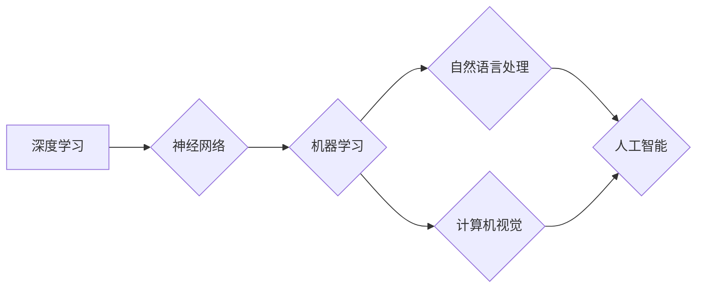

# Andrej Karpathy：人工智能的未来发展趋势

> 关键词：人工智能，深度学习，神经网络，机器学习，自然语言处理，计算机视觉，自动驾驶，图灵奖，Andrej Karpathy

## 1. 背景介绍

人工智能（AI）作为计算机科学的前沿领域，近年来取得了令人瞩目的进展。从AlphaGo战胜围棋世界冠军到自动驾驶汽车的诞生，AI技术正在深刻地改变着我们的生活方式。Andrej Karpathy，作为硅谷著名的AI科学家和工程师，曾在OpenAI担任研究科学家，对AI领域有着深刻的理解和独到的见解。本文将探讨Andrej Karpathy对未来人工智能发展趋势的看法，以及这些趋势对我们生活的影响。

## 2. 核心概念与联系

### 2.1 核心概念

- **深度学习（Deep Learning）**：一种利用多层神经网络进行学习的机器学习技术，能够自动从数据中学习特征表示。
- **神经网络（Neural Networks）**：模仿人脑神经元连接方式的计算模型，用于处理和分类数据。
- **机器学习（Machine Learning）**：使计算机能够从数据中学习并做出决策或预测的技术。
- **自然语言处理（Natural Language Processing，NLP）**：计算机科学和人工智能的分支，涉及机器理解和生成人类语言。
- **计算机视觉（Computer Vision）**：使计算机和系统通过图像和视频分析“看到”和理解世界。
- **自动驾驶（Autonomous Vehicles）**：使用AI技术实现车辆自主行驶，无需人类司机干预。

### 2.2 Mermaid 流程图



## 3. 核心算法原理 & 具体操作步骤

### 3.1 算法原理概述

深度学习算法的核心是神经网络，它通过学习大量的数据集来模拟人脑的工作方式。神经网络由多个层组成，包括输入层、隐藏层和输出层。数据在神经网络中传播，每一层都会对数据进行转换和处理，最终输出结果。

### 3.2 算法步骤详解

1. **数据预处理**：对原始数据进行清洗、归一化和转换，以便神经网络学习。
2. **模型设计**：选择合适的神经网络架构，如卷积神经网络（CNN）或循环神经网络（RNN）。
3. **模型训练**：使用训练数据集对模型进行训练，不断调整网络权重以最小化损失函数。
4. **模型评估**：使用验证数据集评估模型性能，调整超参数以优化模型。
5. **模型部署**：将训练好的模型部署到实际应用中，进行预测或决策。

### 3.3 算法优缺点

**优点**：

- **强大的学习能力**：能够从大量数据中学习复杂的特征和模式。
- **自动特征提取**：无需人工设计特征，能够自动从数据中提取有用的信息。
- **泛化能力**：在未见过的数据上也能保持较高的准确性。

**缺点**：

- **需要大量数据**：需要大量的标注数据进行训练。
- **计算复杂度高**：训练过程需要大量的计算资源和时间。
- **模型可解释性差**：难以解释模型的决策过程。

### 3.4 算法应用领域

- **自然语言处理**：机器翻译、情感分析、语音识别等。
- **计算机视觉**：图像分类、目标检测、人脸识别等。
- **推荐系统**：个性化推荐、广告投放等。
- **自动驾驶**：车辆定位、路径规划、障碍物检测等。

## 4. 数学模型和公式 & 详细讲解 & 举例说明

### 4.1 数学模型构建

深度学习中的神经网络模型通常由多个层组成，每层由多个神经元构成。每个神经元都包含一个权重矩阵和一个偏置向量。神经网络通过前向传播和反向传播算法来更新权重和偏置，以最小化损失函数。

### 4.2 公式推导过程

以下是一个简单的神经网络模型的公式推导过程：

- **前向传播**：

$$
y_l = \sigma(W_l \cdot a_{l-1} + b_l)
$$

其中，$y_l$ 是第 $l$ 层的输出，$W_l$ 是第 $l$ 层的权重矩阵，$a_{l-1}$ 是第 $l-1$ 层的输出，$b_l$ 是第 $l$ 层的偏置向量，$\sigma$ 是激活函数。

- **反向传播**：

$$
\delta_l = \frac{\partial J}{\partial z_l} = \sigma'(z_l) \cdot (z_l - y)
$$

其中，$\delta_l$ 是第 $l$ 层的误差，$J$ 是损失函数，$z_l$ 是第 $l$ 层的输出，$y$ 是真实标签。

### 4.3 案例分析与讲解

以图像分类任务为例，我们可以使用卷积神经网络（CNN）来对图像进行分类。以下是一个简单的CNN模型：

- **输入层**：接收原始图像数据。
- **卷积层**：提取图像特征，如边缘、纹理等。
- **池化层**：降低特征图的维度，减少计算量。
- **全连接层**：将特征映射到类别。
- **输出层**：输出分类结果。

通过训练，模型可以学习到图像特征，并在测试集上对新的图像进行分类。

## 5. 项目实践：代码实例和详细解释说明

### 5.1 开发环境搭建

为了进行深度学习项目实践，我们需要搭建以下开发环境：

- 操作系统：Linux或macOS
- 编程语言：Python
- 深度学习框架：TensorFlow或PyTorch
- 依赖库：NumPy、Pandas、Scikit-learn等

### 5.2 源代码详细实现

以下是一个使用PyTorch构建简单图像分类器的代码示例：

```python
import torch
import torch.nn as nn
import torch.optim as optim
from torch.utils.data import DataLoader, Dataset
from torchvision import datasets, transforms

# 定义神经网络模型
class SimpleCNN(nn.Module):
    def __init__(self):
        super(SimpleCNN, self).__init__()
        self.conv1 = nn.Conv2d(3, 16, kernel_size=3, stride=1, padding=1)
        self.conv2 = nn.Conv2d(16, 32, kernel_size=3, stride=1, padding=1)
        self.fc1 = nn.Linear(32 * 7 * 7, 10)

    def forward(self, x):
        x = torch.relu(self.conv1(x))
        x = torch.max_pool2d(x, kernel_size=2, stride=2)
        x = torch.relu(self.conv2(x))
        x = torch.max_pool2d(x, kernel_size=2, stride=2)
        x = x.view(x.size(0), -1)
        x = self.fc1(x)
        return x

# 训练模型
def train(model, dataloader, criterion, optimizer, epochs):
    model.train()
    for epoch in range(epochs):
        for inputs, labels in dataloader:
            optimizer.zero_grad()
            outputs = model(inputs)
            loss = criterion(outputs, labels)
            loss.backward()
            optimizer.step()
        print(f'Epoch {epoch+1}/{epochs}, Loss: {loss.item()}')

# 测试模型
def test(model, dataloader, criterion):
    model.eval()
    total_loss = 0
    total_correct = 0
    with torch.no_grad():
        for inputs, labels in dataloader:
            outputs = model(inputs)
            loss = criterion(outputs, labels)
            total_loss += loss.item()
            _, predicted = torch.max(outputs.data, 1)
            total_correct += (predicted == labels).sum().item()
    print(f'Test Loss: {total_loss/len(dataloader.dataset)}, Accuracy: {total_correct/len(dataloader.dataset)}')

# 加载数据
transform = transforms.Compose([transforms.ToTensor()])
train_dataset = datasets.CIFAR10(root='./data', train=True, download=True, transform=transform)
test_dataset = datasets.CIFAR10(root='./data', train=False, download=True, transform=transform)

train_loader = DataLoader(train_dataset, batch_size=64, shuffle=True)
test_loader = DataLoader(test_dataset, batch_size=64, shuffle=False)

# 初始化模型、损失函数和优化器
model = SimpleCNN()
criterion = nn.CrossEntropyLoss()
optimizer = optim.Adam(model.parameters(), lr=0.001)

# 训练和测试模型
train(model, train_loader, criterion, optimizer, epochs=10)
test(model, test_loader, criterion)
```

### 5.3 代码解读与分析

这段代码首先定义了一个简单的CNN模型，包括两个卷积层、两个池化层和一个全连接层。然后定义了训练和测试函数，使用CIFAR-10数据集进行训练和测试。最后，加载数据、初始化模型、损失函数和优化器，开始训练和测试过程。

### 5.4 运行结果展示

运行上述代码，可以在控制台看到模型的训练和测试损失以及准确率。通过调整模型结构、超参数等，可以进一步提高模型的性能。

## 6. 实际应用场景

AI技术在各个领域都有广泛的应用，以下是一些典型的应用场景：

- **医疗**：辅助诊断、药物研发、健康监测等。
- **金融**：风险评估、欺诈检测、智能投资等。
- **教育**：个性化学习、智能辅导、自动评分等。
- **交通**：自动驾驶、智能交通系统、智能停车场等。

## 7. 工具和资源推荐

### 7.1 学习资源推荐

- 《深度学习》（Ian Goodfellow等著）
- 《Python深度学习》（François Chollet著）
- Coursera上的深度学习课程

### 7.2 开发工具推荐

- TensorFlow
- PyTorch
- Keras

### 7.3 相关论文推荐

- "Deep Learning"（Ian Goodfellow等著）
- "Playing Atari with Deep Reinforcement Learning"（Volodymyr Mnih等著）
- "ImageNet Classification with Deep Convolutional Neural Networks"（Alex Krizhevsky等著）

## 8. 总结：未来发展趋势与挑战

### 8.1 研究成果总结

AI领域在过去几年取得了显著的进展，深度学习技术推动了各种应用的发展。然而，AI技术仍然面临着诸多挑战，如数据隐私、算法可解释性、偏见和歧视等。

### 8.2 未来发展趋势

- **更强大的模型和算法**：研究者们将致力于开发更强大的模型和算法，以处理更复杂的任务。
- **更高效的计算平台**：随着硬件技术的发展，AI计算将变得更加高效。
- **更广泛的应用领域**：AI技术将在更多领域得到应用，如医疗、教育、交通等。

### 8.3 面临的挑战

- **数据隐私**：AI应用需要收集和处理大量个人数据，如何保护用户隐私是一个重要问题。
- **算法可解释性**：目前许多AI算法的可解释性较差，如何提高算法的可解释性是一个挑战。
- **偏见和歧视**：AI算法可能存在偏见和歧视，如何避免这些问题是一个重要课题。

### 8.4 研究展望

未来，AI技术将朝着更加智能化、通用化、可解释化和安全的方向发展。通过不断的研究和创新，AI技术将更好地服务于人类社会，创造更加美好的未来。

## 9. 附录：常见问题与解答

**Q1：什么是深度学习？**

A：深度学习是一种利用多层神经网络进行学习的机器学习技术，能够自动从数据中学习特征表示。

**Q2：什么是神经网络？**

A：神经网络是一种模拟人脑神经元连接方式的计算模型，用于处理和分类数据。

**Q3：什么是机器学习？**

A：机器学习是一种使计算机能够从数据中学习并做出决策或预测的技术。

**Q4：什么是自然语言处理？**

A：自然语言处理是计算机科学和人工智能的分支，涉及机器理解和生成人类语言。

**Q5：什么是自动驾驶？**

A：自动驾驶是使用AI技术实现车辆自主行驶，无需人类司机干预。

**Q6：AI技术有哪些应用？**

A：AI技术在医疗、金融、教育、交通等多个领域都有广泛的应用。

**Q7：AI技术面临的挑战有哪些？**

A：AI技术面临的挑战包括数据隐私、算法可解释性、偏见和歧视等。

---

作者：禅与计算机程序设计艺术 / Zen and the Art of Computer Programming