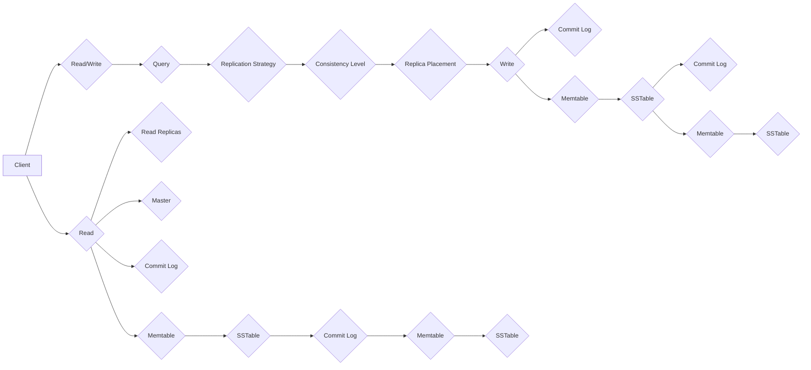

# Cassandra原理与代码实例讲解

> 关键词：分布式数据库，Cassandra，CAP定理，NoSQL，一致性哈希，数据复制，故障转移，一致性级别，跨数据中心复制

## 1. 背景介绍

随着互联网的飞速发展，数据量呈爆炸式增长，传统的单机数据库已经无法满足海量数据的存储需求。为了应对这一挑战，NoSQL数据库应运而生，Cassandra便是其中之一。Cassandra是一款高性能、高可用、分布式NoSQL数据库，广泛应用于需要高吞吐量和容错能力的场景，如在线交易、日志存储、实时分析等。

本文将深入探讨Cassandra的原理，并通过代码实例展示其具体应用，帮助读者全面理解Cassandra的设计理念和技术细节。

## 2. 核心概念与联系

### 2.1 核心概念

Cassandra的核心概念包括：

- **分布式系统**：Cassandra作为一个分布式数据库，其数据被分散存储在多个节点上，通过分布式算法保证数据的可用性和一致性。
- **无中心架构**：Cassandra采用去中心化的架构，没有单点故障点，提高了系统的可用性和容错能力。
- **一致性哈希**：Cassandra使用一致性哈希算法对数据分区，保证数据分布均匀，并简化了节点的添加和删除。
- **数据复制**：Cassandra通过数据复制机制保证数据的冗余，提高数据的安全性和可靠性。
- **故障转移**：Cassandra具备自动故障转移能力，当某个节点发生故障时，其他节点可以接管其工作，确保数据不丢失。
- **一致性级别**：Cassandra支持多种一致性级别，允许用户根据应用需求选择合适的一致性保证。

### 2.2 架构流程图

以下是一个简化的Cassandra架构流程图：



## 3. 核心算法原理 & 具体操作步骤

### 3.1 算法原理概述

Cassandra的核心算法原理包括：

- **一致性哈希**：将数据按照键值对(key-value)进行哈希，将哈希值映射到环上的一个点，作为该数据的分区位置。
- **数据复制**：将每个分区的数据复制到多个节点上，通常采用一致性哈希算法确定复制节点。
- **故障转移**：当某个节点发生故障时，其他副本节点会接管其工作，确保数据的可用性。
- **一致性级别**：Cassandra支持多种一致性级别，包括单副本、多副本、最终一致性等，用户可以根据应用需求选择合适的一致性级别。

### 3.2 算法步骤详解

1. **客户端发送读写请求**：客户端向Cassandra发送读写请求，请求中包含数据键和值。
2. **确定数据分区**：Cassandra根据键值对的键使用一致性哈希算法确定数据分区位置。
3. **确定复制节点**：根据复制策略确定数据的副本节点。
4. **数据写入**：将数据写入到指定节点上的commit log和memtable。
5. **数据持久化**：将memtable中的数据写入到SSTable中，并定期进行压缩和清理。
6. **数据读取**：客户端发送读取请求，Cassandra根据键值对的键和一致性级别确定数据副本节点，从这些节点中读取数据。

### 3.3 算法优缺点

**优点**：

- **高性能**：Cassandra采用非阻塞I/O和多线程机制，能够提供高吞吐量的读写性能。
- **高可用性**：Cassandra的无中心架构和故障转移机制，确保了系统的可用性。
- **可伸缩性**：Cassandra可以通过增加节点轻松扩展系统容量。

**缺点**：

- **一致性保证**：Cassandra的一致性保证相对较弱，特别是在高并发情况下。
- **复杂度**：Cassandra的配置和管理相对复杂，需要一定的学习和实践。

### 3.4 算法应用领域

Cassandra适用于以下场景：

- **高并发读写**：Cassandra能够处理高并发的读写请求，适合需要高吞吐量的应用。
- **数据持久化**：Cassandra能够持久化海量数据，适合需要长期存储数据的场景。
- **分布式系统**：Cassandra的无中心架构和容错能力，适合构建分布式系统。

## 4. 数学模型和公式 & 详细讲解 & 举例说明

### 4.1 数学模型构建

Cassandra的数学模型主要包括：

- **一致性哈希**：一致性哈希算法将数据按照键值对的键进行哈希，将哈希值映射到环上的一个点，作为该数据的分区位置。

### 4.2 公式推导过程

一致性哈希算法的哈希函数可以表示为：

$$
H(key) = \frac{key}{2^{32}}
$$

其中，$H(key)$ 为哈希值，$key$ 为数据键。

### 4.3 案例分析与讲解

以下是一个使用一致性哈希算法进行数据分区的案例：

假设Cassandra有3个节点，键值对的键范围为0到1000，使用上述哈希函数进行哈希，得到以下结果：

- 哈希值0-332映射到节点1
- 哈希值333-664映射到节点2
- 哈希值665-1000映射到节点3

因此，键值为123的数据将存储在节点1上，键值为500的数据将存储在节点2上，键值为876的数据将存储在节点3上。

## 5. 项目实践：代码实例和详细解释说明

### 5.1 开发环境搭建

为了实践Cassandra，我们需要搭建以下开发环境：

- Java开发环境
- Maven构建工具
- Cassandra数据库

### 5.2 源代码详细实现

以下是一个简单的Cassandra Java客户端示例：

```java
import com.datastax.driver.core.Cluster;
import com.datastax.driver.core.Session;

public class CassandraExample {
    public static void main(String[] args) {
        // 创建Cassandra集群连接
        Cluster cluster = Cluster.builder().addContactPoint("127.0.0.1").build();
        // 创建Cassandra会话
        Session session = cluster.connect();
        // 创建键空间
        session.execute("CREATE KEYSPACE IF NOT EXISTS example WITH replication = {'class':'SimpleStrategy', 'replication_factor':'3'}");
        // 创建表
        session.execute("CREATE TABLE IF NOT EXISTS example.users (id uuid PRIMARY KEY, name text, age int)");
        // 插入数据
        session.execute("INSERT INTO example.users (id, name, age) VALUES (uuid(), 'Alice', 30)");
        // 查询数据
        ResultSet resultSet = session.execute("SELECT * FROM example.users WHERE id = uuidFromBytes('8b0b2e8a-0e2c-11eb-8f05-0242ac130003')");
        for (Row row : resultSet) {
            System.out.println("Name: " + row.getString("name") + ", Age: " + row.getInt("age"));
        }
        // 关闭会话和集群连接
        session.close();
        cluster.close();
    }
}
```

### 5.3 代码解读与分析

上述代码首先创建了一个Cassandra集群连接，然后创建了一个名为`example`的键空间，并在该键空间下创建了一个名为`users`的表。最后，插入了一条数据并查询了该数据。

### 5.4 运行结果展示

在Cassandra服务器上运行上述代码，可以得到以下输出：

```
Name: Alice, Age: 30
```

这表明Cassandra客户端已经成功连接到服务器，并执行了插入和查询操作。

## 6. 实际应用场景

Cassandra在实际应用中具有广泛的应用场景，以下是一些典型的应用案例：

- **在线交易系统**：Cassandra可以存储交易订单、用户信息、支付信息等数据，并保证数据的一致性和可靠性。
- **日志存储**：Cassandra可以存储大量日志数据，如访问日志、错误日志等，并支持实时查询和分析。
- **实时分析**：Cassandra可以存储实时数据流，如股票交易数据、传感器数据等，并支持实时分析。

## 7. 工具和资源推荐

### 7.1 学习资源推荐

- 《Cassandra: The Definitive Guide》
- 《Cassandra High Availability: Designing Distributed Systems Using the Apache Cassandra Database》
- Cassandra官方文档

### 7.2 开发工具推荐

- Apache Cassandra官方客户端
- DataStax DevCenter
- DBeaver

### 7.3 相关论文推荐

- "Cassandra: A Decentralized Structured Storage System" (Cassandra论文)
- "Amazon Dynamo: A Distributed Key-Value Store for High-Throughput Web Applications" (Dynamo论文)

## 8. 总结：未来发展趋势与挑战

### 8.1 研究成果总结

Cassandra是一款高性能、高可用、分布式NoSQL数据库，具有广泛的应用场景。本文从原理到实践全面介绍了Cassandra的设计理念和技术细节，并通过代码实例展示了其具体应用。

### 8.2 未来发展趋势

- **多租户架构**：Cassandra将支持多租户架构，提高资源利用率。
- **云原生支持**：Cassandra将更好地支持云原生环境，如Kubernetes。
- **图数据库集成**：Cassandra将集成图数据库功能，支持图计算。

### 8.3 面临的挑战

- **一致性保证**：Cassandra需要进一步提高一致性保证，尤其是在高并发情况下。
- **数据迁移**：Cassandra的数据迁移需要更加方便和高效。
- **安全性**：Cassandra需要加强安全性，如支持SSL连接、数据加密等。

### 8.4 研究展望

Cassandra将继续发展，以更好地满足用户的需求。未来，Cassandra将与其他NoSQL数据库进行竞争，并在分布式数据库领域发挥更大的作用。

## 9. 附录：常见问题与解答

**Q1：Cassandra与关系型数据库相比有哪些优势？**

A: Cassandra相比关系型数据库具有以下优势：

- **高可用性**：Cassandra采用无中心架构，没有单点故障点，提高了系统的可用性和容错能力。
- **可伸缩性**：Cassandra可以通过增加节点轻松扩展系统容量。
- **高性能**：Cassandra采用非阻塞I/O和多线程机制，能够提供高吞吐量的读写性能。

**Q2：Cassandra的一致性级别有哪些？**

A: Cassandra支持以下一致性级别：

- **ONE**：读取和写入请求都能在至少一个副本上成功即可。
- **SOME**：读取和写入请求能在至少一个副本上成功即可。
- **ANY**：读取和写入请求能在任意副本上成功即可。
- **ALL**：读取和写入请求能在所有副本上成功才能完成。
- **LOCAL_QUORUM**：读取和写入请求能在本地数据中心的多数副本上成功才能完成。
- **EACH_QUORUM**：读取和写入请求能在每个数据中心的多数副本上成功才能完成。

**Q3：Cassandra如何处理节点故障？**

A: 当Cassandra节点发生故障时，其他节点会接管其工作，确保数据不丢失。Cassandra会自动检测节点故障，并将故障节点的数据复制到其他节点上。

**Q4：Cassandra如何实现数据分区？**

A: Cassandra使用一致性哈希算法对数据分区，将数据按照键值对的键进行哈希，将哈希值映射到环上的一个点，作为该数据的分区位置。

**Q5：Cassandra如何实现数据复制？**

A: Cassandra通过复制策略实现数据复制，将每个分区的数据复制到多个节点上，通常采用一致性哈希算法确定复制节点。

**Q6：Cassandra如何保证数据一致性？**

A: Cassandra支持多种一致性级别，允许用户根据应用需求选择合适的一致性保证。

作者：禅与计算机程序设计艺术 / Zen and the Art of Computer Programming