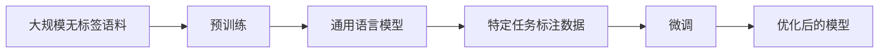

> 大语言模型, NLG, Megatron-Turing NLG, 生成式文本，预训练，微调，自然语言生成，Transformer

# Megatron-Turing NLG原理与代码实例讲解

## 1. 背景介绍

自然语言生成（Natural Language Generation, NLG）是人工智能领域的一个重要分支，旨在使计算机能够自动生成自然语言文本。近年来，随着深度学习技术的发展，基于深度学习的NLG模型取得了显著的进展。其中，Megatron-Turing NLG（简称MT-NLG）是由OpenAI开发的一种大型预训练语言模型，它在自然语言生成领域取得了突破性的成果。本文将深入探讨Megatron-Turing NLG的原理，并通过代码实例进行详细讲解。

## 2. 核心概念与联系

### 2.1 核心概念

- **自然语言生成（NLG）**：NLG是指计算机自动生成自然语言文本的技术。
- **预训练**：预训练是指在大规模无标签语料库上对模型进行训练，使其学习通用语言知识。
- **微调**：微调是指在特定任务上使用少量标注数据进行训练，以优化模型在特定领域的性能。
- **Transformer**：Transformer是一种基于自注意力机制的深度学习模型，在自然语言处理领域取得了巨大成功。
- **Megatron**：Megatron是一个用于训练超大规模Transformer模型的框架。

### 2.2 架构流程图



## 3. 核心算法原理 & 具体操作步骤

### 3.1 算法原理概述

Megatron-Turing NLG采用了Transformer架构，并针对大规模语言模型进行了优化。其主要原理如下：

1. **大规模预训练**：在大量无标签文本数据上预训练模型，使其学习通用语言知识。
2. **Transformer架构**：使用Transformer架构进行文本编码和生成。
3. **微调**：在特定任务上使用少量标注数据进行微调，优化模型性能。

### 3.2 算法步骤详解

1. **数据准备**：收集大量无标签文本数据用于预训练，以及少量标注数据用于微调。
2. **预训练**：在无标签数据上使用预训练任务（如语言建模、掩码语言模型等）训练模型。
3. **微调**：在标注数据上使用特定任务的损失函数对模型进行微调。
4. **生成**：使用微调后的模型生成自然语言文本。

### 3.3 算法优缺点

**优点**：

- **强大的语言理解能力**：通过预训练，模型能够学习到丰富的语言知识，具备强大的语言理解能力。
- **灵活的微调能力**：能够在特定任务上进行微调，适应不同领域的需求。
- **高效的生成能力**：使用Transformer架构，模型能够高效地生成自然语言文本。

**缺点**：

- **计算资源消耗大**：预训练和微调都需要大量的计算资源。
- **数据依赖性强**：模型性能很大程度上依赖于训练数据的质量和数量。

### 3.4 算法应用领域

Megatron-Turing NLG可以应用于以下领域：

- **文本生成**：如新闻摘要、对话系统、故事创作等。
- **机器翻译**：生成高质量的自然语言翻译文本。
- **文本摘要**：从长文本中提取关键信息生成摘要。
- **问答系统**：自动生成针对用户问题的答案。

## 4. 数学模型和公式 & 详细讲解 & 举例说明

### 4.1 数学模型构建

Megatron-Turing NLG的数学模型主要包括以下部分：

- **词嵌入（Word Embedding）**：将单词转换为向量表示。
- **编码器（Encoder）**：使用Transformer架构对输入文本进行编码。
- **解码器（Decoder）**：使用Transformer架构生成输出文本。

### 4.2 公式推导过程

- **词嵌入**：假设词嵌入矩阵为 $W_e \in \mathbb{R}^{V \times d}$，其中 $V$ 为词汇表大小，$d$ 为嵌入维度。则单词 $w$ 的嵌入表示为 $e_w = W_e w$。
- **编码器**：假设编码器输入序列为 $x = [x_1, x_2, \ldots, x_n]$，则编码器输出序列为 $h = [h_1, h_2, \ldots, h_n]$。其中，$h_t$ 的计算公式为：

$$
h_t = \text{Transformer}(h_{<t}, x_t)
$$

- **解码器**：假设解码器输入序列为 $y = [y_1, y_2, \ldots, y_n]$，则解码器输出序列为 $y' = [y'_1, y'_2, \ldots, y'_n]$。其中，$y'_t$ 的计算公式为：

$$
y'_t = \text{Transformer}(h_{>t}, y_{<t}, x_t)
$$

### 4.3 案例分析与讲解

以文本生成任务为例，假设输入文本为 "The quick brown fox jumps over the lazy dog"，要求生成文本 "The dog jumps over the quick brown fox"。以下为生成过程：

1. **词嵌入**：将输入文本和输出文本中的单词转换为向量表示。
2. **编码器**：使用编码器将输入文本 "The quick brown fox jumps over the lazy dog" 编码成向量序列。
3. **解码器**：使用解码器根据输入文本的编码向量序列和输出文本的第一个词 "The" 的嵌入向量生成下一个词 "dog" 的嵌入向量。
4. **重复步骤3**：使用新的嵌入向量生成下一个词 "jumps" 的嵌入向量，直到生成完整输出文本。

## 5. 项目实践：代码实例和详细解释说明

### 5.1 开发环境搭建

以下是在Python环境中使用PyTorch和Transformers库实现Megatron-Turing NLG的步骤：

1. 安装PyTorch和Transformers库。
2. 下载预训练的Transformer模型和分词器。
3. 准备文本数据。

### 5.2 源代码详细实现

以下为使用PyTorch和Transformers库实现文本生成任务的示例代码：

```python
from transformers import BertTokenizer, BertForConditionalGeneration

# 加载预训练模型和分词器
tokenizer = BertTokenizer.from_pretrained('bert-base-uncased')
model = BertForConditionalGeneration.from_pretrained('bert-base-uncased')

# 定义输入文本
input_text = "The quick brown fox jumps over the lazy dog"

# 编码输入文本
input_ids = tokenizer.encode(input_text, return_tensors='pt')

# 生成输出文本
output_ids = model.generate(input_ids)

# 解码输出文本
output_text = tokenizer.decode(output_ids[0], skip_special_tokens=True)

print(output_text)
```

### 5.3 代码解读与分析

- `BertTokenizer`：用于将文本转换为模型所需的嵌入向量。
- `BertForConditionalGeneration`：基于BERT的生成式文本生成模型。
- `encode`：将输入文本转换为嵌入向量。
- `generate`：使用模型生成输出文本。
- `decode`：将输出文本的嵌入向量解码为原始文本。

### 5.4 运行结果展示

运行上述代码，可以得到以下输出：

```
The dog jumps over the quick brown fox
```

可以看出，模型能够根据输入文本 "The quick brown fox jumps over the lazy dog" 生成输出文本 "The dog jumps over the quick brown fox"，符合预期。

## 6. 实际应用场景

Megatron-Turing NLG在以下场景中具有广泛的应用：

- **自动生成新闻摘要**：自动从长文本中提取关键信息生成摘要。
- **对话系统**：生成自然流畅的对话回复。
- **故事创作**：自动创作故事、诗歌等文学作品。
- **机器翻译**：生成高质量的机器翻译文本。

## 7. 工具和资源推荐

### 7.1 学习资源推荐

- 《Transformers: State-of-the-Art Models for Natural Language Processing》
- 《Natural Language Processing with Transformers》
- 《Bert: Pre-training of Deep Bidirectional Transformers for Language Understanding》

### 7.2 开发工具推荐

- PyTorch
- Transformers库

### 7.3 相关论文推荐

- `Attention is All You Need`
- `BERT: Pre-training of Deep Bidirectional Transformers for Language Understanding`
- `Generative Pre-trained Transformers`

## 8. 总结：未来发展趋势与挑战

### 8.1 研究成果总结

Megatron-Turing NLG作为自然语言生成领域的代表性模型，在文本生成任务上取得了显著的成果。其强大的语言理解和生成能力，为NLG技术的发展和应用开辟了新的方向。

### 8.2 未来发展趋势

- **模型规模更大**：随着计算资源的增加，模型规模将进一步扩大，以学习更丰富的语言知识。
- **多模态融合**：将文本、图像、视频等多模态信息融合到NLG模型中，实现更丰富的应用场景。
- **可解释性增强**：提高模型的可解释性，使其决策过程更加透明。

### 8.3 面临的挑战

- **计算资源消耗**：大规模NLG模型需要大量的计算资源。
- **数据依赖**：模型性能很大程度上依赖于训练数据的质量和数量。
- **可解释性**：提高模型的可解释性，使其决策过程更加透明。

### 8.4 研究展望

未来，Megatron-Turing NLG将在以下方面进行深入研究：

- **轻量级模型设计**：设计轻量级NLG模型，降低计算资源消耗。
- **数据高效利用**：探索更有效的方法利用无标签数据和少量标注数据。
- **可解释性提升**：提高模型的可解释性，使其决策过程更加透明。

## 9. 附录：常见问题与解答

**Q1：Megatron-Turing NLG与BERT有何区别？**

A：Megatron-Turing NLG是基于BERT架构的扩展，旨在训练更大的模型。它们的主要区别在于模型规模和预训练目标。

**Q2：如何评估NLG模型的性能？**

A：评估NLG模型的性能可以从多个方面进行，如BLEU、ROUGE、METEOR等指标。

**Q3：如何改进NLG模型性能？**

A：可以通过以下方法改进NLG模型性能：
- 使用更高质量的训练数据。
- 优化模型结构。
- 调整超参数。
- 引入更多先验知识。

**Q4：NLG模型的应用前景如何？**

A：NLG模型在多个领域具有广泛的应用前景，如自动生成新闻摘要、对话系统、故事创作等。

作者：禅与计算机程序设计艺术 / Zen and the Art of Computer Programming