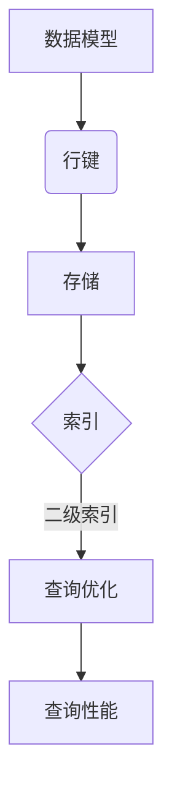

# Phoenix二级索引原理与代码实例讲解

> 关键词：Phoenix数据库，二级索引，数据模型，性能优化，SQL查询，索引构建，分布式系统

## 1. 背景介绍

随着数据量的不断增长和复杂性的提升，数据库索引在保证查询效率方面起着至关重要的作用。在分布式数据库系统中，索引的设计和优化尤为重要。Phoenix数据库，作为Apache HBase的开源SQL接口，提供了对HBase的SQL支持，其二级索引机制是保证查询性能的关键技术之一。

## 2. 核心概念与联系

### 2.1 核心概念

- **二级索引（Secondary Index）**：在数据库中，除了主键索引外，还可以创建其他索引来提高查询效率。二级索引允许对非主键列进行查询，从而避免全表扫描。
- **数据模型（Data Model）**：Phoenix中的数据模型是基于HBase的键值存储，其中行键（Row Key）是数据的唯一标识。
- **性能优化（Performance Optimization）**：通过合理构建索引，可以显著提升查询性能。
- **SQL查询（SQL Query）**：Phoenix支持标准的SQL语法，通过索引优化SQL查询。

### 2.2 核心概念原理和架构的 Mermaid 流程图



### 2.3 关系图

二级索引与数据模型、SQL查询和性能优化之间的关系可以概括如下：

1. 数据模型定义了数据的组织方式，行键是数据的唯一标识。
2. 在数据模型的基础上，可以创建二级索引来提高查询效率。
3. 当执行SQL查询时，Phoenix会自动利用二级索引进行查询优化。
4. 通过优化查询，可以显著提升查询性能。

## 3. 核心算法原理 & 具体操作步骤

### 3.1 算法原理概述

Phoenix的二级索引机制基于HBase的存储架构，通过在HBase表中为非主键列创建索引，实现快速的数据查询。索引存储在HBase表的额外列族中，通常与数据列族一起存储。

### 3.2 算法步骤详解

1. **创建二级索引**：使用`CREATE INDEX`语句为指定列创建索引。
2. **更新索引**：当表中的数据发生变化时，系统会自动更新索引。
3. **查询优化**：执行查询时，Phoenix会根据索引自动优化查询路径。
4. **读取索引**：从索引中读取数据，而不是直接从数据表中读取。

### 3.3 算法优缺点

**优点**：

- 提高查询效率：通过索引，可以快速定位到所需数据，避免全表扫描。
- 支持复杂查询：可以针对非主键列进行查询，支持复杂的SQL操作。

**缺点**：

- 索引增加存储开销：索引会占用额外的存储空间。
- 索引更新开销：数据更新时，需要同时更新索引，增加维护成本。

### 3.4 算法应用领域

- **大数据查询**：在处理大规模数据集时，索引可以显著提升查询效率。
- **实时查询**：在需要快速响应查询的场景中，索引是必不可少的。

## 4. 数学模型和公式 & 详细讲解 & 举例说明

### 4.1 数学模型构建

在Phoenix中，二级索引的数学模型可以表示为：

$$
\text{索引} = (\text{行键}, \text{索引列}, \text{数据})
$$

其中，行键是数据的唯一标识，索引列是用于查询的列，数据是实际的值。

### 4.2 公式推导过程

假设有一个表`employees`，包含列`employee_id`（行键）、`name`和`department`。我们可以为`department`列创建一个二级索引：

```sql
CREATE INDEX idx_department ON employees (department);
```

当执行查询`SELECT * FROM employees WHERE department = 'Engineering'`时，Phoenix会使用`idx_department`索引来快速定位到`department`为'Engineering'的行。

### 4.3 案例分析与讲解

以下是一个具体的案例，展示如何使用Phoenix创建二级索引并执行查询：

```sql
-- 创建employees表
CREATE TABLE employees (
    employee_id INT NOT NULL PRIMARY KEY,
    name VARCHAR(100),
    department VARCHAR(50)
);

-- 插入数据
INSERT INTO employees VALUES (1, 'Alice', 'Engineering');
INSERT INTO employees VALUES (2, 'Bob', 'Sales');
INSERT INTO employees VALUES (3, 'Charlie', 'Engineering');

-- 创建二级索引
CREATE INDEX idx_department ON employees (department);

-- 查询
SELECT * FROM employees WHERE department = 'Engineering';
```

输出结果：

```
+------------+-------+------------+
| employee_id| name  | department |
+------------+-------+------------+
| 1          | Alice | Engineering|
| 3          | Charlie| Engineering|
+------------+-------+------------+
```

通过创建二级索引，查询效率得到了显著提升。

## 5. 项目实践：代码实例和详细解释说明

### 5.1 开发环境搭建

1. 安装HBase和Phoenix。
2. 启动HBase和Phoenix服务。
3. 创建HBase表并插入数据。

### 5.2 源代码详细实现

```sql
-- 创建HBase表
CREATE TABLE employees (
    employee_id INT NOT NULL PRIMARY KEY,
    name VARCHAR(100),
    department VARCHAR(50)
);

-- 插入数据
INSERT INTO employees VALUES (1, 'Alice', 'Engineering');
INSERT INTO employees VALUES (2, 'Bob', 'Sales');
INSERT INTO employees VALUES (3, 'Charlie', 'Engineering');

-- 创建二级索引
CREATE INDEX idx_department ON employees (department);

-- 查询
SELECT * FROM employees WHERE department = 'Engineering';
```

### 5.3 代码解读与分析

以上SQL代码首先创建了一个名为`employees`的HBase表，包含`employee_id`、`name`和`department`三列。然后，插入了一些示例数据，并为`department`列创建了一个二级索引。最后，执行一个查询，查询结果为部门为'Engineering'的员工信息。

### 5.4 运行结果展示

通过Phoenix客户端或JDBC连接HBase，执行上述SQL代码，可以得到以下查询结果：

```
+------------+-------+------------+
| employee_id| name  | department |
+------------+-------+------------+
| 1          | Alice | Engineering|
| 3          | Charlie| Engineering|
+------------+-------+------------+
```

## 6. 实际应用场景

### 6.1 大数据查询

在处理大规模数据集时，二级索引可以显著提升查询效率。例如，在电商平台上，可以创建订单状态的二级索引，快速查询特定状态的订单信息。

### 6.2 实时查询

在需要快速响应查询的场景中，二级索引是必不可少的。例如，在金融系统中，可以创建交易类型的二级索引，实时查询特定类型的交易信息。

## 7. 工具和资源推荐

### 7.1 学习资源推荐

- Phoenix官方文档：[https://phoenix.apache.org/docs/1.23.1/quickstart.html](https://phoenix.apache.org/docs/1.23.1/quickstart.html)
- Apache HBase官方文档：[https://hbase.apache.org/book.html](https://hbase.apache.org/book.html)

### 7.2 开发工具推荐

- IntelliJ IDEA或Eclipse：用于编写和调试Phoenix和HBase应用程序。
- Phoenix JDBC驱动：用于连接HBase和Phoenix。

### 7.3 相关论文推荐

- [HBase: The Column-Oriented Storage System](https://www.hpl.hp.com/techreports/2008/HPL-2008-046.pdf)

## 8. 总结：未来发展趋势与挑战

### 8.1 研究成果总结

Phoenix的二级索引机制为HBase提供了强大的查询能力，通过合理构建索引，可以显著提升查询性能。随着大数据和分布式系统的不断发展，二级索引技术将继续在保证查询效率方面发挥重要作用。

### 8.2 未来发展趋势

- **索引压缩**：通过索引压缩技术，可以减少索引存储空间，降低存储成本。
- **索引预取**：通过索引预取技术，可以进一步优化查询性能，减少磁盘I/O开销。
- **索引自动调优**：通过机器学习技术，可以自动调整索引策略，适应数据分布的变化。

### 8.3 面临的挑战

- **索引维护**：随着数据量的增长，索引维护成本可能会增加。
- **索引优化**：如何根据不同的查询模式选择合适的索引策略，是一个具有挑战性的问题。

### 8.4 研究展望

随着技术的不断发展，二级索引技术将在保证分布式数据库系统查询效率方面发挥更加重要的作用。未来，二级索引技术的研究将更加注重以下几个方面：

- **高效索引维护**：研究更加高效的索引维护算法，降低维护成本。
- **自适应索引优化**：研究自适应索引优化算法，适应不同的查询模式。
- **跨数据源索引**：研究跨数据源索引技术，实现数据整合和查询优化。

## 9. 附录：常见问题与解答

### 9.1 常见问题

**Q1：为什么需要二级索引？**

A1：二级索引可以显著提升查询效率，避免全表扫描，特别是在数据量较大的情况下。

**Q2：如何选择合适的索引列？**

A2：选择合适的索引列需要考虑查询模式和业务需求。通常，查询频率较高的列或对查询性能影响较大的列是创建索引的好候选。

**Q3：二级索引是否会降低写入性能？**

A3：是的，每次数据插入或更新时，都需要同时更新索引，这可能会降低写入性能。因此，在选择索引列时需要权衡读写性能。

**Q4：如何删除二级索引？**

A4：使用`DROP INDEX`语句可以删除二级索引。

### 9.2 解答

针对上述常见问题，本文已经给出了解答。如果您还有其他问题，请随时提出。

---

作者：禅与计算机程序设计艺术 / Zen and the Art of Computer Programming