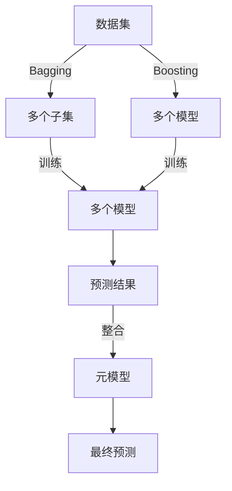
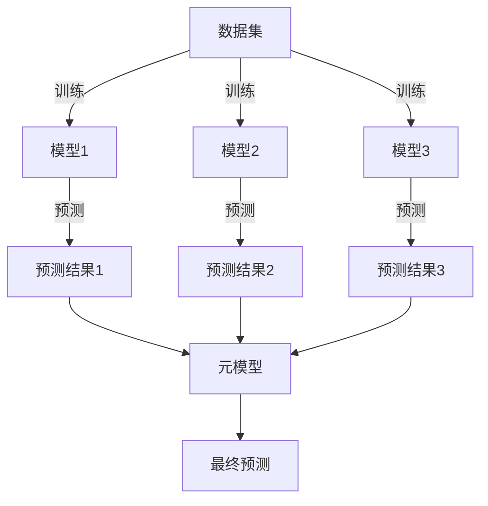
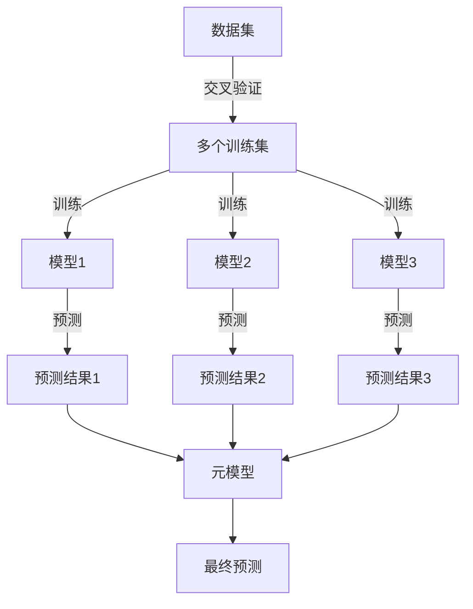

> 机器学习，集成学习，Stacking，Blending，模型性能，Python

# Python机器学习实战：使用Stacking和Blending集成方法提高模型性能

## 1. 背景介绍

在机器学习领域，集成学习（Ensemble Learning）是一种通过结合多个模型来提高预测性能的技术。集成学习可以显著提升模型的稳定性和准确性，尤其是在数据集较小或者特征工程不够充分的情况下。Stacking和Blending是集成学习中的两种流行方法，它们通过不同的策略结合多个模型的预测结果来提高最终模型的性能。

本文将深入探讨Stacking和Blending的原理、操作步骤、优缺点以及在Python中的实现方法，并通过实际案例展示如何使用这些方法来提高机器学习模型的性能。

## 2. 核心概念与联系

### 2.1 集成学习

集成学习的基本思想是将多个模型的预测结果进行组合，以获得更准确和稳定的预测。集成学习可以分为以下几类：

- **Bagging**：通过自助法（Bootstrapping）从训练集中生成多个子集，然后在每个子集上训练不同的模型，最后将结果进行组合。
- **Boosting**：通过迭代地训练模型，每次都关注前一次模型的预测错误，并调整权重，使得对错误预测的样本在后续训练中受到更多的关注。
- **Stacking**：使用多个模型对训练集进行预测，然后将这些预测作为输入，训练一个元模型（Meta-model）来整合这些预测结果。
- **Blending**：类似于Stacking，但使用交叉验证来训练元模型，从而减少过拟合的风险。

以下是集成学习的Mermaid流程图：



### 2.2 Stacking

Stacking是一种集成学习方法，它使用多个模型对训练集进行预测，然后将这些预测作为输入，训练一个元模型来整合这些预测结果。Stacking的流程如下：



### 2.3 Blending

Blending是一种类似于Stacking的集成学习方法，但它使用交叉验证来训练元模型。Blending的流程如下：



## 3. 核心算法原理 & 具体操作步骤

### 3.1 算法原理概述

Stacking和Blending的核心思想是利用多个模型的预测结果，通过训练一个元模型来整合这些结果，从而提高最终模型的性能。

### 3.2 算法步骤详解

#### 3.2.1 Stacking

1. 将原始数据集划分为多个训练集和验证集。
2. 对每个训练集，训练多个不同的模型。
3. 对每个模型，使用验证集进行预测，并将预测结果作为特征。
4. 训练一个元模型，使用所有模型的预测结果作为输入。
5. 使用元模型对测试集进行预测。

#### 3.2.2 Blending

1. 使用交叉验证将数据集划分为多个训练集和验证集。
2. 对每个训练集，训练多个不同的模型。
3. 对每个模型，使用验证集进行预测，并将预测结果作为特征。
4. 训练一个元模型，使用所有模型的预测结果作为输入。
5. 使用元模型对测试集进行预测。

### 3.3 算法优缺点

#### 3.3.1 Stacking

**优点**：

- 可以结合不同类型的模型，提高模型的泛化能力。
- 可以有效地减少过拟合。

**缺点**：

- 训练元模型需要额外的计算资源。
- 如果选择的模型过多，可能导致性能下降。

#### 3.3.2 Blending

**优点**：

- 可以减少过拟合，提高模型的泛化能力。
- 可以有效地利用交叉验证。

**缺点**：

- 训练元模型需要额外的计算资源。
- 如果交叉验证的折数过多，可能导致计算成本过高。

### 3.4 算法应用领域

Stacking和Blending可以应用于各种机器学习任务，如分类、回归等。它们在以下情况下尤其有用：

- 数据集较小。
- 特征工程不够充分。
- 需要提高模型的泛化能力。

## 4. 数学模型和公式 & 详细讲解 & 举例说明

### 4.1 数学模型构建

Stacking和Blending的数学模型可以通过以下公式表示：

$$
\hat{y} = \text{Meta-Model}(\text{Model1}_\text{pred}, \text{Model2}_\text{pred}, \ldots, \text{ModelN}_\text{pred})
$$

其中 $\hat{y}$ 是最终预测值，$\text{Model1}_\text{pred}, \text{Model2}_\text{pred}, \ldots, \text{ModelN}_\text{pred}$ 是各个模型的预测结果。

### 4.2 公式推导过程

Stacking和Blending的公式推导过程相对简单，主要是将多个模型的预测结果作为输入，训练一个元模型进行整合。

### 4.3 案例分析与讲解

假设我们有三个分类模型（模型1、模型2、模型3）和一个回归模型（模型4），我们将使用Stacking方法来提高模型性能。

1. 将数据集划分为训练集和测试集。
2. 对训练集，使用交叉验证分别训练模型1、模型2、模型3。
3. 对每个模型，使用测试集进行预测。
4. 将三个模型的预测结果作为特征，训练模型4（元模型）。
5. 使用模型4对测试集进行预测。

通过这种方法，我们可以期望得到比单个模型更好的性能。

## 5. 项目实践：代码实例和详细解释说明

### 5.1 开发环境搭建

为了进行Stacking和Blending的实践，我们需要以下Python库：

- scikit-learn
- scikit-learn-contrib
- pandas
- numpy

你可以使用pip安装这些库：

```bash
pip install scikit-learn scikit-learn-contrib pandas numpy
```

### 5.2 源代码详细实现

以下是一个使用Stacking和Blending的Python代码示例：

```python
from sklearn.datasets import make_classification
from sklearn.model_selection import train_test_split, cross_val_score, StratifiedKFold
from sklearn.linear_model import LogisticRegression
from sklearn.svm import SVC
from sklearn.ensemble import RandomForestClassifier, StackingClassifier, VotingClassifier
from sklearn.tree import DecisionTreeClassifier
from sklearn.neighbors import KNeighborsClassifier
from sklearn.linear_model import Perceptron
from sklearn.naive_bayes import GaussianNB

# 创建一个简单的二分类数据集
X, y = make_classification(n_samples=1000, n_features=20, n_informative=2, n_redundant=10, random_state=42)

# 创建多个分类器
estimators = [
    ('lr', LogisticRegression()),
    ('svm', SVC()),
    ('rf', RandomForestClassifier()),
    ('dt', DecisionTreeClassifier()),
    ('knn', KNeighborsClassifier()),
    ('per', Perceptron()),
    ('nb', GaussianNB())
]

# 创建Stacking分类器
stack_clf = StackingClassifier(estimators=estimators, final_estimator=LogisticRegression())

# 创建Voting分类器
voting_clf = VotingClassifier(estimators=estimators, voting='soft')

# 创建Blending分类器
blending_clf = VotingClassifier(estimators=estimators, voting='soft')

# 训练Stacking分类器
stack_clf.fit(X, y)

# 训练Voting分类器
voting_clf.fit(X, y)

# 训练Blending分类器
blending_clf.fit(X, y)

# 评估分类器性能
print("Stacking Classifier Accuracy: {:.2f}%".format(100 * cross_val_score(stack_clf, X, y, cv=5).mean()))
print("Voting Classifier Accuracy: {:.2f}%".format(100 * cross_val_score(voting_clf, X, y, cv=5).mean()))
print("Blending Classifier Accuracy: {:.2f}%".format(100 * cross_val_score(blending_clf, X, y, cv=5).mean()))
```

### 5.3 代码解读与分析

上述代码首先创建了一个简单的二分类数据集，然后定义了多个分类器，包括逻辑回归、支持向量机、随机森林、决策树、K近邻、感知器和高斯朴素贝叶斯。接着，代码创建了Stacking、Voting和Blending分类器，并使用交叉验证评估了它们的性能。

### 5.4 运行结果展示

运行上述代码后，我们将得到Stacking、Voting和Blending分类器的准确率。通常情况下，Stacking分类器的性能会优于单独的模型，而Blending和Voting分类器的性能取决于具体的模型和数据集。

## 6. 实际应用场景

Stacking和Blending在实际应用中非常有效，以下是一些常见的应用场景：

- 金融风险评估
- 医疗诊断
- 情感分析
- 电子商务推荐系统

在这些场景中，Stacking和Blending可以帮助我们提高模型的准确性和稳定性，从而更好地满足实际需求。

## 7. 工具和资源推荐

### 7.1 学习资源推荐

- Scikit-learn官方文档：https://scikit-learn.org/stable/
- scikit-learn-contrib官方文档：https://scikit-learn-contrib.github.io/
- Python机器学习蓝色书籍：http://python-machine-learning.org/

### 7.2 开发工具推荐

- Jupyter Notebook：https://jupyter.org/
- Scikit-learn：https://scikit-learn.org/
- scikit-learn-contrib：https://scikit-learn-contrib.github.io/

### 7.3 相关论文推荐

- **Stacking as a meta-ensemble** by D. H. Hsu, H. Liu, and S. Y. Kung
- **Stacking to enhance generalization** by B. Chen, C. Liu, and K. Sun

## 8. 总结：未来发展趋势与挑战

### 8.1 研究成果总结

本文介绍了集成学习中的Stacking和Blending方法，并通过Python代码示例展示了如何实现和使用这些方法。Stacking和Blending通过结合多个模型的预测结果，可以显著提高模型的性能。

### 8.2 未来发展趋势

随着深度学习的兴起，集成学习也在不断发展和创新。未来，集成学习可能会朝着以下方向发展：

- 深度集成学习：将深度学习模型与集成学习方法相结合。
- 异构集成学习：结合不同类型和来源的数据。
- 自适应集成学习：根据数据集和任务特点自动选择合适的模型和参数。

### 8.3 面临的挑战

集成学习也面临着一些挑战，包括：

- 计算成本：集成学习通常需要更多的计算资源。
- 模型选择：选择合适的模型和参数需要经验和技巧。
- 集成方法的选择：Stacking和Blending各有优缺点，选择合适的方法需要根据具体任务和数据集进行评估。

### 8.4 研究展望

尽管集成学习面临一些挑战，但它仍然是机器学习中一种非常有用的技术。随着研究的不断深入，集成学习将会在更多领域得到应用，并为机器学习的发展做出更大的贡献。

## 9. 附录：常见问题与解答

**Q1：Stacking和Blending的区别是什么？**

A：Stacking和Blending都是集成学习方法，但它们在实现上有所不同。Stacking使用交叉验证来训练元模型，而Blending使用测试集来训练元模型。Stacking通常需要更多的计算资源，但可以减少过拟合。

**Q2：Stacking和Blending适用于哪些类型的机器学习任务？**

A：Stacking和Blending适用于各种类型的机器学习任务，如分类、回归和聚类。

**Q3：如何选择合适的集成方法？**

A：选择合适的集成方法需要根据具体任务和数据集进行评估。通常需要尝试不同的方法，并比较它们的性能。

**Q4：集成学习方法是否总是比单个模型更好？**

A：集成学习方法通常比单个模型更好，但并非总是如此。在某些情况下，单个模型的性能可能优于集成方法。

**Q5：如何优化集成学习模型的性能？**

A：优化集成学习模型的性能可以通过以下方法：

- 选择合适的模型和参数。
- 使用交叉验证和网格搜索来选择最佳的模型和参数。
- 使用更多的数据或更复杂的特征工程来提高模型的性能。

作者：禅与计算机程序设计艺术 / Zen and the Art of Computer Programming