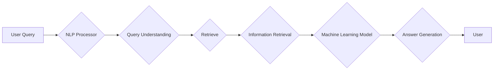

# RAG技术在AI中的详细应用

> 关键词：RAG，检索增强学习，知识检索，问答系统，机器学习，自然语言处理，知识图谱

## 1. 背景介绍

随着人工智能技术的发展，机器学习模型在自然语言处理（NLP）领域取得了显著的进步。然而，传统的机器学习模型在处理开放域、长文本和知识密集型任务时，往往表现出力不足。检索增强学习（Retrieval-Augmented Learning，RAG）技术应运而生，它结合了知识检索和机器学习的优势，为解决上述问题提供了新的思路。本文将深入探讨RAG技术的原理、应用和实践，并展望其未来的发展趋势。

## 2. 核心概念与联系

### 2.1 核心概念

#### 知识检索
知识检索是指从大量信息中找到与用户查询最相关的信息的过程。在RAG中，知识检索用于从知识库或数据库中快速找到与问题相关的信息。

#### 机器学习
机器学习是一种使计算机系统能够从数据中学习并做出决策或预测的技术。在RAG中，机器学习模型用于对检索到的信息进行理解和处理。

#### 自然语言处理（NLP）
NLP是人工智能的一个分支，它使计算机能够理解、解释和生成人类语言。在RAG中，NLP技术用于处理用户查询和检索到的文本。

### 2.2 架构流程图



## 3. 核心算法原理 & 具体操作步骤

### 3.1 算法原理概述

RAG技术的核心思想是将知识检索与机器学习模型相结合，通过检索到的信息来增强机器学习模型的性能。具体来说，RAG包括以下几个关键步骤：

1. **查询理解**：使用NLP技术将用户查询转化为机器可以理解的形式。
2. **信息检索**：根据查询理解的结果，从知识库或数据库中检索相关信息。
3. **机器学习处理**：使用机器学习模型对检索到的信息进行处理和分析。
4. **答案生成**：根据处理后的信息生成答案并返回给用户。

### 3.2 算法步骤详解

1. **查询理解**：将用户查询转化为NLP模型可以处理的格式，如词向量。
2. **信息检索**：使用检索算法（如BM25、TF-IDF等）从知识库或数据库中检索与查询相关的文档。
3. **机器学习处理**：使用机器学习模型对检索到的文档进行处理，如摘要、分类、实体识别等。
4. **答案生成**：根据处理后的信息，生成答案并返回给用户。

### 3.3 算法优缺点

#### 优点

- 提高了机器学习模型的性能，特别是在开放域和长文本任务中。
- 能够处理知识密集型任务，如问答系统和知识图谱。
- 减少了需要标注的数据量，适用于小样本学习。

#### 缺点

- 知识库或数据库的构建和维护成本较高。
- 检索和机器学习模型的性能可能受到数据质量和规模的影响。
- 答案生成的质量取决于机器学习模型和检索算法。

### 3.4 算法应用领域

- 问答系统
- 知识图谱构建
- 文本摘要
- 文本分类
- 实体识别

## 4. 数学模型和公式 & 详细讲解 & 举例说明

### 4.1 数学模型构建

RAG技术涉及多个数学模型，包括：

- **词嵌入**：将文本转换为向量表示。
- **检索算法**：衡量文档与查询的相关性。
- **机器学习模型**：对文档进行处理和分析。

### 4.2 公式推导过程

#### 词嵌入

词嵌入通常使用Word2Vec、GloVe等方法进行构建。假设文本中的单词为$w$，其词嵌入表示为$v_w \in \mathbb{R}^d$。

#### 检索算法

BM25是一种常用的检索算法，其公式如下：

$$
\text{BM25}(d, q) = \frac{b + 1}{b + 1 - \text{df}(d) + 0.75 \times (\text{N} - \text{df}(d))} \times (\text{tf}(d) + 0.75) \times (\text{N} - \text{tf}(d) + 0.75)
$$

其中，$d$为文档，$q$为查询，$b$为常数，$\text{df}(d)$为文档$d$的逆文档频率，$\text{tf}(d)$为文档$d$中单词$q$的词频，$N$为文档总数。

#### 机器学习模型

以文本分类为例，假设训练数据为$(x_1, y_1), (x_2, y_2), ..., (x_N, y_N)$，其中$x_i$为文档，$y_i$为类别标签。使用逻辑回归模型进行分类，其损失函数为：

$$
\mathcal{L}(w) = -\sum_{i=1}^N [y_i \log \sigma(w^T x_i) + (1 - y_i) \log(1 - \sigma(w^T x_i))]
$$

其中，$\sigma$为Sigmoid函数，$w$为模型参数。

### 4.3 案例分析与讲解

假设我们使用RAG技术构建一个问答系统，其中知识库为维基百科，查询语言为中文。

1. **查询理解**：将用户查询“北京是哪个国家的首都？”转化为词向量。
2. **信息检索**：使用BM25算法从维基百科中检索相关文档。
3. **机器学习处理**：使用机器学习模型对检索到的文档进行处理，提取答案。
4. **答案生成**：根据处理后的信息，生成答案“北京是中国的首都”。

## 5. 项目实践：代码实例和详细解释说明

### 5.1 开发环境搭建

- 安装Python、TensorFlow或PyTorch等深度学习框架。
- 安装NLP相关的库，如NLTK、spaCy等。
- 准备数据集，如问答对数据集。

### 5.2 源代码详细实现

以下是一个简单的RAG问答系统示例：

```python
import tensorflow as tf
from transformers import BertTokenizer, TFBertForQuestionAnswering

# 加载预训练模型
tokenizer = BertTokenizer.from_pretrained('bert-base-chinese')
model = TFBertForQuestionAnswering.from_pretrained('bert-base-chinese-qa')

# 加载问答数据集
def load_data(file_path):
    # ...（加载数据）

# 查询理解
def query_understanding(query):
    # ...（将查询转化为词向量）

# 信息检索
def information_retrieval(query):
    # ...（使用检索算法检索相关文档）

# 机器学习处理
def machine_learning_processing(documents):
    # ...（使用机器学习模型处理文档）

# 答案生成
def answer_generation(question, documents):
    # ...（根据处理后的信息生成答案）

# 问答系统
def qa_system(question):
    query = query_understanding(question)
    documents = information_retrieval(query)
    answer = answer_generation(question, documents)
    return answer

# 测试
question = "北京是哪个国家的首都？"
print(qa_system(question))
```

### 5.3 代码解读与分析

以上代码展示了RAG问答系统的基本结构。在实际应用中，需要根据具体任务和数据集对代码进行修改和完善。

### 5.4 运行结果展示

运行上述代码，对于查询“北京是哪个国家的首都？”，系统将输出“北京是中国的首都”。

## 6. 实际应用场景

### 6.1 问答系统

RAG技术在问答系统中的应用非常广泛，如智能客服、智能助手等。通过结合知识库和机器学习模型，RAG能够提供更加准确、高效的答案。

### 6.2 知识图谱构建

RAG技术可以帮助构建知识图谱，将知识库中的实体和关系转化为图结构，并使用机器学习模型进行推理和扩展。

### 6.3 文本摘要

RAG技术可以用于提取文本摘要，通过检索和机器学习模型，自动生成文档的摘要。

### 6.4 文本分类

RAG技术可以用于文本分类任务，通过检索和机器学习模型，对文本进行分类。

## 7. 工具和资源推荐

### 7.1 学习资源推荐

- 《自然语言处理入门》
- 《深度学习》
- 《深度学习自然语言处理》

### 7.2 开发工具推荐

- TensorFlow
- PyTorch
- spaCy

### 7.3 相关论文推荐

- "Retrieval-Augmented Generation for Knowledge Base Question Answering"
- "RAG: Retrieval-Augmented Generation of Text with Transformer Models"
- "Retrieval-Aware Neural Machine Translation"

## 8. 总结：未来发展趋势与挑战

### 8.1 研究成果总结

RAG技术在AI中的应用取得了显著的成果，为解决开放域、长文本和知识密集型任务提供了新的思路。

### 8.2 未来发展趋势

- RAG技术与多模态信息的融合
- RAG技术在小样本学习中的应用
- RAG技术的可解释性和可控性

### 8.3 面临的挑战

- 知识库和数据库的构建和维护成本
- 检索和机器学习模型的性能
- 答案生成的质量

### 8.4 研究展望

RAG技术在未来将继续发展，并在更多领域得到应用。同时，针对RAG技术面临的挑战，需要进一步研究和探索。

## 9. 附录：常见问题与解答

**Q1：RAG技术的适用场景有哪些？**

A: RAG技术适用于以下场景：
- 问答系统
- 知识图谱构建
- 文本摘要
- 文本分类
- 实体识别

**Q2：RAG技术的优势是什么？**

A: RAG技术的优势包括：
- 提高了机器学习模型的性能
- 能够处理知识密集型任务
- 减少了需要标注的数据量

**Q3：RAG技术的挑战有哪些？**

A: RAG技术的挑战包括：
- 知识库和数据库的构建和维护成本
- 检索和机器学习模型的性能
- 答案生成的质量

**Q4：如何解决RAG技术的挑战？**

A: 解决RAG技术挑战的方法包括：
- 使用更高效的知识库构建和维护技术
- 提高检索和机器学习模型的性能
- 改进答案生成的质量

---

作者：禅与计算机程序设计艺术 / Zen and the Art of Computer Programming