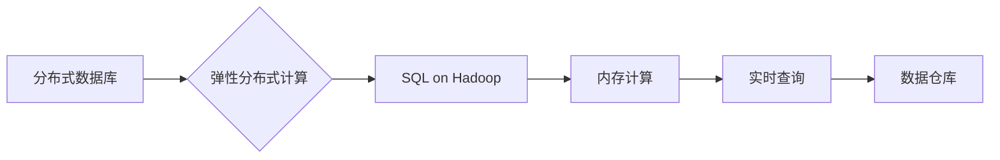

# Spark SQL原理与代码实例讲解

> 关键词：Spark SQL，分布式数据库，大数据，弹性分布式计算，SQL on Hadoop，内存计算，实时查询，数据仓库

## 1. 背景介绍

随着数据量的爆炸式增长，传统的数据库系统在处理大规模数据集时面临着性能瓶颈。为了解决这一问题，分布式数据库和大数据技术应运而生。Apache Spark作为分布式大数据处理框架，以其弹性分布式计算能力和丰富的API接口，成为了大数据处理领域的佼佼者。Spark SQL作为Spark的组成部分，提供了高级的DataFrame抽象和优化的Catalyst查询优化器，使得Spark能够支持SQL查询，成为了处理结构化数据的重要工具。

### 1.1 问题的由来

在大数据时代，数据量庞大且种类繁多，传统的数据库系统难以满足处理和分析这些数据的需求。以下是导致这一问题的几个主要原因：

- **数据量巨大**：随着物联网、社交媒体等技术的发展，数据量呈指数级增长，传统的单机数据库难以处理如此庞大的数据集。
- **数据种类多样**：除了结构化数据外，半结构化和非结构化数据也在不断增加，传统数据库难以对这些数据进行有效的处理和分析。
- **实时性要求**：对于金融、电信等行业，对数据的实时处理和分析具有极高的要求，传统数据库难以满足。

### 1.2 研究现状

为了解决上述问题，研究人员和工程师们开发了一系列大数据处理技术，其中Apache Spark是最为著名的一个。Spark SQL是Spark的核心组件之一，它允许用户使用SQL或DataFrame API来查询和分析数据。

### 1.3 研究意义

Spark SQL的出现具有以下重要意义：

- **统一的数据处理平台**：Spark SQL可以处理多种类型的数据，包括结构化、半结构化和非结构化数据，为用户提供了一个统一的数据处理平台。
- **高效的查询性能**：Spark SQL利用Spark的弹性分布式计算能力，能够高效地执行SQL查询，提供快速的查询结果。
- **易于使用**：Spark SQL支持SQL和DataFrame API，使得用户可以像使用传统数据库一样方便地查询和分析数据。

### 1.4 本文结构

本文将围绕Spark SQL进行深入探讨，包括其核心概念、算法原理、代码实例、实际应用场景等内容。具体结构如下：

- **第2章**：介绍Spark SQL的核心概念和与相关技术的联系。
- **第3章**：讲解Spark SQL的算法原理和具体操作步骤。
- **第4章**：分析Spark SQL的数学模型和公式，并提供案例分析和讲解。
- **第5章**：通过代码实例展示如何使用Spark SQL进行数据查询和处理。
- **第6章**：探讨Spark SQL在实际应用场景中的应用。
- **第7章**：推荐学习资源、开发工具和参考文献。
- **第8章**：总结Spark SQL的未来发展趋势与挑战。
- **第9章**：提供常见问题与解答。

## 2. 核心概念与联系

### 2.1 核心概念

- **分布式数据库**：将数据分布在多台机器上，通过分布式算法进行数据存储和访问。
- **弹性分布式计算**：根据需要动态地扩展或缩减计算资源，以应对数据量和计算需求的波动。
- **SQL on Hadoop**：在Hadoop平台上运行的SQL查询引擎，如Apache Hive。
- **内存计算**：利用内存的高速度来加速数据处理和分析。
- **实时查询**：对数据的查询和分析能够在极短的时间内完成。
- **数据仓库**：存储大量数据以支持企业级的数据分析和报告。

### 2.2 Mermaid 流程图



### 2.3 核心概念联系

Spark SQL的核心概念与上述技术紧密相连。分布式数据库和弹性分布式计算为Spark SQL提供了底层的数据存储和计算能力。SQL on Hadoop为Spark SQL提供了SQL查询接口。内存计算使得Spark SQL能够快速处理和分析数据。实时查询使得Spark SQL能够满足对数据处理速度的要求。数据仓库则将Spark SQL处理后的结果存储起来，以供后续分析和报告使用。

## 3. 核心算法原理 & 具体操作步骤

### 3.1 算法原理概述

Spark SQL的核心算法原理是基于DataFrame的抽象和Catalyst查询优化器。DataFrame是一个分布式数据集合，它提供了丰富的操作接口，如过滤、排序、聚合等。Catalyst查询优化器则负责优化DataFrame的查询操作，以提高查询效率。

### 3.2 算法步骤详解

1. **数据读取**：Spark SQL支持读取多种数据源，如HDFS、Hive、 Cassandra等。
2. **DataFrame操作**：对读取的数据进行过滤、排序、聚合等操作。
3. **Catalyst优化**：Catalyst查询优化器对DataFrame操作进行优化，如树形结构转换、谓词下推、谓词合并等。
4. **数据写入**：将处理后的数据写入到目标存储系统，如HDFS、Hive、Cassandra等。

### 3.3 算法优缺点

#### 优点

- **高效性**：Spark SQL利用内存计算和分布式计算能力，能够高效地处理和分析大规模数据集。
- **灵活性**：Spark SQL支持多种数据源，并提供丰富的DataFrame操作接口，能够满足各种数据处理需求。
- **易用性**：Spark SQL支持SQL和DataFrame API，使得用户可以像使用传统数据库一样方便地查询和分析数据。

#### 缺点

- **学习曲线**：Spark SQL的学习曲线相对较陡峭，需要用户具备一定的编程和大数据处理知识。
- **资源消耗**：Spark SQL需要较高的资源消耗，包括内存和CPU。

### 3.4 算法应用领域

Spark SQL在以下领域具有广泛的应用：

- **大数据分析**：对大规模数据集进行实时或批量分析，如用户行为分析、市场分析等。
- **数据仓库**：构建数据仓库，存储和分析企业级数据。
- **机器学习**：使用Spark SQL作为数据预处理和特征工程工具。

## 4. 数学模型和公式 & 详细讲解 & 举例说明

### 4.1 数学模型构建

Spark SQL的数学模型主要基于DataFrame的抽象和Catalyst查询优化器的算法。

#### DataFrame抽象

DataFrame是Spark SQL的核心数据结构，它由行和列组成，类似于关系数据库中的表格。

#### Catalyst优化器

Catalyst查询优化器是Spark SQL的核心，它对DataFrame操作进行优化，以提高查询效率。

### 4.2 公式推导过程

#### DataFrame操作

DataFrame操作可以使用SQL语句或DataFrame API进行。以下是一些常见的DataFrame操作及其公式：

- **过滤**：使用WHERE子句进行过滤，公式如下：

  $$
 \text{SELECT } * \text{ FROM } \text{ DataFrame } \text{ WHERE } \text{ condition} 
$$

- **排序**：使用ORDER BY子句进行排序，公式如下：

  $$
 \text{SELECT } * \text{ FROM } \text{ DataFrame } \text{ ORDER BY } \text{ column} 
$$

- **聚合**：使用GROUP BY子句进行聚合，公式如下：

  $$
 \text{SELECT } \text{ column\_1, } \text{ SUM(column\_2) } \text{ FROM } \text{ DataFrame } \text{ GROUP BY } \text{ column\_1} 
$$

#### Catalyst优化器

Catalyst查询优化器对DataFrame操作进行优化，以下是一些常见的优化策略：

- **树形结构转换**：将多个操作合并成一个操作，以减少操作次数。
- **谓词下推**：将谓词条件下推到底层操作，以减少中间结果的数量。
- **谓词合并**：将多个谓词条件合并为一个谓词条件，以减少操作次数。

### 4.3 案例分析与讲解

以下是一个使用Spark SQL进行数据查询的案例：

假设有一个包含用户购买信息的DataFrame，其中包含用户ID、产品ID、购买时间和购买金额等字段。

```sql
CREATE TABLE purchases (
    user_id INT,
    product_id INT,
    purchase_time TIMESTAMP,
    amount DECIMAL
)
```

要查询过去一个月内购买金额超过100元的用户和产品信息，可以使用以下SQL语句：

```sql
SELECT user_id, product_id, amount
FROM purchases
WHERE purchase_time > CURRENT_DATE - INTERVAL '1' MONTH
AND amount > 100
```

Spark SQL将执行以下操作：

1. **数据读取**：从存储系统（如HDFS）读取purchases表的数据。
2. **过滤**：过滤出过去一个月内购买金额超过100元的记录。
3. **排序**：按购买金额降序排序。
4. **聚合**：按用户ID和产品ID进行分组，并计算每个用户和产品的总购买金额。

## 5. 项目实践：代码实例和详细解释说明

### 5.1 开发环境搭建

为了使用Spark SQL，需要搭建以下开发环境：

1. **Java开发环境**：安装Java开发环境，如JDK。
2. **Scala开发环境**：安装Scala开发环境，因为Spark是用Scala编写的。
3. **Spark环境**：下载并安装Spark，并配置环境变量。
4. **IDE**：选择合适的IDE，如IntelliJ IDEA或Eclipse。

### 5.2 源代码详细实现

以下是一个使用Spark SQL进行数据查询的Java代码实例：

```java
import org.apache.spark.sql.Dataset;
import org.apache.spark.sql.Row;
import org.apache.spark.sql.SparkSession;

public class SparkSqlExample {
    public static void main(String[] args) {
        // 创建SparkSession
        SparkSession spark = SparkSession.builder()
                .appName("Spark SQL Example")
                .master("local[*]")
                .getOrCreate();

        // 读取数据
        Dataset<Row> purchases = spark.read().csv("path/to/purchases.csv");

        // 查询
        Dataset<Row> result = purchases
                .filter("purchase_time > CURRENT_DATE - INTERVAL '1' MONTH")
                .filter("amount > 100")
                .orderBy("amount desc");

        // 显示结果
        result.show();

        // 停止SparkSession
        spark.stop();
    }
}
```

### 5.3 代码解读与分析

上述代码首先创建了一个SparkSession，然后读取了一个CSV文件中的数据，并创建了一个DataFrame。接下来，使用DataFrame API对数据进行过滤和排序，最后将结果输出到控制台。

### 5.4 运行结果展示

运行上述代码后，将显示过去一个月内购买金额超过100元的用户和产品信息。

## 6. 实际应用场景

Spark SQL在以下实际应用场景中具有广泛的应用：

- **电商数据分析**：分析用户购买行为、产品销售趋势等。
- **金融数据分析**：分析交易数据、风险评估等。
- **社交媒体分析**：分析用户行为、热点事件等。
- **医疗数据分析**：分析医疗数据、疾病预测等。

## 7. 工具和资源推荐

### 7.1 学习资源推荐

- **Apache Spark官方文档**：提供了Spark SQL的详细文档和教程。
- **《Spark SQL in Action》**：一本关于Spark SQL的实战指南。
- **《Spark: The Definitive Guide》**：一本全面介绍Spark的书籍。

### 7.2 开发工具推荐

- **IntelliJ IDEA**：一个功能强大的IDE，支持Spark开发。
- **Eclipse**：另一个功能丰富的IDE，支持Spark开发。
- **Databricks**：一个基于Spark的云服务平台。

### 7.3 相关论文推荐

- **Catalyst: A Data Flow Language for Spark**：介绍了Catalyst查询优化器的原理。
- **The Design of Apache Spark**：介绍了Apache Spark的设计和架构。

## 8. 总结：未来发展趋势与挑战

### 8.1 研究成果总结

Spark SQL作为Spark的核心组件之一，以其高效的查询性能和易用的API接口，成为了处理结构化数据的重要工具。它不仅支持SQL查询，还提供了丰富的DataFrame操作接口，使得用户可以像使用传统数据库一样方便地查询和分析数据。

### 8.2 未来发展趋势

- **更强大的数据处理能力**：随着Spark SQL的不断演进，它将能够处理更大规模的数据集和更复杂的查询。
- **更丰富的数据源支持**：Spark SQL将支持更多类型的数据源，如图形数据库、时间序列数据库等。
- **更易用的API接口**：Spark SQL将继续优化其API接口，使其更加易用。

### 8.3 面临的挑战

- **资源消耗**：Spark SQL需要较高的资源消耗，包括内存和CPU。
- **学习曲线**：Spark SQL的学习曲线相对较陡峭，需要用户具备一定的编程和大数据处理知识。

### 8.4 研究展望

未来，Spark SQL将继续发展，并面临以下挑战：

- **优化资源消耗**：通过改进算法和优化技术，降低Spark SQL的资源消耗。
- **简化学习曲线**：通过提供更丰富的文档和教程，降低Spark SQL的学习曲线。

## 9. 附录：常见问题与解答

**Q1：Spark SQL与Hive有什么区别？**

A：Spark SQL和Hive都是基于Hadoop的数据仓库解决方案。Spark SQL与Hive的主要区别在于：

- **查询语言**：Spark SQL支持SQL和DataFrame API，而Hive只支持SQL。
- **性能**：Spark SQL比Hive具有更好的性能，因为它直接运行在Spark上，而Hive则需要将查询转换为MapReduce任务。

**Q2：Spark SQL如何处理大数据量？**

A：Spark SQL利用Spark的弹性分布式计算能力，将数据分布在多台机器上进行并行处理，从而能够处理大规模数据集。

**Q3：Spark SQL如何进行数据清洗？**

A：Spark SQL提供了丰富的DataFrame操作接口，如过滤、排序、聚合等，可以用于数据清洗。

**Q4：Spark SQL如何进行数据转换？**

A：Spark SQL提供了丰富的DataFrame操作接口，如映射、投影、转换等，可以用于数据转换。

**Q5：Spark SQL如何与机器学习结合使用？**

A：Spark SQL可以将处理后的数据转换为DataFrame，然后使用Spark MLlib进行机器学习模型的训练和预测。

---

作者：禅与计算机程序设计艺术 / Zen and the Art of Computer Programming