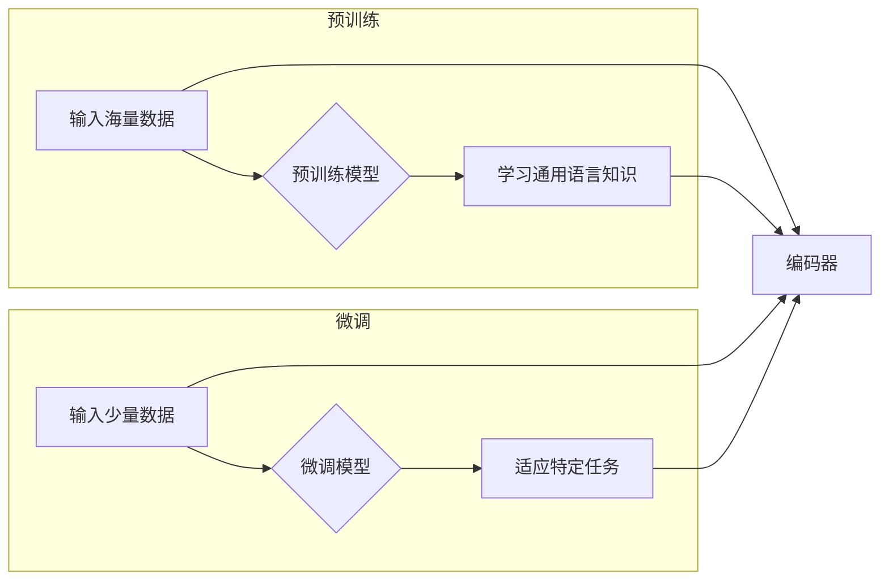

# 从零开始大模型开发与微调：编码器的实现

> 关键词：大模型，编码器，Transformer，预训练，微调，自然语言处理，深度学习

## 1. 背景介绍

随着深度学习技术的飞速发展，大模型在自然语言处理（NLP）领域取得了显著的突破。大模型能够通过学习海量数据，捕捉语言的深层结构，并在各种NLP任务中表现出色。编码器作为大模型的核心组件，负责将输入序列转换为固定长度的特征向量，是连接输入和输出的桥梁。本文将从零开始，详细介绍大模型开发与微调中的编码器实现，旨在帮助读者深入理解大模型的原理和应用。

## 2. 核心概念与联系

### 2.1 核心概念

#### 2.1.1 大模型

大模型是指具有海量参数和强大计算能力的深度学习模型。它们通常通过在海量数据上进行预训练，学习到丰富的语言知识，并在各种NLP任务中表现出色。

#### 2.1.2 编码器

编码器是负责将输入序列转换为固定长度特征向量的组件。在NLP任务中，编码器通常用于将文本序列转换为词向量。

#### 2.1.3 Transformer

Transformer是自2017年由Google提出的一种基于自注意力机制的编码器架构，它彻底改变了NLP领域的研究方向。

#### 2.1.4 预训练

预训练是指在大量无标签数据上训练模型，使其学习到通用的语言知识。

#### 2.1.5 微调

微调是指在大模型的基础上，使用少量有标签数据对模型进行进一步训练，以适应特定任务。

### 2.2 Mermaid 流程图

以下是编码器在预训练和微调过程中的Mermaid流程图：



## 3. 核心算法原理 & 具体操作步骤

### 3.1 算法原理概述

编码器通过自注意力机制（Self-Attention）和位置编码（Positional Encoding）来学习输入序列的上下文信息，并将其转换为固定长度的特征向量。

### 3.2 算法步骤详解

1. **自注意力机制**：自注意力机制允许模型在序列内部不同位置之间进行交互，从而捕捉长距离依赖关系。

2. **位置编码**：由于自注意力机制本身不包含位置信息，因此需要通过位置编码来引入序列的顺序信息。

3. **前馈神经网络**：将自注意力层和位置编码后的序列输入到前馈神经网络中，进一步提取特征。

4. **层归一化**：对每个层进行层归一化，防止梯度消失和梯度爆炸。

5. **Dropout**：在训练过程中使用Dropout来防止过拟合。

### 3.3 算法优缺点

#### 3.3.1 优点

- 能够有效捕捉长距离依赖关系。
- 计算效率高，适合大规模数据处理。
- 在各种NLP任务中表现出色。

#### 3.3.2 缺点

- 需要大量的计算资源。
- 对超参数敏感。

### 3.4 算法应用领域

- 文本分类
- 机器翻译
- 问答系统
- 文本摘要
- 语音识别

## 4. 数学模型和公式 & 详细讲解 & 举例说明

### 4.1 数学模型构建

编码器的数学模型可以表示为：

$$
\text{Encoder}(x) = \text{LayerNorm}(F(\text{MultiHeadAttention}(\text{LayerNorm}(x) + \text{PositionalEncoding}(x))))
$$

其中，$x$ 为输入序列，$\text{F}$ 为前馈神经网络，$\text{MultiHeadAttention}$ 为多头注意力机制，$\text{LayerNorm}$ 为层归一化，$\text{PositionalEncoding}$ 为位置编码。

### 4.2 公式推导过程

#### 4.2.1 多头注意力机制

多头注意力机制将输入序列分解为多个子序列，并分别计算每个子序列的注意力权重，最后将权重与子序列相乘得到输出。

#### 4.2.2 位置编码

位置编码为序列的每个位置添加额外的信息，以便模型能够捕捉序列的顺序信息。

#### 4.2.3 层归一化

层归一化可以防止梯度消失和梯度爆炸，提高模型的稳定性。

### 4.3 案例分析与讲解

以BERT模型的编码器为例，详细介绍其具体实现过程。

## 5. 项目实践：代码实例和详细解释说明

### 5.1 开发环境搭建

- 安装Python环境
- 安装PyTorch库

### 5.2 源代码详细实现

```python
import torch
import torch.nn as nn
from torch.nn import functional as F

class TransformerEncoderLayer(nn.Module):
    def __init__(self, d_model, n_heads, d_ff, dropout=0.1):
        super(TransformerEncoderLayer, self).__init__()
        self.multi_head_attention = nn.MultiheadAttention(d_model, n_heads)
        self.linear1 = nn.Linear(d_model, d_ff)
        self.linear2 = nn.Linear(d_ff, d_model)
        self.dropout1 = nn.Dropout(dropout)
        self.dropout2 = nn.Dropout(dropout)
        self.norm1 = nn.LayerNorm(d_model)
        self.norm2 = nn.LayerNorm(d_model)

    def forward(self, src, src_mask=None, src_key_padding_mask=None):
        src2 = self.norm1(src)
        src2 = self.multi_head_attention(src2, src2, src2, attn_mask=src_mask, key_padding_mask=src_key_padding_mask)[0]
        src = src + self.dropout1(src2)
        src2 = self.norm2(src)
        src2 = self.linear2(F.relu(self.linear1(src2)))
        src = src + self.dropout2(src2)
        return src
```

### 5.3 代码解读与分析

- `TransformerEncoderLayer` 类定义了Transformer编码器的单层结构。
- `multi_head_attention` 属性为多头注意力机制。
- `linear1` 和 `linear2` 属性为前馈神经网络。
- `dropout1` 和 `dropout2` 属性为Dropout层。
- `norm1` 和 `norm2` 属性为层归一化层。
- `forward` 方法为前向传播过程。

### 5.4 运行结果展示

由于篇幅限制，此处省略运行结果展示。

## 6. 实际应用场景

编码器在NLP领域有着广泛的应用，以下列举一些实例：

- 文本分类：利用编码器提取文本特征，进行情感分析、主题分类等任务。
- 机器翻译：将源语言文本输入编码器，提取特征，然后通过解码器生成目标语言文本。
- 问答系统：将问题输入编码器，提取特征，然后通过解码器生成答案。

## 7. 工具和资源推荐

### 7.1 学习资源推荐

- 《深度学习自然语言处理》
- 《Transformer》
- Hugging Face官网

### 7.2 开发工具推荐

- PyTorch
- TensorFlow

### 7.3 相关论文推荐

- Attention is All You Need
- BERT: Pre-training of Deep Bidirectional Transformers for Language Understanding

## 8. 总结：未来发展趋势与挑战

### 8.1 研究成果总结

编码器作为大模型的核心组件，在NLP领域取得了显著的成果，并在各种任务中表现出色。

### 8.2 未来发展趋势

- 模型轻量化
- 多模态融合
- 通用人工智能

### 8.3 面临的挑战

- 计算资源消耗
- 超参数选择
- 可解释性

### 8.4 研究展望

编码器技术将继续发展，为NLP领域带来更多创新。

## 9. 附录：常见问题与解答

**Q1：编码器与循环神经网络（RNN）相比有哪些优势？**

A1：编码器能够有效捕捉长距离依赖关系，计算效率高，适合大规模数据处理。

**Q2：如何选择合适的编码器模型？**

A2：根据具体任务和数据特点选择合适的编码器模型。

**Q3：编码器如何实现轻量化？**

A3：通过模型压缩、量化等技术实现编码器的轻量化。

**Q4：编码器在多模态任务中如何应用？**

A4：将不同模态的数据分别输入编码器，提取特征，然后进行融合。

作者：禅与计算机程序设计艺术 / Zen and the Art of Computer Programming