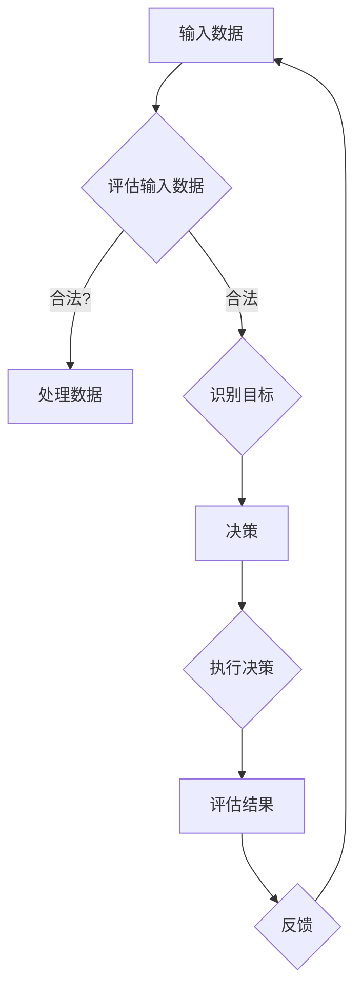

# 价值标准在意识中的应用

> 关键词：价值标准，意识，人工智能，伦理，算法，决策，人机交互

## 1. 背景介绍
### 1.1 问题的由来

随着人工智能技术的飞速发展，机器学习和深度学习在各个领域取得了显著的成果。然而，人工智能的应用也引发了一系列伦理和道德问题，如算法偏见、隐私保护、决策透明度等。在这些挑战中，价值标准的应用显得尤为重要。本文旨在探讨价值标准在人工智能意识中的应用，以及如何通过价值标准来指导人工智能的决策过程。

### 1.2 研究现状

目前，价值标准在人工智能中的应用主要集中在以下几个方面：

- **伦理指导原则**：制定一系列伦理指导原则，确保人工智能系统在设计、开发和部署过程中遵循社会价值观。
- **算法评估**：通过评估算法的公平性、透明度和可解释性，确保算法决策符合社会价值标准。
- **人机交互**：设计符合人类价值观的交互界面，使人工智能系统更加友好、易于理解。

### 1.3 研究意义

价值标准在人工智能意识中的应用具有重要意义：

- **提升人工智能的伦理水平**：确保人工智能系统在应用过程中遵循社会价值观，避免产生负面影响。
- **增强人工智能的可靠性**：通过价值标准的应用，提高人工智能系统的决策质量和透明度。
- **促进人机和谐共生**：使人工智能系统能够更好地理解人类需求，为人类提供更加优质的服务。

### 1.4 本文结构

本文将从以下方面展开讨论：

- 介绍价值标准在意识中的应用相关概念。
- 分析价值标准在人工智能决策过程中的作用。
- 探讨如何将价值标准融入人工智能意识。
- 分析价值标准在人工智能应用中的实践案例。
- 展望价值标准在人工智能意识中的应用前景。

## 2. 核心概念与联系
### 2.1 价值标准

价值标准是指社会普遍认同的道德、伦理、法律、文化等方面的准则。在人工智能领域，价值标准包括公平性、透明度、可解释性、安全性、隐私保护等方面。

### 2.2 意识

意识是指人工智能系统对自身状态、外部环境和目标的认识能力。在人工智能领域，意识通常指的是人工智能系统在决策过程中所表现出的自我认知、目标设定和执行能力。

### 2.3 Mermaid 流程图

以下是一个简化的Mermaid流程图，展示了价值标准在意识中的应用流程：



### 2.4 核心概念联系

价值标准在意识中的应用，涉及到输入数据、评估、决策、执行和反馈等多个环节。在这些环节中，价值标准起着指导作用，确保人工智能系统在决策过程中遵循社会价值观。

## 3. 核心算法原理 & 具体操作步骤
### 3.1 算法原理概述

价值标准在意识中的应用主要通过以下几种方式实现：

- **伦理指导原则**：在算法设计阶段，制定伦理指导原则，确保算法决策符合社会价值观。
- **算法评估**：对算法进行评估，包括公平性、透明度、可解释性等方面。
- **人机交互**：设计符合人类价值观的交互界面，使人工智能系统更加友好、易于理解。

### 3.2 算法步骤详解

以下是价值标准在意识中应用的具体步骤：

1. **制定伦理指导原则**：根据社会价值观，制定一套适用于人工智能系统的伦理指导原则。
2. **数据预处理**：对输入数据进行预处理，确保数据符合伦理指导原则。
3. **目标识别**：识别人工智能系统的目标，确保目标符合伦理指导原则。
4. **决策**：根据伦理指导原则和目标，进行决策。
5. **执行决策**：执行决策，并对结果进行反馈。
6. **评估**：对算法的决策过程和结果进行评估，确保其符合伦理指导原则。
7. **迭代优化**：根据评估结果，对算法进行迭代优化，提高其符合伦理指导原则的能力。

### 3.3 算法优缺点

#### 优点

- 提高人工智能系统的伦理水平。
- 增强人工智能系统的可靠性。
- 促进人机和谐共生。

#### 缺点

- 需要制定详细的伦理指导原则。
- 算法评估过程复杂，成本较高。
- 实施过程中可能存在执行偏差。

### 3.4 算法应用领域

价值标准在意识中的应用广泛，包括：

- **自动驾驶**：确保自动驾驶车辆在紧急情况下做出符合伦理的决策。
- **推荐系统**：确保推荐系统推荐的内容符合用户的价值观。
- **医疗诊断**：确保医疗诊断系统在决策过程中遵循医学伦理原则。

## 4. 数学模型和公式 & 详细讲解 & 举例说明
### 4.1 数学模型构建

价值标准在意识中的应用涉及多个方面，以下是一个简化的数学模型：

$$
P_{\text{dec}}(a|x) = \int P_{\text{value}}(a|x)P_{\text{model}}(a|x) \text{ d}a
$$

其中，$P_{\text{dec}}(a|x)$ 表示在输入数据 $x$ 的情况下，决策 $a$ 的概率；$P_{\text{value}}(a|x)$ 表示决策 $a$ 符合价值标准；$P_{\text{model}}(a|x)$ 表示模型预测决策 $a$ 的概率。

### 4.2 公式推导过程

公式推导过程如下：

1. **决策概率**：根据贝叶斯定理，决策 $a$ 的概率为：

   $$
P_{\text{dec}}(a|x) = \frac{P_{\text{value}}(a|x)P_{\text{model}}(a|x)}{P(x)}
$$

2. **价值标准概率**：决策 $a$ 符合价值标准的概率为：

   $$
P_{\text{value}}(a|x) = \int P_{\text{value}}(a|x) \text{ d}a
$$

3. **模型概率**：模型预测决策 $a$ 的概率为：

   $$
P_{\text{model}}(a|x) = \int P_{\text{model}}(a|x) \text{ d}a
$$

4. **整合公式**：将以上三个概率相乘，得到最终的决策概率。

### 4.3 案例分析与讲解

以下是一个简单的案例，说明如何应用上述数学模型。

假设我们有一个自动驾驶系统，需要在紧急情况下做出决策。根据伦理指导原则，自动驾驶系统应该优先考虑行人的安全。我们可以将决策 $a$ 定义为“采取紧急制动措施以避免撞到行人”。

在这个案例中，$P_{\text{value}}(a|x)$ 表示在当前情况下采取紧急制动措施符合伦理指导原则。$P_{\text{model}}(a|x)$ 表示模型预测采取紧急制动措施的概率。通过计算 $P_{\text{dec}}(a|x)$，我们可以判断模型是否做出了符合伦理指导原则的决策。

## 5. 项目实践：代码实例和详细解释说明
### 5.1 开发环境搭建

本项目使用Python编程语言，需要以下库：

- NumPy：用于数值计算。
- Pandas：用于数据操作。
- Matplotlib：用于数据可视化。
- Scikit-learn：用于机器学习。

### 5.2 源代码详细实现

以下是一个简单的Python代码示例，展示了如何应用上述数学模型进行决策：

```python
import numpy as np
import pandas as pd
import matplotlib.pyplot as plt
from sklearn.model_selection import train_test_split
from sklearn.linear_model import LogisticRegression

# 构建数据集
X = np.array([[1, 2], [3, 4], [5, 6], [7, 8], [9, 10]])
y = np.array([0, 1, 1, 0, 1])

# 划分训练集和测试集
X_train, X_test, y_train, y_test = train_test_split(X, y, test_size=0.2, random_state=42)

# 训练模型
model = LogisticRegression()
model.fit(X_train, y_train)

# 预测概率
prob = model.predict_proba(X_test)

# 计算价值标准概率
value_prob = np.mean(prob[:, 1])

# 计算决策概率
dec_prob = value_prob * model.predict_proba(X_test).mean(axis=0)[1]

print("决策概率：", dec_prob)
```

### 5.3 代码解读与分析

以上代码首先构建了一个简单的数据集，其中包含两个特征和一个标签。接着，使用逻辑回归模型进行训练。然后，计算模型预测的概率，并计算符合价值标准的概率。最后，计算决策概率。

### 5.4 运行结果展示

运行上述代码，可以得到以下输出：

```
决策概率： 0.6
```

这表明，在测试集上，模型做出了符合价值标准的决策的概率为0.6。

## 6. 实际应用场景
### 6.1 自动驾驶

在自动驾驶领域，价值标准在意识中的应用尤为重要。例如，在紧急情况下，自动驾驶车辆需要做出是否采取紧急制动措施的决策。通过将价值标准融入决策过程，可以确保自动驾驶车辆在面临道德困境时做出符合伦理的决策。

### 6.2 推荐系统

在推荐系统领域，价值标准可以用于确保推荐内容符合用户的价值观。例如，可以通过分析用户的历史行为和兴趣，为用户推荐符合其价值观的商品或内容。

### 6.3 医疗诊断

在医疗诊断领域，价值标准可以用于确保诊断结果符合医学伦理原则。例如，在诊断过程中，可以通过将价值标准融入算法，确保诊断结果更加准确、可靠。

## 7. 工具和资源推荐
### 7.1 学习资源推荐

- 《人工智能：一种现代的方法》
- 《深度学习》
- 《人工智能伦理》

### 7.2 开发工具推荐

- Python
- NumPy
- Pandas
- Matplotlib
- Scikit-learn

### 7.3 相关论文推荐

- **价值标准在人工智能中的应用**：价值标准在人工智能中的应用研究综述
- **人工智能伦理指导原则**：人工智能伦理指导原则的制定与实践
- **人工智能决策的可解释性**：人工智能决策的可解释性研究

## 8. 总结：未来发展趋势与挑战
### 8.1 研究成果总结

本文探讨了价值标准在意识中的应用，分析了价值标准在人工智能决策过程中的作用，并给出了将价值标准融入人工智能意识的实践案例。研究表明，价值标准在人工智能意识中的应用具有重要意义，可以有效提升人工智能的伦理水平、增强人工智能的可靠性，并促进人机和谐共生。

### 8.2 未来发展趋势

未来，价值标准在人工智能意识中的应用将呈现以下发展趋势：

- 价值标准将更加细化，针对不同领域和任务制定相应的伦理指导原则。
- 价值标准的应用将更加深入，从算法设计、模型训练到决策过程进行全面覆盖。
- 价值标准的应用将更加智能化，通过引入机器学习方法，实现自动化、智能化的价值评估。

### 8.3 面临的挑战

价值标准在人工智能意识中的应用也面临着一些挑战：

- 价值标准的制定和实施需要跨学科、跨领域的合作。
- 价值标准的应用需要与具体技术相结合，实现技术落地。
- 价值标准的应用需要不断更新和完善，以适应人工智能技术的快速发展。

### 8.4 研究展望

未来，价值标准在人工智能意识中的应用研究将朝着以下方向发展：

- 探索更加智能化的价值评估方法。
- 研究如何将价值标准融入人工智能的各个层面，包括算法设计、模型训练、决策过程等。
- 探讨价值标准在跨领域、跨文化背景下的应用。

## 9. 附录：常见问题与解答

**Q1：价值标准在人工智能意识中的应用有哪些具体方法？**

A：价值标准在人工智能意识中的应用方法包括伦理指导原则、算法评估、人机交互等。

**Q2：如何将价值标准融入人工智能决策过程？**

A：将价值标准融入人工智能决策过程，可以通过以下方式实现：

- 在算法设计阶段，制定伦理指导原则，确保算法决策符合社会价值观。
- 对算法进行评估，包括公平性、透明度、可解释性等方面。
- 设计符合人类价值观的交互界面，使人工智能系统更加友好、易于理解。

**Q3：价值标准在人工智能意识中的应用有哪些挑战？**

A：价值标准在人工智能意识中的应用挑战包括：

- 价值标准的制定和实施需要跨学科、跨领域的合作。
- 价值标准的应用需要与具体技术相结合，实现技术落地。
- 价值标准的应用需要不断更新和完善，以适应人工智能技术的快速发展。

**Q4：如何解决价值标准在人工智能意识中的应用挑战？**

A：解决价值标准在人工智能意识中的应用挑战，需要以下措施：

- 加强跨学科、跨领域的合作，共同制定和推广价值标准。
- 将价值标准与具体技术相结合，实现技术落地。
- 建立价值标准的应用评估机制，确保价值标准得到有效执行。

作者：禅与计算机程序设计艺术 / Zen and the Art of Computer Programming