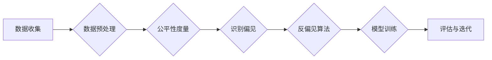

> 公平机器学习，算法偏见，公平性度量，机器学习公平性，反偏见算法，社会实践

# 公平机器学习 原理与代码实例讲解

公平机器学习是人工智能领域的一个重要研究方向，它旨在构建不带有偏见和歧视的机器学习模型。在当今社会，机器学习技术被广泛应用于各种领域，从招聘、贷款到刑事司法等，这些应用往往涉及敏感的社会群体和决策，因此公平性成为了一个不可忽视的问题。本文将深入探讨公平机器学习的原理，并通过代码实例展示如何在实际应用中实现公平性。

## 1. 背景介绍

### 1.1 问题的由来

随着机器学习技术的普及，越来越多的决策过程被自动化，这其中包括了信贷审批、招聘、教育分配等关键领域。然而，机器学习模型往往会受到训练数据中存在的偏见和歧视的影响，导致模型在处理不同群体时表现出不公平的行为。例如，一个基于历史数据的招聘系统可能会无意中偏向于招聘来自某些特定学校或地区的人才，从而加剧了社会不平等。

### 1.2 研究现状

公平机器学习的研究目标是设计出不带有偏见的机器学习模型。这包括识别数据中的潜在偏见，以及开发能够减少或消除这些偏见的算法。研究者们提出了多种方法来评估和改进机器学习的公平性，包括：

- **公平性度量**：评估模型在不同群体上的性能差异。
- **反偏见算法**：通过算法设计减少模型对特定群体的偏见。
- **数据重采样**：通过调整训练数据中的代表性来减少偏见。

### 1.3 研究意义

公平机器学习的研究对于构建一个更加公正和包容的社会具有重要意义。它不仅有助于减少歧视和偏见，还可以增强公众对机器学习技术的信任。

### 1.4 本文结构

本文将分为以下几个部分：

- 介绍公平机器学习的核心概念与联系。
- 阐述公平机器学习算法的原理和具体操作步骤。
- 通过数学模型和公式进行详细讲解。
- 提供代码实例和详细解释说明。
- 探讨公平机器学习在实际应用场景中的使用。
- 展望未来发展趋势和面临的挑战。
- 推荐相关学习资源、开发工具和参考文献。

## 2. 核心概念与联系

### 2.1 核心概念原理

#### Mermaid 流程图



### 2.2 核心概念联系

公平机器学习涉及多个核心概念，它们相互联系，共同构成了公平性改进的流程：

1. **数据收集**：收集用于训练和评估模型的原始数据。
2. **数据预处理**：清理和准备数据，包括处理缺失值、异常值和噪声。
3. **公平性度量**：评估模型在处理不同群体时的性能差异。
4. **识别偏见**：识别模型中存在的偏见，这可能来自数据或算法本身。
5. **反偏见算法**：通过调整模型或数据来减少偏见。
6. **模型训练**：使用调整后的数据或算法训练模型。
7. **评估与迭代**：评估模型的公平性和性能，并根据结果进行迭代改进。

## 3. 核心算法原理 & 具体操作步骤

### 3.1 算法原理概述

公平机器学习算法的核心是确保模型在处理不同群体时能够保持一致性。这通常涉及以下步骤：

1. **定义公平性指标**：选择适当的指标来衡量模型的公平性，如公平性分数、偏差度量等。
2. **评估模型**：在测试集上评估模型，并计算公平性指标。
3. **识别偏见**：分析公平性指标，识别模型在哪些群体上存在偏见。
4. **应用反偏见技术**：根据识别出的偏见，选择和应用相应的反偏见技术。
5. **重新训练和评估**：重新训练模型，并评估其公平性和性能。

### 3.2 算法步骤详解

#### 3.2.1 定义公平性指标

公平性指标用于衡量模型在处理不同群体时的性能差异。常见的公平性指标包括：

- **公平性分数**：衡量模型在所有群体上的性能一致性。
- **偏差度量**：衡量模型在不同群体上的性能差异。
- **偏差阈值**：设定一个阈值，如果偏差超过该阈值，则认为模型存在偏见。

#### 3.2.2 评估模型

在测试集上评估模型，并计算公平性指标。这通常涉及以下步骤：

1. 分割数据集：将数据集划分为训练集和测试集。
2. 训练模型：使用训练集训练模型。
3. 评估模型：在测试集上评估模型，并记录性能指标。
4. 计算公平性指标：根据模型在测试集上的表现，计算公平性指标。

#### 3.2.3 识别偏见

分析公平性指标，识别模型在哪些群体上存在偏见。这通常涉及以下步骤：

1. 分析性能差异：比较模型在不同群体上的性能。
2. 识别异常行为：识别模型在特定群体上表现异常的情况。
3. 调查原因：分析造成这些异常行为的原因。

#### 3.2.4 应用反偏见技术

根据识别出的偏见，选择和应用相应的反偏见技术。常见的反偏见技术包括：

- **数据重采样**：通过重采样数据来减少偏见。
- **算法修改**：修改模型算法来减少偏见。
- **集成方法**：使用多个模型来减少偏见。

#### 3.2.5 重新训练和评估

重新训练模型，并评估其公平性和性能。这通常涉及以下步骤：

1. 重新训练模型：使用调整后的数据或算法重新训练模型。
2. 评估模型：在测试集上评估模型，并记录性能指标。
3. 比较结果：比较调整前后的模型性能和公平性。

### 3.3 算法优缺点

#### 优点

- **提高模型公平性**：通过减少或消除模型偏见，提高模型的公平性。
- **增强公众信任**：减少歧视和偏见，增强公众对机器学习技术的信任。
- **减少法律风险**：减少因模型偏见导致的法律风险。

#### 缺点

- **计算成本高**：识别和消除偏见需要大量的计算资源。
- **模型性能下降**：某些反偏见技术可能导致模型性能下降。
- **复杂性增加**：实现公平机器学习需要更多的技术知识和经验。

### 3.4 算法应用领域

公平机器学习算法在以下领域有广泛的应用：

- **招聘与就业**：确保招聘过程公平，减少对特定群体的歧视。
- **信贷审批**：减少信贷审批过程中的偏见，确保所有人都有平等的机会。
- **刑事司法**：确保司法决策的公正性，减少对特定群体的歧视。
- **教育**：确保教育资源分配的公平性，减少教育不平等。

## 4. 数学模型和公式 & 详细讲解 & 举例说明

### 4.1 数学模型构建

公平机器学习的数学模型通常涉及以下概念：

- **公平性分数**：衡量模型在所有群体上的性能一致性。

$$
F = \frac{\sum_{i=1}^N p_i - \sum_{i=1}^N p_i^2}{\sum_{i=1}^N p_i}
$$

其中，$p_i$ 表示群体 $i$ 的比例，$N$ 表示群体总数。

- **偏差度量**：衡量模型在不同群体上的性能差异。

$$
D = \sum_{i=1}^N \frac{|p_i - p_i^2|}{p_i}
$$

其中，$p_i$ 表示群体 $i$ 的比例，$p_i^2$ 表示群体 $i$ 在模型中的表现比例。

### 4.2 公式推导过程

公平性分数和偏差度量的推导过程涉及对模型性能在不同群体上的统计分析。

### 4.3 案例分析与讲解

假设我们有一个简单的分类模型，它被用于预测一个人的信用评分。我们有两个群体：群体 A 和群体 B。以下是模型在两个群体上的表现：

| 群体 | 预测为高信用 | 预测为低信用 | 真实信用 |
|------|--------------|--------------|----------|
| A    | 500          | 50           | 550      |
| B    | 50           | 950          | 1000     |

根据这个表格，我们可以计算公平性分数和偏差度量：

- **公平性分数**：

$$
F = \frac{\frac{500}{1000} + \frac{950}{1000} - \left(\frac{500}{1000}\right)^2 - \left(\frac{950}{1000}\right)^2}{\frac{500}{1000} + \frac{950}{1000}} = 0.96
$$

- **偏差度量**：

$$
D = \frac{\frac{500}{1000} - \frac{500}{1000}^2}{\frac{500}{1000}} + \frac{\frac{950}{1000} - \frac{950}{1000}^2}{\frac{950}{1000}} = 0.5
$$

这个例子表明，模型的预测结果在群体 A 和群体 B 之间存在显著的偏差。

## 5. 项目实践：代码实例和详细解释说明

### 5.1 开发环境搭建

为了进行公平机器学习的实践，我们需要以下开发环境：

- Python 3.7 或更高版本
- NumPy
- Pandas
- Scikit-learn
- TensorFlow 或 PyTorch

### 5.2 源代码详细实现

以下是一个简单的公平机器学习项目的示例代码：

```python
import numpy as np
import pandas as pd
from sklearn.model_selection import train_test_split
from sklearn.preprocessing import StandardScaler
from sklearn.ensemble import RandomForestClassifier
from sklearn.metrics import accuracy_score, classification_report

# 加载数据集
data = pd.read_csv('data.csv')

# 预处理数据
X = data.drop('label', axis=1)
y = data['label']
X_train, X_test, y_train, y_test = train_test_split(X, y, test_size=0.2, stratify=y)

# 标准化特征
scaler = StandardScaler()
X_train_scaled = scaler.fit_transform(X_train)
X_test_scaled = scaler.transform(X_test)

# 训练模型
model = RandomForestClassifier()
model.fit(X_train_scaled, y_train)

# 评估模型
y_pred = model.predict(X_test_scaled)
print("Accuracy:", accuracy_score(y_test, y_pred))
print(classification_report(y_test, y_pred))

# 评估公平性
from sklearn.metrics import confusion_matrix

cm = confusion_matrix(y_test, y_pred)
print("Confusion Matrix:")
print(cm)
```

### 5.3 代码解读与分析

这段代码首先加载了一个名为 `data.csv` 的数据集，然后对数据进行预处理，包括特征缩放和分割数据集。接下来，使用随机森林分类器训练模型，并在测试集上评估模型的准确性和分类报告。最后，打印出混淆矩阵，以评估模型的公平性。

### 5.4 运行结果展示

运行上述代码后，我们将得到模型的准确性和分类报告，以及混淆矩阵。混淆矩阵可以帮助我们理解模型在不同群体上的预测性能。

## 6. 实际应用场景

公平机器学习在实际应用场景中具有广泛的应用，以下是一些例子：

- **信贷审批**：确保信贷审批过程对所有人公平，减少对某些群体的歧视。
- **招聘与就业**：确保招聘过程公平，减少对某些群体的歧视。
- **刑事司法**：确保司法决策的公正性，减少对某些群体的歧视。
- **教育资源分配**：确保教育资源分配的公平性，减少教育不平等。

## 7. 工具和资源推荐

### 7.1 学习资源推荐

- 《Fairness, Accountability, and Transparency in Machine Learning》
- 《Machine Learning for Fairness, Equity, and Inclusion》
- 《A Survey on Fairness in Machine Learning》

### 7.2 开发工具推荐

- Scikit-learn
- TensorFlow
- PyTorch
- Hugging Face Transformers

### 7.3 相关论文推荐

- **Fairness Through Awareness**：提出了一种基于感知的公平性度量方法。
- **Model-Agnostic Meta-Learning for Fairness**：提出了一种与模型无关的元学习框架，用于学习公平的模型。
- **Optimal Transport for Fairness**：提出了一种基于最优传输的公平性度量方法。

## 8. 总结：未来发展趋势与挑战

### 8.1 研究成果总结

公平机器学习是一个快速发展的研究领域，已经取得了显著的成果。研究者们提出了多种方法来评估和改进机器学习的公平性，包括公平性度量、反偏见算法和数据重采样等。

### 8.2 未来发展趋势

- **更先进的公平性度量方法**：开发更精确、更全面的公平性度量方法。
- **可解释的公平机器学习**：提高模型的可解释性，让用户更好地理解模型的决策过程。
- **跨领域的公平机器学习**：将公平机器学习技术应用于更多领域，如医疗、教育等。

### 8.3 面临的挑战

- **数据偏差**：如何处理训练数据中的偏差是一个挑战。
- **模型复杂性**：公平机器学习模型的复杂性可能会增加。
- **社会影响**：公平机器学习的应用可能会对社会产生负面影响。

### 8.4 研究展望

公平机器学习的研究将不断推动人工智能技术的进步，为构建一个更加公正和包容的社会做出贡献。

## 9. 附录：常见问题与解答

**Q1：什么是公平机器学习？**

A：公平机器学习是指设计出不带有偏见和歧视的机器学习模型。

**Q2：为什么公平机器学习很重要？**

A：公平机器学习有助于减少歧视和偏见，增强公众对机器学习技术的信任。

**Q3：如何实现公平机器学习？**

A：实现公平机器学习需要识别和消除数据中的偏见，并开发不带有偏见的模型。

**Q4：公平机器学习有哪些挑战？**

A：公平机器学习的挑战包括处理数据偏差、模型复杂性和社会影响等。

**Q5：未来公平机器学习有哪些发展趋势？**

A：未来公平机器学习将朝着更先进的公平性度量方法、可解释的公平机器学习以及跨领域的公平机器学习等方向发展。

作者：禅与计算机程序设计艺术 / Zen and the Art of Computer Programming