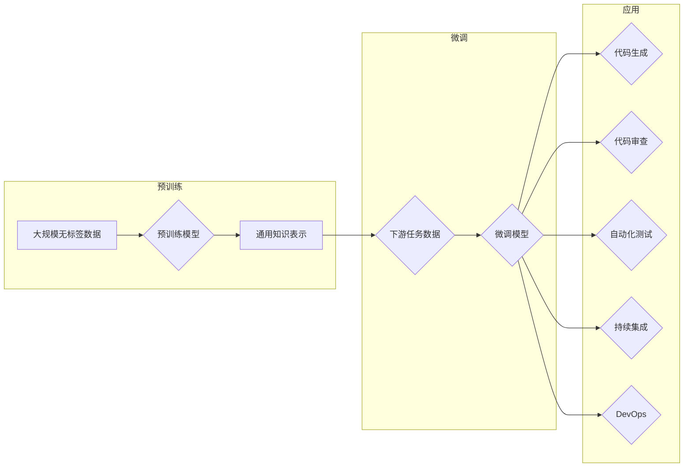

# 大模型在软件开发中的应用

> 关键词：大模型，软件开发，AI辅助，代码生成，代码审查，自动化测试，持续集成，DevOps

## 1. 背景介绍

随着人工智能技术的飞速发展，大模型（Large Models）已经成为计算机科学领域的研究热点。大模型通过在庞大的数据集上进行预训练，学习到了丰富的知识结构和模式，从而在各个领域展现出惊人的能力。在软件开发领域，大模型的应用也越来越广泛，它不仅能够辅助开发人员提高效率，还能够提升软件质量和安全性。本文将探讨大模型在软件开发中的应用，分析其原理、操作步骤、优缺点以及未来发展趋势。

## 2. 核心概念与联系

### 2.1 核心概念

- **大模型**：通常指参数数量达到数亿乃至千亿级别的深度学习模型，如GPT、BERT等。
- **预训练**：在特定领域或任务上进行大量无标签数据的学习，以获得通用的知识表示。
- **微调**：在预训练模型的基础上，使用特定任务的有标签数据进行进一步训练，以提高模型在该任务上的性能。
- **代码生成**：利用大模型生成代码片段、类、模块等，辅助开发人员提高编码效率。
- **代码审查**：使用大模型自动审查代码，提高代码质量和安全性。
- **自动化测试**：利用大模型自动生成测试用例，提高测试效率和质量。
- **持续集成**：结合大模型进行持续集成，自动构建、测试和部署软件。
- **DevOps**：利用大模型实现自动化和智能化的软件开发流程。

### 2.2 架构流程图



## 3. 核心算法原理 & 具体操作步骤

### 3.1 算法原理概述

大模型在软件开发中的应用，主要基于以下原理：

- **预训练模型的学习能力**：大模型通过在大量无标签数据上进行预训练，学习到了丰富的语言、知识结构和模式，能够理解代码的结构和语义。
- **微调的针对性**：通过在特定任务的有标签数据上进行微调，大模型能够更好地适应下游任务的需求。
- **多模态学习**：大模型可以处理文本、代码等多种模态的数据，从而实现更广泛的辅助功能。

### 3.2 算法步骤详解

1. **预训练**：收集大规模无标签数据，如开源代码库、文档、博客等，使用预训练模型进行训练，获得通用知识表示。
2. **微调**：根据具体任务的需求，收集有标签数据，对预训练模型进行微调，获得针对该任务的模型。
3. **应用**：将微调后的模型应用于软件开发的不同环节，如代码生成、代码审查、自动化测试、持续集成和DevOps等。

### 3.3 算法优缺点

**优点**：

- **提高效率**：大模型可以自动完成许多重复性工作，如代码生成、代码审查、自动化测试等，从而提高开发效率。
- **提升质量**：大模型能够帮助开发人员发现潜在的错误和漏洞，提升软件质量和安全性。
- **降低成本**：通过自动化和智能化，降低人力成本和运维成本。

**缺点**：

- **数据依赖**：大模型的应用依赖于大量的数据，数据质量直接影响模型的性能。
- **计算资源**：大模型训练和推理需要大量的计算资源，对硬件设备要求较高。
- **可解释性**：大模型的决策过程往往缺乏可解释性，难以理解其内部工作机制。

### 3.4 算法应用领域

大模型在软件开发中的应用领域主要包括：

- **代码生成**：自动生成代码片段、类、模块等，辅助开发人员提高编码效率。
- **代码审查**：自动审查代码，提高代码质量和安全性。
- **自动化测试**：自动生成测试用例，提高测试效率和质量。
- **持续集成**：结合大模型进行持续集成，自动构建、测试和部署软件。
- **DevOps**：利用大模型实现自动化和智能化的软件开发流程。

## 4. 数学模型和公式 & 详细讲解 & 举例说明

### 4.1 数学模型构建

大模型的数学模型通常基于深度学习框架，如PyTorch或TensorFlow。以下以BERT模型为例进行讲解：

- **输入**：文本序列，表示为$X = [x_1, x_2, \ldots, x_n]$，其中$x_i$为第$i$个token的嵌入表示。
- **输出**：文本序列的表示，表示为$H = [h_1, h_2, \ldots, h_n]$，其中$h_i$为第$i$个token的隐藏状态。
- **损失函数**：通常使用交叉熵损失函数，表示为$L(Y, \hat{Y}) = -\sum_{i=1}^n [y_i \log \hat{y}_i]$，其中$Y$为真实标签，$\hat{Y}$为模型预测的概率分布。

### 4.2 公式推导过程

BERT模型的损失函数主要基于以下公式：

$$
\hat{y}_i = \text{Softmax}(W_{\text{output}}H_i + b_{\text{output}})
$$

其中，$W_{\text{output}}$和$b_{\text{output}}$分别为输出层的权重和偏置。

### 4.3 案例分析与讲解

以下以代码生成为例，讲解大模型在软件开发中的应用：

- **数据准备**：收集开源代码库中的代码片段，并进行预处理，如分词、去除无关信息等。
- **模型选择**：选择合适的代码生成模型，如T5、CodeBERT等。
- **微调**：使用收集到的代码片段对模型进行微调，以适应特定的代码生成任务。
- **生成代码**：使用微调后的模型生成新的代码片段。

## 5. 项目实践：代码实例和详细解释说明

### 5.1 开发环境搭建

以下以使用Hugging Face的Transformers库进行代码生成为例，讲解开发环境的搭建：

1. 安装Python环境，版本要求为3.6及以上。
2. 安装Transformers库：
   ```
   pip install transformers
   ```
3. 安装其他依赖库，如torch、torchvision等。

### 5.2 源代码详细实现

以下为使用Transformers库进行代码生成的示例代码：

```python
from transformers import T5ForConditionalGeneration, T5Tokenizer

# 加载模型和分词器
model = T5ForConditionalGeneration.from_pretrained('t5-small')
tokenizer = T5Tokenizer.from_pretrained('t5-small')

# 加载示例文本
text = "给定一个数字n，输出n+1的所有质数。"

# 对文本进行编码
input_ids = tokenizer(text, return_tensors='pt')

# 生成代码
outputs = model.generate(input_ids)

# 将生成的代码解码为文本
generated_code = tokenizer.decode(outputs[0])

print(generated_code)
```

### 5.3 代码解读与分析

1. 加载模型和分词器：使用Transformers库加载T5模型和对应的分词器。
2. 加载示例文本：加载需要生成代码的文本。
3. 对文本进行编码：使用分词器将文本编码为模型所需的格式。
4. 生成代码：使用模型生成代码，并解码为文本。

### 5.4 运行结果展示

运行上述代码，可以得到以下生成的代码：

```python
def find_prime_numbers(n):
    prime_numbers = []
    for x in range(2, n+1):
        is_prime = True
        for i in range(2, int(x**0.5)+1):
            if (x % i) == 0:
                is_prime = False
                break
        if is_prime:
            prime_numbers.append(x)
    return prime_numbers
```

## 6. 实际应用场景

### 6.1 代码生成

大模型在代码生成中的应用非常广泛，可以用于：

- 自动生成代码片段，如函数、类、模块等。
- 自动修复代码中的错误，如语法错误、逻辑错误等。
- 自动优化代码，如简化代码结构、提高代码效率等。

### 6.2 代码审查

大模型在代码审查中的应用主要包括：

- 自动识别代码中的潜在错误和漏洞。
- 自动检查代码规范和最佳实践。
- 自动生成代码注释，提高代码可读性。

### 6.3 自动化测试

大模型在自动化测试中的应用主要包括：

- 自动生成测试用例，提高测试覆盖率。
- 自动执行测试用例，提高测试效率。
- 自动分析测试结果，发现潜在问题。

### 6.4 持续集成

大模型在持续集成中的应用主要包括：

- 自动构建软件，包括编译、打包等步骤。
- 自动执行测试用例，确保代码质量。
- 自动部署软件，提高部署效率。

### 6.5 DevOps

大模型在DevOps中的应用主要包括：

- 自动化部署流程，提高部署效率。
- 自动化监控，及时发现和解决问题。
- 自动化运维，降低运维成本。

## 7. 工具和资源推荐

### 7.1 学习资源推荐

- 《深度学习与自然语言处理》
- 《深度学习实践指南》
- 《PyTorch深度学习实战》
- 《Transformer原理与实践》

### 7.2 开发工具推荐

- PyTorch
- TensorFlow
- Hugging Face Transformers库
- Jupyter Notebook

### 7.3 相关论文推荐

- "Attention is All You Need"
- "BERT: Pre-training of Deep Bidirectional Transformers for Language Understanding"
- "Generative Pre-trained Transformer for Code"
- "BERT for Code: A New Approach to Code Understanding"

## 8. 总结：未来发展趋势与挑战

### 8.1 研究成果总结

大模型在软件开发中的应用已经取得了显著的成果，为开发人员提供了强大的辅助工具，提高了开发效率和质量。随着大模型技术的不断发展和完善，其在软件开发中的应用将越来越广泛。

### 8.2 未来发展趋势

- **多模态学习**：大模型将能够处理多种模态的数据，如文本、代码、图像等，实现更广泛的辅助功能。
- **迁移学习**：大模型将能够更好地迁移到不同任务和领域，提高泛化能力。
- **可解释性**：大模型的决策过程将更加可解释，提高开发人员的信任度。

### 8.3 面临的挑战

- **数据质量**：大模型的应用依赖于高质量的数据，数据质量直接影响模型的性能。
- **计算资源**：大模型训练和推理需要大量的计算资源，对硬件设备要求较高。
- **可解释性**：大模型的决策过程往往缺乏可解释性，难以理解其内部工作机制。

### 8.4 研究展望

未来，大模型在软件开发中的应用将面临以下挑战：

- **数据隐私**：如何保证数据隐私和安全，是未来研究的重要课题。
- **伦理道德**：如何避免大模型产生偏见和歧视，是未来研究的重要课题。
- **法律法规**：如何制定相关法律法规，规范大模型在软件开发中的应用，是未来研究的重要课题。

## 9. 附录：常见问题与解答

**Q1：大模型在软件开发中的应用是否会影响开发人员的就业？**

A1：大模型的应用可以提高开发效率和质量，但不会替代开发人员。相反，大模型将成为开发人员的得力助手，让他们能够更专注于创造性工作。

**Q2：大模型在代码生成中的应用是否会导致代码质量下降？**

A2：大模型在代码生成中的应用，旨在提高编码效率和质量。当然，生成的代码可能存在一些错误或不足，需要开发人员进行人工审查和修改。

**Q3：大模型在代码审查中的应用是否会影响代码的安全性？**

A3：大模型在代码审查中的应用，旨在提高代码质量和安全性。当然，大模型可能无法检测到所有潜在的安全问题，需要开发人员结合其他安全手段进行综合评估。

**Q4：大模型在自动化测试中的应用是否会导致测试覆盖率下降？**

A4：大模型在自动化测试中的应用，旨在提高测试效率和覆盖率。当然，大模型生成的测试用例可能存在一些不足，需要开发人员根据实际情况进行调整和补充。

**Q5：大模型在DevOps中的应用是否会降低运维成本？**

A5：大模型在DevOps中的应用，旨在提高部署效率，降低运维成本。当然，大模型的部署和应用需要一定的技术积累和投入，需要根据实际情况进行评估。

作者：禅与计算机程序设计艺术 / Zen and the Art of Computer Programming