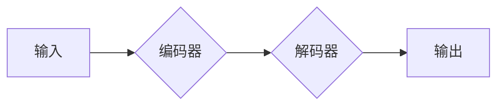

> 关键词：大语言模型，局限性，预训练，微调，泛化能力，伦理问题，模型可解释性

# 大语言模型应用指南：大语言模型的局限性

随着深度学习的飞速发展，大语言模型（Large Language Models，LLMs）如BERT、GPT-3等在自然语言处理（NLP）领域取得了显著的成果。这些模型在文本生成、机器翻译、问答系统等领域展现出惊人的能力，但同时也暴露出一些局限性。本文将深入探讨大语言模型的局限性，以期为开发者、研究者提供参考。

## 1. 背景介绍

近年来，大语言模型在NLP领域取得了突破性进展。预训练技术使得模型可以在海量无标注数据上学习到丰富的语言知识，并通过微调（Fine-Tuning）技术在特定任务上取得优异的性能。然而，随着模型的规模不断扩大，其局限性也逐渐显现，主要包括以下几个方面：

- 泛化能力不足
- 伦理问题
- 模型可解释性差
- 计算资源需求高
- 安全性问题

## 2. 核心概念与联系

### 2.1 大语言模型原理

大语言模型的核心思想是通过预训练和微调两个阶段来学习语言知识。

- **预训练**：在大量无标注数据上进行自监督学习，学习通用的语言表示。
- **微调**：在少量有标注数据上进行监督学习，针对特定任务进行优化。

### 2.2 大语言模型架构

以下是大语言模型的基本架构：



其中，编码器负责将输入文本转换为向量表示，解码器负责根据向量表示生成输出文本。

### 2.3 大语言模型局限性

大语言模型的局限性主要体现在以下几个方面：

- **泛化能力不足**：大语言模型在特定领域或特定任务上的性能可能不如领域特定模型。
- **伦理问题**：大语言模型可能生成歧视性、偏见性或有害的文本。
- **模型可解释性差**：大语言模型的决策过程难以解释，存在黑盒风险。
- **计算资源需求高**：大语言模型需要大量的计算资源和存储空间。
- **安全性问题**：大语言模型可能被恶意利用，如生成虚假信息、进行网络攻击等。

## 3. 核心算法原理 & 具体操作步骤

### 3.1 算法原理概述

大语言模型的算法原理主要包括以下两个方面：

- **自监督学习**：在无标注数据上学习语言知识。
- **监督学习**：在有标注数据上优化模型性能。

### 3.2 算法步骤详解

#### 3.2.1 预训练阶段

1. 在海量无标注数据上选择自监督学习任务，如掩码语言模型（Masked Language Model，MLM）。
2. 使用预训练任务训练模型，学习通用的语言表示。

#### 3.2.2 微调阶段

1. 收集少量有标注数据。
2. 在预训练模型的基础上，针对特定任务进行微调。
3. 使用监督学习优化模型性能。

### 3.3 算法优缺点

#### 优点

- **泛化能力强**：大语言模型在预训练阶段学习到丰富的语言知识，能够泛化到各种语言任务。
- **性能优异**：大语言模型在NLP领域取得了多项SOTA性能。

#### 缺点

- **泛化能力不足**：大语言模型在特定领域或特定任务上的性能可能不如领域特定模型。
- **伦理问题**：大语言模型可能生成歧视性、偏见性或有害的文本。

### 3.4 算法应用领域

大语言模型在以下领域取得了显著的应用成果：

- **文本生成**：生成文章、故事、诗歌等。
- **机器翻译**：实现不同语言之间的翻译。
- **问答系统**：自动回答用户提出的问题。
- **对话系统**：实现人机对话。

## 4. 数学模型和公式 & 详细讲解 & 举例说明

### 4.1 数学模型构建

大语言模型的核心是神经网络，其数学模型可以表示为：

$$
M(x) = f(W, b)
$$

其中 $M(x)$ 是模型输出，$x$ 是输入，$W$ 和 $b$ 分别是模型的权重和偏置。

### 4.2 公式推导过程

以BERT模型为例，其数学模型可以表示为：

$$
M(x) = \text{Transformer}(x, W, b)
$$

其中 $\text{Transformer}$ 是Transformer编码器，$W$ 和 $b$ 分别是编码器的权重和偏置。

### 4.3 案例分析与讲解

以GPT-3为例，其数学模型可以表示为：

$$
M(x) = \text{GPT-3}(x, W, b)
$$

其中 $\text{GPT-3}$ 是GPT-3模型，$W$ 和 $b$ 分别是GPT-3的权重和偏置。

## 5. 项目实践：代码实例和详细解释说明

### 5.1 开发环境搭建

1. 安装Python和pip。
2. 安装TensorFlow或PyTorch等深度学习框架。
3. 安装Hugging Face的Transformers库。

### 5.2 源代码详细实现

以下是一个使用Transformers库微调BERT模型的简单示例：

```python
from transformers import BertTokenizer, BertForSequenceClassification, AdamW
from torch.utils.data import DataLoader, RandomSampler, SequentialSampler
from torch.utils.data import WeightedRandomSampler
from sklearn.model_selection import train_test_split
from torch.utils.data import Dataset

# 加载数据
def load_data():
    # 这里以一个简单的二分类任务为例，加载数据集
    texts = [...]  # 文本数据
    labels = [...]  # 标签数据
    tokenizer = BertTokenizer.from_pretrained('bert-base-chinese')
    tokenized_data = tokenizer(texts, padding=True, truncation=True, max_length=128, return_tensors='pt')
    return tokenized_data['input_ids'], tokenized_data['attention_mask'], labels

# 定义Dataset
class TextDataset(Dataset):
    def __init__(self, input_ids, attention_mask, labels, tokenizer, max_length=128):
        self.input_ids = input_ids
        self.attention_mask = attention_mask
        self.labels = labels
        self.tokenizer = tokenizer
        self.max_length = max_length

    def __len__(self):
        return len(self.labels)

    def __getitem__(self, item):
        return {
            'input_ids': self.input_ids[item],
            'attention_mask': self.attention_mask[item],
            'labels': self.labels[item]
        }

# 训练模型
def train_model(model, train_loader, dev_loader, optimizer, device, num_train_epochs):
    model.train()
    for epoch in range(num_train_epochs):
        for input_ids, attention_mask, labels in train_loader:
            input_ids = input_ids.to(device)
            attention_mask = attention_mask.to(device)
            labels = labels.to(device)
            optimizer.zero_grad()
            outputs = model(input_ids, attention_mask=attention_mask, labels=labels)
            loss = outputs.loss
            loss.backward()
            optimizer.step()
        
        # 在验证集上评估模型
        model.eval()
        for input_ids, attention_mask, labels in dev_loader:
            input_ids = input_ids.to(device)
            attention_mask = attention_mask.to(device)
            labels = labels.to(device)
            with torch.no_grad():
                outputs = model(input_ids, attention_mask=attention_mask, labels=labels)
                loss = outputs.loss
```

### 5.3 代码解读与分析

以上代码展示了使用Transformers库微调BERT模型的基本流程：

1. 加载数据：加载数据集并使用分词器进行编码。
2. 定义Dataset：定义数据集类，实现`__len__`和`__getitem__`方法。
3. 训练模型：定义训练函数，实现模型的训练过程。
4. 在验证集上评估模型：在验证集上评估模型的性能。

### 5.4 运行结果展示

运行以上代码后，模型将在训练集和验证集上训练和评估，并在最后输出验证集上的损失和准确率。

## 6. 实际应用场景

大语言模型在实际应用场景中取得了显著的成果，以下列举一些典型应用：

- **文本生成**：生成文章、故事、诗歌等。
- **机器翻译**：实现不同语言之间的翻译。
- **问答系统**：自动回答用户提出的问题。
- **对话系统**：实现人机对话。
- **文本摘要**：自动生成文本摘要。
- **情感分析**：分析文本的情感倾向。

## 7. 工具和资源推荐

### 7.1 学习资源推荐

- 《深度学习自然语言处理》
- 《自然语言处理入门》
- 《BERT：原理、应用与开源实现》

### 7.2 开发工具推荐

- TensorFlow
- PyTorch
- Hugging Face Transformers

### 7.3 相关论文推荐

- BERT: Pre-training of Deep Bidirectional Transformers for Language Understanding
- GPT-3: Language Models are Few-Shot Learners
- T5: Text-to-Text Transfer Transformer

## 8. 总结：未来发展趋势与挑战

### 8.1 研究成果总结

大语言模型在NLP领域取得了显著的成果，但同时也暴露出一些局限性。未来，我们需要关注以下研究方向：

- 提高泛化能力：针对特定领域或特定任务进行优化，提高模型在特定场景下的性能。
- 解决伦理问题：消除模型偏见，防止模型生成歧视性、偏见性或有害的文本。
- 增强模型可解释性：提高模型决策过程的透明度，增强模型的可信度。
- 降低计算资源需求：优化模型结构和算法，降低模型的计算资源需求。
- 提高模型安全性：防止模型被恶意利用。

### 8.2 未来发展趋势

- 多模态大语言模型：融合文本、图像、语音等多模态信息。
- 强化学习与大语言模型结合：利用强化学习提高模型的决策能力。
- 模型压缩与加速：降低模型的计算资源需求，提高模型的运行速度。

### 8.3 面临的挑战

- 计算资源：大语言模型的训练和推理需要大量的计算资源。
- 数据隐私：大规模数据收集和处理可能涉及数据隐私问题。
- 模型偏见：大语言模型可能学习到社会偏见和歧视。

### 8.4 研究展望

大语言模型在NLP领域具有广阔的应用前景，未来需要在以下方面进行深入研究：

- 开发更加高效、可解释、可解释的大语言模型。
- 探索大语言模型在不同领域的应用。
- 加强大语言模型的伦理和安全研究。

## 9. 附录：常见问题与解答

**Q1：大语言模型的局限性有哪些？**

A：大语言模型的局限性主要包括泛化能力不足、伦理问题、模型可解释性差、计算资源需求高、安全性问题等。

**Q2：如何提高大语言模型的泛化能力？**

A：提高大语言模型的泛化能力可以从以下方面入手：

- 使用更多的预训练数据。
- 针对特定领域或特定任务进行优化。
- 使用迁移学习技术。

**Q3：如何解决大语言模型的伦理问题？**

A：解决大语言模型的伦理问题需要从以下方面入手：

- 优化模型训练数据，消除偏见。
- 设计可解释的模型，便于分析模型的决策过程。
- 建立伦理审查机制，确保模型输出符合伦理道德。

**Q4：如何提高大语言模型的可解释性？**

A：提高大语言模型的可解释性可以从以下方面入手：

- 使用注意力机制可视化模型决策过程。
- 使用因果推断技术分析模型输出结果。
- 开发可解释的模型结构。

**Q5：如何降低大语言模型的计算资源需求？**

A：降低大语言模型的计算资源需求可以从以下方面入手：

- 模型压缩与加速。
- 使用更轻量级的模型结构。
- 使用分布式训练技术。

作者：禅与计算机程序设计艺术 / Zen and the Art of Computer Programming