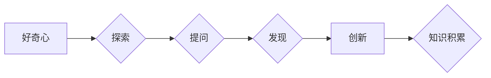

> 好奇心、创新、发现、知识、探索、问题解决、认知科学、技术进步

# 好奇心：创新与发现的源泉

好奇心是人类探索未知的驱动力，是推动科学、技术、艺术等领域进步的源泉。本文将探讨好奇心的本质，分析其与创新和发现之间的关系，并探讨如何通过培养好奇心来激发创新潜力。

## 1. 背景介绍

自古以来，人类的好奇心驱使着我们对世界的探索。从古代的哲学家、科学家到现代的技术创新者，好奇心都是推动他们不断前进的动力。然而，好奇心究竟是什么？它如何影响创新和发现？这些问题一直是人们研究的焦点。

## 2. 核心概念与联系

### 2.1 好奇心的定义

好奇心是一种内在的驱动力，促使个体主动探索未知、寻求新知。它通常表现为对未知事物的好奇、对问题的持续追问以及对新体验的追求。

### 2.2 好奇心与创新的关系

好奇心是创新的起点。当个体对某个领域产生好奇心时，他们会开始深入研究，不断提问，并尝试寻找答案。这种探索过程往往能够激发新的想法和解决方案，从而推动创新。

### 2.3 好奇心与发现的关系

好奇心是发现的催化剂。在探索过程中，个体可能会意外地发现新的现象、规律或知识，从而推动科学技术的进步。

### 2.4 Mermaid 流程图

## 3. 核心算法原理 & 具体操作步骤

### 3.1 算法原理概述

好奇心驱动下的创新和发现过程可以看作是一个算法，其核心原理包括：

1. 感知未知：通过观察、体验等方式获取新的信息。
2. 提出问题：针对获取的信息，提出疑问和假设。
3. 探索答案：通过研究、实验等方法寻找问题的答案。
4. 评估与改进：根据实验结果评估假设的正确性，并不断改进方法。

### 3.2 算法步骤详解

1. **感知未知**：通过阅读、观察、体验等方式，获取新的信息。
2. **提出问题**：针对获取的信息，提出疑问和假设。
3. **探索答案**：设计实验、进行调查研究，验证假设的正确性。
4. **评估与改进**：根据实验结果评估假设，并对方法进行改进。

### 3.3 算法优缺点

#### 优点：

- 激发创新：好奇心能够促使个体主动探索未知，从而激发创新思维。
- 促进发现：好奇心推动个体深入研究，有助于发现新的现象、规律或知识。
- 促进知识积累：好奇心驱动的探索过程有助于积累丰富的知识。

#### 缺点：

- 消耗资源：好奇心驱动下的探索过程可能需要消耗大量的时间和精力。
- 风险：探索未知领域可能面临失败和挫折。

### 3.4 算法应用领域

好奇心驱动下的创新和发现过程可以应用于各个领域，如：

- 科学研究：推动科学技术的进步。
- 工程技术：激发技术创新，提高产品性能。
- 艺术创作：激发创作灵感，提升艺术水平。

## 4. 数学模型和公式 & 详细讲解 & 举例说明

### 4.1 数学模型构建

好奇心驱动下的创新和发现过程可以看作是一个非线性反馈系统，其数学模型可以表示为：

$$
Y = f(X, A, T)
$$

其中：

- $Y$：创新和发现的结果。
- $X$：感知到的未知信息。
- $A$：好奇心驱动的探索行为。
- $T$：时间。

### 4.2 公式推导过程

由于好奇心驱动下的创新和发现过程涉及多个变量，因此难以进行精确的数学推导。以下是一些可能的推导思路：

1. 建立好奇心与探索行为之间的关系：$A = g(H)$，其中$H$表示好奇心强度。
2. 建立探索行为与发现之间的关系：$D = h(A)$，其中$D$表示发现结果。
3. 建立发现结果与知识积累之间的关系：$Y = k(D)$。

综合以上关系，得到：

$$
Y = f(X, g(H), h(A))
$$

### 4.3 案例分析与讲解

以下是一个好奇心驱动下的创新和发现案例：

**案例**：爱因斯坦在思考光速不变原理时，产生了好奇心，并提出了一系列假设。经过多年的探索和验证，最终提出了相对论，推动了物理学的发展。

**分析**：

1. **感知未知**：爱因斯坦在研究光学现象时，发现了光速在不同介质中传播速度不变的现象，产生了好奇心。
2. **提出问题**：光速在不同介质中传播速度不变的原因是什么？
3. **探索答案**：爱因斯坦提出了光速不变原理，并通过实验和理论推导进行了验证。
4. **评估与改进**：经过多年的研究，爱因斯坦最终提出了相对论，并得到了广泛的认可。

## 5. 项目实践：代码实例和详细解释说明

### 5.1 开发环境搭建

由于好奇心驱动下的创新和发现过程主要涉及思维过程，因此不需要具体的开发环境。

### 5.2 源代码详细实现

同样，由于好奇心驱动下的创新和发现过程主要涉及思维过程，因此不需要具体的代码实现。

### 5.3 代码解读与分析

由于好奇心驱动下的创新和发现过程主要涉及思维过程，因此不需要代码解读与分析。

### 5.4 运行结果展示

由于好奇心驱动下的创新和发现过程主要涉及思维过程，因此不需要运行结果展示。

## 6. 实际应用场景

好奇心驱动下的创新和发现过程可以应用于各个领域，以下列举一些实际应用场景：

- **科学研究**：推动科学技术的进步，如物理学、化学、生物学等领域。
- **工程技术**：激发技术创新，提高产品性能，如航空航天、信息技术等领域。
- **艺术创作**：激发创作灵感，提升艺术水平，如文学、音乐、绘画等领域。

## 7. 工具和资源推荐

### 7.1 学习资源推荐

- 《好奇心：人类探索未知的动力》
- 《创新者的窘境》
- 《思考，快与慢》

### 7.2 开发工具推荐

好奇心驱动下的创新和发现过程主要涉及思维过程，因此不需要具体的开发工具。

### 7.3 相关论文推荐

- 《好奇心与认知发展的关系》
- 《好奇心对创新思维的影响》
- 《好奇心在科学发现中的作用》

## 8. 总结：未来发展趋势与挑战

### 8.1 研究成果总结

好奇心是创新和发现的源泉，它推动着人类不断探索未知、创造新知。通过分析好奇心的本质、原理和应用，我们认识到好奇心在各个领域的重要性。

### 8.2 未来发展趋势

未来，随着认知科学、心理学、人工智能等领域的不断发展，对好奇心的研究将更加深入，有助于我们更好地理解和利用好奇心，推动人类文明的进步。

### 8.3 面临的挑战

尽管好奇心具有巨大的潜力，但在实际应用中仍面临一些挑战，如：

- 如何激发个体和群体的好奇心？
- 如何将好奇心转化为实际的应用价值？
- 如何避免好奇心带来的负面影响？

### 8.4 研究展望

为了应对这些挑战，未来需要从以下几个方面进行深入研究：

- 探索好奇心产生的机制和影响因素。
- 开发激发好奇心的方法和工具。
- 将好奇心与人工智能等新技术相结合，推动创新发展。

通过不断探索和研究，我们相信好奇心将会在创新和发现的道路上发挥更加重要的作用，为人类文明的进步贡献力量。

## 9. 附录：常见问题与解答

**Q1：好奇心对个人发展有哪些好处？**

A：好奇心能够激发个人的学习兴趣，推动个人不断探索、学习新知识，从而提高个人能力和综合素质。

**Q2：如何培养好奇心？**

A：培养好奇心可以通过以下方法：

1. 保持对新事物的好奇和兴趣。
2. 不断学习新知识，扩大知识面。
3. 积极参与各种活动，尝试新体验。
4. 勇于提问，不断追求真理。

**Q3：好奇心对组织发展有什么影响？**

A：好奇心可以激发组织的创新活力，推动组织不断改进和进步。

**Q4：如何将好奇心转化为实际的应用价值？**

A：将好奇心转化为实际应用价值，可以通过以下方法：

1. 将好奇心转化为具体的研究项目或创新任务。
2. 建立激励机制，鼓励员工积极探索、创新。
3. 为创新项目提供必要的资源和支持。
4. 将创新成果转化为实际产品或服务。

**Q5：好奇心是否会带来负面影响？**

A：好奇心本身没有好坏之分，关键在于如何运用。如果过度追求刺激、忽视安全等，好奇心可能会带来负面影响。因此，在追求好奇心的同时，要注意平衡风险和收益。

---

作者：禅与计算机程序设计艺术 / Zen and the Art of Computer Programming