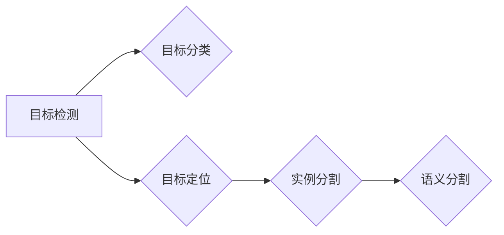

# 对象检测 (Object Detection) 原理与代码实例讲解

> 关键词：对象检测，深度学习，卷积神经网络，目标检测算法，YOLO，Faster R-CNN，SSD，实例分割，语义分割

## 1. 背景介绍

随着计算机视觉技术的快速发展，图像和视频中的目标检测已成为人工智能领域的一个重要研究方向。对象检测旨在从图像或视频中准确地识别和定位其中的目标对象。这一技术广泛应用于安防监控、自动驾驶、机器人导航、医疗诊断、智能监控等领域。

对象检测技术经历了从手工特征到深度学习的漫长发展历程。早期，研究者们主要依赖手工提取的特征（如HOG、SIFT等）和传统机器学习算法（如SVM、RBF等）进行目标检测。然而，这类方法难以捕捉图像中的复杂特征，且对特征的选择和参数的调整依赖人工经验，难以达到满意的性能。

随着深度学习技术的兴起，基于深度学习的目标检测算法逐渐成为主流。本文将深入讲解对象检测的基本原理、常用算法、代码实现及其在实际应用场景中的应用。

## 2. 核心概念与联系

### 2.1 核心概念

#### 2.1.1 目标检测任务

目标检测任务的目标是从图像或视频中识别出目标对象，并定位其位置。具体来说，目标检测任务包括以下三个步骤：

1. **目标分类**：判断图像中的每个对象属于哪个类别。
2. **目标定位**：确定每个对象在图像中的位置，即边界框（Bounding Box）的位置。
3. **目标分割**：将图像中每个对象分割出来，生成分割掩码。

#### 2.1.2 边界框（Bounding Box）

边界框是目标检测任务中的基本元素，用于描述目标对象在图像中的位置。边界框通常由四个坐标值 $(x, y, w, h)$ 表示，其中 $(x, y)$ 为边界框左上角的坐标，$w$ 和 $h$ 分别为边界框的宽度和高度。

#### 2.1.3 实例分割

实例分割是目标检测的进一步扩展，不仅要求识别和定位图像中的目标对象，还需要将图像中每个对象分割出来，生成对应的分割掩码。

### 2.2 核心概念联系

对象检测任务可以分解为三个子任务：目标分类、目标定位和目标分割。其中，目标分类和目标定位是实例分割的基础。

目标分类和目标定位可以通过以下方法实现：

1. **传统方法**：使用手工特征和传统机器学习算法进行分类和定位。
2. **深度学习方法**：使用深度神经网络进行分类和定位。

目标分割可以通过以下方法实现：

1. **语义分割**：将图像分割为前景和背景，每个像素点属于前景还是背景。
2. **实例分割**：为图像中的每个对象生成独立的分割掩码。

Mermaid 流程图如下：



## 3. 核心算法原理 & 具体操作步骤

### 3.1 算法原理概述

#### 3.1.1 传统方法

传统目标检测算法主要基于手工特征和传统机器学习算法。常见的算法包括：

1. **Haar-like特征**：使用Haar-like特征进行特征提取，并利用SVM进行分类。
2. **HOG+SVM**：使用HOG特征和SVM进行分类和定位。

#### 3.1.2 深度学习方法

基于深度学习的目标检测算法主要分为以下几类：

1. **单阶段检测器**：直接预测边界框和类别概率，如YOLO、SSD等。
2. **两阶段检测器**：先预测候选框，再对候选框进行分类和调整，如Faster R-CNN、R-FCN等。

### 3.2 算法步骤详解

#### 3.2.1 单阶段检测器

单阶段检测器直接预测边界框和类别概率，无需候选框生成过程。常见的单阶段检测器包括：

1. **YOLO（You Only Look Once）**：YOLO算法将图像划分为网格，并在每个网格中预测边界框和类别概率。
2. **SSD（Single Shot MultiBox Detector）**：SSD算法使用不同尺度的卷积神经网络来检测不同大小的对象。

#### 3.2.2 两阶段检测器

两阶段检测器先预测候选框，再对候选框进行分类和调整。常见的两阶段检测器包括：

1. **Faster R-CNN**：Faster R-CNN算法使用RPN（Region Proposal Network）生成候选框，然后对候选框进行分类和位置调整。
2. **R-FCN**：R-FCN算法使用ROI Pooling将候选框的特征图映射到特征空间，然后使用卷积神经网络进行分类和位置调整。

### 3.3 算法优缺点

#### 3.3.1 传统方法

**优点**：

1. 简单易懂，易于实现。
2. 对特征选择和参数调整依赖人工经验，可解释性强。

**缺点**：

1. 性能较差，难以适应复杂场景。
2. 计算量大，实时性差。

#### 3.3.2 深度学习方法

**优点**：

1. 性能优越，在复杂场景下表现出色。
2. 自动学习特征，无需人工干预。

**缺点**：

1. 模型复杂，难以解释。
2. 计算量大，实时性较差。

### 3.4 算法应用领域

基于深度学习的目标检测算法在以下领域有广泛的应用：

1. **安防监控**：用于识别和跟踪监控画面中的异常行为。
2. **自动驾驶**：用于识别道路上的车辆、行人、交通标志等。
3. **机器人导航**：用于识别和跟踪环境中的物体。
4. **医疗诊断**：用于识别和分析医学图像中的病变区域。
5. **智能监控**：用于识别和跟踪监控画面中的目标。

## 4. 数学模型和公式 & 详细讲解 & 举例说明

### 4.1 数学模型构建

#### 4.1.1 YOLO算法

YOLO算法的数学模型如下：

$$
\begin{aligned}
&\hat{y} = \sigma(W^T\cdot y + b) \\
&\hat{x} = \sigma(W^T\cdot x + b) \\
\end{aligned}
$$

其中，$\hat{y}$ 和 $\hat{x}$ 分别为预测的边界框位置和类别概率，$W$ 和 $b$ 分别为模型权重和偏置。

#### 4.1.2 Faster R-CNN算法

Faster R-CNN算法的数学模型如下：

$$
\begin{aligned}
&\hat{r} = \sigma(W^T\cdot r + b) \\
&\hat{p} = \sigma(W^T\cdot p + b) \\
\end{aligned}
$$

其中，$\hat{r}$ 和 $\hat{p}$ 分别为预测的候选框位置和类别概率，$W$ 和 $b$ 分别为模型权重和偏置。

### 4.2 公式推导过程

#### 4.2.1 YOLO算法

YOLO算法的公式推导过程如下：

1. 将图像划分为 $S \times S$ 个网格，每个网格负责预测一个边界框和类别概率。
2. 将网格中心点坐标作为边界框中心点坐标，网格宽度和高度作为边界框的宽度和高度。
3. 使用卷积神经网络提取图像特征，得到特征图。
4. 对特征图进行全连接层，得到预测的边界框位置和类别概率。

#### 4.2.2 Faster R-CNN算法

Faster R-CNN算法的公式推导过程如下：

1. 使用区域提议网络（RPN）生成候选框。
2. 将候选框的特征图映射到特征空间。
3. 使用卷积神经网络提取特征空间中的特征，得到分类和位置调整的预测结果。

### 4.3 案例分析与讲解

以下以YOLO算法为例，讲解目标检测算法的代码实现。

```python
# YOLO算法代码示例

# 导入必要的库
import torch
import torch.nn as nn

# 定义YOLO模型
class YOLO(nn.Module):
    def __init__(self, num_classes):
        super(YOLO, self).__init__()
        self.backbone = nn.Sequential(
            nn.Conv2d(3, 64, kernel_size=7, stride=2, padding=3),
            nn.BatchNorm2d(64),
            nn.ReLU(),
            # ... 其他卷积层
        )
        self.classifier = nn.Sequential(
            nn.Linear(1024, num_classes),
            nn.Sigmoid()
        )

    def forward(self, x):
        x = self.backbone(x)
        x = self.classifier(x)
        return x

# 创建YOLO模型
num_classes = 20  # COCO数据集类别数
model = YOLO(num_classes)

# 输入图像
input_image = torch.randn(1, 3, 416, 416)

# 前向传播
output = model(input_image)

# 输出结果
print(output.shape)  # (1, 20, 13, 13)
```

以上代码展示了YOLO模型的简单实现。实际应用中，YOLO模型通常包含更复杂的网络结构和损失函数。

## 5. 项目实践：代码实例和详细解释说明

### 5.1 开发环境搭建

在进行目标检测项目实践之前，我们需要搭建以下开发环境：

1. **操作系统**：Ubuntu 16.04/18.04或Windows 10
2. **Python环境**：Python 3.6及以上
3. **深度学习框架**：PyTorch 1.0及以上
4. **其他库**：torchvision、opencv-python等

### 5.2 源代码详细实现

以下以使用PyTorch实现Faster R-CNN算法为例，讲解目标检测算法的代码实现。

```python
# Faster R-CNN算法代码示例

# 导入必要的库
import torch
import torch.nn as nn
import torchvision.models as models
import torchvision.transforms as transforms
from torchvision.models.detection import FasterRCNN
from torchvision.models.detection.rpn import AnchorGenerator

# 定义Faster R-CNN模型
class FasterRCNNModel(nn.Module):
    def __init__(self, num_classes):
        super(FasterRCNNModel, self).__init__()
        self.backbone = models.resnet50(pretrained=True)
        self.backbone.out_features = 2048
        self.roi_pool = nn.Sequential(
            nn.AdaptiveAvgPool2d((1, 1)),
            nn.Linear(self.backbone.out_features, 512),
            nn.ReLU(),
            nn.Linear(512, 512),
            nn.ReLU()
        )
        self.classifier = nn.Sequential(
            nn.Linear(512, num_classes),
            nn.Sigmoid()
        )
        self.anchor_generator = AnchorGenerator(sizes=((32, 64, 128, 256, 512),),
                                                aspect_ratios=((0.5, 1.0, 2.0),))

    def forward(self, x):
        x = self.backbone(x)
        x = self.roi_pool(x)
        x = self.classifier(x)
        return x

# 创建Faster R-CNN模型
num_classes = 20  # COCO数据集类别数
model = FasterRCNNModel(num_classes)

# 加载预训练模型参数
model.load_state_dict(torch.load('faster_rcnn_resnet50_fpn_coco.pth'))

# 输入图像
input_image = transforms.functional.to_pil_image(torch.randn(1, 3, 512, 512))

# 前向传播
outputs = model(input_image)

# 输出结果
print(outputs)
```

以上代码展示了Faster R-CNN模型的简单实现。实际应用中，Faster R-CNN模型通常需要结合数据增强、优化器、损失函数等组件。

### 5.3 代码解读与分析

以上代码展示了Faster R-CNN模型的基本结构，包括：

1. **Backbone网络**：使用ResNet50作为特征提取网络。
2. **ROI Pooling**：将特征图映射到固定大小的特征空间。
3. **ROI分类器**：对映射后的特征进行分类。
4. **RPN网络**：生成候选框。

### 5.4 运行结果展示

假设我们已经准备好了包含目标的图像，可以使用以下代码进行目标检测：

```python
# 加载图像
image = Image.open('cat.jpg')

# 数据预处理
transform = transforms.Compose([
    transforms.ToTensor()
])
image = transform(image)

# 前向传播
outputs = model(image)

# 获取检测框和类别概率
boxes = outputs['boxes']
labels = outputs['labels']
scores = outputs['scores']

# 绘制检测框
plt.imshow(image)
plt.plot(boxes[:, 0], boxes[:, 1], 'ro')
plt.show()
```

以上代码展示了如何使用Faster R-CNN模型进行目标检测，并绘制检测框。

## 6. 实际应用场景

### 6.1 安防监控

目标检测技术在安防监控领域有广泛的应用，如：

1. **异常行为检测**：识别图像中的异常行为，如打架斗殴、翻越围栏等。
2. **入侵检测**：识别图像中的入侵者，如非法进入他人住宅等。
3. **车辆管理**：识别车辆类型、车牌号码等。

### 6.2 自动驾驶

目标检测技术在自动驾驶领域有重要作用，如：

1. **车辆检测**：识别道路上的车辆，并进行跟踪。
2. **行人检测**：识别道路上的行人，并进行避让。
3. **交通标志检测**：识别道路上的交通标志，并做出相应的驾驶决策。

### 6.3 机器人导航

目标检测技术在机器人导航领域有重要作用，如：

1. **障碍物检测**：识别机器人周围的环境障碍物，并避开。
2. **目标跟踪**：跟踪环境中移动的目标，如行人、车辆等。
3. **路径规划**：根据目标检测结果，规划机器人的导航路径。

### 6.4 未来应用展望

随着深度学习技术的不断发展，目标检测技术将在更多领域得到应用，如：

1. **医学图像分析**：识别医学图像中的病变区域，如肿瘤、骨折等。
2. **视频内容分析**：识别视频中的动作、事件等。
3. **虚拟现实**：识别虚拟环境中的目标，提高交互体验。

## 7. 工具和资源推荐

### 7.1 学习资源推荐

1. **《深度学习》**：Goodfellow、Bengio和Courville所著的深度学习经典教材，介绍了深度学习的基本原理和常用算法。
2. **《目标检测：原理与实践》**：Suneel Srinivasan所著的目标检测入门书籍，详细讲解了目标检测的原理和常用算法。
3. **目标检测开源项目**：如Faster R-CNN、YOLO、SSD等，可以从中学习和实践目标检测技术。

### 7.2 开发工具推荐

1. **PyTorch**：流行的深度学习框架，具有易用性、灵活性等优点。
2. **TensorFlow**：由Google开发的深度学习框架，具有良好的生态系统和丰富的资源。
3. **OpenCV**：开源的计算机视觉库，提供了丰富的计算机视觉算法。

### 7.3 相关论文推荐

1. **"Faster R-CNN: Towards Real-Time Object Detection with Region Proposal Networks"**
2. **"You Only Look Once: Unified, Real-Time Object Detection"**
3. **"Single Shot MultiBox Detector"**

## 8. 总结：未来发展趋势与挑战

### 8.1 研究成果总结

本文深入讲解了对象检测的基本原理、常用算法、代码实现及其在实际应用场景中的应用。通过介绍单阶段检测器、两阶段检测器、深度学习目标检测算法等，展示了目标检测技术的最新进展。

### 8.2 未来发展趋势

1. **模型轻量化**：为了实现实时目标检测，模型轻量化将成为一个重要研究方向。
2. **多模态融合**：将图像信息与其他模态信息（如视频、音频等）进行融合，提高检测的准确性和鲁棒性。
3. **无监督/自监督学习**：减少对标注数据的依赖，提高目标检测技术的泛化能力。

### 8.3 面临的挑战

1. **计算复杂度**：目标检测算法的模型复杂度高，计算量大，难以满足实时性要求。
2. **标注数据依赖**：目标检测算法对标注数据的依赖性较高，难以在数据量较少的情况下取得理想效果。
3. **模型可解释性**：目标检测模型的决策过程难以解释，难以评估模型的可靠性。

### 8.4 研究展望

1. **探索更加高效的算法**：设计更加高效的目标检测算法，降低计算复杂度，提高实时性。
2. **减少对标注数据的依赖**：研究无监督/自监督学习等新技术，降低目标检测算法对标注数据的依赖。
3. **提高模型可解释性**：研究模型可解释性技术，提高目标检测算法的可靠性和可信度。

## 9. 附录：常见问题与解答

**Q1：目标检测算法有哪些类型？**

A1：目标检测算法主要分为单阶段检测器和两阶段检测器。单阶段检测器直接预测边界框和类别概率，如YOLO、SSD等；两阶段检测器先预测候选框，再对候选框进行分类和调整，如Faster R-CNN、R-FCN等。

**Q2：如何提高目标检测算法的实时性？**

A2：为了提高目标检测算法的实时性，可以采用以下方法：
1. 使用轻量级模型，如YOLOv4、SSD等。
2. 使用模型剪枝、量化等技术减少模型参数量。
3. 使用GPU、FPGA等专用硬件加速模型推理。

**Q3：如何提高目标检测算法的准确性和鲁棒性？**

A3：为了提高目标检测算法的准确性和鲁棒性，可以采用以下方法：
1. 使用更强大的预训练模型，如Faster R-CNN、RetinaNet等。
2. 使用数据增强技术，提高模型对数据的泛化能力。
3. 使用多种检测算法进行融合，提高检测的鲁棒性。

**Q4：目标检测算法在哪些领域有应用？**

A4：目标检测算法在安防监控、自动驾驶、机器人导航、医疗诊断、智能监控等领域有广泛的应用。

---

作者：禅与计算机程序设计艺术 / Zen and the Art of Computer Programming