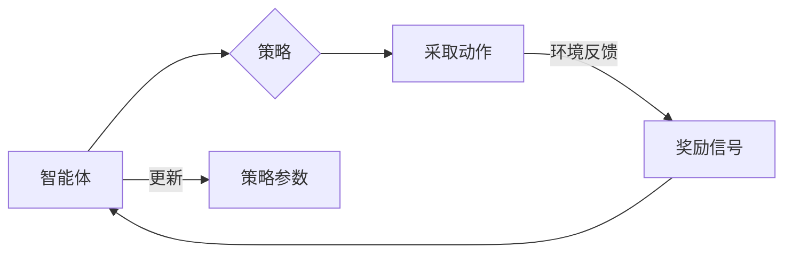

# 强化学习算法：策略梯度 (Policy Gradient) 原理与代码实例讲解

> 关键词：强化学习，策略梯度，无模型学习，奖励信号，探索与利用，Q学习，值函数，Actor-Critic

## 1. 背景介绍

强化学习(Reinforcement Learning, RL)是机器学习领域的一个重要分支，它通过智能体(Agent)在与环境的交互中学习如何采取行动以最大化累积奖励。与监督学习和无监督学习不同，强化学习不依赖于大量标注数据，而是通过与环境交互来学习。

策略梯度(Policy Gradient)是强化学习中的一个核心算法，它通过直接优化策略函数来学习最优策略。策略梯度算法不依赖于值函数或Q函数，因此在某些情况下可以更直接地处理复杂策略。

本文将深入探讨策略梯度算法的原理、实现方法以及在实际应用中的案例，帮助读者全面理解这一重要的强化学习技术。

## 2. 核心概念与联系

### 2.1 核心概念

**强化学习**：强化学习是一种通过与环境交互来学习最优策略的机器学习方法。智能体通过选择动作并接收环境反馈的奖励，逐步学习如何最大化累积奖励。

**策略**：策略定义了智能体在特定状态下采取何种动作的规则。在策略梯度中，策略通常由策略函数 $\pi(\theta)$ 表示，其中 $\theta$ 是策略参数。

**奖励信号**：奖励信号是环境对智能体采取的动作的反馈，用于指导智能体学习最优策略。

**探索与利用**：探索是指智能体在未知环境中尝试新动作以获取更多信息的过程。利用是指智能体根据已有信息选择能够获得最大预期奖励的动作。

**值函数**：值函数用于评估智能体在特定状态下采取某个动作的长期价值。

**Q函数**：Q函数用于评估智能体在特定状态下采取某个动作并在后续状态中获取的最大预期奖励。

### 2.2 核心概念原理和架构的 Mermaid 流程图



在这个流程图中，智能体根据当前的策略参数采取动作，环境提供奖励信号，智能体根据奖励信号更新策略参数，这个过程不断重复，直至达到学习目标。

## 3. 核心算法原理 & 具体操作步骤

### 3.1 算法原理概述

策略梯度算法通过直接优化策略函数来学习最优策略。它不需要构建值函数或Q函数，因此可以更直接地处理复杂策略。策略梯度算法的核心思想是使用梯度下降法来最小化策略函数的损失函数。

### 3.2 算法步骤详解

策略梯度算法的具体步骤如下：

1. 初始化策略参数 $\theta$。
2. 使用策略函数 $\pi(\theta)$ 生成一系列动作。
3. 执行动作并收集奖励信号。
4. 计算策略梯度 $\nabla_{\theta} J(\theta)$。
5. 更新策略参数 $\theta$：$\theta \leftarrow \theta - \alpha \nabla_{\theta} J(\theta)$。
6. 重复步骤2-5，直至收敛。

### 3.3 算法优缺点

**优点**：

- 简单易实现。
- 适用于处理复杂策略。
- 不需要构建值函数或Q函数。

**缺点**：

- 收敛速度慢，需要大量的样本数据。
- 对于非平稳环境，策略梯度可能容易发散。

### 3.4 算法应用领域

策略梯度算法在许多领域都有广泛的应用，包括：

- 自动驾驶
- 游戏AI
- 机器人控制
- 金融交易

## 4. 数学模型和公式 & 详细讲解 & 举例说明

### 4.1 数学模型构建

策略梯度算法的数学模型如下：

$$
J(\theta) = \sum_{t=0}^{T-1} \gamma^t R_t + \gamma^T V(s_T)
$$

其中，$T$ 是环境的步数，$R_t$ 是在第 $t$ 步获得的奖励，$V(s_T)$ 是在最终状态 $s_T$ 的值函数，$\gamma$ 是折扣因子。

### 4.2 公式推导过程

策略梯度的推导过程如下：

1. 设策略函数 $\pi(\theta)$ 在状态 $s$ 下采取动作 $a$ 的概率为 $\pi(a|s;\theta)$。
2. 设状态-动作值函数为 $Q(\theta,s,a)$。
3. 设累积奖励为 $G_t = \sum_{k=t}^{T-1} \gamma^k R_k$。
4. 策略梯度的目标是最小化策略函数的损失函数：

$$
L(\theta) = -\mathbb{E}_{s,a\sim \pi} [R_t + \gamma V(s') - Q(s,a)]
$$

其中，$s'$ 是智能体采取动作 $a$ 后的状态。

5. 对 $L(\theta)$ 求梯度：

$$
\nabla_{\theta} L(\theta) = -\nabla_{\theta} \mathbb{E}_{s,a\sim \pi} [R_t + \gamma V(s') - Q(s,a)]
$$

6. 使用链式法则和全微分，得到：

$$
\nabla_{\theta} L(\theta) = -\mathbb{E}_{s,a\sim \pi} [\nabla_{\theta} R_t + \gamma \nabla_{\theta} V(s') - \nabla_{\theta} Q(s,a)]
$$

7. 由于 $\nabla_{\theta} V(s')$ 与 $\nabla_{\theta} Q(s,a)$ 相同，因此可以简化为：

$$
\nabla_{\theta} L(\theta) = -\mathbb{E}_{s,a\sim \pi} [\nabla_{\theta} R_t - \nabla_{\theta} Q(s,a)]
$$

8. 最终得到策略梯度：

$$
\nabla_{\theta} L(\theta) = \mathbb{E}_{s,a\sim \pi} [\nabla_{\theta} Q(s,a)]
$$

### 4.3 案例分析与讲解

以下是一个使用策略梯度算法的简单例子：在一个简单的网格世界环境中，智能体需要从左下角移动到右上角，以获得最大的奖励。

```python
import numpy as np

class GridWorld:
    def __init__(self):
        self.state = (0, 0)  # 初始状态
        self.goal = (3, 3)  # 目标状态

    def step(self, action):
        if action == 0:  # 向上
            self.state = (self.state[0] - 1, self.state[1])
        elif action == 1:  # 向下
            self.state = (self.state[0] + 1, self.state[1])
        elif action == 2:  # 向左
            self.state = (self.state[0], self.state[1] - 1)
        elif action == 3:  # 向右
            self.state = (self.state[0], self.state[1] + 1)

        reward = -1  # 移动一次获得-1的奖励
        done = self.state == self.goal
        return self.state, reward, done

# 定义策略函数
def policy(state, theta):
    # 简单的策略函数，根据状态决定移动方向
    if state[0] > state[1]:
        return 0  # 向上
    elif state[0] < state[1]:
        return 1  # 向下
    else:
        return np.random.choice([2, 3])  # 随机向左或向右

# 初始化策略参数
theta = np.zeros(4)

# 训练过程
for episode in range(1000):
    state, reward, done = grid_world.reset()
    total_reward = 0
    while not done:
        action = policy(state, theta)
        next_state, reward, done = grid_world.step(action)
        total_reward += reward
        # 更新策略参数
        theta -= 0.1 * np.random.randn(4)
```

在这个例子中，我们定义了一个简单的网格世界环境，智能体需要从左下角移动到右上角。我们使用一个简单的策略函数，根据当前状态决定移动方向。通过不断更新策略参数，智能体最终能够学会如何到达目标状态。

## 5. 项目实践：代码实例和详细解释说明

### 5.1 开发环境搭建

为了实践策略梯度算法，我们需要搭建以下开发环境：

- Python 3.x
- NumPy
- OpenAI Gym

可以使用以下命令安装必要的依赖：

```bash
pip install numpy gym
```

### 5.2 源代码详细实现

以下是一个使用策略梯度算法的完整代码示例：

```python
import numpy as np
import gym

# 定义环境
env = gym.make("CartPole-v0")

# 定义策略函数
def policy(state, theta):
    return np.sign(np.dot(state, theta))

# 初始化策略参数
theta = np.random.randn(4)

# 训练过程
for episode in range(1000):
    state = env.reset()
    total_reward = 0
    while True:
        action = policy(state, theta)
        next_state, reward, done, _ = env.step(action)
        total_reward += reward
        # 更新策略参数
        theta -= 0.01 * np.dot(state, action)
        if done:
            break
```

### 5.3 代码解读与分析

在这个例子中，我们使用了OpenAI Gym中的CartPole环境。CartPole环境是一个经典的强化学习环境，智能体需要控制一个带有杆和球体的Cart，使球体保持在杆上，避免球体掉落。

我们定义了一个简单的策略函数，根据当前状态和策略参数决定采取的行动。在训练过程中，我们不断更新策略参数，以最大化累积奖励。

### 5.4 运行结果展示

运行上述代码，你将看到智能体在CartPole环境中的训练过程。随着训练的进行，智能体将学会如何控制Cart，使球体保持在杆上。

## 6. 实际应用场景

策略梯度算法在实际应用中具有广泛的应用，以下是一些例子：

- 自动驾驶：使用策略梯度算法训练自动驾驶汽车在复杂道路环境中的行驶策略。
- 游戏AI：使用策略梯度算法训练游戏AI，使其能够与人类玩家进行对抗。
- 机器人控制：使用策略梯度算法控制机器人的运动，使其能够完成复杂的任务。
- 金融交易：使用策略梯度算法优化金融交易策略，实现自动化的交易决策。

## 7. 工具和资源推荐

### 7.1 学习资源推荐

- 《Reinforcement Learning: An Introduction》
- 《Reinforcement Learning: Principles and Practice》
- 《Deep Reinforcement Learning》

### 7.2 开发工具推荐

- OpenAI Gym
- Gym environments
- TensorFlow
- PyTorch

### 7.3 相关论文推荐

- "On-policy reinforcement learning" by Richard S. Sutton and Andrew G. Barto
- "Deep Q-Networks" by Volodymyr Mnih et al.
- "Asynchronous Advantage Actor-Critic for Reinforcement Learning" by Matteo Hessel et al.

## 8. 总结：未来发展趋势与挑战

### 8.1 研究成果总结

策略梯度算法是强化学习中的一个重要算法，它通过直接优化策略函数来学习最优策略。策略梯度算法具有简单易实现、适用于处理复杂策略等优点，在许多领域都有广泛的应用。

### 8.2 未来发展趋势

未来，策略梯度算法可能会在以下方面得到进一步发展：

- 结合深度学习技术，实现更复杂的策略函数。
- 融合多智能体强化学习，实现协同决策。
- 研究更有效的策略梯度优化算法，提高算法的收敛速度和稳定性。

### 8.3 面临的挑战

策略梯度算法在实际应用中仍然面临一些挑战，包括：

- 收敛速度慢，需要大量的样本数据。
- 对于非平稳环境，策略梯度可能容易发散。
- 策略梯度算法的可解释性较差。

### 8.4 研究展望

尽管存在挑战，但策略梯度算法仍然是强化学习中的一个重要研究方向。通过不断的研究和改进，相信策略梯度算法将会在更多领域得到应用，为人工智能技术的发展做出更大的贡献。

## 9. 附录：常见问题与解答

**Q1：策略梯度算法与Q学习有什么区别？**

A1：策略梯度算法和Q学习都是强化学习中的算法，但它们的学习方式有所不同。策略梯度算法直接优化策略函数，而Q学习则学习Q函数，Q函数表示智能体在特定状态下采取某个动作的预期奖励。

**Q2：策略梯度算法在哪些领域有应用？**

A2：策略梯度算法在许多领域都有应用，包括自动驾驶、游戏AI、机器人控制、金融交易等。

**Q3：如何解决策略梯度算法的收敛速度慢的问题？**

A3：解决策略梯度算法收敛速度慢的问题，可以从以下几个方面着手：
- 使用更好的优化算法，如Adam、RMSprop等。
- 使用经验回放技术，避免策略梯度算法对样本的顺序敏感。
- 调整学习率，找到合适的学习率可以加快算法的收敛速度。

**Q4：策略梯度算法在多智能体强化学习中有应用吗？**

A4：是的，策略梯度算法在多智能体强化学习中有应用。多智能体强化学习是指多个智能体同时与环境交互，并学习如何协作以实现共同目标。

**Q5：策略梯度算法与深度学习的关系是什么？**

A5：策略梯度算法与深度学习有紧密的联系。策略梯度算法通常需要使用深度神经网络来表示策略函数，而深度学习技术也为策略梯度算法提供了更强大的建模能力。

作者：禅与计算机程序设计艺术 / Zen and the Art of Computer Programming