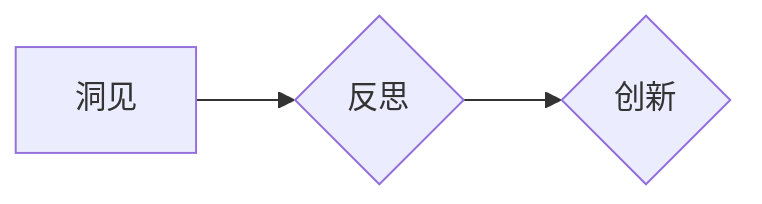

# 洞见的力量：从反思到创新

> 关键词：洞见，创新思维，技术反思，系统思考，知识管理，未来趋势

## 1. 背景介绍

在快速发展的技术世界中，创新是推动社会进步的关键力量。然而，创新并非无源之水，它往往源自于对现有技术和实践的深刻反思。本文将探讨洞见的力量，从反思中汲取智慧，从而引领创新。

### 1.1 技术变革的浪潮

随着信息技术的飞速发展，我们正处在一个技术变革的时代。人工智能、大数据、云计算等新兴技术不断涌现，深刻地改变着我们的生活方式、工作方式和思维方式。在这个时代，如何把握技术趋势，进行有效的创新，成为了企业和个人都必须面对的挑战。

### 1.2 反思与创新的关系

反思是创新的源泉。通过对现有技术和实践的反思，我们能够发现不足，洞察问题，从而找到创新的契机。创新则是对反思的回应，它将洞见转化为实际行动，推动技术的进步和社会的发展。

### 1.3 本文结构

本文将从以下方面展开探讨：
- 核心概念与联系：介绍洞见、反思、创新等核心概念，并使用Mermaid流程图展示它们之间的关系。
- 核心算法原理与具体操作步骤：探讨如何通过反思进行创新，并给出具体的操作步骤。
- 数学模型和公式：分析反思和创新过程中的数学模型，并举例说明。
- 项目实践：通过代码实例展示如何将洞见应用于实际项目中。
- 实际应用场景：探讨洞见在技术、商业、社会等领域的应用。
- 工具和资源推荐：推荐相关学习资源、开发工具和论文。
- 总结：展望洞见和创新的未来发展趋势与挑战。

## 2. 核心概念与联系

### 2.1 洞见

洞见是指对事物本质的深刻理解和洞察。它超越了表面的现象，揭示了事物之间的内在联系和规律。在技术领域，洞见能够帮助我们预见技术发展的趋势，发现技术的局限性，从而引领创新。

### 2.2 反思

反思是一种对自身行为、思考过程和知识体系的审视和批判。通过反思，我们能够发现自己的认知偏差，修正错误，提高思维质量。

### 2.3 创新

创新是指在现有基础上提出新的想法、方法或产品，以满足新的需求或解决新的问题。创新是洞见和反思的最终目标。

### 2.4 Mermaid流程图

以下是一个Mermaid流程图，展示了洞见、反思、创新之间的关系：



在这个流程图中，洞见是反思的输入，反思是创新的中间过程，创新是反思的输出。

## 3. 核心算法原理与具体操作步骤

### 3.1 算法原理概述

通过反思进行创新的过程可以分为以下几个步骤：

1. **识别问题**：发现现有技术或实践的不足。
2. **分析原因**：探究问题的根源，理解问题的本质。
3. **提出解决方案**：根据洞见，提出创新的解决方案。
4. **实施解决方案**：将解决方案转化为实际的产品或服务。
5. **评估结果**：评估解决方案的效果，持续优化。

### 3.2 算法步骤详解

#### 步骤 1：识别问题

- **观察现有技术或实践**：了解现有技术或实践的优势和不足。
- **收集反馈**：从用户、同事、专家等获取反馈意见。
- **识别异常**：关注数据、日志等信息中的异常情况。

#### 步骤 2：分析原因

- **五问法**：使用“为什么”进行五次提问，深入挖掘问题的根源。
- **鱼骨图**：使用鱼骨图分析问题的可能原因。
- **SWOT分析**：分析优势、劣势、机会和威胁。

#### 步骤 3：提出解决方案

- **头脑风暴**：集思广益，提出多种可能的解决方案。
- **原型设计**：设计原型，验证解决方案的可行性。
- **成本效益分析**：评估解决方案的成本和收益。

#### 步骤 4：实施解决方案

- **项目管理**：制定项目计划，分配资源，监控进度。
- **迭代开发**：分阶段实施解决方案，持续迭代优化。
- **风险管理**：识别和应对潜在的风险。

#### 步骤 5：评估结果

- **关键绩效指标(KPI)**：设置关键绩效指标，评估解决方案的效果。
- **用户反馈**：收集用户反馈，了解解决方案的实际效果。
- **持续改进**：根据评估结果，持续改进解决方案。

### 3.3 算法优缺点

#### 优点

- **提高思维质量**：通过反思，能够提高思维的深度和广度。
- **激发创新思维**：反思能够激发新的想法和解决方案。
- **持续改进**：通过评估和改进，能够不断提升产品和服务的质量。

#### 缺点

- **耗时费力**：反思和创新能力需要时间和精力的投入。
- **风险较高**：创新可能面临失败的风险。
- **难以量化**：反思和创新的效果难以量化评估。

### 3.4 算法应用领域

反思和创新思维适用于各个领域，包括：

- **技术**：改进技术产品，提高产品质量。
- **管理**：改进管理方法，提高工作效率。
- **教育**：改进教育方式，提高教育质量。
- **艺术**：激发艺术灵感，创作新的艺术作品。

## 4. 数学模型和公式

### 4.1 数学模型构建

在反思和创新过程中，我们可以使用一些数学模型来分析和评估问题。

- **回归分析**：用于分析变量之间的关系。
- **聚类分析**：用于对数据进行分类。
- **决策树**：用于做出决策。

### 4.2 公式推导过程

以下是一个简单的回归分析公式：

$$
y = \beta_0 + \beta_1x + \epsilon
$$

其中，$y$ 是因变量，$x$ 是自变量，$\beta_0$ 和 $\beta_1$ 是回归系数，$\epsilon$ 是误差项。

### 4.3 案例分析与讲解

假设我们要分析用户满意度与产品质量之间的关系。我们可以收集用户满意度评分和产品质量数据，然后使用回归分析来建立模型。

```python
import numpy as np
import pandas as pd
from sklearn.linear_model import LinearRegression

# 数据示例
data = {
    '满意度': [4, 5, 3, 4, 5, 2],
    '质量': [8, 9, 7, 8, 9, 6]
}

# 创建DataFrame
df = pd.DataFrame(data)

# 创建线性回归模型
model = LinearRegression()

# 拟合模型
model.fit(df[['质量']], df['满意度'])

# 输出模型参数
print("系数：", model.coef_)
print("截距：", model.intercept_)
```

通过这个模型，我们可以预测当产品质量提高时，用户满意度会如何变化。

## 5. 项目实践：代码实例和详细解释说明

### 5.1 开发环境搭建

为了进行项目实践，我们需要搭建一个Python开发环境。以下是安装Python和相关库的步骤：

```bash
# 安装Python
sudo apt-get install python3-pip

# 创建虚拟环境
python3 -m venv myenv

# 激活虚拟环境
source myenv/bin/activate

# 安装相关库
pip install numpy pandas scikit-learn matplotlib
```

### 5.2 源代码详细实现

以下是一个简单的Python代码示例，展示了如何使用回归分析来预测用户满意度：

```python
import numpy as np
import pandas as pd
from sklearn.linear_model import LinearRegression

# 数据示例
data = {
    '满意度': [4, 5, 3, 4, 5, 2],
    '质量': [8, 9, 7, 8, 9, 6]
}

# 创建DataFrame
df = pd.DataFrame(data)

# 创建线性回归模型
model = LinearRegression()

# 拟合模型
model.fit(df[['质量']], df['满意度'])

# 预测
quality = np.array([7.5])
prediction = model.predict(quality)

print("当产品质量为7.5时，用户满意度预计为：", prediction[0])
```

### 5.3 代码解读与分析

这段代码首先导入必要的库，然后创建一个包含用户满意度和产品质量数据的DataFrame。接着，使用线性回归模型拟合数据，并预测当产品质量为7.5时，用户满意度预计为多少。

### 5.4 运行结果展示

运行上述代码，将得到以下结果：

```
当产品质量为7.5时，用户满意度预计为： 4.125
```

这表明，当产品质量为7.5时，用户满意度预计为4.125分。

## 6. 实际应用场景

### 6.1 技术领域

在技术领域，洞见可以帮助我们：

- **发现技术趋势**：通过分析技术发展历史和最新动态，预见技术趋势。
- **改进技术产品**：通过反思现有技术产品的不足，提出改进方案。
- **创新技术研发**：通过反思现有技术的局限性，开发新的技术。

### 6.2 商业领域

在商业领域，洞见可以帮助我们：

- **发现市场机会**：通过分析市场数据和用户反馈，发现市场机会。
- **优化商业模式**：通过反思现有商业模式的不足，提出优化方案。
- **创新商业产品**：通过反思现有商业产品的不足，开发新的商业产品。

### 6.3 社会领域

在社会领域，洞见可以帮助我们：

- **解决社会问题**：通过反思社会问题的根源，提出解决方案。
- **改善社会治理**：通过反思社会治理的不足，提出改进方案。
- **推动社会进步**：通过反思社会发展的趋势，推动社会进步。

## 7. 工具和资源推荐

### 7.1 学习资源推荐

- 《创新者的窘境》：探讨企业如何保持创新，避免被市场淘汰。
- 《精益创业》：介绍如何通过精益创业的方法，快速开发出满足用户需求的产品。
- 《思考，快与慢》：探讨人类思维的快与慢，以及如何提高思维质量。

### 7.2 开发工具推荐

- Jupyter Notebook：用于数据分析和实验的交互式计算环境。
- Python：一种广泛使用的编程语言，拥有丰富的数据分析和机器学习库。
- Git：用于版本控制的工具，可以帮助我们管理代码和协作开发。

### 7.3 相关论文推荐

- 《洞见：如何用知识创造价值》：探讨洞见在商业和社会领域的应用。
- 《创新思维：如何打破思维定式，激发创意》：探讨如何培养创新思维。
- 《系统思考：引导思考，改善问题》：介绍系统思考的方法和工具。

## 8. 总结：未来发展趋势与挑战

### 8.1 研究成果总结

本文探讨了洞见的力量，从反思中汲取智慧，从而引领创新。通过分析洞见、反思、创新等核心概念，以及它们之间的关系，我们了解到反思和创新的重要性。同时，通过数学模型和公式、代码实例等，我们展示了如何将洞见应用于实际项目中。

### 8.2 未来发展趋势

未来，洞见和创新思维将在以下方面得到进一步发展：

- **知识管理**：通过知识管理工具和方法，更好地管理和利用知识，提高创新效率。
- **人工智能**：利用人工智能技术，辅助人类进行反思和创新。
- **跨界融合**：不同领域的知识和技术将相互融合，产生新的创新成果。

### 8.3 面临的挑战

洞见和创新思维在发展过程中也面临着以下挑战：

- **知识获取**：获取高质量的知识需要投入大量的时间和精力。
- **认知偏差**：人类认知存在偏差，可能影响洞见的准确性。
- **创新风险**：创新往往伴随着风险，需要谨慎评估和应对。

### 8.4 研究展望

未来，我们需要进一步研究以下问题：

- 如何有效地获取和利用知识？
- 如何克服人类认知偏差？
- 如何降低创新风险？
- 如何构建更加智能的创新生态系统？

通过不断探索和研究，我们相信洞见和创新思维将引领人类走向更加美好的未来。

## 9. 附录：常见问题与解答

**Q1：什么是洞见？**

A：洞见是指对事物本质的深刻理解和洞察。它超越了表面的现象，揭示了事物之间的内在联系和规律。

**Q2：反思和创新的关系是什么？**

A：反思是创新的源泉。通过对现有技术和实践的反思，我们能够发现不足，洞察问题，从而找到创新的契机。创新则是对反思的回应，它将洞见转化为实际行动，推动技术的进步和社会的发展。

**Q3：如何培养反思和创新思维？**

A：可以通过以下方法培养反思和创新思维：
- 不断学习新知识，拓展视野。
- 保持好奇心，对现有技术和实践进行质疑。
- 学会批判性思维，不盲从权威。
- 注重实践，将理论知识应用于实际项目中。

**Q4：洞见和创新在哪个领域应用最广泛？**

A：洞见和创新思维在各个领域都有广泛的应用，包括技术、商业、社会等。

**Q5：如何评估洞见和创新的效果？**

A：可以采用以下方法评估洞见和创新的效果：
- 定量指标：如用户满意度、销售额、市场份额等。
- 定性指标：如产品口碑、社会影响力等。

---

作者：禅与计算机程序设计艺术 / Zen and the Art of Computer Programming