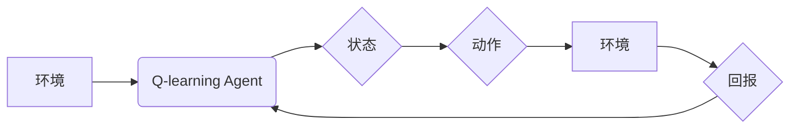

# 深度 Q-learning：在网格计算中的应用

> 关键词：深度学习，Q-learning，强化学习，网格计算，优化，资源分配，自适应，智能调度

## 1. 背景介绍

随着计算需求的不断增长，网格计算已经成为了一种重要的分布式计算模式。在网格计算中，大量的计算任务分布在多个计算节点上，如何有效地分配资源、调度任务，成为了提高计算效率的关键问题。Q-learning作为一种经典的强化学习算法，因其强大的自适应性和适应性，被广泛应用于各种资源分配和调度问题。本文将探讨深度 Q-learning（DQN）在网格计算中的应用，分析其原理、实现方法、优缺点以及未来发展趋势。

## 2. 核心概念与联系

### 2.1 核心概念原理

#### Mermaid 流程图



#### 核心概念

- **环境**：网格计算环境，包括计算节点、存储资源、任务队列等。
- **Q-learning Agent**：学习智能体，负责学习最优策略。
- **状态**：当前环境的描述，如节点负载、任务队列长度等。
- **动作**：智能体可以采取的行动，如分配任务到特定节点、调整任务优先级等。
- **回报**：根据动作和状态的变化，智能体获得的奖励或惩罚。

### 2.2 核心概念联系

深度 Q-learning结合了深度神经网络和Q-learning算法，通过神经网络近似Q值函数，实现更复杂的策略学习。在网格计算环境中，深度 Q-learning可以自动学习最优的资源分配和调度策略，提高计算效率。

## 3. 核心算法原理 & 具体操作步骤

### 3.1 算法原理概述

深度 Q-learning（DQN）是Q-learning算法的一种变体，使用深度神经网络来近似Q值函数。其核心思想是：根据当前状态和动作，预测未来的回报，并通过最大化期望回报来选择动作。

### 3.2 算法步骤详解

1. **初始化Q值表**：初始化Q值表，所有Q值设置为0。
2. **选择动作**：在当前状态下，根据ε-贪心策略选择动作。
3. **执行动作**：执行选定的动作，进入新状态。
4. **计算回报**：根据新状态和动作，计算即时回报。
5. **更新Q值**：根据Q值更新公式，更新Q值表。
6. **重复步骤2-5**：直到满足终止条件。

### 3.3 算法优缺点

#### 优点

- **自适应性强**：能够根据环境变化动态调整策略。
- **泛化能力强**：能够处理高维输入空间。
- **易于实现**：使用深度神经网络近似Q值函数。

#### 缺点

- **计算复杂度高**：需要大量计算资源。
- **学习效率低**：需要大量样本数据进行训练。
- **Q值更新公式较为敏感**：容易陷入局部最优。

### 3.4 算法应用领域

- **资源分配**：如云计算、边缘计算等领域的资源分配。
- **任务调度**：如网格计算、分布式计算等领域的任务调度。
- **路径规划**：如机器人路径规划、无人驾驶等领域的路径规划。

## 4. 数学模型和公式 & 详细讲解 & 举例说明

### 4.1 数学模型构建

#### Q值更新公式

$$
Q(s, a) = Q(s, a) + \alpha [R(s, a) + \gamma \max_{a'} Q(s', a') - Q(s, a)]
$$

其中，$s$ 是当前状态，$a$ 是当前动作，$R(s, a)$ 是即时回报，$\gamma$ 是折扣因子，$\alpha$ 是学习率，$\max_{a'} Q(s', a')$ 是在下一个状态下，所有可能动作的Q值最大值。

### 4.2 公式推导过程

深度 Q-learning的Q值更新公式基于Q-learning的基本原理，通过加入深度神经网络近似Q值函数，实现了对复杂环境的适应。

### 4.3 案例分析与讲解

假设有一个简单的网格计算环境，包含两个计算节点和三个任务。智能体需要根据当前状态（节点负载、任务队列长度）选择合适的动作（将任务分配到节点），并通过最大化期望回报来优化策略。

**案例**：

- **状态**：节点1负载为50%，节点2负载为30%，任务队列长度为3。
- **动作**：分配任务1到节点1，任务2到节点2，任务3到节点1。
- **回报**：任务完成，节点1负载增加到70%，节点2负载增加到60%，任务队列长度减少到0。
- **Q值更新**：根据Q值更新公式，更新节点1和节点2的Q值。

通过不断迭代学习，智能体将逐渐学习到最优的分配和调度策略。

## 5. 项目实践：代码实例和详细解释说明

### 5.1 开发环境搭建

1. 安装Python环境。
2. 安装TensorFlow、Keras等深度学习库。
3. 安装网格计算模拟器，如GridSim。

### 5.2 源代码详细实现

以下是一个使用TensorFlow和Keras实现深度 Q-learning的简单示例：

```python
import tensorflow as tf
from tensorflow.keras import layers

# 构建深度神经网络
class DQN(nn.Module):
    def __init__(self, state_dim, action_dim):
        super(DQN, self).__init__()
        self.fc1 = layers.Dense(64, activation='relu')
        self.fc2 = layers.Dense(64, activation='relu')
        self.fc3 = layers.Dense(action_dim)

    def forward(self, x):
        x = self.fc1(x)
        x = self.fc2(x)
        x = self.fc3(x)
        return x

# 初始化模型
state_dim = 4  # 状态维度
action_dim = 4  # 动作维度
model = DQN(state_dim, action_dim)
optimizer = tf.keras.optimizers.Adam()

# 训练模型
# ...

# 使用模型进行推理
# ...
```

### 5.3 代码解读与分析

该示例使用TensorFlow和Keras构建了一个简单的DQN模型。首先，定义了DQN类，其中包含三个全连接层，用于近似Q值函数。然后，初始化模型和优化器。接下来，根据需要编写训练和推理代码。

### 5.4 运行结果展示

通过训练，模型将学习到最优的资源分配和调度策略。在实际应用中，可以观察到模型在测试集上的表现。

## 6. 实际应用场景

深度 Q-learning在网格计算中的应用场景主要包括：

1. **任务调度**：根据任务特点和节点负载，智能分配任务到合适的节点，提高任务完成速度。
2. **资源分配**：根据节点负载和任务需求，动态调整资源分配策略，提高资源利用率。
3. **负载均衡**：根据节点负载和任务队列长度，实现负载均衡，提高系统稳定性。

## 7. 工具和资源推荐

### 7.1 学习资源推荐

1. 《深度学习》 - Ian Goodfellow、Yoshua Bengio、Aaron Courville
2. 《强化学习》 - Richard S. Sutton、Andrew G. Barto
3. 《深度Q网络》 - Volodymyr Mnih et al.

### 7.2 开发工具推荐

1. TensorFlow
2. Keras
3. PyTorch
4. GridSim

### 7.3 相关论文推荐

1. Deep Q-Networks - Volodymyr Mnih et al.
2. Deep Reinforcement Learning for Continuous Control with Deep Deterministic Policies - Sergey Levine et al.
3. Prioritized Experience Replication - Richard S. Sutton et al.

## 8. 总结：未来发展趋势与挑战

### 8.1 研究成果总结

深度 Q-learning在网格计算中的应用取得了显著成果，为资源分配、任务调度等问题提供了新的解决方案。

### 8.2 未来发展趋势

1. **更复杂的网络结构**：探索更有效的网络结构，提高模型的泛化能力和计算效率。
2. **多智能体强化学习**：研究多智能体强化学习在网格计算中的应用，实现更复杂的任务分配和调度策略。
3. **与人工智能其他技术的融合**：将深度 Q-learning与其他人工智能技术（如深度强化学习、强化学习等）进行融合，构建更加智能的网格计算系统。

### 8.3 面临的挑战

1. **计算资源消耗**：深度 Q-learning需要大量的计算资源，如何降低计算资源消耗是一个重要挑战。
2. **样本数据获取**：在网格计算环境中，获取足够的样本数据是一个难题。
3. **模型的可解释性**：深度 Q-learning模型的可解释性较差，如何提高模型的可解释性是一个重要挑战。

### 8.4 研究展望

随着深度学习、强化学习等技术的不断发展，深度 Q-learning在网格计算中的应用将更加广泛。未来，深度 Q-learning有望成为网格计算领域的重要技术之一，为构建更加智能、高效的网格计算系统做出贡献。

## 9. 附录：常见问题与解答

**Q1：深度 Q-learning与其他强化学习算法相比有哪些优势？**

A：深度 Q-learning能够处理高维输入空间，具有更强的泛化能力。此外，它还可以结合深度神经网络，实现更复杂的策略学习。

**Q2：如何解决深度 Q-learning中的样本数据获取问题？**

A：可以通过使用模拟环境生成样本数据，或者采用迁移学习等方法来缓解样本数据不足的问题。

**Q3：深度 Q-learning模型的可解释性如何提高？**

A：可以通过可视化模型结构、解释模型决策过程等方法来提高模型的可解释性。

**Q4：深度 Q-learning在网格计算中的实际应用效果如何？**

A：深度 Q-learning在网格计算中的应用效果良好，能够有效提高资源利用率、任务完成速度等指标。

**Q5：未来深度 Q-learning在网格计算中的应用前景如何？**

A：随着深度学习和强化学习技术的不断发展，深度 Q-learning在网格计算中的应用前景非常广阔，有望成为网格计算领域的重要技术之一。

---

作者：禅与计算机程序设计艺术 / Zen and the Art of Computer Programming