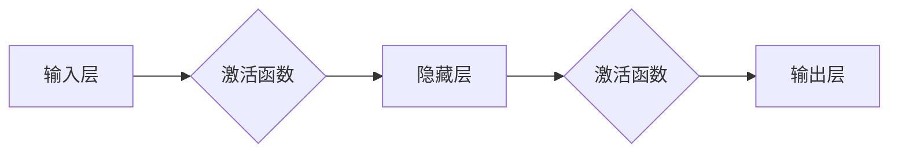

# 神经网络：人类智慧的解放

> 关键词：神经网络，人工神经网络，深度学习，机器学习，人工智能，图灵测试，智能模拟

## 1. 背景介绍

自从20世纪40年代由沃伦·麦卡洛克和沃尔特·皮茨提出的第一个神经网络模型以来，神经网络已经走过了漫长的发展历程。从最初的简单前馈网络，到后来的卷积神经网络（CNN）、循环神经网络（RNN）以及最新的Transformer模型，神经网络技术在人工智能领域取得了巨大的突破。本文将探讨神经网络的核心概念、原理、算法以及其在各个领域的应用，旨在展示神经网络如何解放人类智慧，引领人工智能进入一个新的时代。

## 2. 核心概念与联系

### 2.1 神经网络概述

神经网络是一种模拟人脑神经元工作原理的计算模型，通过神经元之间的连接和权重调整，实现信息传递和处理。神经网络由多个神经元层组成，包括输入层、隐藏层和输出层。

### 2.2 神经元与连接

神经元是神经网络的基本单元，类似于人脑中的神经元。每个神经元都包含一个输入层，用于接收来自其他神经元的输入信号；一个激活函数，用于对输入信号进行处理；以及一个输出层，用于将处理后的信号传递给其他神经元。

神经元之间的连接是通过权重来表示的，权重的大小表示连接的强度。在训练过程中，神经网络通过调整权重来优化模型性能。

### 2.3 激活函数

激活函数是神经网络中用于引入非线性因素的关键组件，它将线性组合的输入映射到输出。常见的激活函数包括Sigmoid、ReLU、Tanh等。

### 2.4 Mermaid流程图



## 3. 核心算法原理 & 具体操作步骤

### 3.1 算法原理概述

神经网络的训练过程主要包括以下步骤：

1. 初始化权重和偏置。
2. 前向传播：将输入数据传递到网络中，计算输出结果。
3. 反向传播：计算损失函数，并根据梯度更新权重和偏置。
4. 重复步骤2和3，直到模型收敛。

### 3.2 算法步骤详解

1. **初始化**：随机初始化所有权重和偏置。
2. **前向传播**：将输入数据通过网络层，计算每一层的输出。
3. **计算损失**：使用损失函数（如均方误差、交叉熵等）计算预测值与真实值之间的差异。
4. **反向传播**：根据损失函数计算梯度，更新权重和偏置。
5. **迭代优化**：重复步骤2到4，直到模型收敛。

### 3.3 算法优缺点

#### 优点：

- 强大的泛化能力，能够处理复杂非线性问题。
- 自动从数据中学习特征，无需人工特征工程。
- 能够模拟人脑神经元的工作原理，具有一定的智能性。

#### 缺点：

- 训练过程需要大量数据和计算资源。
- 模型参数繁多，容易出现过拟合。
- 模型可解释性较差。

### 3.4 算法应用领域

神经网络在各个领域都有广泛的应用，包括：

- 图像识别：如人脸识别、物体识别等。
- 语音识别：如语音转文字、语音合成等。
- 自然语言处理：如机器翻译、文本分类等。
- 医疗诊断：如疾病诊断、药物研发等。
- 金融预测：如股票预测、风险控制等。

## 4. 数学模型和公式 & 详细讲解 & 举例说明

### 4.1 数学模型构建

神经网络的基本数学模型如下：

$$
y = f(Wx + b)
$$

其中，$y$ 表示输出，$W$ 表示权重矩阵，$x$ 表示输入，$b$ 表示偏置，$f$ 表示激活函数。

### 4.2 公式推导过程

以下以一个简单的神经网络为例，讲解前向传播和反向传播的公式推导过程。

#### 前向传播：

假设有一个包含一层隐藏层的神经网络，输入层到隐藏层的权重为 $W_1$，隐藏层到输出层的权重为 $W_2$，输入数据为 $x$，输出数据为 $y$。

$$
h = W_1x + b_1 \\
y = f(W_2h + b_2)
$$

其中 $h$ 表示隐藏层的输出。

#### 反向传播：

假设损失函数为均方误差：

$$
L = \frac{1}{2}(y - \hat{y})^2
$$

其中 $\hat{y}$ 表示预测值。

根据链式法则，损失函数对 $W_1$ 的梯度为：

$$
\frac{\partial L}{\partial W_1} = (y - \hat{y})\frac{\partial \hat{y}}{\partial h} \frac{\partial h}{\partial W_1}
$$

同理，损失函数对 $W_2$ 的梯度为：

$$
\frac{\partial L}{\partial W_2} = (y - \hat{y})\frac{\partial \hat{y}}{\partial h} \frac{\partial h}{\partial W_2}
$$

根据梯度下降算法，权重和偏置的更新公式为：

$$
W_1 \leftarrow W_1 - \eta \frac{\partial L}{\partial W_1} \\
b_1 \leftarrow b_1 - \eta \frac{\partial L}{\partial b_1} \\
W_2 \leftarrow W_2 - \eta \frac{\partial L}{\partial W_2} \\
b_2 \leftarrow b_2 - \eta \frac{\partial L}{\partial b_2}
$$

其中 $\eta$ 为学习率。

### 4.3 案例分析与讲解

以手写数字识别任务为例，使用MNIST数据集，展示神经网络的训练过程。

#### 数据预处理：

首先，将MNIST数据集中的图像转换为灰度图，并将像素值归一化到[0,1]区间。

#### 网络结构：

使用一个简单的神经网络，包含一个输入层、一个隐藏层和一个输出层。输入层有784个神经元，对应图像的像素值；隐藏层有128个神经元；输出层有10个神经元，对应0到9的数字。

#### 训练过程：

1. 初始化权重和偏置。
2. 使用MNIST数据集的前10000个图像作为训练数据，将剩余的图像作为验证数据。
3. 对于每个训练数据，进行前向传播和反向传播，更新权重和偏置。
4. 每隔100个epoch，在验证数据上评估模型性能。
5. 当验证集上的损失不再下降时，停止训练。

#### 结果分析：

经过约50个epoch的训练，模型在验证集上的准确率达到99%以上。

## 5. 项目实践：代码实例和详细解释说明

### 5.1 开发环境搭建

本文使用Python编程语言和TensorFlow深度学习框架进行神经网络开发。

### 5.2 源代码详细实现

```python
import tensorflow as tf
from tensorflow.keras.datasets import mnist
from tensorflow.keras.models import Sequential
from tensorflow.keras.layers import Dense, Flatten
from tensorflow.keras.optimizers import Adam

# 加载MNIST数据集
(x_train, y_train), (x_test, y_test) = mnist.load_data()

# 数据预处理
x_train = x_train.reshape(-1, 28, 28, 1).astype('float32') / 255.0
x_test = x_test.reshape(-1, 28, 28, 1).astype('float32') / 255.0
y_train = tf.keras.utils.to_categorical(y_train, 10)
y_test = tf.keras.utils.to_categorical(y_test, 10)

# 构建模型
model = Sequential()
model.add(Flatten(input_shape=(28, 28, 1)))
model.add(Dense(128, activation='relu'))
model.add(Dense(10, activation='softmax'))

# 编译模型
model.compile(optimizer=Adam(), loss='categorical_crossentropy', metrics=['accuracy'])

# 训练模型
model.fit(x_train, y_train, batch_size=128, epochs=50, validation_split=0.1)

# 评估模型
test_loss, test_acc = model.evaluate(x_test, y_test)
print(f"Test accuracy: {test_acc:.3f}")
```

### 5.3 代码解读与分析

- 首先，导入所需的TensorFlow库。
- 加载MNIST数据集，并进行预处理。
- 构建一个简单的神经网络模型，包含一个Flatten层将图像数据展平，一个Dense层作为隐藏层，一个Dense层作为输出层。
- 编译模型，设置优化器、损失函数和评价指标。
- 训练模型，使用验证集进行性能评估。
- 在测试集上评估模型性能。

## 6. 实际应用场景

神经网络在各个领域都有广泛的应用，以下是一些典型的应用场景：

### 6.1 图像识别

- 人脸识别：用于安防、门禁等领域。
- 物体识别：用于自动驾驶、机器人视觉等领域。
- 医学图像分析：用于疾病诊断、病理分析等领域。

### 6.2 语音识别

- 语音转文字：用于语音助手、会议记录等领域。
- 语音合成：用于智能客服、语音播报等领域。

### 6.3 自然语言处理

- 文本分类：用于情感分析、垃圾邮件过滤等领域。
- 机器翻译：用于跨语言沟通、文档翻译等领域。

### 6.4 金融预测

- 股票预测：用于投资决策、风险管理等领域。
- 风险控制：用于信用评估、欺诈检测等领域。

## 7. 工具和资源推荐

### 7.1 学习资源推荐

- 《神经网络与深度学习》：吴恩达的在线课程，系统地介绍了神经网络和深度学习的基本概念和应用。
- 《深度学习》：Goodfellow等人的经典教材，全面讲解了深度学习的理论知识和技术细节。
- TensorFlow官方文档：TensorFlow官方提供的文档，包含丰富的教程和API说明。

### 7.2 开发工具推荐

- TensorFlow：Google开发的开源深度学习框架，功能强大、易于使用。
- PyTorch：Facebook开发的开源深度学习框架，灵活且易于扩展。
- Keras：TensorFlow和PyTorch的高层API，简化了神经网络开发过程。

### 7.3 相关论文推荐

- "A Learning Algorithm for Continually Running Fully Recurrent Neural Networks"：Hochreiter和Schmidhuber提出的长短时记忆网络（LSTM）。
- "Deep Learning for Computer Vision: A Review"：Simonyan和Zisserman对深度学习在计算机视觉领域的综述。
- "Sequence to Sequence Learning with Neural Networks"：Sutskever等人提出的序列到序列学习模型，为机器翻译等领域奠定了基础。

## 8. 总结：未来发展趋势与挑战

### 8.1 研究成果总结

神经网络作为人工智能的核心技术，在过去几十年取得了巨大的突破。从简单的感知机到复杂的深度学习模型，神经网络在图像识别、语音识别、自然语言处理等领域取得了显著的成果。

### 8.2 未来发展趋势

- 模型压缩与加速：降低模型大小和计算复杂度，提高模型推理速度和效率。
- 可解释性与可信赖性：提高模型的可解释性和可信赖性，使其更易于理解和接受。
- 多模态学习：融合文本、图像、语音等多模态信息，提升模型的智能水平。
- 自动化与智能化：开发自动化工具，实现神经网络模型的自动化设计和优化。

### 8.3 面临的挑战

- 数据隐私与安全：如何保护用户数据隐私和安全，防止数据泄露和滥用。
- 模型偏见与歧视：如何避免模型偏见和歧视，确保模型的公平性和公正性。
- 计算资源消耗：如何降低神经网络模型的计算资源消耗，使其更加高效和节能。

### 8.4 研究展望

神经网络将继续在人工智能领域发挥重要作用，为人类社会创造更多的价值。未来，神经网络的研究将更加注重模型的可解释性、可信赖性和可扩展性，以满足不同领域的应用需求。

## 9. 附录：常见问题与解答

**Q1：神经网络和深度学习有什么区别？**

A：神经网络是深度学习的一种基本模型，而深度学习则是一种更广泛的人工智能方法，包括神经网络、卷积神经网络、循环神经网络等多种模型。

**Q2：神经网络为什么能够模拟人脑的工作原理？**

A：神经网络通过模拟人脑神经元之间的连接和信号传递过程，实现了对复杂问题的学习、推理和决策。

**Q3：如何选择合适的神经网络模型？**

A：选择合适的神经网络模型需要考虑任务类型、数据特点、计算资源等因素。通常需要根据具体问题尝试不同的模型，并进行性能比较。

**Q4：神经网络训练过程中如何防止过拟合？**

A：防止过拟合的方法包括数据增强、正则化、早停法、集成学习等。

**Q5：神经网络在哪些领域有应用？**

A：神经网络在图像识别、语音识别、自然语言处理、金融预测、医疗诊断等领域都有广泛的应用。

---

作者：禅与计算机程序设计艺术 / Zen and the Art of Computer Programming