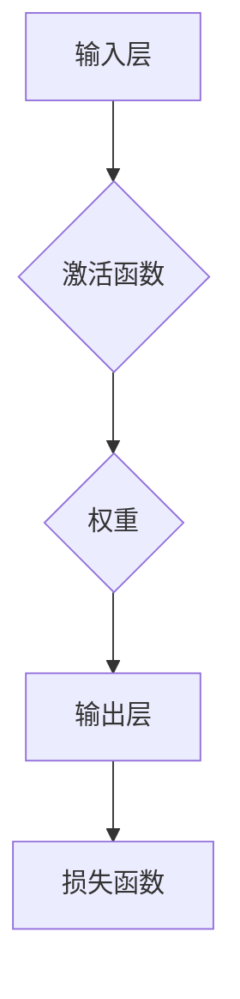

# 神经网络：推动社会进步的力量

> 关键词：神经网络，深度学习，机器学习，人工智能，社会进步，智能系统，算法

## 1. 背景介绍

从简单的逻辑门到复杂的深度神经网络，神经网络作为人工智能领域的基础和核心，已经走过了漫长的道路。自20世纪中叶以来，神经网络的研究和应用经历了兴衰更替，如今，随着计算能力的提升和大数据的涌现，深度学习技术取得了突破性进展，神经网络成为了推动社会进步的重要力量。

### 1.1 问题的由来

早期的人工智能研究主要集中在符号主义和逻辑推理上，但这些方法难以处理复杂的问题，且难以模拟人类的学习过程。1990年代，随着神经网络的复兴，人们开始探索通过模拟人脑神经元的工作原理，来实现更强大的机器学习模型。

### 1.2 研究现状

近年来，深度学习技术的发展使得神经网络在图像识别、语音识别、自然语言处理等多个领域取得了显著的成果。从AlphaGo战胜世界围棋冠军到自动驾驶汽车的普及，神经网络的应用已经渗透到我们的日常生活和各行各业。

### 1.3 研究意义

神经网络作为一种强大的机器学习模型，具有以下重要意义：

- **模拟人脑学习机制**：神经网络能够模拟人脑神经元的工作原理，从而实现类似人类的学习过程。
- **处理复杂问题**：神经网络能够处理复杂的数据关系，解决传统机器学习方法难以解决的问题。
- **提高决策效率**：神经网络能够辅助人类进行决策，提高工作效率和准确率。
- **推动社会进步**：神经网络的应用推动了人工智能技术的发展，为各行各业带来了变革。

### 1.4 本文结构

本文将围绕神经网络的核心概念、算法原理、应用场景和未来发展趋势等方面进行深入探讨。具体内容包括：

- 核心概念与联系
- 核心算法原理与具体操作步骤
- 数学模型和公式讲解
- 项目实践：代码实例和详细解释说明
- 实际应用场景
- 工具和资源推荐
- 总结：未来发展趋势与挑战

## 2. 核心概念与联系

### 2.1 核心概念原理

神经网络是一种模拟人脑神经元结构和功能的人工智能系统。它由大量的神经元连接而成，每个神经元负责处理一部分输入信息，并通过激活函数产生输出。

神经网络的原理可以用以下Mermaid流程图表示：



在这个流程图中，输入层接收外部输入数据，通过激活函数处理后，与权重进行加权求和，最后通过输出层产生预测结果。损失函数用于衡量预测结果与真实值之间的差异，并指导权重更新。

### 2.2 核心概念联系

神经网络的核心概念包括：

- **神经元**：神经网络的基本单元，负责处理输入数据并产生输出。
- **权重**：连接神经元之间的参数，用于调整输入数据对输出结果的影响。
- **激活函数**：用于对神经元输出进行非线性变换，增加模型的非线性。
- **损失函数**：衡量模型预测结果与真实值之间的差异。
- **反向传播**：一种优化算法，用于更新神经网络中的权重，使损失函数最小化。

这些概念相互联系，共同构成了神经网络的完整体系。

## 3. 核心算法原理 & 具体操作步骤

### 3.1 算法原理概述

神经网络的核心算法包括：

- **前向传播**：将输入数据传递到神经网络的各个层，并计算输出结果。
- **反向传播**：根据损失函数计算梯度，更新神经网络中的权重，使模型更接近真实值。
- **优化算法**：用于选择权重的更新方向和步长，如梯度下降、Adam等。

### 3.2 算法步骤详解

以下是神经网络训练的基本步骤：

1. **初始化权重**：随机初始化神经网络中的权重。
2. **前向传播**：将输入数据传递到神经网络，计算输出结果。
3. **计算损失**：计算输出结果与真实值之间的差异，即损失函数。
4. **反向传播**：根据损失函数计算梯度，更新神经网络中的权重。
5. **迭代训练**：重复步骤2-4，直到满足停止条件（如损失函数收敛）。

### 3.3 算法优缺点

神经网络算法的优点包括：

- **强大的非线性建模能力**：能够处理复杂的数据关系。
- **自学习能力**：能够从数据中学习并改进模型。
- **泛化能力**：能够将学习到的知识应用到新的数据上。

神经网络的缺点包括：

- **训练数据需求量大**：需要大量的训练数据才能达到良好的效果。
- **计算复杂度高**：训练过程需要大量的计算资源。
- **可解释性差**：难以解释模型内部的决策过程。

### 3.4 算法应用领域

神经网络算法在以下领域得到了广泛应用：

- **图像识别**：如人脸识别、物体识别等。
- **语音识别**：如语音转文字、语音翻译等。
- **自然语言处理**：如机器翻译、情感分析等。
- **推荐系统**：如电影推荐、商品推荐等。

## 4. 数学模型和公式 & 详细讲解 & 举例说明

### 4.1 数学模型构建

神经网络的数学模型可以用以下公式表示：

$$
y = \sigma(W \cdot x + b)
$$

其中，$y$ 是输出，$x$ 是输入，$W$ 是权重，$b$ 是偏置，$\sigma$ 是激活函数。

### 4.2 公式推导过程

以下以一个简单的全连接神经网络为例，讲解公式的推导过程。

假设神经网络包含一个输入层、一个隐藏层和一个输出层，输入层有 $n$ 个神经元，隐藏层有 $m$ 个神经元，输出层有 $k$ 个神经元。

- 输入层到隐藏层的连接权重矩阵为 $W_1 \in \mathbb{R}^{m \times n}$，偏置矩阵为 $b_1 \in \mathbb{R}^{m \times 1}$。
- 隐藏层到输出层的连接权重矩阵为 $W_2 \in \mathbb{R}^{k \times m}$，偏置矩阵为 $b_2 \in \mathbb{R}^{k \times 1}$。

隐藏层的输入为 $z_1 = W_1 \cdot x + b_1$，输出为 $h_1 = \sigma(z_1)$。

输出层的输入为 $z_2 = W_2 \cdot h_1 + b_2$，输出为 $y = \sigma(z_2)$。

### 4.3 案例分析与讲解

以下以一个简单的回归问题为例，讲解神经网络的实现过程。

假设我们有一个包含 $n$ 个样本的回归问题，样本特征为 $x \in \mathbb{R}^n$，真实标签为 $y \in \mathbb{R}$。

我们构建一个包含一个隐藏层的神经网络，隐藏层有 $m$ 个神经元，输出层只有一个神经元。

输入层到隐藏层的连接权重矩阵为 $W_1 \in \mathbb{R}^{m \times n}$，偏置矩阵为 $b_1 \in \mathbb{R}^{m \times 1}$。

隐藏层到输出层的连接权重矩阵为 $W_2 \in \mathbb{R}^{1 \times m}$，偏置矩阵为 $b_2 \in \mathbb{R}^{1 \times 1}$。

隐藏层的输入为 $z_1 = W_1 \cdot x + b_1$，输出为 $h_1 = \sigma(z_1)$。

输出层的输入为 $z_2 = W_2 \cdot h_1 + b_2$，输出为 $y = z_2$。

我们将该神经网络训练在样本上，使得输出值 $y$ 尽可能接近真实标签 $y$。

## 5. 项目实践：代码实例和详细解释说明

### 5.1 开发环境搭建

为了实践神经网络，我们需要搭建以下开发环境：

- Python 3.6及以上版本
- TensorFlow 2.x或PyTorch
- NumPy

### 5.2 源代码详细实现

以下是一个使用TensorFlow实现的简单神经网络回归问题的代码实例：

```python
import tensorflow as tf
from tensorflow.keras.layers import Dense
from tensorflow.keras.models import Sequential

# 定义神经网络模型
model = Sequential([
    Dense(64, activation='relu', input_shape=(n_features,)),
    Dense(1)
])

# 编译模型
model.compile(optimizer='adam', loss='mse')

# 训练模型
model.fit(X_train, y_train, epochs=100, batch_size=32)

# 评估模型
mse = model.evaluate(X_test, y_test)
print(f"测试集均方误差: {mse}")
```

### 5.3 代码解读与分析

以上代码首先导入TensorFlow库，并定义了一个包含一个隐藏层的神经网络模型。隐藏层有64个神经元，激活函数为ReLU。输出层只有一个神经元。

接着，编译模型并设置优化器为Adam，损失函数为均方误差。

然后，在训练集上训练模型100个epoch，每个batch大小为32。

最后，在测试集上评估模型性能，打印测试集均方误差。

### 5.4 运行结果展示

假设我们的测试集均方误差为0.01，说明模型在测试集上的性能较好。

## 6. 实际应用场景

### 6.1 图像识别

神经网络在图像识别领域取得了显著的成果，如人脸识别、物体识别等。

以下是一些常见的图像识别应用：

- **人脸识别**：通过识别图像中的人脸特征，实现门禁系统、身份验证等。
- **物体识别**：识别图像中的物体类别，如自动驾驶汽车中的行人检测。

### 6.2 语音识别

神经网络在语音识别领域也取得了突破性进展，如语音转文字、语音翻译等。

以下是一些常见的语音识别应用：

- **语音转文字**：将语音信号转换为文字文本，实现语音助手、会议记录等功能。
- **语音翻译**：将一种语言的语音信号翻译成另一种语言的文字或语音，实现跨语言沟通。

### 6.3 自然语言处理

神经网络在自然语言处理领域也取得了显著的成果，如机器翻译、情感分析等。

以下是一些常见的自然语言处理应用：

- **机器翻译**：将一种语言的文本翻译成另一种语言的文本，实现跨语言沟通。
- **情感分析**：分析文本中的情感倾向，如社交媒体分析、产品评论分析。

## 7. 工具和资源推荐

### 7.1 学习资源推荐

- 《深度学习》系列书籍：由Ian Goodfellow、Yoshua Bengio和Aaron Courville合著，是深度学习的经典教材。
- TensorFlow官方文档：提供了TensorFlow的完整教程和API文档。
- PyTorch官方文档：提供了PyTorch的完整教程和API文档。

### 7.2 开发工具推荐

- TensorFlow：由Google开发的开源深度学习框架，适合进行大规模深度学习模型的开发。
- PyTorch：由Facebook开发的开源深度学习框架，易于上手和使用。

### 7.3 相关论文推荐

- "A Neural Network for Pattern Recognition"：神经网络之父Geoffrey Hinton的经典论文，介绍了神经网络的基本原理。
- "ImageNet Classification with Deep Convolutional Neural Networks"：该论文介绍了AlexNet模型，是深度学习在图像识别领域取得突破性进展的里程碑。

## 8. 总结：未来发展趋势与挑战

### 8.1 研究成果总结

神经网络作为一种强大的机器学习模型，在图像识别、语音识别、自然语言处理等多个领域取得了显著的成果。随着深度学习技术的不断发展，神经网络的应用将更加广泛，为人类社会带来更多便利。

### 8.2 未来发展趋势

以下是神经网络未来发展的几个趋势：

- **更强大的模型**：随着计算能力的提升，将出现更加复杂的神经网络模型，能够处理更复杂的问题。
- **更轻量级的模型**：为了提高神经网络在移动设备和嵌入式系统上的应用，将出现更加轻量级的神经网络模型。
- **更可解释的模型**：为了提高神经网络的透明度和可信度，将出现更加可解释的神经网络模型。

### 8.3 面临的挑战

以下是神经网络未来发展中面临的几个挑战：

- **计算资源**：神经网络训练需要大量的计算资源，如何降低计算成本是一个重要挑战。
- **数据隐私**：神经网络在处理数据时，可能涉及用户隐私，如何保护用户隐私是一个重要挑战。
- **模型可解释性**：神经网络内部的决策过程难以解释，如何提高模型可解释性是一个重要挑战。

### 8.4 研究展望

未来，神经网络的研究将朝着更加高效、智能、可解释的方向发展，为人类社会带来更多创新和进步。

## 9. 附录：常见问题与解答

**Q1：什么是神经网络？**

A：神经网络是一种模拟人脑神经元结构和功能的人工智能系统，由大量的神经元连接而成，能够处理复杂的数据关系。

**Q2：神经网络有哪些优点？**

A：神经网络具有强大的非线性建模能力、自学习能力和泛化能力。

**Q3：神经网络有哪些缺点？**

A：神经网络需要大量的训练数据，计算复杂度高，且可解释性差。

**Q4：神经网络在哪些领域得到广泛应用？**

A：神经网络在图像识别、语音识别、自然语言处理等多个领域得到广泛应用。

**Q5：如何选择合适的神经网络模型？**

A：选择合适的神经网络模型需要根据具体问题、数据特点和计算资源等因素综合考虑。

作者：禅与计算机程序设计艺术 / Zen and the Art of Computer Programming