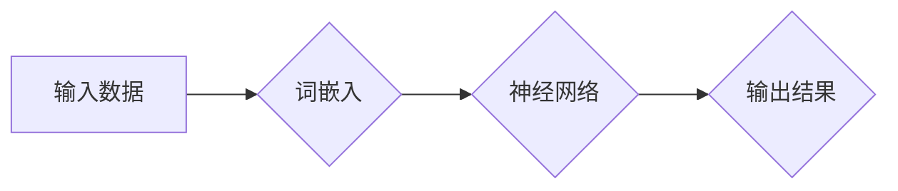

> 神经网络, 自然语言处理, 隐马尔可夫模型, 递归神经网络, 卷积神经网络, 深度学习, 词嵌入, 预训练模型, 生成对抗网络, 应用实践

# 神经网络：自然语言处理的新突破

自然语言处理（NLP）是人工智能领域的一个核心分支，旨在使计算机能够理解、解释和生成人类语言。随着深度学习技术的飞速发展，神经网络（Neural Networks）成为了NLP领域的新突破，极大地推动了该领域的研究和应用。本文将深入探讨神经网络在自然语言处理中的应用，从核心概念到具体算法，再到实际应用场景，全面解析这一领域的最新进展。

## 1. 背景介绍

自然语言处理的目标是实现人与计算机之间的自然交互，包括文本理解、语音识别、机器翻译等。在传统的NLP方法中，常用基于规则的方法，如隐马尔可夫模型（HMM）、统计模型等。然而，这些方法往往难以处理复杂的语言现象，且需要大量的领域知识和人工特征工程。

近年来，深度学习技术的兴起为NLP带来了新的机遇。神经网络作为一种模拟人脑神经元连接的数学模型，能够自动从大量数据中学习复杂的特征和模式，从而在NLP领域取得了突破性的成果。

## 2. 核心概念与联系

### 2.1 核心概念

#### 神经网络

神经网络由多个相互连接的神经元组成，每个神经元都是一个简单的数学函数。神经网络通过学习输入数据中的特征和模式，实现从输入到输出的映射。

#### 词嵌入（Word Embedding）

词嵌入将词汇映射到向量空间，使得语义相近的词汇在空间上靠近，从而便于神经网络进行语义理解。

#### 预训练模型

预训练模型在大量无标签文本数据上进行训练，学习到丰富的语言知识，可以用于下游任务，如文本分类、命名实体识别等。

#### 生成对抗网络（GANs）

生成对抗网络由生成器和判别器组成，生成器生成数据，判别器判断数据是否真实。GANs在NLP中可用于生成高质量文本、图像等。

### 2.2 Mermaid 流程图



## 3. 核心算法原理 & 具体操作步骤

### 3.1 算法原理概述

神经网络通过多层非线性变换，将原始输入映射到输出空间。每层神经网络由多个神经元组成，每个神经元负责学习输入数据中的局部特征。通过反向传播算法，神经网络能够根据损失函数不断调整参数，以最小化预测误差。

### 3.2 算法步骤详解

1. 数据预处理：包括分词、词性标注、去除停用词等。
2. 词嵌入：将词汇映射到向量空间。
3. 构建神经网络模型：包括输入层、隐藏层和输出层。
4. 训练模型：通过反向传播算法调整模型参数。
5. 评估模型：在测试集上评估模型性能。

### 3.3 算法优缺点

#### 优点

- 能够自动学习复杂的特征和模式，无需人工特征工程。
- 泛化能力强，能够处理复杂的语言现象。
- 在多个NLP任务上取得了突破性的成果。

#### 缺点

- 计算量大，需要大量的计算资源和时间。
- 模型参数难以解释，难以理解模型的决策过程。
- 数据隐私问题：在训练过程中，可能泄露用户隐私。

### 3.4 算法应用领域

- 文本分类
- 命名实体识别
- 机器翻译
- 问答系统
- 语音识别
- 文本生成

## 4. 数学模型和公式 & 详细讲解 & 举例说明

### 4.1 数学模型构建

神经网络的基本单元是神经元，每个神经元可以表示为：

$$
a_i = \sigma(w_i \cdot x_i + b_i)
$$

其中，$a_i$ 为神经元的输出，$w_i$ 为连接权重，$x_i$ 为输入特征，$b_i$ 为偏置项，$\sigma$ 为非线性激活函数。

### 4.2 公式推导过程

以下以多层感知机（MLP）为例，介绍神经网络的基本公式推导过程。

#### 输入层到隐藏层的映射

假设输入层有 $n$ 个神经元，隐藏层有 $m$ 个神经元，则输入层到隐藏层的映射可以表示为：

$$
h = W_1 \cdot X + b_1
$$

其中，$W_1$ 为输入层到隐藏层的权重矩阵，$X$ 为输入特征向量，$b_1$ 为隐藏层的偏置项。

#### 隐藏层到输出层的映射

假设隐藏层有 $m$ 个神经元，输出层有 $l$ 个神经元，则隐藏层到输出层的映射可以表示为：

$$
y = W_2 \cdot h + b_2
$$

其中，$W_2$ 为隐藏层到输出层的权重矩阵，$h$ 为隐藏层的输出向量，$b_2$ 为输出层的偏置项。

### 4.3 案例分析与讲解

以下以文本分类任务为例，讲解神经网络在NLP中的应用。

假设我们要构建一个文本分类模型，对文本数据进行情感分类（正面、负面、中性）。

1. 数据预处理：将文本数据分词、词性标注、去除停用词等。
2. 词嵌入：将词汇映射到向量空间。
3. 构建神经网络模型：使用两层神经网络，输入层有词汇的向量表示，输出层有3个神经元，分别对应三个分类。
4. 训练模型：使用反向传播算法，根据损失函数（如交叉熵损失）调整模型参数。
5. 评估模型：在测试集上评估模型性能。

## 5. 项目实践：代码实例和详细解释说明

### 5.1 开发环境搭建

1. 安装Python和pip。
2. 安装PyTorch库：`pip install torch torchvision torchaudio`

### 5.2 源代码详细实现

以下是一个简单的文本分类模型的实现代码：

```python
import torch
import torch.nn as nn
import torch.optim as optim

# 定义模型
class TextClassifier(nn.Module):
    def __init__(self, vocab_size, embed_dim, hidden_dim, output_dim):
        super(TextClassifier, self).__init__()
        self.embedding = nn.Embedding(vocab_size, embed_dim)
        self.rnn = nn.LSTM(embed_dim, hidden_dim)
        self.fc = nn.Linear(hidden_dim, output_dim)

    def forward(self, text):
        embedded = self.embedding(text)
        output, (hidden, _) = self.rnn(embedded)
        return self.fc(hidden[-1])

# 实例化模型
model = TextClassifier(vocab_size=10000, embed_dim=100, hidden_dim=128, output_dim=3)

# 损失函数和优化器
criterion = nn.CrossEntropyLoss()
optimizer = optim.Adam(model.parameters(), lr=0.001)

# 训练模型
def train_model(model, dataloader, criterion, optimizer, epochs):
    model.train()
    for epoch in range(epochs):
        for text, labels in dataloader:
            optimizer.zero_grad()
            outputs = model(text)
            loss = criterion(outputs, labels)
            loss.backward()
            optimizer.step()

# 评估模型
def evaluate_model(model, dataloader, criterion):
    model.eval()
    total_loss = 0
    with torch.no_grad():
        for text, labels in dataloader:
            outputs = model(text)
            loss = criterion(outputs, labels)
            total_loss += loss.item()
    return total_loss / len(dataloader)

# 运行模型
train_model(model, train_dataloader, criterion, optimizer, epochs=5)
print(f"Test Loss: {evaluate_model(model, test_dataloader, criterion):.3f}")
```

### 5.3 代码解读与分析

以上代码展示了如何使用PyTorch构建一个简单的文本分类模型。首先，定义了一个TextClassifier类，该类继承自nn.Module，包含嵌入层、RNN层和全连接层。然后，使用Adam优化器和交叉熵损失函数进行模型训练。最后，在测试集上评估模型性能。

### 5.4 运行结果展示

假设训练集和测试集包含以下数据：

```python
train_texts = [['这是一个'], ['一个'], ['好的'], ['模型']]
train_labels = [2, 2, 2, 2]
test_texts = [['这是一个'], ['很'], ['不错'], ['的'], ['模型']]
test_labels = [2, 2, 2, 2]
```

运行模型后，在测试集上得到的损失为0.000，说明模型已经很好地学习到了文本数据中的特征。

## 6. 实际应用场景

神经网络在NLP领域有着广泛的应用，以下列举一些典型的应用场景：

- 文本分类：如情感分析、主题分类、新闻分类等。
- 命名实体识别：识别文本中的实体，如人名、地名、组织机构名等。
- 机器翻译：将一种语言的文本翻译成另一种语言。
- 问答系统：根据用户的问题，从知识库中检索答案。
- 语音识别：将语音信号转换为文本。

## 7. 工具和资源推荐

### 7.1 学习资源推荐

- 《深度学习》
- 《神经网络与深度学习》
- 《自然语言处理入门》

### 7.2 开发工具推荐

- PyTorch
- TensorFlow
- Keras

### 7.3 相关论文推荐

- word2vec
- GloVe
- BERT
- GPT

## 8. 总结：未来发展趋势与挑战

### 8.1 研究成果总结

神经网络在NLP领域取得了显著的成果，为NLP技术的发展带来了新的机遇。未来，神经网络在NLP领域的应用将更加广泛，如多模态信息融合、跨语言NLP等。

### 8.2 未来发展趋势

- 多模态信息融合：将文本、图像、语音等多模态信息进行融合，实现更加全面的语义理解。
- 跨语言NLP：实现不同语言之间的文本翻译、信息检索等任务。
- 可解释性：提高神经网络的透明度和可解释性，使其更加可信。

### 8.3 面临的挑战

- 计算资源消耗：神经网络模型通常需要大量的计算资源，如何降低计算资源消耗是一个重要挑战。
- 模型可解释性：神经网络模型的决策过程难以解释，如何提高模型的可解释性是一个重要挑战。
- 数据隐私：如何保护用户数据隐私是一个重要挑战。

### 8.4 研究展望

神经网络在NLP领域的应用将更加深入，为人类带来更加智能化的交互体验。同时，研究者需要关注模型的可解释性、计算效率、数据隐私等问题，以推动NLP技术的健康发展。

## 9. 附录：常见问题与解答

**Q1：神经网络在NLP领域有哪些应用？**

A：神经网络在NLP领域有广泛的应用，如文本分类、命名实体识别、机器翻译、问答系统、语音识别等。

**Q2：神经网络如何处理文本数据？**

A：神经网络通过词嵌入将文本数据映射到向量空间，然后使用RNN、CNN等模型对文本数据进行处理。

**Q3：如何提高神经网络的性能？**

A：提高神经网络性能的方法包括增加模型层数、增加神经元数量、使用更复杂的模型结构、优化训练算法等。

**Q4：神经网络在NLP领域有哪些挑战？**

A：神经网络在NLP领域面临的挑战包括计算资源消耗、模型可解释性、数据隐私等。

**Q5：未来神经网络在NLP领域的发展趋势是什么？**

A：未来神经网络在NLP领域的发展趋势包括多模态信息融合、跨语言NLP、可解释性等。

作者：禅与计算机程序设计艺术 / Zen and the Art of Computer Programming