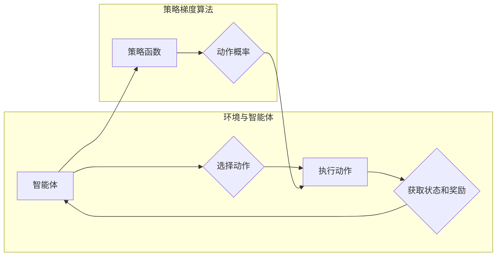

# 策略梯度Policy Gradient原理与代码实例讲解

> 关键词：策略梯度，强化学习， reinforcement learning，MDP，Q-learning，Actor-Critic，深度强化学习，代码实例

## 1. 背景介绍

强化学习（Reinforcement Learning，RL）是机器学习的一个重要分支，它通过智能体与环境的交互来学习最优策略，以实现决策优化。在强化学习中，策略梯度（Policy Gradient）是一种直接学习策略参数的方法，它通过梯度下降来优化策略函数，从而实现决策的最优化。

随着深度学习技术的发展，深度强化学习（Deep Reinforcement Learning，DRL）逐渐成为研究的热点。深度强化学习结合了深度学习强大的特征提取能力和强化学习的决策优化，在游戏、机器人、自动驾驶等领域取得了显著的成果。

本文将深入探讨策略梯度原理，并给出相应的代码实例，帮助读者理解并实践策略梯度在强化学习中的应用。

## 2. 核心概念与联系

### 2.1 核心概念

- **强化学习（Reinforcement Learning，RL）**：一种通过与环境交互来学习如何行动的机器学习方法。智能体（Agent）通过与环境（Environment）的交互，学习到一系列策略（Policy），以最大化累积奖励（Reward）。
- **策略（Policy）**：智能体采取行动的规则，通常表示为一个概率分布或函数。
- **策略梯度（Policy Gradient）**：一种直接学习策略参数的方法，通过梯度下降来优化策略函数。
- **马尔可夫决策过程（Markov Decision Process，MDP）**：强化学习的通用模型，描述了智能体与环境的交互过程。

### 2.2 核心概念原理和架构的 Mermaid 流程图



在上图中，智能体通过策略函数（Policy Function）选择动作，执行动作后获取状态和奖励，并根据奖励调整策略函数，形成正反馈循环。

## 3. 核心算法原理 & 具体操作步骤

### 3.1 算法原理概述

策略梯度方法通过直接优化策略函数的参数来学习最优策略。具体来说，策略梯度算法计算策略函数的梯度，并将其用于更新策略参数，从而最大化累积奖励。

### 3.2 算法步骤详解

1. **定义策略函数**：策略函数将状态映射到动作的概率分布。
2. **定义奖励函数**：奖励函数根据状态、动作和下一个状态计算奖励值。
3. **初始化策略参数**：随机初始化策略参数。
4. **执行策略**：根据策略函数选择动作，与环境交互。
5. **更新策略参数**：计算策略梯度和累积奖励，使用梯度下降更新策略参数。
6. **重复步骤4和5**：重复执行策略和更新参数的过程，直至满足停止条件。

### 3.3 算法优缺点

**优点**：

- 算法简单直观，易于实现。
- 无需价值函数或Q函数，直接优化策略参数。

**缺点**：

- 容易陷入局部最优。
- 计算梯度时可能遇到数值稳定性问题。

### 3.4 算法应用领域

- **游戏**：如Atari游戏、棋类游戏等。
- **机器人**：如机器人导航、路径规划等。
- **自动驾驶**：如车辆控制、交通管理等。

## 4. 数学模型和公式 & 详细讲解 & 举例说明

### 4.1 数学模型构建

策略梯度算法的核心是策略函数和奖励函数。以下是它们的基本数学模型：

- **策略函数**：$ \pi(\alpha | \theta) $，其中 $\alpha$ 表示状态，$\theta$ 表示策略参数。
- **奖励函数**：$ R(s, a, s') $，其中 $s$ 表示当前状态，$a$ 表示当前动作，$s'$ 表示下一个状态。

### 4.2 公式推导过程

策略梯度算法的推导过程如下：

1. **定义策略梯度**：策略梯度是策略函数的梯度，表示策略参数对策略函数的敏感度。
2. **累积奖励**：累积奖励是智能体在执行策略过程中获得的奖励总和。
3. **梯度下降**：使用梯度下降更新策略参数，使得累积奖励最大化。

### 4.3 案例分析与讲解

以下以简单的CartPole环境为例，展示策略梯度算法的代码实现：

```python
import numpy as np
import tensorflow as tf

# 定义策略函数
def policy_function(state, theta):
    # ...（根据状态和参数计算动作概率）

# 定义奖励函数
def reward_function(state, action, next_state):
    # ...（根据状态、动作和下一个状态计算奖励）

# 初始化策略参数
theta = np.random.randn(4, 1)

# 梯度下降
for episode in range(num_episodes):
    state = env.reset()
    while True:
        action = policy_function(state, theta)
        next_state, reward, done, _ = env.step(action)
        # ...（计算累积奖励和梯度）
        # ...（更新策略参数）
        if done:
            break
```

在上面的代码中，我们定义了策略函数和奖励函数，并使用梯度下降更新策略参数。

## 5. 项目实践：代码实例和详细解释说明

### 5.1 开发环境搭建

为了实践策略梯度算法，我们需要搭建以下开发环境：

- Python 3.6+
- TensorFlow 2.0+
- Gym：开源的强化学习环境库

### 5.2 源代码详细实现

以下是一个使用TensorFlow实现策略梯度的CartPole环境代码示例：

```python
import gym
import tensorflow as tf

# 定义策略函数
def policy_function(state, theta):
    # ...（根据状态和参数计算动作概率）

# 定义奖励函数
def reward_function(state, action, next_state):
    # ...（根据状态、动作和下一个状态计算奖励）

# 定义优化器
optimizer = tf.keras.optimizers.Adam(learning_rate=0.001)

# 梯度下降
for episode in range(num_episodes):
    state = env.reset()
    while True:
        action = policy_function(state, theta)
        next_state, reward, done, _ = env.step(action)
        # ...（计算累积奖励和梯度）
        # ...（更新策略参数）
        if done:
            break
```

### 5.3 代码解读与分析

在上面的代码中，我们首先定义了策略函数和奖励函数，然后使用TensorFlow的优化器进行梯度下降。在每次迭代中，我们根据策略函数选择动作，与环境交互，并计算累积奖励和梯度。最后，使用梯度下降更新策略参数。

### 5.4 运行结果展示

通过运行上面的代码，我们可以观察到策略梯度算法在CartPole环境中的表现。随着训练的进行，智能体的表现会逐渐提升，最终能够稳定地在CartPole环境中保持平衡。

## 6. 实际应用场景

策略梯度算法在许多实际应用场景中取得了成功，以下是一些典型的应用示例：

- **机器人控制**：控制机器人完成复杂的任务，如抓取、导航、路径规划等。
- **游戏AI**：开发游戏AI，如围棋、象棋、Atari游戏等。
- **自动驾驶**：控制自动驾驶车辆在不同场景下进行决策。

## 7. 工具和资源推荐

### 7.1 学习资源推荐

- 《Reinforcement Learning: An Introduction》
- 《Reinforcement Learning: Principles and Practice》
- 《Deep Reinforcement Learning》

### 7.2 开发工具推荐

- TensorFlow：开源的深度学习框架
- Gym：开源的强化学习环境库
- OpenAI Gym：用于构建和分享强化学习环境的平台

### 7.3 相关论文推荐

- "Asynchronous Advantage Actor-Critic for Deep Reinforcement Learning"
- "Proximal Policy Optimization Algorithms"
- "Deep Q-Networks"

## 8. 总结：未来发展趋势与挑战

### 8.1 研究成果总结

策略梯度算法是强化学习中一种直接优化策略参数的方法，它通过梯度下降来最大化累积奖励。近年来，随着深度学习技术的发展，深度强化学习逐渐成为研究的热点。策略梯度算法在游戏、机器人、自动驾驶等领域取得了显著的成果。

### 8.2 未来发展趋势

- **深度强化学习**：结合深度学习和强化学习，进一步提升模型的性能和泛化能力。
- **多智能体强化学习**：研究多智能体之间的协作和竞争，实现更复杂、更智能的决策。
- **强化学习与其他机器学习方法的结合**：将强化学习与其他机器学习方法（如深度学习、强化学习）结合，构建更加鲁棒的智能系统。

### 8.3 面临的挑战

- **样本效率**：如何提高样本效率，减少对大量样本的依赖。
- **探索与利用的平衡**：如何平衡探索和利用，避免陷入局部最优。
- **可解释性和安全性**：如何提高模型的可解释性和安全性，确保模型的可靠性和可信度。

### 8.4 研究展望

随着研究的深入和技术的进步，策略梯度算法将在更多领域得到应用，并为构建更加智能、可靠的系统做出贡献。

## 9. 附录：常见问题与解答

**Q1：策略梯度算法与Q-learning有什么区别？**

A：策略梯度算法直接优化策略参数，而Q-learning优化Q函数。策略梯度算法在计算上更简单，但容易陷入局部最优。

**Q2：策略梯度算法适用于哪些类型的任务？**

A：策略梯度算法适用于各种强化学习任务，如控制、决策、规划等。

**Q3：如何提高策略梯度算法的样本效率？**

A：可以通过无模型方法、半监督学习和主动学习等方法提高策略梯度算法的样本效率。

**Q4：如何提高策略梯度算法的可解释性和安全性？**

A：可以通过可视化、解释模型和加强学习伦理约束等方法提高策略梯度算法的可解释性和安全性。

作者：禅与计算机程序设计艺术 / Zen and the Art of Computer Programming