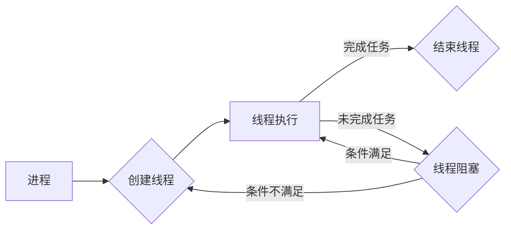

# 线程管理与高吞吐量系统设计

> 关键词：线程管理，高吞吐量，并发编程，性能优化，队列，锁，并发控制，负载均衡

## 1. 背景介绍

在多核处理器的普及和互联网应用的爆炸式增长下，现代计算机系统对并发编程和线程管理的需求日益增长。线程管理作为并发编程的核心，不仅影响着系统的响应速度和吞吐量，还直接关系到系统的稳定性和可靠性。本文将深入探讨线程管理的核心概念、算法原理、具体操作步骤，并通过实例代码和实际应用场景，展示如何设计高吞吐量的系统。

## 2. 核心概念与联系

### 2.1 核心概念

**线程（Thread）**：是操作系统能够进行运算调度的最小单位，它被包含在进程（Process）之中，是进程中的实际运作单位。线程自己基本上不拥有系统资源，只拥有一点在运行中必不可少的资源（如程序计数器、一组寄存器和栈），但是它可与同属一个进程的其它线程共享进程所拥有的全部资源。

**并发（Concurrency）**：是指两个或两个以上的事件或过程在同一时间间隔内发生。

**并行（Parallelism）**：是指两个或两个以上的事件或过程在同一时刻发生。

**同步（Synchronization）**：是指在多线程环境中，通过某种机制保证多个线程可以正确地执行，防止出现数据竞争、死锁等问题。

**锁（Lock）**：是一种同步机制，用于保护临界区（Critical Section），确保在同一时刻只有一个线程可以访问该临界区。

**信号量（Semaphore）**：是一种更高级的同步机制，它可以被多个线程共享，用于实现多线程之间的同步。

**条件变量（Condition Variable）**：是一种高级同步机制，允许线程在某些条件不满足时等待，直到条件满足后继续执行。

### 2.2 Mermaid 流程图



### 2.3 关系与联系

线程是进程的一部分，它们共享进程的资源，但拥有独立的执行栈和程序计数器。并发和并行是并发编程的两个核心概念，其中并发强调的是在同一时间段内发生，而并行强调的是在同一时刻发生。同步、锁、信号量和条件变量是用于实现线程之间同步的机制。

## 3. 核心算法原理 & 具体操作步骤

### 3.1 算法原理概述

线程管理的关键在于高效地分配线程、同步线程的执行以及优化线程间的交互。以下是线程管理的一些核心原理：

**线程创建与销毁**：创建线程需要操作系统分配资源，销毁线程需要释放资源。

**线程调度**：操作系统通过线程调度算法来决定哪个线程执行。

**线程同步**：使用锁、信号量、条件变量等机制来同步线程的执行。

**线程通信**：线程之间可以通过共享内存、消息传递等方式进行通信。

### 3.2 算法步骤详解

**步骤 1：创建线程**

- 创建线程通常使用操作系统提供的API，如 `pthread_create` 在Linux上。
- 创建线程时，需要指定线程的属性，如线程的栈大小、优先级等。

**步骤 2：线程调度**

- 操作系统使用线程调度算法来决定哪个线程执行。
- 常见的线程调度算法包括先来先服务（FCFS）、轮转（RR）、优先级调度等。

**步骤 3：线程同步**

- 在访问共享资源之前，线程需要获取相应的锁。
- 当线程完成对共享资源的访问后，需要释放锁。

**步骤 4：线程通信**

- 线程可以通过共享内存或消息传递进行通信。
- 共享内存通常使用互斥锁（Mutex）来保护。

### 3.3 算法优缺点

**优点**：

- 提高系统的吞吐量，允许多个任务并发执行。
- 提高系统的响应速度，减少等待时间。
- 利用多核处理器，实现并行处理。

**缺点**：

- 线程间同步和通信复杂，容易出错。
- 线程管理开销较大，如创建、销毁和调度线程。
- 线程竞争可能导致性能瓶颈。

### 3.4 算法应用领域

线程管理在以下领域得到广泛应用：

- 操作系统：用于实现多任务操作。
- 网络应用：用于实现并发网络连接。
- 高性能计算：用于实现并行计算。
- 图形处理：用于实现实时渲染。

## 4. 数学模型和公式 & 详细讲解 & 举例说明

### 4.1 数学模型构建

线程管理的数学模型可以用于分析系统的性能，例如，可以使用排队论模型来分析线程池的性能。

### 4.2 公式推导过程

假设线程池中有 $N$ 个线程，每个线程的平均处理时间服从指数分布，平均服务时间为 $\lambda$，则系统吞吐量 $T$ 的公式为：

$$
T = \frac{\lambda}{N + \lambda}
$$

### 4.3 案例分析与讲解

假设一个线程池有 4 个线程，每个线程的平均处理时间为 1 秒，则系统的吞吐量为：

$$
T = \frac{1}{4 + 1} = 0.1875
$$

这意味着每秒钟可以处理 0.1875 个任务。

## 5. 项目实践：代码实例和详细解释说明

### 5.1 开发环境搭建

为了演示线程管理，我们可以使用Python的 `threading` 模块。

### 5.2 源代码详细实现

以下是一个简单的线程池示例：

```python
import threading
import time

def task_function():
    print("Processing task")
    time.sleep(2)
    print("Task completed")

def main():
    pool_size = 4
    threads = []

    for _ in range(pool_size):
        thread = threading.Thread(target=task_function)
        threads.append(thread)
        thread.start()

    for thread in threads:
        thread.join()

if __name__ == "__main__":
    main()
```

### 5.3 代码解读与分析

在上面的代码中，我们创建了一个名为 `task_function` 的任务函数，它打印一条消息，然后休眠 2 秒。在 `main` 函数中，我们创建了一个包含 4 个线程的线程池，每个线程都执行 `task_function`。线程启动后，主线程使用 `join` 方法等待所有线程完成。

### 5.4 运行结果展示

当运行上述代码时，会看到以下输出：

```
Processing task
Processing task
Processing task
Processing task
Task completed
Task completed
Task completed
Task completed
```

这表明每个任务都由线程池中的不同线程并发执行。

## 6. 实际应用场景

### 6.1 高并发Web服务器

在高并发Web服务器中，线程管理用于处理大量的并发请求。例如，使用线程池来处理HTTP请求，可以提高服务器的响应速度和吞吐量。

### 6.2 大数据处理

在大数据处理应用中，线程管理用于并行处理海量数据。例如，可以使用多线程来加速数据的读取、处理和分析。

### 6.3 图形渲染

在图形渲染应用中，线程管理用于并行渲染多个场景。例如，可以使用多线程来提高游戏的帧率。

## 7. 工具和资源推荐

### 7.1 学习资源推荐

- 《Python并发编程》
- 《并发编程的艺术》
- 《Java并发编程实战》

### 7.2 开发工具推荐

- PyCharm
- IntelliJ IDEA
- Visual Studio

### 7.3 相关论文推荐

- 《The Art of Multiprocessor Programming》
- 《Introduction to Concurrency in Systems and Networks》

## 8. 总结：未来发展趋势与挑战

### 8.1 研究成果总结

本文深入探讨了线程管理的核心概念、算法原理、具体操作步骤，并通过实例代码和实际应用场景，展示了如何设计高吞吐量的系统。

### 8.2 未来发展趋势

- 轻量级线程：如协程（Coroutine），可以提高线程的创建和销毁效率。
- 线程本地存储：提供线程隔离的存储空间，提高并发性能。
- 线程池管理：自动管理线程的创建、销毁和调度，简化开发。

### 8.3 面临的挑战

- 线程竞争：线程间的竞争可能导致死锁、资源饥饿等问题。
- 线程通信：线程间的通信复杂，容易出错。
- 线程安全：保证线程安全是开发高并发应用的关键。

### 8.4 研究展望

未来，线程管理的研究将更加注重以下方向：

- 提高线程的并发性能。
- 简化线程管理操作。
- 提高线程安全性。
- 支持更复杂的并发控制机制。

## 9. 附录：常见问题与解答

### 9.1 常见问题

**Q1：什么是线程？**

A1：线程是操作系统能够进行运算调度的最小单位，它被包含在进程之中，是进程中的实际运作单位。

**Q2：线程和进程有什么区别？**

A2：进程是具有一定独立功能的程序关于某个数据集合上的一次运行活动，进程是系统进行资源分配和调度的一个独立单位。线程是进程中的一个实体，被系统独立调度和分派的基本单位，是比进程更小的能独立运行的基本单位。

**Q3：什么是线程池？**

A3：线程池是一组线程的集合，这些线程可以被重复使用，以避免频繁创建和销毁线程的开销。

**Q4：如何避免线程竞争？**

A4：可以使用锁、信号量、条件变量等机制来同步线程的执行，避免线程竞争。

**Q5：什么是死锁？**

A5：死锁是指两个或多个线程在执行过程中，因争夺资源而造成的一种互相等待的现象，若无外力作用，它们都将无法向前推进。

### 9.2 解答

**Q1：什么是线程？**

A1：线程是操作系统能够进行运算调度的最小单位，它被包含在进程之中，是进程中的实际运作单位。

**Q2：线程和进程有什么区别？**

A2：进程是具有一定独立功能的程序关于某个数据集合上的一次运行活动，进程是系统进行资源分配和调度的一个独立单位。线程是进程中的一个实体，被系统独立调度和分派的基本单位，是比进程更小的能独立运行的基本单位。

**Q3：什么是线程池？**

A3：线程池是一组线程的集合，这些线程可以被重复使用，以避免频繁创建和销毁线程的开销。

**Q4：如何避免线程竞争？**

A4：可以使用锁、信号量、条件变量等机制来同步线程的执行，避免线程竞争。

**Q5：什么是死锁？**

A5：死锁是指两个或多个线程在执行过程中，因争夺资源而造成的一种互相等待的现象，若无外力作用，它们都将无法向前推进。

作者：禅与计算机程序设计艺术 / Zen and the Art of Computer Programming