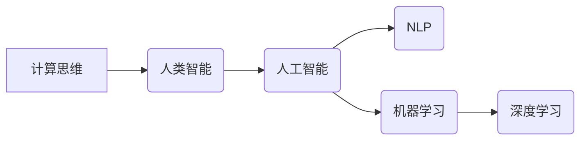

# 计算：附录 D 机器智能宣言

> 关键词：机器智能，计算思维，人类智能，人工智能，自然语言处理，机器学习，深度学习，伦理，责任

## 1. 背景介绍

随着计算能力的提升和算法的进步，机器智能（Artificial Intelligence, AI）已经取得了令人瞩目的成就。从早期的专家系统到如今的深度学习模型，机器智能正在改变着我们的工作和生活方式。然而，随着技术的发展，我们也开始面临一系列挑战，如算法偏见、隐私保护、责任归属等。为了应对这些挑战，我们需要一个共同的宣言，来指导机器智能的发展和应用。

## 2. 核心概念与联系

### 2.1 核心概念

#### 2.1.1 计算思维

计算思维是一种利用计算原理解决问题和创新的方法论。它强调逻辑推理、算法设计、抽象建模等能力，是机器智能发展的基石。

#### 2.1.2 人类智能

人类智能是指人类在感知、认知、推理、学习、解决问题等方面的能力。理解人类智能的原理，有助于我们更好地设计机器智能系统。

#### 2.1.3 人工智能

人工智能是指使计算机具有智能行为的技术。它包括机器学习、深度学习、自然语言处理等多个领域。

#### 2.1.4 自然语言处理

自然语言处理（Natural Language Processing, NLP）是人工智能的一个分支，旨在使计算机能够理解和生成人类语言。

#### 2.1.5 机器学习

机器学习（Machine Learning, ML）是使计算机能够从数据中学习并做出决策的技术。

#### 2.1.6 深度学习

深度学习（Deep Learning, DL）是一种特殊的机器学习技术，通过构建多层神经网络模拟人脑的学习过程。

### 2.2 核心概念联系



## 3. 核心算法原理 & 具体操作步骤

### 3.1 算法原理概述

机器智能的核心是算法，它决定了机器智能系统的性能和应用范围。以下是几种常见的机器智能算法原理：

#### 3.1.1 机器学习

机器学习算法通过从数据中学习规律，从而对未知数据进行预测或分类。

#### 3.1.2 深度学习

深度学习算法通过多层神经网络模拟人脑的学习过程，能够自动提取特征并进行复杂的学习任务。

#### 3.1.3 自然语言处理

自然语言处理算法通过对文本数据进行处理，使其能够被计算机理解和生成。

### 3.2 算法步骤详解

#### 3.2.1 机器学习

1. 数据收集：收集相关领域的样本数据。
2. 数据预处理：对数据进行清洗、转换等操作。
3. 特征提取：从数据中提取有用信息。
4. 模型选择：选择合适的机器学习算法。
5. 模型训练：使用训练数据训练模型。
6. 模型评估：使用测试数据评估模型性能。
7. 模型优化：根据评估结果优化模型参数。

#### 3.2.2 深度学习

1. 数据收集：收集相关领域的样本数据。
2. 数据预处理：对数据进行清洗、转换等操作。
3. 构建神经网络：设计网络结构，选择激活函数等。
4. 模型训练：使用训练数据训练网络。
5. 模型评估：使用测试数据评估网络性能。
6. 模型优化：根据评估结果优化网络结构和参数。

#### 3.2.3 自然语言处理

1. 数据收集：收集相关领域的文本数据。
2. 数据预处理：对文本数据进行清洗、分词等操作。
3. 特征提取：从文本中提取特征，如词袋模型、TF-IDF等。
4. 模型选择：选择合适的自然语言处理算法。
5. 模型训练：使用训练数据训练模型。
6. 模型评估：使用测试数据评估模型性能。
7. 模型优化：根据评估结果优化模型参数。

### 3.3 算法优缺点

#### 3.3.1 机器学习

优点：简单、易于实现、可解释性强。

缺点：需要大量标注数据、泛化能力有限。

#### 3.3.2 深度学习

优点：能够自动提取特征、泛化能力强。

缺点：模型复杂度高、可解释性差。

#### 3.3.3 自然语言处理

优点：能够处理非结构化数据。

缺点：算法复杂度高、数据需求量大。

### 3.4 算法应用领域

#### 3.4.1 机器学习

应用领域：图像识别、语音识别、推荐系统等。

#### 3.4.2 深度学习

应用领域：自动驾驶、自然语言处理、医疗诊断等。

#### 3.4.3 自然语言处理

应用领域：机器翻译、文本摘要、情感分析等。

## 4. 数学模型和公式 & 详细讲解 & 举例说明

### 4.1 数学模型构建

机器智能算法通常涉及多种数学模型，以下列举几种常见的数学模型：

#### 4.1.1 机器学习

#### 4.1.2 深度学习

#### 4.1.3 自然语言处理

### 4.2 公式推导过程

以下以线性回归为例，讲解公式推导过程：

#### 4.2.1 线性回归公式

$$
y = \beta_0 + \beta_1 x
$$

其中，$y$ 为因变量，$x$ 为自变量，$\beta_0$ 和 $\beta_1$ 为模型参数。

#### 4.2.2 梯度下降法

梯度下降法是一种优化算法，用于寻找函数的局部最小值。其基本思想是沿着函数梯度的反方向更新参数，即：

$$
\theta_{t+1} = \theta_t - \alpha \nabla_{\theta}J(\theta_t)
$$

其中，$\theta_t$ 为当前参数，$\alpha$ 为学习率，$J(\theta_t)$ 为损失函数。

### 4.3 案例分析与讲解

以文本分类为例，分析自然语言处理中的数学模型和公式。

#### 4.3.1 模型

文本分类任务通常使用支持向量机（Support Vector Machine, SVM）模型。SVM通过最大化间隔来划分不同类别的数据。

#### 4.3.2 公式

SVM的损失函数为：

$$
L(\theta) = \frac{1}{2} \sum_{i=1}^n (\theta^T x_i y_i - 1)^2
$$

其中，$x_i$ 为样本特征，$y_i$ 为样本标签。

## 5. 项目实践：代码实例和详细解释说明

### 5.1 开发环境搭建

1. 安装Python和必要的库，如NumPy、SciPy、Matplotlib等。
2. 安装机器学习库，如scikit-learn、TensorFlow、PyTorch等。

### 5.2 源代码详细实现

以下以文本分类任务为例，使用scikit-learn库实现SVM模型：

```python
from sklearn import svm
from sklearn.feature_extraction.text import CountVectorizer
from sklearn.model_selection import train_test_split
from sklearn.metrics import accuracy_score

# 示例数据
texts = ["This is a good product", "This is a bad product", "I love this product", "I hate this product"]
labels = [1, 0, 1, 0]

# 数据预处理
vectorizer = CountVectorizer()
X = vectorizer.fit_transform(texts)

# 划分训练集和测试集
X_train, X_test, y_train, y_test = train_test_split(X, labels, test_size=0.2, random_state=42)

# 训练SVM模型
clf = svm.SVC()
clf.fit(X_train, y_train)

# 测试模型
y_pred = clf.predict(X_test)
print("Accuracy:", accuracy_score(y_test, y_pred))
```

### 5.3 代码解读与分析

1. 导入必要的库。
2. 创建示例数据。
3. 使用CountVectorizer将文本数据转换为特征向量。
4. 划分训练集和测试集。
5. 训练SVM模型。
6. 测试模型并计算准确率。

## 6. 实际应用场景

### 6.1 机器翻译

机器翻译是自然语言处理领域的一个重要应用。通过将一种语言的文本翻译成另一种语言，机器翻译能够打破语言障碍，促进全球交流。

### 6.2 医疗诊断

医疗诊断是机器学习在医疗领域的一个重要应用。通过分析医学影像、病历等数据，机器学习模型能够辅助医生进行疾病诊断。

### 6.3 自动驾驶

自动驾驶是深度学习在交通领域的一个重要应用。通过感知周围环境，自动驾驶汽车能够安全地行驶在道路上。

## 7. 工具和资源推荐

### 7.1 学习资源推荐

1. 《Python机器学习》
2. 《深度学习》
3. 《自然语言处理实战》

### 7.2 开发工具推荐

1. TensorFlow
2. PyTorch
3. scikit-learn

### 7.3 相关论文推荐

1. "A Few Useful Things to Know about Machine Learning" (JMLR)
2. "Deep Learning" (Goodfellow, Bengio, Courville)
3. "Speech Recognition in Python with Kaldi and Python" (Boersma, Schuller)

## 8. 总结：未来发展趋势与挑战

### 8.1 研究成果总结

机器智能领域的研究成果不断涌现，推动着人工智能技术的快速发展。从机器学习到深度学习，从自然语言处理到计算机视觉，机器智能的应用领域越来越广泛。

### 8.2 未来发展趋势

1. 人工智能将更加智能化、泛化能力强。
2. 人工智能将与人类智能相互融合，共同发展。
3. 人工智能将推动更多行业实现智能化升级。

### 8.3 面临的挑战

1. 算法偏见和歧视。
2. 隐私保护和数据安全。
3. 责任归属和法律问题。

### 8.4 研究展望

1. 开发更加高效、安全的机器学习算法。
2. 探索人机协同的新模式。
3. 建立人工智能伦理和法律规范。

## 9. 附录：常见问题与解答

### 9.1 常见问题

1. 机器智能是什么？
2. 机器智能与人类智能有什么区别？
3. 机器智能有哪些应用领域？
4. 如何学习机器智能？

### 9.2 解答

1. 机器智能是指使计算机具有智能行为的技术。
2. 机器智能与人类智能的区别在于，机器智能是基于数据学习和算法实现的，而人类智能是基于生物学机制实现的。
3. 机器智能的应用领域包括自然语言处理、计算机视觉、医疗诊断、自动驾驶等。
4. 学习机器智能可以通过阅读相关书籍、参加在线课程、实践项目等方式进行。

作者：禅与计算机程序设计艺术 / Zen and the Art of Computer Programming