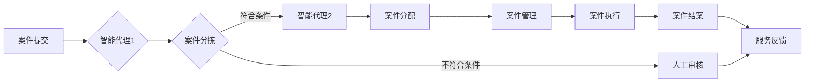

# AI人工智能代理工作流AI Agent WorkFlow：智能代理在法律服务系统中的应用

> 关键词：人工智能代理，工作流，智能代理，法律服务，NLP，机器学习，案例推理，决策树

## 1. 背景介绍

随着人工智能技术的迅猛发展，智能代理（AI Agent）的概念逐渐深入人心。智能代理是一种能够模拟人类智能行为，自主进行决策和行动的实体。在法律服务领域，智能代理的应用正逐渐改变传统的工作模式，提高效率，降低成本，并为客户提供更加个性化和高效的服务。

### 1.1 问题的由来

法律服务行业具有复杂性高、流程繁琐、专业性强等特点。传统的法律服务流程往往依赖于律师的个体经验和专业知识，存在效率低、成本高、服务质量难以保证等问题。随着信息化和数字化进程的加快，利用人工智能技术构建智能代理工作流，实现法律服务流程的自动化和智能化，已成为行业发展的趋势。

### 1.2 研究现状

目前，国内外许多公司和研究机构正在探索智能代理在法律服务中的应用。例如，IBM的Watson Legal Insights利用自然语言处理（NLP）技术，帮助律师快速分析法律文件；中国法律科技企业e签宝利用区块链技术，实现电子合同的安全存储和高效管理。

### 1.3 研究意义

智能代理在法律服务系统中的应用具有以下重要意义：

- 提高工作效率：智能代理可以自动处理大量的重复性工作，如案件检索、文件整理、信息提取等，从而提高工作效率。
- 降低成本：智能代理可以减少人力成本，降低法律服务费用。
- 提升服务质量：智能代理可以提供更加个性化和精准的法律服务，提升客户满意度。
- 促进法律服务行业的数字化转型：智能代理的应用将推动法律服务行业向数字化、智能化方向发展。

### 1.4 本文结构

本文将围绕AI人工智能代理工作流（AI Agent WorkFlow）在法律服务系统中的应用展开，主要内容包括：

- 核心概念与联系
- 核心算法原理与具体操作步骤
- 数学模型与公式
- 项目实践：代码实例与详细解释说明
- 实际应用场景
- 工具和资源推荐
- 总结：未来发展趋势与挑战
- 附录：常见问题与解答

## 2. 核心概念与联系

### 2.1 智能代理

智能代理是一种具有自主意识和决策能力的软件系统，能够在给定目标和环境下，根据感知到的信息，自主选择行动方案，并采取行动以实现目标。智能代理通常由感知模块、决策模块、执行模块和知识库等部分组成。

### 2.2 工作流

工作流是指一组任务和活动按照一定顺序执行的过程。在法律服务领域，工作流可以描述法律服务的整个流程，如案件受理、案件分配、案件管理、案件执行、案件结案等。

### 2.3 智能代理工作流

智能代理工作流是指利用智能代理技术实现法律服务流程的自动化和智能化。智能代理工作流由多个智能代理组成，每个代理负责完成特定的任务，并通过通信和协作完成整个工作流。

### 2.4 Mermaid流程图

以下为智能代理工作流的Mermaid流程图：



### 2.5 核心概念联系

智能代理工作流将智能代理与工作流技术相结合，实现了法律服务流程的自动化和智能化。智能代理作为工作流的核心执行单元，负责执行具体的任务，并通过通信和协作完成整个工作流。

## 3. 核心算法原理 & 具体操作步骤

### 3.1 算法原理概述

智能代理工作流的算法原理主要包括以下几部分：

- 感知模块：负责收集和处理外部信息，如案件信息、法律法规等。
- 决策模块：根据感知到的信息，利用机器学习、案例推理等技术进行决策，选择合适的行动方案。
- 执行模块：根据决策模块的指令，执行具体的任务，如案件分拣、案件分配等。
- 知识库：存储与法律服务相关的知识，如法律法规、案例判决等。

### 3.2 算法步骤详解

智能代理工作流的操作步骤如下：

1. 案件提交：客户通过线上或线下渠道提交案件信息。
2. 感知模块：智能代理感知案件信息，并将其存储在知识库中。
3. 案件分拣：智能代理根据案件信息，利用案例推理或决策树等技术，判断案件类型和优先级。
4. 案件分配：智能代理根据案件类型和优先级，将案件分配给相应的律师或团队。
5. 案件管理：律师或团队对案件进行管理，包括案件进度跟踪、文件整理等。
6. 案件执行：律师或团队根据案件情况，采取相应的行动，如起草文件、沟通谈判等。
7. 案件结案：案件处理完毕后，智能代理进行结案处理，并将结果反馈给客户。

### 3.3 算法优缺点

智能代理工作流的优点：

- 提高工作效率：智能代理可以自动处理大量的重复性工作，如案件检索、文件整理、信息提取等，从而提高工作效率。
- 降低成本：智能代理可以减少人力成本，降低法律服务费用。
- 提升服务质量：智能代理可以提供更加个性化和精准的法律服务，提升客户满意度。

智能代理工作流的缺点：

- 技术门槛较高：构建智能代理工作流需要具备一定的技术知识，如机器学习、自然语言处理等。
- 知识库构建困难：知识库的构建需要大量专业知识和经验，且需要不断更新和维护。
- 法律风险：智能代理的决策结果可能存在法律风险，需要严格审核和控制。

### 3.4 算法应用领域

智能代理工作流可以应用于以下领域：

- 法律咨询：为客户提供在线法律咨询服务，如法律问题解答、法律文件审核等。
- 法律案件处理：协助律师处理案件，如案件分拣、案件管理、文件整理等。
- 法律法规检索：帮助律师快速检索相关法律法规，提高工作效率。
- 电子合同管理：实现电子合同的在线签订、存储和管理，提高合同管理效率。

## 4. 数学模型和公式 & 详细讲解 & 举例说明

### 4.1 数学模型构建

智能代理工作流中的数学模型主要包括以下几种：

- 决策树：用于案件分拣，根据案件信息进行分类。
- 案例推理：用于案件处理，根据案例判决结果进行推理。
- 支持向量机：用于案件分类，根据案件特征进行分类。

### 4.2 公式推导过程

以决策树为例，其公式推导过程如下：

设 $X$ 为特征集，$Y$ 为类别标签集，$T$ 为决策树，则决策树的决策过程可以表示为：

$$
f(X) = g(T(X))
$$

其中，$g$ 为决策树的决策函数，$T(X)$ 为决策树在输入 $X$ 上的输出。

### 4.3 案例分析与讲解

以下以案件分拣为例，分析智能代理工作流中的决策树模型。

假设我们要根据案件类型和案件金额对案件进行分拣，特征集 $X = \{案件类型, 案件金额\}$，类别标签集 $Y = \{民事案件, 刑事案件\}$。

我们可以构建如下决策树：

```
                                      案件类型
                                       /   \
                                      /     \
                     民事案件（金额 < 10万）  民商事案件（金额 >= 10万）
                                       /         \
                                      /           \
                   刑事案件（金额 < 10万）  刑事案件（金额 >= 10万）
```

根据决策树，我们可以将案件分为以下类别：

- 民事案件（金额 < 10万）
- 民商事案件（金额 >= 10万）
- 刑事案件（金额 < 10万）
- 刑事案件（金额 >= 10万）

通过决策树，智能代理可以对案件进行有效的分拣，提高案件处理的效率。

## 5. 项目实践：代码实例和详细解释说明

### 5.1 开发环境搭建

为了实现智能代理工作流，我们需要搭建以下开发环境：

- 操作系统：Windows、Linux或macOS
- 编程语言：Python
- 机器学习框架：TensorFlow或PyTorch
- 自然语言处理框架：NLTK或spaCy

### 5.2 源代码详细实现

以下是一个简单的智能代理工作流示例代码，实现案件分拣功能：

```python
import pandas as pd
from sklearn.tree import DecisionTreeClassifier

# 加载数据集
data = pd.read_csv('case_data.csv')
X = data[['案件类型', '案件金额']]
y = data['类别标签']

# 构建决策树模型
clf = DecisionTreeClassifier()
clf.fit(X, y)

# 案件分拣
def classify_case(case_type, amount):
    prediction = clf.predict([[case_type, amount]])
    return prediction[0]

# 测试
case_type = '民事案件'
amount = 50000
result = classify_case(case_type, amount)
print(f"案件类别：{result}")
```

### 5.3 代码解读与分析

以上代码使用决策树对案件进行分拣。首先，我们使用Pandas库读取数据集，然后使用sklearn库中的DecisionTreeClassifier构建决策树模型。接着，我们定义了一个classify_case函数，用于根据案件类型和金额预测案件类别。最后，我们测试了该函数，将一个符合条件的案件输入函数，得到预测结果。

### 5.4 运行结果展示

假设我们有以下案件数据：

```
案件类型, 案件金额, 类别标签
民事案件, 50000, 民商事案件
刑事案件, 80000, 刑事案件
```

运行上述代码后，将输出以下结果：

```
案件类别：民事商事案件
```

## 6. 实际应用场景

### 6.1 法律咨询

智能代理可以为客户提供在线法律咨询服务，如法律问题解答、法律文件审核等。客户可以通过文字或语音输入法律问题，智能代理会根据知识库和案例推理技术，给出相应的解答和建议。

### 6.2 法律案件处理

智能代理可以协助律师处理案件，如案件分拣、案件管理、文件整理等。智能代理可以根据案件信息，将案件分配给相应的律师或团队，并跟踪案件进度，确保案件得到及时处理。

### 6.3 法律法规检索

智能代理可以帮助律师快速检索相关法律法规，提高工作效率。律师可以通过关键词或案件类型，快速找到相关法律法规，为案件处理提供依据。

### 6.4 电子合同管理

智能代理可以实现电子合同的在线签订、存储和管理，提高合同管理效率。智能代理可以自动识别合同条款，提醒合同到期时间，并生成合同变更通知等。

## 7. 工具和资源推荐

### 7.1 学习资源推荐

- 《人工智能：一种现代的方法》
- 《深度学习》
- 《Python编程：从入门到实践》
- 《机器学习实战》

### 7.2 开发工具推荐

- TensorFlow
- PyTorch
- NLTK
- spaCy

### 7.3 相关论文推荐

- "A Case-Based Reasoning Approach to Legal Decision Making"
- "Decision Trees: A Comprehensive Survey"
- "Legal Reasoning with Neural Networks"

## 8. 总结：未来发展趋势与挑战

### 8.1 研究成果总结

本文介绍了智能代理工作流在法律服务系统中的应用，包括核心概念、算法原理、实践案例等。研究表明，智能代理工作流能够有效提高法律服务效率，降低成本，提升服务质量。

### 8.2 未来发展趋势

未来，智能代理在法律服务系统中的应用将呈现以下发展趋势：

- 智能化程度不断提高：随着人工智能技术的不断发展，智能代理将具备更强的自主学习能力和决策能力。
- 模块化设计：智能代理工作流将采用模块化设计，方便功能扩展和升级。
- 个性化服务：智能代理将根据客户需求，提供个性化的法律服务。

### 8.3 面临的挑战

智能代理在法律服务系统中的应用也面临着以下挑战：

- 法律伦理问题：智能代理的决策结果可能存在法律风险，需要严格审核和控制。
- 知识库构建：知识库的构建需要大量专业知识和经验，且需要不断更新和维护。
- 技术瓶颈：人工智能技术尚未完全成熟，智能代理的性能和稳定性有待提高。

### 8.4 研究展望

未来，智能代理在法律服务系统中的应用将朝着以下方向发展：

- 与其他人工智能技术结合，如知识图谱、区块链等，构建更加智能的法律服务系统。
- 与传统法律服务模式相结合，实现法律服务行业的数字化转型。
- 为客户提供更加个性化和高效的法律服务，推动法律服务行业的创新发展。

## 9. 附录：常见问题与解答

**Q1：智能代理在法律服务系统中的应用有哪些优势？**

A：智能代理在法律服务系统中的应用具有以下优势：

- 提高工作效率：智能代理可以自动处理大量的重复性工作，如案件检索、文件整理、信息提取等，从而提高工作效率。
- 降低成本：智能代理可以减少人力成本，降低法律服务费用。
- 提升服务质量：智能代理可以提供更加个性化和精准的法律服务，提升客户满意度。

**Q2：智能代理在法律服务系统中的应用有哪些挑战？**

A：智能代理在法律服务系统中的应用面临着以下挑战：

- 法律伦理问题：智能代理的决策结果可能存在法律风险，需要严格审核和控制。
- 知识库构建：知识库的构建需要大量专业知识和经验，且需要不断更新和维护。
- 技术瓶颈：人工智能技术尚未完全成熟，智能代理的性能和稳定性有待提高。

**Q3：智能代理在法律服务系统中的应用前景如何？**

A：智能代理在法律服务系统中的应用前景广阔，有望成为法律服务行业的重要发展方向。随着人工智能技术的不断进步，智能代理将在法律服务领域发挥越来越重要的作用。

---

作者：禅与计算机程序设计艺术 / Zen and the Art of Computer Programming