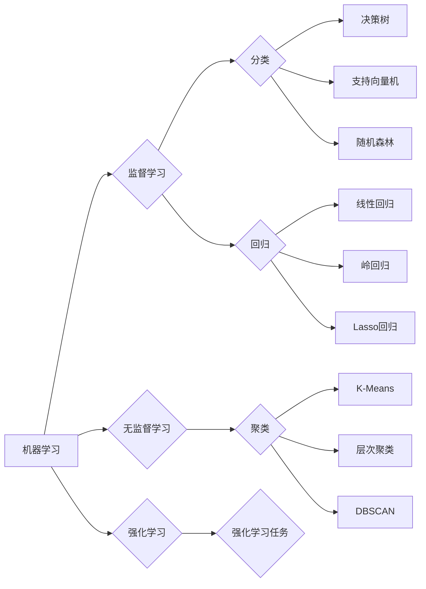

# AI人工智能核心算法原理与代码实例讲解：模型选择

> 关键词：人工智能，核心算法，模型选择，机器学习，深度学习，神经网络，分类算法，回归算法，聚类算法

## 1. 背景介绍

在人工智能领域，算法的选择至关重要。它决定了模型的性能、效率和可解释性。随着机器学习、深度学习技术的快速发展，出现了众多算法和模型，如何从这些算法中做出明智的选择，成为了人工智能研究和应用的关键问题。本文将深入探讨人工智能核心算法的原理，并通过代码实例讲解如何进行模型选择。

## 2. 核心概念与联系

### 2.1 核心概念

**机器学习**：机器学习是一种使计算机系统能够从数据中学习并做出决策或预测的方法。它分为监督学习、无监督学习和强化学习三种类型。

**深度学习**：深度学习是机器学习的一种，它使用类似于人脑的神经网络结构来学习数据的复杂特征。

**神经网络**：神经网络是一种模仿人脑神经元连接方式的计算模型，由输入层、隐藏层和输出层组成。

**分类算法**：分类算法用于将数据分为不同的类别。常见的分类算法包括决策树、支持向量机、随机森林等。

**回归算法**：回归算法用于预测连续值。常见的回归算法包括线性回归、岭回归、Lasso回归等。

**聚类算法**：聚类算法用于将相似的数据点归为一组。常见的聚类算法包括K-Means、层次聚类、DBSCAN等。

### 2.2 Mermaid 流程图



## 3. 核心算法原理 & 具体操作步骤

### 3.1 算法原理概述

**分类算法**：分类算法通过学习输入数据和标签之间的关系，将新数据分为预定义的类别。

**回归算法**：回归算法通过学习输入数据和连续标签之间的关系，预测新数据的标签值。

**聚类算法**：聚类算法通过寻找数据点之间的相似性，将数据点划分为若干个簇。

### 3.2 算法步骤详解

**分类算法**：

1. 数据准备：收集和清洗数据，将数据分为特征和标签。
2. 模型选择：选择合适的分类算法，如决策树、支持向量机等。
3. 模型训练：使用训练数据训练模型。
4. 模型评估：使用验证数据评估模型性能。
5. 模型部署：将模型部署到实际应用中。

**回归算法**：

1. 数据准备：收集和清洗数据，将数据分为特征和标签。
2. 模型选择：选择合适的回归算法，如线性回归、岭回归等。
3. 模型训练：使用训练数据训练模型。
4. 模型评估：使用验证数据评估模型性能。
5. 模型部署：将模型部署到实际应用中。

**聚类算法**：

1. 数据准备：收集和清洗数据。
2. 模型选择：选择合适的聚类算法，如K-Means、层次聚类等。
3. 模型训练：使用聚类算法对数据进行聚类。
4. 模型评估：评估聚类结果的合理性。
5. 模型部署：将聚类结果应用于实际应用中。

### 3.3 算法优缺点

**分类算法**：

- 优点：准确率高，易于解释。
- 缺点：对特征维度敏感，可能过拟合。

**回归算法**：

- 优点：可以处理连续值标签。
- 缺点：对异常值敏感，可能欠拟合。

**聚类算法**：

- 优点：无需标签信息，适用于无监督学习。
- 缺点：聚类结果主观性强，难以解释。

### 3.4 算法应用领域

**分类算法**：金融风险控制、垃圾邮件过滤、医疗诊断等。

**回归算法**：房价预测、股票价格预测、销量预测等。

**聚类算法**：市场细分、客户细分、图像分割等。

## 4. 数学模型和公式 & 详细讲解 & 举例说明

### 4.1 数学模型构建

**线性回归**：

$$
y = \beta_0 + \beta_1x_1 + \beta_2x_2 + \ldots + \beta_nx_n + \epsilon
$$

**支持向量机**：

$$
\min_{\beta, \beta_0} \frac{1}{2}\|\beta\|^2 + C\sum_{i=1}^N \xi_i
$$

$$
s.t. y_i[(\beta_0 + \beta_1x_{1i} + \beta_2x_{2i} + \ldots + \beta_nx_{ni})] \geq 1 - \xi_i
$$

$$
0 \leq \xi_i \leq C
$$

### 4.2 公式推导过程

**线性回归**：

线性回归的目标是最小化预测值和实际值之间的误差平方和。

**支持向量机**：

支持向量机的目标是找到一个超平面，将不同类别的数据点分开，并最大化两类数据点之间的间隔。

### 4.3 案例分析与讲解

**案例**：使用线性回归预测房价。

**数据集**：房价数据集。

**特征**：房屋面积、房屋数量、房屋位置等。

**标签**：房价。

**模型**：线性回归模型。

**代码**：

```python
import numpy as np
from sklearn.linear_model import LinearRegression

# 加载数据
X = np.array([[1000], [1500], [2000], [2500]])
y = np.array([500000, 1000000, 1500000, 2000000])

# 创建模型
model = LinearRegression()

# 训练模型
model.fit(X, y)

# 预测房价
new_area = np.array([[1800]])
predicted_price = model.predict(new_area)
```

## 5. 项目实践：代码实例和详细解释说明

### 5.1 开发环境搭建

1. 安装Python和pip。
2. 安装机器学习库，如scikit-learn、TensorFlow、PyTorch等。
3. 安装数据分析库，如NumPy、Pandas等。

### 5.2 源代码详细实现

```python
from sklearn.datasets import load_iris
from sklearn.model_selection import train_test_split
from sklearn.ensemble import RandomForestClassifier

# 加载数据
iris = load_iris()
X = iris.data
y = iris.target

# 划分训练集和测试集
X_train, X_test, y_train, y_test = train_test_split(X, y, test_size=0.2, random_state=42)

# 创建模型
model = RandomForestClassifier(n_estimators=100)

# 训练模型
model.fit(X_train, y_train)

# 评估模型
print("Test set accuracy: {:.2f}%".format(model.score(X_test, y_test) * 100))
```

### 5.3 代码解读与分析

该代码实例使用随机森林算法对鸢尾花数据集进行分类。首先加载数据集，然后划分训练集和测试集。接着创建随机森林模型，使用训练数据训练模型，最后在测试集上评估模型性能。

## 6. 实际应用场景

**金融风险控制**：使用分类算法对贷款申请进行风险评估，预测用户是否违约。

**垃圾邮件过滤**：使用分类算法将邮件分类为垃圾邮件或正常邮件。

**医疗诊断**：使用分类算法对疾病进行诊断，如癌症检测。

**房价预测**：使用回归算法预测房价。

**市场细分**：使用聚类算法对客户进行细分，以便更好地进行营销。

## 7. 工具和资源推荐

### 7.1 学习资源推荐

- 《Python机器学习》
- 《深度学习》
- 《统计学习方法》

### 7.2 开发工具推荐

- scikit-learn
- TensorFlow
- PyTorch

### 7.3 相关论文推荐

- "A Few Useful Things to Know about Machine Learning"
- "Deep Learning"
- "The Hundred-Page Machine Learning Book"

## 8. 总结：未来发展趋势与挑战

### 8.1 研究成果总结

本文介绍了人工智能核心算法的原理和代码实例，并讲解了如何进行模型选择。通过学习这些内容，读者可以更好地理解和应用人工智能技术。

### 8.2 未来发展趋势

- 深度学习将继续发展，并与其他人工智能技术（如强化学习、迁移学习等）结合，实现更强大的智能系统。
- 模型选择将更加智能化，基于数据的模型选择和自动机器学习（AutoML）将成为主流。
- 可解释人工智能（XAI）将得到更多关注，提高模型的可解释性和可信度。

### 8.3 面临的挑战

- 数据质量：高质量的数据是机器学习成功的关键，如何获取和清洗数据是一个挑战。
- 模型可解释性：提高模型的可解释性，使模型决策过程更加透明和可信。
- 模型泛化能力：提高模型的泛化能力，使模型在不同数据和任务上都能取得好的效果。

### 8.4 研究展望

随着人工智能技术的不断发展，未来人工智能将在更多领域得到应用，为人类社会带来更多便利和进步。

作者：禅与计算机程序设计艺术 / Zen and the Art of Computer Programming