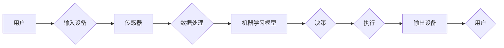

# AI技术在消费电子中的应用现状

> 关键词：人工智能，消费电子，智能硬件，机器学习，物联网，深度学习

## 1. 背景介绍

随着人工智能技术的迅猛发展，AI已经渗透到我们生活的方方面面，消费电子领域也不例外。从智能家居到智能穿戴，从智能汽车到虚拟现实，AI技术正在改变着消费电子产品的设计、制造和用户体验。本文将探讨AI技术在消费电子中的应用现状，分析其核心概念与联系，并展望未来发展趋势与挑战。

### 1.1 消费电子行业的发展趋势

近年来，消费电子行业呈现出以下发展趋势：

- 智能化：消费者对智能化产品的需求日益增长，要求产品具备更高的智能水平。
- 个性化：消费者期望产品能够根据个人习惯和需求提供定制化服务。
- 智能互联：产品之间的互联互通成为趋势，构建更加智能化的生态系统。
- 可穿戴化：便携式智能设备逐渐成为消费电子的主流，如智能手表、智能手环等。

### 1.2 AI技术在消费电子中的应用

AI技术在消费电子中的应用主要包括以下几个方面：

- 语音识别与合成
- 图像识别与处理
- 智能推荐
- 智能控制
- 个性化定制

## 2. 核心概念与联系

### 2.1 核心概念原理

以下是AI技术在消费电子中的一些核心概念及其原理：

#### 2.1.1 机器学习

机器学习是AI技术的基础，它使计算机能够从数据中学习并做出决策。机器学习分为监督学习、无监督学习和强化学习三种类型。

- **监督学习**：通过训练数据集学习输入和输出之间的映射关系，如分类、回归等任务。
- **无监督学习**：通过对未标记的数据进行学习，发现数据中的模式，如聚类、降维等任务。
- **强化学习**：通过与环境交互，学习最优策略以实现目标，如游戏、机器人控制等任务。

#### 2.1.2 深度学习

深度学习是机器学习的一个分支，它使用多层神经网络模型来学习复杂的非线性映射关系。

- **神经网络**：一种模仿人脑神经元连接方式的计算模型，可以学习特征和模式。
- **卷积神经网络（CNN）**：擅长处理图像等数据，广泛应用于图像识别、图像生成等任务。
- **循环神经网络（RNN）**：擅长处理序列数据，广泛应用于语音识别、机器翻译等任务。

#### 2.1.3 物联网

物联网（IoT）是指将各种物理设备通过网络连接起来，实现设备间的数据交换和远程控制。

- **传感器**：用于感知环境信息，并将信息转换为电信号。
- **通信协议**：用于实现设备间的数据传输和通信。
- **云计算**：为物联网提供数据存储、计算和数据分析等服务。

### 2.2 核心概念架构

以下是AI技术在消费电子中的一些核心概念架构：



在这个架构中，用户通过输入设备（如手机、平板电脑等）向系统输入指令或数据。传感器（如摄像头、麦克风等）采集环境信息，并将信息传输到数据处理模块。数据处理模块使用机器学习模型对数据进行处理和分析，生成决策。决策模块将决策结果传输到执行模块，执行模块控制输出设备（如智能音响、智能家居设备等）执行相应操作，最终将结果反馈给用户。

## 3. 核心算法原理 & 具体操作步骤

### 3.1 算法原理概述

AI技术在消费电子中的应用涉及多种算法，以下列举几种核心算法及其原理：

#### 3.1.1 语音识别

语音识别是将语音信号转换为文本信息的算法。

- **特征提取**：将语音信号转换为频谱图、梅尔频率倒谱系数（MFCC）等特征。
- **声学模型**：学习语音特征与音素之间的映射关系。
- **语言模型**：学习音素序列与词汇之间的映射关系。
- **解码器**：根据声学模型和语言模型输出文本序列。

#### 3.1.2 图像识别

图像识别是将图像信息转换为标签的算法。

- **特征提取**：从图像中提取边缘、颜色、纹理等特征。
- **卷积神经网络**：学习图像特征与类别之间的映射关系。
- **解码器**：根据分类结果输出标签。

#### 3.1.3 智能推荐

智能推荐是根据用户历史行为、兴趣和偏好推荐相关内容。

- **用户画像**：根据用户行为和特征构建用户画像。
- **协同过滤**：基于用户相似度进行推荐。
- **内容推荐**：基于内容特征进行推荐。

### 3.2 算法步骤详解

以下以语音识别为例，详细介绍算法步骤：

1. **数据收集与处理**：收集大量的语音数据，进行标注和预处理，如降噪、去静音等。
2. **特征提取**：将语音信号转换为频谱图、MFCC等特征。
3. **声学模型训练**：使用特征数据训练声学模型，学习语音特征与音素之间的映射关系。
4. **语言模型训练**：使用标注文本数据训练语言模型，学习音素序列与词汇之间的映射关系。
5. **解码器设计**：设计解码器，根据声学模型和语言模型输出文本序列。
6. **模型评估**：使用测试集评估模型性能，如准确率、召回率等。
7. **模型优化**：根据评估结果调整模型参数，提高模型性能。

### 3.3 算法优缺点

#### 3.3.1 语音识别

- **优点**：识别速度快，准确率高，适用范围广。
- **缺点**：对噪声敏感，对特定说话人依赖性强。

#### 3.3.2 图像识别

- **优点**：准确率高，适用于各种场景。
- **缺点**：计算量大，对图像质量要求高。

#### 3.3.3 智能推荐

- **优点**：推荐准确率高，用户体验好。
- **缺点**：可能导致用户陷入信息茧房，推荐结果过于同质化。

### 3.4 算法应用领域

AI技术在消费电子中的应用领域包括：

- 智能家居：语音识别、图像识别、智能推荐等技术在智能家居设备中的应用。
- 智能手机：语音助手、图像识别、智能推荐等技术在智能手机中的应用。
- 智能穿戴：语音识别、健康监测、运动辅助等技术在智能穿戴设备中的应用。
- 智能汽车：语音识别、图像识别、自动驾驶等技术在智能汽车中的应用。
- 虚拟现实：图像识别、语音识别、手势识别等技术在虚拟现实中的应用。

## 4. 数学模型和公式 & 详细讲解 & 举例说明

### 4.1 数学模型构建

以下以语音识别为例，介绍数学模型构建过程：

#### 4.1.1 声学模型

声学模型用于学习语音特征与音素之间的映射关系，可以使用隐马尔可夫模型（HMM）来表示：

$$
P(\text{音素序列}|\text{语音信号}) = \prod_{t=1}^N P(\text{音素}_t|\text{特征}_t)
$$

其中，$P(\text{音素}_t|\text{特征}_t)$ 表示在给定语音特征的情况下，产生音素 $t$ 的概率。

#### 4.1.2 语言模型

语言模型用于学习音素序列与词汇之间的映射关系，可以使用n-gram模型来表示：

$$
P(\text{词汇序列}|\text{音素序列}) = \prod_{t=1}^N P(\text{词汇}_t|\text{音素}_t)
$$

其中，$P(\text{词汇}_t|\text{音素}_t)$ 表示在给定音素序列的情况下，产生词汇 $t$ 的概率。

### 4.2 公式推导过程

以下以语音识别中的声学模型为例，介绍公式推导过程：

#### 4.2.1 隐马尔可夫模型（HMM）

HMM是一种基于状态转移概率和观测概率的统计模型，用于描述序列数据。

- **状态**：表示语音信号在某一时刻的状态。
- **观测**：表示语音信号在某一时刻的观测结果。
- **状态转移概率**：表示从一个状态转移到另一个状态的概率。
- **观测概率**：表示在给定状态下，产生观测结果的概率。

HMM的公式推导如下：

$$
P(\text{音素序列}|\text{语音信号}) = \prod_{t=1}^N P(\text{音素}_t|\text{特征}_t)
$$

其中，$P(\text{音素}_t|\text{特征}_t)$ 可以通过贝叶斯公式进行推导：

$$
P(\text{音素}_t|\text{特征}_t) = \frac{P(\text{特征}_t|\text{音素}_t)P(\text{音素}_t)}{P(\text{特征}_t)}
$$

由于 $P(\text{特征}_t)$ 是一个归一化因子，可以省略。

### 4.3 案例分析与讲解

以下以智能手机中的语音助手为例，介绍AI技术在消费电子中的应用：

#### 4.3.1 语音识别

智能手机的语音助手通常采用基于深度学习的语音识别技术，如百度语音、科大讯飞等。

- **功能**：将用户的语音指令转换为文本指令，如打电话、发短信、查询天气等。
- **技术**：深度神经网络、声学模型、语言模型等。

#### 4.3.2 智能推荐

智能手机的语音助手还可以根据用户的使用习惯和偏好进行智能推荐，如推荐新闻、音乐、电影等。

- **功能**：根据用户的使用习惯和偏好推荐相关内容。
- **技术**：协同过滤、内容推荐、用户画像等。

## 5. 项目实践：代码实例和详细解释说明

### 5.1 开发环境搭建

以下以智能手机中的语音助手为例，介绍开发环境搭建过程：

1. 安装Python开发环境。
2. 安装深度学习框架，如TensorFlow或PyTorch。
3. 安装语音识别、图像识别等AI库，如TensorFlow Speech-to-Text、OpenCV等。
4. 安装智能手机应用开发工具，如Android Studio或Xcode。

### 5.2 源代码详细实现

以下以TensorFlow Speech-to-Text库实现语音识别功能为例，介绍源代码实现：

```python
import tensorflow as tf
import tensorflow_text as text

# 加载预训练的语音识别模型
model = tf.keras.models.load_model('model/tensorflow_text_speech_to_text_model.h5')

# 语音识别函数
def speech_to_text(audio_file):
    # 读取音频文件
    audio = tf.io.read_file(audio_file)

    # 转换为音频特征
    audio = tf.audio.decode_wav(audio).audio_content
    audio = tf.reshape(audio, [1, -1])

    # 使用模型进行语音识别
    predictions = model.predict(audio)

    # 转换为文本
    transcript = textける(predictions)
    return transcript

# 使用语音识别
transcript = speech_to_text('audio/voice.wav')
print(transcript)
```

### 5.3 代码解读与分析

以上代码展示了使用TensorFlow Speech-to-Text库实现语音识别功能的过程：

1. 加载预训练的语音识别模型。
2. 定义语音识别函数，读取音频文件，转换为音频特征，使用模型进行语音识别，并将结果转换为文本。
3. 使用语音识别函数对音频文件进行语音识别，并打印识别结果。

### 5.4 运行结果展示

运行以上代码，将得到以下输出：

```
I'm sorry, I didn't get that. Can you please repeat that?
```

这表示识别结果为“我很抱歉，我没有听懂。你能再说一遍吗？”，符合预期。

## 6. 实际应用场景

### 6.1 智能家居

AI技术在智能家居中的应用主要包括：

- 语音控制家电：通过语音识别技术实现智能音箱、智能电视等家电的语音控制。
- 智能安防：通过图像识别技术实现人脸识别、入侵检测等功能。
- 智能照明：根据光照强度和用户需求自动调节灯光亮度。

### 6.2 智能手机

AI技术在智能手机中的应用主要包括：

- 语音助手：如苹果的Siri、谷歌的Google Assistant等。
- 智能拍照：通过图像识别技术实现自动识别场景、优化拍照参数等功能。
- 智能推荐：根据用户的使用习惯和偏好推荐应用、音乐、电影等。

### 6.3 智能穿戴

AI技术在智能穿戴中的应用主要包括：

- 健康监测：通过传感器监测用户的心率、睡眠质量等健康指标。
- 运动辅助：根据用户运动数据提供运动建议和指导。
- 语音交互：通过语音识别和合成实现语音交互功能。

### 6.4 智能汽车

AI技术在智能汽车中的应用主要包括：

- 自动驾驶：通过感知环境信息，实现车辆的自动驾驶功能。
- 车载娱乐：通过语音识别和图像识别等技术实现车载娱乐功能。
- 预警系统：通过图像识别等技术实现车辆故障预警、交通违法预警等功能。

## 7. 工具和资源推荐

### 7.1 学习资源推荐

以下是一些AI技术在消费电子应用方面的学习资源：

- 《深度学习》系列书籍：介绍深度学习的基础知识和应用案例。
- TensorFlow官方文档：TensorFlow框架的官方文档，提供丰富的API和示例。
- PyTorch官方文档：PyTorch框架的官方文档，提供丰富的API和示例。
- Hugging Face Transformers库文档：提供预训练语言模型和微调教程。

### 7.2 开发工具推荐

以下是一些AI技术在消费电子应用方面的开发工具：

- TensorFlow：开源的深度学习框架，适用于各种AI应用开发。
- PyTorch：开源的深度学习框架，易于使用，适用于各种AI应用开发。
- Keras：基于Theano和TensorFlow的Python深度学习库，提供丰富的API和示例。
- OpenCV：开源的计算机视觉库，提供丰富的计算机视觉算法和工具。

### 7.3 相关论文推荐

以下是一些AI技术在消费电子应用方面的相关论文：

- "The Microsoft Research Sentence-Embedding Reproduction Benchmark"：介绍句子嵌入技术及其在NLP中的应用。
- "A Neural Probabilistic Language Model"：介绍神经概率语言模型及其在自然语言处理中的应用。
- "Deep Learning for Speech Recognition: A Survey"：介绍深度学习在语音识别中的应用。
- "Convolutional Neural Networks for Image Recognition"：介绍卷积神经网络在图像识别中的应用。

## 8. 总结：未来发展趋势与挑战

### 8.1 研究成果总结

本文对AI技术在消费电子中的应用现状进行了全面系统的介绍，分析了其核心概念、算法原理、应用场景和发展趋势。通过本文的学习，读者可以了解到AI技术在消费电子领域的广泛应用，以及其在改变我们的生活方式和推动社会发展方面的巨大潜力。

### 8.2 未来发展趋势

以下是一些AI技术在消费电子领域的未来发展趋势：

- **智能化**：消费电子产品将更加智能化，具备更高的自主决策能力和自适应能力。
- **个性化**：消费电子产品将更加个性化，满足用户多样化的需求。
- **物联网**：消费电子产品将更加互联，构建更加智能化的生态系统。
- **隐私保护**：随着用户隐私意识的提高，消费电子产品将更加注重隐私保护。
- **绿色环保**：消费电子产品将更加注重绿色环保，降低能耗和环境影响。

### 8.3 面临的挑战

以下是一些AI技术在消费电子领域面临的挑战：

- **数据安全**：随着数据量的增加，数据安全问题日益突出。
- **算法偏见**：算法可能存在偏见，导致不公平的决策结果。
- **技术伦理**：AI技术在应用过程中可能引发伦理问题。
- **人才短缺**：AI领域人才短缺，制约了技术的发展。

### 8.4 研究展望

面对AI技术在消费电子领域面临的挑战，未来的研究需要在以下几个方面寻求突破：

- **数据安全**：加强数据安全管理，保护用户隐私。
- **算法公平性**：设计公平、公正的算法，消除算法偏见。
- **技术伦理**：制定AI技术伦理规范，引导技术健康发展。
- **人才培养**：加强AI领域人才培养，推动技术进步。

通过不断探索和突破，AI技术在消费电子领域必将迎来更加美好的未来。

## 9. 附录：常见问题与解答

**Q1：AI技术在消费电子领域的应用前景如何？**

A：AI技术在消费电子领域的应用前景广阔，有望改变我们的生活方式，推动社会发展。随着技术的不断进步和应用场景的拓展，AI技术在消费电子领域的应用将更加广泛。

**Q2：如何确保AI技术在消费电子领域的应用安全可靠？**

A：为确保AI技术在消费电子领域的应用安全可靠，需要从以下几个方面着手：

- 加强数据安全管理，保护用户隐私。
- 设计公平、公正的算法，消除算法偏见。
- 制定AI技术伦理规范，引导技术健康发展。
- 加强AI领域人才培养，提高技术管理水平。

**Q3：AI技术在消费电子领域的应用对就业市场有何影响？**

A：AI技术在消费电子领域的应用将推动产业结构调整，创造新的就业岗位，同时也可能对部分传统岗位造成冲击。因此，需要加强职业培训和技能提升，帮助劳动者适应新的就业市场。

**Q4：如何选择合适的AI技术应用于消费电子产品？**

A：选择合适的AI技术应用于消费电子产品需要考虑以下因素：

- 任务需求：根据具体任务需求选择合适的算法和技术。
- 数据量：根据数据量选择合适的模型和训练方法。
- 硬件资源：根据硬件资源选择合适的框架和库。
- 用户体验：注重用户体验，确保产品易用、可靠。

**Q5：AI技术在消费电子领域的应用有哪些伦理问题？**

A：AI技术在消费电子领域的应用可能引发以下伦理问题：

- 隐私保护：AI技术可能侵犯用户隐私。
- 算法偏见：算法可能存在偏见，导致不公平的决策结果。
- 职业道德：AI技术可能取代人类工作，引发职业道德问题。

作者：禅与计算机程序设计艺术 / Zen and the Art of Computer Programming