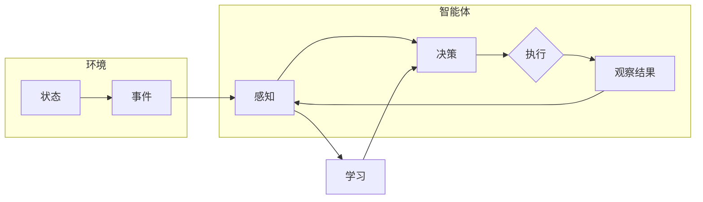

# Agent代理在AI系统中的详细解析

> 关键词：智能代理，人工智能，智能体，强化学习，多智能体系统，MAS，交互式代理，协同优化

## 1. 背景介绍

在人工智能领域，代理（Agent）是一个核心概念，它代表了一个能够感知环境并采取行动以实现特定目标的实体。代理的概念起源于经济学和计算机科学，随着人工智能技术的发展，代理在智能系统中的应用越来越广泛。本文将深入探讨代理在AI系统中的原理、实现方法、应用场景以及未来发展趋势。

### 1.1 问题的由来

随着互联网、物联网、大数据等技术的发展，智能系统需要处理越来越复杂的环境和任务。为了应对这种复杂性，AI系统需要具备以下能力：

- **感知环境**：能够感知外部环境的变化，获取必要的信息。
- **决策制定**：根据感知到的信息，制定合适的行动策略。
- **执行动作**：根据决策结果，采取实际行动影响环境。
- **自我适应**：根据执行结果和反馈，调整行为策略以适应环境变化。

代理的概念正是为了满足这些需求而诞生的。通过引入代理，AI系统能够以更加灵活和自主的方式处理复杂问题。

### 1.2 研究现状

近年来，代理在AI系统中的应用研究取得了显著进展。以下是一些关键的研究方向：

- **强化学习**：通过与环境交互，学习最优策略的智能体。
- **多智能体系统（MAS）**：由多个智能体组成的系统，智能体之间可以相互通信和协作。
- **交互式代理**：能够与其他智能体或人类进行交互的智能体。
- **协同优化**：多个智能体共同优化一个目标函数。

### 1.3 研究意义

代理在AI系统中的应用具有重要的研究意义：

- **提高系统智能**：代理能够使AI系统更加智能，更好地适应复杂环境。
- **增强系统鲁棒性**：代理能够通过学习适应环境变化，提高系统的鲁棒性。
- **促进跨领域应用**：代理的概念可以应用于多个领域，促进AI技术的交叉融合。

### 1.4 本文结构

本文将按照以下结构进行阐述：

- **第2章**：介绍代理的核心概念与联系，包括智能体、环境、行动、感知等。
- **第3章**：详细介绍代理的核心算法原理和具体操作步骤。
- **第4章**：讲解代理的数学模型和公式，并通过实例说明。
- **第5章**：提供代理的代码实例和详细解释说明。
- **第6章**：探讨代理在实际应用场景中的运用。
- **第7章**：推荐相关学习资源和开发工具。
- **第8章**：总结研究成果，展望未来发展趋势和挑战。
- **第9章**：提供常见问题与解答。

## 2. 核心概念与联系

### 2.1 核心概念

以下是代理在AI系统中的一些核心概念：

- **智能体（Agent）**：一个能够感知环境并采取行动的实体。
- **环境（Environment）**：智能体所处的外部世界，包含状态、事件和规则。
- **感知（Perception）**：智能体获取环境信息的手段。
- **行动（Action）**：智能体对环境施加的影响。
- **决策（Decision）**：智能体根据感知到的信息，选择采取何种行动。
- **学习（Learning）**：智能体通过与环境交互，改进其行为策略。

### 2.2 Mermaid 流程图



### 2.3 联系

智能体、环境、感知、行动、决策和学习是代理系统中的核心要素，它们相互关联，共同构成了一个完整的智能体系统。

## 3. 核心算法原理 & 具体操作步骤

### 3.1 算法原理概述

代理的核心算法原理主要包括以下两个方面：

- **感知与决策**：智能体通过感知获取环境信息，根据预设的策略或学习到的模型进行决策。
- **行动与学习**：智能体根据决策结果采取行动，并通过观察结果进行学习，改进其行为策略。

### 3.2 算法步骤详解

以下是代理系统的一般操作步骤：

1. **初始化**：设置智能体的初始状态、环境参数和策略。
2. **感知**：智能体从环境中获取信息。
3. **决策**：根据感知到的信息和预设策略或学习到的模型进行决策。
4. **行动**：智能体根据决策结果采取行动。
5. **观察结果**：智能体观察行动结果，获取反馈信息。
6. **学习**：根据观察结果和学习算法，更新智能体的策略或模型。
7. **循环**：重复步骤2-6，持续改进智能体的行为。

### 3.3 算法优缺点

**优点**：

- **灵活性**：代理可以根据环境变化动态调整行为策略。
- **适应性**：代理可以通过学习不断适应新的环境。
- **自主性**：代理可以独立完成任务，无需人工干预。

**缺点**：

- **计算复杂度高**：代理需要处理大量的感知、决策和学习任务。
- **数据需求量大**：代理需要大量数据来学习有效的行为策略。
- **可解释性差**：代理的行为策略往往难以解释。

### 3.4 算法应用领域

代理算法在以下领域得到广泛应用：

- **游戏AI**：如棋类游戏、电子竞技等。
- **机器人控制**：如无人驾驶、无人机等。
- **智能客服**：如聊天机器人、智能问答等。
- **供应链管理**：如库存管理、运输调度等。

## 4. 数学模型和公式 & 详细讲解 & 举例说明

### 4.1 数学模型构建

代理的数学模型主要包括以下部分：

- **感知模型**：将感知到的信息转化为数学表示。
- **决策模型**：根据感知信息和策略，选择最优行动。
- **行动模型**：将决策转化为具体的行动指令。
- **学习模型**：根据观察结果和学习算法，更新模型参数。

### 4.2 公式推导过程

以下是一个简单的强化学习代理的数学模型：

$$
Q(s,a) = \sum_{r \in R} r \times P(r|s,a) \times \gamma
$$

其中，$Q(s,a)$ 表示在状态 $s$ 采取行动 $a$ 的预期回报，$R$ 表示所有可能的回报，$P(r|s,a)$ 表示在状态 $s$ 采取行动 $a$ 获得回报 $r$ 的概率，$\gamma$ 表示折现因子。

### 4.3 案例分析与讲解

以下是一个简单的示例，说明如何使用强化学习算法训练一个代理：

假设我们想要训练一个代理来玩一个简单的猜数字游戏。游戏规则如下：

- 代理需要猜一个1到10之间的数字。
- 环境会告诉代理猜测结果，并给出一个奖励或惩罚。
- 如果猜对了，代理获得10分；如果猜错了，代理获得-1分。

我们可以使用Q学习算法来训练这个代理。首先，定义状态空间为1到10的数字，行动空间为1到10的数字。然后，初始化Q值表格，并开始训练循环：

1. 初始化Q值表格。
2. 选择一个随机状态 $s$。
3. 在状态 $s$ 上采取行动 $a$。
4. 根据行动 $a$ 获得回报 $r$。
5. 更新Q值表格：$Q(s,a) = Q(s,a) + \alpha [r + \gamma \max_{a'} Q(s',a') - Q(s,a)]$。
6. 转到下一个状态 $s'$。
7. 重复步骤2-6，直到达到训练轮数。

通过训练，代理将学习到在给定状态下采取何种行动可以获得最大的回报。

## 5. 项目实践：代码实例和详细解释说明

### 5.1 开发环境搭建

为了进行代理的实践开发，我们需要以下开发环境：

- 编程语言：Python
- 框架：TensorFlow或PyTorch
- 库：NumPy、Pandas、Scikit-learn等

### 5.2 源代码详细实现

以下是一个使用TensorFlow和DeepQNetwork算法训练代理的简单示例：

```python
import tensorflow as tf
from tensorflow.keras import layers
import numpy as np

class Agent:
    def __init__(self, state_size, action_size, learning_rate=0.001, gamma=0.95):
        self.state_size = state_size
        self.action_size = action_size
        self.gamma = gamma
        self.learning_rate = learning_rate
        self.model = self._build_model()

    def _build_model(self):
        model = tf.keras.Sequential()
        model.add(layers.Dense(24, input_dim=self.state_size, activation='relu'))
        model.add(layers.Dense(24, activation='relu'))
        model.add(layers.Dense(self.action_size, activation='linear'))
        model.compile(loss='mse', optimizer=tf.keras.optimizers.Adam(lr=self.learning_rate))
        return model

    def remember(self, state, action, reward, next_state, done):
        self.memory.append((state, action, reward, next_state, done))

    def act(self, state):
        if np.random.rand() <= self.epsilon:
            return np.random.randint(self.action_size)
        act_values = self.model.predict(state)
        return np.argmax(act_values[0])

    def replay(self, batch_size):
        minibatch = random.sample(self.memory, batch_size)
        for state, action, reward, next_state, done in minibatch:
            target = reward
            if not done:
                target = reward + self.gamma * np.amax(self.model.predict(next_state)[0])
            target_f = self.model.predict(state)
            target_f[0][action] = target
            self.model.fit(state, target_f, epochs=1, verbose=0)
        if self.epsilon > 0.01:
            self.epsilon *= 0.99

# 创建代理实例
agent = Agent(state_size=10, action_size=10)

# 初始化记忆库
memory = []

# 训练代理
for _ in range(total_episodes):
    state = env.reset()
    state = np.reshape(state, [1, state_size])
    for time in range(total_steps_per_episode):
        action = agent.act(state)
        next_state, reward, done, _ = env.step(action)
        next_state = np.reshape(next_state, [1, state_size])
        agent.remember(state, action, reward, next_state, done)
        state = next_state
        if done:
            break
    if len(memory) > batch_size:
        agent.replay(batch_size)
```

### 5.3 代码解读与分析

以上代码演示了如何使用TensorFlow和DeepQNetwork算法训练一个简单的代理来玩猜数字游戏。

- `Agent` 类：定义了代理的属性和方法。
- `_build_model` 方法：定义了代理的神经网络模型。
- `remember` 方法：将经验存储到记忆库中。
- `act` 方法：根据当前状态和epsilon选择行动。
- `replay` 方法：从记忆库中抽取经验进行学习。

### 5.4 运行结果展示

运行以上代码，代理将通过与环境交互学习到在给定状态下采取何种行动可以获得最大的回报。随着训练的进行，代理的预测准确性将不断提高。

## 6. 实际应用场景

代理在以下实际应用场景中得到广泛应用：

- **自动驾驶**：代理可以控制车辆在复杂的交通环境中行驶。
- **智能客服**：代理可以与用户进行自然语言交互，解答问题并提供帮助。
- **机器人控制**：代理可以控制机器人执行各种任务，如家庭服务、工业制造等。
- **游戏AI**：代理可以参与各种游戏，如棋类游戏、电子竞技等。
- **供应链管理**：代理可以优化供应链的库存、运输等环节，降低成本。

## 7. 工具和资源推荐

### 7.1 学习资源推荐

- 《Artificial Intelligence: A Modern Approach》
- 《Reinforcement Learning: An Introduction》
- 《Deep Reinforcement Learning Hands-On》
- 《Multi-Agent Deep Reinforcement Learning: Principles and Algorithms》

### 7.2 开发工具推荐

- TensorFlow
- PyTorch
- OpenAI Gym
- Ray
- AirSim

### 7.3 相关论文推荐

- "Reinforcement Learning: An Introduction" by Richard S. Sutton and Andrew G. Barto
- "Deep Reinforcement Learning" by David Silver et al.
- "Multi-Agent Reinforcement Learning: A Survey" by Tuomas Sandholm
- "Algorithms for Optimal Multidimensional Load Balancing" by Michael L. Littman

## 8. 总结：未来发展趋势与挑战

### 8.1 研究成果总结

代理在AI系统中的应用研究取得了显著进展，为解决复杂问题提供了新的思路和方法。通过引入代理，AI系统可以更加智能、鲁棒和自主。

### 8.2 未来发展趋势

未来，代理在AI系统中的应用将呈现以下发展趋势：

- **多智能体系统**：多个代理协同工作，完成更复杂的任务。
- **强化学习**：更有效的学习算法和策略，使代理能够更好地适应环境变化。
- **迁移学习**：将代理的经验迁移到新的环境或任务中。
- **可解释性**：提高代理行为的可解释性，增强用户信任。

### 8.3 面临的挑战

代理在AI系统中的应用也面临着以下挑战：

- **数据需求**：需要大量的数据来训练代理。
- **计算复杂度**：代理的学习和推理过程需要大量的计算资源。
- **安全性**：需要确保代理的行为符合伦理道德规范。

### 8.4 研究展望

随着人工智能技术的不断发展，代理在AI系统中的应用将更加广泛和深入。未来，代理将与其他AI技术如自然语言处理、计算机视觉等相结合，为构建更加智能、高效、安全的AI系统做出贡献。

## 9. 附录：常见问题与解答

**Q1：什么是代理？**

A：代理是一个能够感知环境并采取行动的实体。它代表了一个具有自主性的智能体，可以在特定环境中完成任务。

**Q2：代理有哪些类型？**

A：代理可以分为多种类型，如基于规则代理、基于学习代理、基于模型代理等。

**Q3：如何设计一个代理？**

A：设计代理需要考虑以下因素：

- **环境**：代理所处的环境及其规则。
- **目标**：代理需要实现的目标。
- **感知**：代理感知环境的手段。
- **行动**：代理对环境施加的影响。
- **学习**：代理如何从经验中学习并改进其行为。

**Q4：代理在哪些领域得到应用？**

A：代理在自动驾驶、智能客服、机器人控制、游戏AI、供应链管理等领域得到广泛应用。

**Q5：未来代理的发展趋势是什么？**

A：未来，代理将与其他AI技术相结合，实现更加智能、高效、安全的AI系统。

---

作者：禅与计算机程序设计艺术 / Zen and the Art of Computer Programming