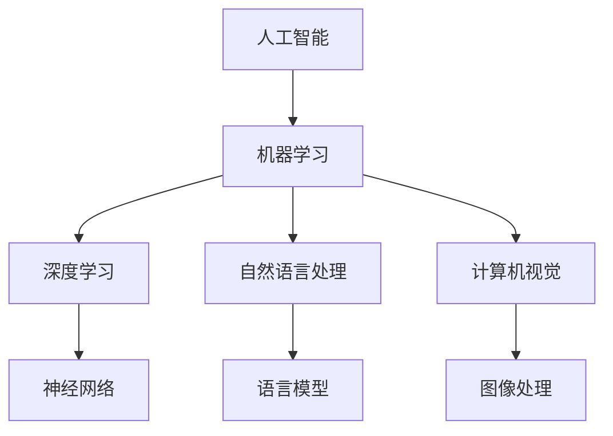

> 人工智能，机器学习，深度学习，自然语言处理，自动驾驶，伦理，未来展望

# Andrej Karpathy：人工智能的未来发展前景

人工智能（AI）正在以前所未有的速度发展，其影响遍及各行各业。Andrej Karpathy，作为世界知名的人工智能专家和特斯拉的AI总监，对AI的未来发展有着深刻的见解。本文将基于Karpathy的观点，探讨人工智能的未来发展前景。

## 1. 背景介绍

### 1.1 人工智能的崛起

近年来，随着计算能力的提升和大数据的积累，人工智能技术取得了突破性的进展。深度学习作为AI的核心技术，在图像识别、自然语言处理、语音识别等领域取得了显著成果。

### 1.2 Andrej Karpathy的贡献

Andrej Karpathy在机器学习和自然语言处理领域有着卓越的贡献。他曾担任OpenAI的首席工程师，负责GPT-2、GPT-3等大型语言模型的开发。在特斯拉，他领导着自动驾驶和AI团队，推动AI技术在汽车领域的应用。

### 1.3 本文结构

本文将围绕以下几个方面展开：

- 人工智能的核心概念与联系
- 人工智能的核心算法原理与操作步骤
- 人工智能的数学模型与公式
- 项目实践：代码实例与详细解释
- 人工智能的实际应用场景
- 未来应用展望
- 总结：发展趋势与挑战

## 2. 核心概念与联系

### 2.1 人工智能的核心概念

#### 人工智能（AI）

人工智能是指由人制造出来的系统所表现出来的智能行为。它包括机器学习、深度学习、自然语言处理、计算机视觉等多个领域。

#### 机器学习（ML）

机器学习是一种使计算机系统能够从数据中学习并做出决策的技术。它分为监督学习、无监督学习和强化学习。

#### 深度学习（DL）

深度学习是一种特殊的机器学习范式，通过模拟人脑神经网络结构，对数据进行层次化特征提取。

#### 自然语言处理（NLP）

自然语言处理是人工智能的一个分支，旨在使计算机能够理解、解释和生成人类语言。

#### 计算机视觉（CV）

计算机视觉是人工智能的一个分支，旨在使计算机能够理解和解释图像和视频。

### 2.2 Mermaid 流程图



## 3. 核心算法原理 & 具体操作步骤

### 3.1 算法原理概述

深度学习是人工智能的核心技术，其基本原理是通过神经网络模拟人脑神经元之间的连接和交互，从数据中学习特征并做出决策。

### 3.2 算法步骤详解

深度学习算法主要包括以下步骤：

1. 数据预处理：包括数据清洗、数据增强、归一化等操作。
2. 构建神经网络：选择合适的神经网络结构，如卷积神经网络（CNN）、循环神经网络（RNN）、Transformer等。
3. 训练模型：使用标注数据进行训练，优化网络参数。
4. 评估模型：使用测试数据评估模型性能。
5. 部署模型：将模型应用于实际任务。

### 3.3 算法优缺点

深度学习算法的优点：

- 智能度高：能够自动从数据中学习特征，无需人工设计特征。
- 泛化能力强：能够处理复杂的数据，适用于各种任务。
- 应用范围广：在图像识别、语音识别、自然语言处理等领域都有广泛应用。

深度学习算法的缺点：

- 计算量大：需要大量的计算资源和时间进行训练。
- 数据依赖性强：需要大量高质量的数据进行训练。
- 模型可解释性差：难以解释模型内部的决策过程。

### 3.4 算法应用领域

深度学习算法在以下领域有广泛应用：

- 图像识别
- 语音识别
- 自然语言处理
- 自动驾驶
- 医疗诊断
- 金融风控

## 4. 数学模型和公式 & 详细讲解 & 举例说明

### 4.1 数学模型构建

深度学习的基本数学模型是神经网络，其基本结构包括输入层、隐藏层和输出层。每个神经元都通过权重连接，并使用激活函数进行非线性变换。

### 4.2 公式推导过程

以下以简单的全连接神经网络为例，介绍神经网络的基本公式推导过程。

假设输入层有 $n$ 个神经元，隐藏层有 $m$ 个神经元，输出层有 $k$ 个神经元。设 $w_{ij}$ 为输入层到隐藏层的权重，$w_{jk}$ 为隐藏层到输出层的权重，$b_i$ 为输入层偏置，$b_j$ 为隐藏层偏置，$b_k$ 为输出层偏置。

输入层到隐藏层的输出为：

$$
h_j = w_{1j}x_1 + w_{2j}x_2 + \cdots + w_{nj}x_n + b_j
$$

其中 $x_1, x_2, \cdots, x_n$ 为输入层神经元输出。

隐藏层到输出层的输出为：

$$
y_k = w_{k1}h_1 + w_{k2}h_2 + \cdots + w_{km}h_m + b_k
$$

其中 $h_1, h_2, \cdots, h_m$ 为隐藏层神经元输出。

### 4.3 案例分析与讲解

以下以图像识别任务为例，介绍深度学习在图像识别中的应用。

假设我们有一个包含10000张猫和狗的图像数据集。我们的目标是训练一个模型，能够识别出图像中的猫和狗。

我们可以使用卷积神经网络（CNN）来解决这个问题。首先，我们使用预训练的VGG16模型作为特征提取器，提取图像特征。然后，我们添加一个全连接层，用于分类图像中的猫和狗。

通过在训练集上训练模型，我们可以使模型学会区分猫和狗。在测试集上，模型能够准确识别图像中的猫和狗。

## 5. 项目实践：代码实例和详细解释说明

### 5.1 开发环境搭建

为了进行深度学习项目实践，我们需要搭建以下开发环境：

- 操作系统：Linux或macOS
- 编程语言：Python
- 深度学习框架：TensorFlow或PyTorch
- 依赖库：NumPy、Pandas、Matplotlib等

### 5.2 源代码详细实现

以下是一个简单的图像识别项目示例，使用PyTorch和VGG16模型进行猫和狗的图像识别。

```python
import torch
import torch.nn as nn
from torchvision import datasets, transforms
from torch.utils.data import DataLoader

# 加载数据集
transform = transforms.Compose([
    transforms.Resize((224, 224)),
    transforms.ToTensor(),
])

train_dataset = datasets.ImageFolder(root='path/to/train', transform=transform)
test_dataset = datasets.ImageFolder(root='path/to/test', transform=transform)

train_loader = DataLoader(train_dataset, batch_size=32, shuffle=True)
test_loader = DataLoader(test_dataset, batch_size=32, shuffle=False)

# 加载预训练模型
model = torchvision.models.vgg16(pretrained=True)

# 修改模型结构
model.classifier[6] = nn.Linear(4096, 2)

# 定义损失函数和优化器
criterion = nn.CrossEntropyLoss()
optimizer = torch.optim.Adam(model.parameters())

# 训练模型
model.train()
for epoch in range(10):
    for images, labels in train_loader:
        optimizer.zero_grad()
        outputs = model(images)
        loss = criterion(outputs, labels)
        loss.backward()
        optimizer.step()
    print(f"Epoch {epoch+1}, Loss: {loss.item()}")

# 评估模型
model.eval()
correct = 0
total = 0
with torch.no_grad():
    for images, labels in test_loader:
        outputs = model(images)
        _, predicted = torch.max(outputs.data, 1)
        total += labels.size(0)
        correct += (predicted == labels).sum().item()

print(f"Accuracy of the model on the test images: {100 * correct / total}%")
```

### 5.3 代码解读与分析

上述代码展示了使用PyTorch和VGG16模型进行图像识别的完整流程。首先，我们加载了训练集和测试集数据，并定义了数据预处理步骤。然后，我们加载了预训练的VGG16模型，并将其分类层替换为两层全连接层。接下来，我们定义了损失函数和优化器，并开始训练模型。最后，我们评估模型在测试集上的性能。

## 6. 实际应用场景

### 6.1 自动驾驶

自动驾驶是人工智能在交通领域的一个重要应用。通过使用深度学习技术，自动驾驶汽车可以识别道路上的行人、车辆、交通标志等，并做出相应的决策，实现自动驾驶。

### 6.2 医疗诊断

深度学习技术在医疗诊断领域具有广泛的应用，如癌症检测、疾病诊断、药物研发等。通过使用深度学习模型，医生可以更准确地诊断疾病，提高医疗水平。

### 6.3 金融风控

深度学习技术在金融风控领域也有广泛应用，如信用评估、欺诈检测、投资策略等。通过分析大量金融数据，深度学习模型可以预测风险，帮助金融机构做出更明智的决策。

## 7. 未来应用展望

### 7.1 智能化生活

随着人工智能技术的不断发展，智能化生活将成为未来社会的主流。智能家居、智能穿戴设备、智能医疗等将为人们的生活带来更多便利。

### 7.2 个性化服务

人工智能技术可以根据用户的需求和偏好，提供更加个性化的服务。例如，推荐系统可以根据用户的兴趣和购买历史，推荐更加符合用户喜好的商品。

### 7.3 智能制造

人工智能技术可以应用于智能制造领域，提高生产效率，降低生产成本。例如，通过使用机器人进行自动化生产，可以实现24小时不间断生产。

## 8. 总结：未来发展趋势与挑战

### 8.1 研究成果总结

本文回顾了人工智能的发展历程，介绍了Andrej Karpathy的观点，并探讨了人工智能的未来发展趋势。从机器学习、深度学习到自然语言处理、计算机视觉，人工智能技术取得了巨大的突破。未来，人工智能将在更多领域得到应用，为人类创造更多价值。

### 8.2 未来发展趋势

- 人工智能将与其他技术深度融合，如物联网、云计算、大数据等。
- 人工智能将实现更加智能化、个性化、高效化的应用。
- 人工智能将推动各行各业进行数字化转型。

### 8.3 面临的挑战

- 数据安全问题：如何保护用户隐私和防止数据泄露，是人工智能发展面临的重要挑战。
- 伦理道德问题：人工智能的应用可能带来伦理道德问题，如偏见、歧视等。
- 技术瓶颈：人工智能技术仍存在一些技术瓶颈，如可解释性、鲁棒性等。

### 8.4 研究展望

- 加强人工智能的伦理道德研究，制定相关规范和标准。
- 提升人工智能的可解释性和鲁棒性，提高模型的可靠性和可信度。
- 推动人工智能与其他技术的融合，拓展人工智能的应用范围。

## 9. 附录：常见问题与解答

### 9.1 人工智能是做什么的？

A: 人工智能是一种使计算机系统能够表现智能行为的技术。它包括机器学习、深度学习、自然语言处理、计算机视觉等多个领域。

### 9.2 深度学习与机器学习的区别是什么？

A: 深度学习是机器学习的一种特殊范式，通过模拟人脑神经网络结构，对数据进行层次化特征提取。

### 9.3 人工智能的安全问题有哪些？

A: 人工智能的安全问题主要包括数据安全问题、伦理道德问题、技术瓶颈等。

### 9.4 人工智能的未来发展趋势是什么？

A: 人工智能的未来发展趋势包括与其他技术深度融合、实现更加智能化、个性化、高效化的应用、推动各行各业进行数字化转型。

作者：禅与计算机程序设计艺术 / Zen and the Art of Computer Programming