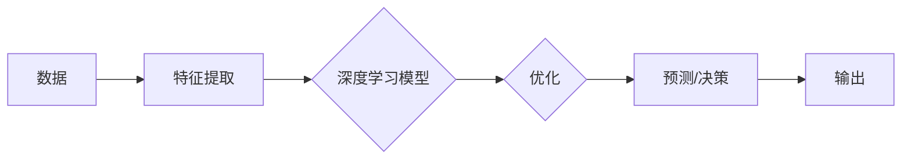

> 人工智能，深度学习，神经网络，机器学习，自然语言处理，自动驾驶，医疗诊断，伦理，可解释性

# Andrej Karpathy：人工智能的未来发展前景

## 1. 背景介绍

人工智能（AI）领域近年来取得了令人瞩目的进展，其中深度学习和神经网络技术成为推动这一变革的核心动力。Andrej Karpathy，作为深度学习领域的杰出人物，以其对深度学习理论和实践的深入理解，以及对未来AI发展趋势的独特见解，为业界和学界带来了许多启发。本文将围绕Andrej Karpathy的观点，探讨人工智能的未来发展前景。

## 2. 核心概念与联系

### 2.1 核心概念

#### 深度学习
深度学习是一种机器学习方法，通过构建具有多个隐层的神经网络，自动从数据中学习特征和模式。

#### 人工神经网络
人工神经网络是模仿人脑神经元连接方式构建的计算模型，能够通过训练学习复杂的非线性关系。

#### 机器学习
机器学习是使计算机系统能够从数据中学习并做出决策或预测的技术。

#### 自然语言处理（NLP）
自然语言处理是人工智能的一个分支，旨在使计算机能够理解、解释和生成人类语言。

#### 自动驾驶
自动驾驶技术是人工智能在交通领域的应用，旨在使汽车能够自主驾驶，提高安全性、效率和便利性。

#### 医疗诊断
人工智能在医疗领域的应用，如通过图像识别进行疾病诊断，提高诊断准确性和效率。

### 2.2 架构的 Mermaid 流程图



## 3. 核心算法原理 & 具体操作步骤

### 3.1 算法原理概述

深度学习算法的核心是神经网络，它由多个相互连接的神经元层组成。每个神经元都是一个简单的函数，多个神经元层的组合能够处理复杂的非线性问题。

### 3.2 算法步骤详解

1. 数据预处理：对原始数据进行清洗、转换和规范化，以便于模型训练。
2. 构建神经网络：设计并构建神经网络结构，包括输入层、隐藏层和输出层。
3. 模型训练：使用训练数据对神经网络进行训练，调整网络参数以最小化预测误差。
4. 模型评估：使用测试数据评估模型性能，调整模型结构和参数以获得更好的结果。
5. 模型部署：将训练好的模型部署到实际应用场景中。

### 3.3 算法优缺点

#### 优点
- 高效处理复杂数据
- 能够从数据中自动学习特征
- 在图像识别、语音识别等领域取得显著成果

#### 缺点
- 需要大量数据和计算资源
- 模型可解释性差
- 存在过拟合风险

### 3.4 算法应用领域

- 图像识别
- 语音识别
- 自然语言处理
- 自动驾驶
- 医疗诊断
- 金融分析

## 4. 数学模型和公式 & 详细讲解 & 举例说明

### 4.1 数学模型构建

神经网络中的每个神经元可以表示为一个非线性函数，如：

$$
f(x) = \sigma(w \cdot x + b)
$$

其中，$w$ 是权重，$x$ 是输入，$b$ 是偏置，$\sigma$ 是激活函数。

### 4.2 公式推导过程

神经网络通过反向传播算法进行参数优化，具体推导过程如下：

1. 计算损失函数的梯度
2. 根据梯度更新权重和偏置

### 4.3 案例分析与讲解

以卷积神经网络（CNN）为例，介绍其在图像识别任务中的应用。

1. 数据预处理：对图像数据进行灰度化、归一化等操作。
2. 构建CNN模型：包括卷积层、池化层、全连接层等。
3. 模型训练：使用图像数据对模型进行训练，调整参数以最小化预测误差。
4. 模型评估：使用测试数据评估模型性能。
5. 模型部署：将训练好的模型应用于实际图像识别任务。

## 5. 项目实践：代码实例和详细解释说明

### 5.1 开发环境搭建

1. 安装Python、PyTorch等开发环境。
2. 下载并安装必要的库，如NumPy、Pandas等。

### 5.2 源代码详细实现

以下是一个简单的CNN模型实现示例：

```python
import torch
import torch.nn as nn

class SimpleCNN(nn.Module):
    def __init__(self):
        super(SimpleCNN, self).__init__()
        self.conv1 = nn.Conv2d(1, 10, kernel_size=5)
        self.conv2 = nn.Conv2d(10, 20, kernel_size=5)
        self.fc1 = nn.Linear(320, 50)
        self.fc2 = nn.Linear(50, 10)

    def forward(self, x):
        x = nn.functional.relu(self.conv1(x))
        x = nn.functional.max_pool2d(x, 2)
        x = nn.functional.relu(self.conv2(x))
        x = nn.functional.max_pool2d(x, 2)
        x = x.view(-1, 320)
        x = nn.functional.relu(self.fc1(x))
        x = self.fc2(x)
        return x
```

### 5.3 代码解读与分析

- `SimpleCNN` 类：定义了一个简单的CNN模型，包括卷积层、池化层和全连接层。
- `forward` 方法：实现了模型的正向传播过程。

### 5.4 运行结果展示

运行上述代码，可以训练一个简单的CNN模型，并对其性能进行评估。

## 6. 实际应用场景

### 6.1 自动驾驶

自动驾驶是人工智能在交通领域的应用之一。通过使用深度学习技术，自动驾驶汽车可以实时识别道路上的行人、车辆和其他障碍物，并做出相应的驾驶决策，提高行车安全。

### 6.2 医疗诊断

人工智能在医疗领域的应用可以辅助医生进行疾病诊断。通过分析医学影像，如X光片、CT扫描等，人工智能可以识别疾病特征，提高诊断准确性和效率。

### 6.3 金融分析

人工智能在金融领域的应用可以用于股票市场预测、风险评估和欺诈检测等。通过分析大量金融数据，人工智能可以预测市场趋势，帮助投资者做出更明智的决策。

## 7. 工具和资源推荐

### 7.1 学习资源推荐

- 《深度学习》（Goodfellow、Bengio和Courville著）
- 《Python深度学习》（François Chollet著）
- 《神经网络与深度学习》（邱锡鹏著）

### 7.2 开发工具推荐

- PyTorch
- TensorFlow
- Keras

### 7.3 相关论文推荐

- "ImageNet Classification with Deep Convolutional Neural Networks"（Alex Krizhevsky等）
- "Playing Atari with Deep Reinforcement Learning"（Volodymyr Mnih等）
- "BERT: Pre-training of Deep Bidirectional Transformers for Language Understanding"（Jacob Devlin等）

## 8. 总结：未来发展趋势与挑战

### 8.1 研究成果总结

深度学习技术在人工智能领域取得了显著的成果，为各行各业带来了变革。然而，人工智能仍然面临着诸多挑战，如数据隐私、算法可解释性、伦理问题等。

### 8.2 未来发展趋势

- 深度学习模型将更加高效和可解释
- 人工智能将与更多领域融合，如生物医学、能源等
- 人工智能将更加注重伦理和可解释性

### 8.3 面临的挑战

- 数据隐私和安全
- 算法可解释性
- 伦理问题
- 技术普及和人才培养

### 8.4 研究展望

人工智能技术的发展将推动人类社会进入一个全新的时代。未来，人工智能将更加智能、高效、可解释和可控，为人类创造更加美好的生活。

## 9. 附录：常见问题与解答

**Q1：人工智能是否会取代人类工作？**

A：人工智能的发展将改变一些工作，但同时也会创造新的就业机会。人工智能将更多地用于辅助人类工作，提高生产效率和决策质量。

**Q2：人工智能的伦理问题如何解决？**

A：人工智能的伦理问题需要全社会的共同努力，包括制定相关法律法规、加强伦理教育、提高人工智能算法的可解释性等。

**Q3：如何提高人工智能算法的可解释性？**

A：提高人工智能算法的可解释性需要从算法设计、模型结构、数据预处理等多个方面入手，提高算法的可解释性和可审计性。

**Q4：人工智能的发展前景如何？**

A：人工智能的发展前景广阔，将在未来十年内深刻改变人类社会，为人类创造更加美好的生活。

---

作者：禅与计算机程序设计艺术 / Zen and the Art of Computer Programming