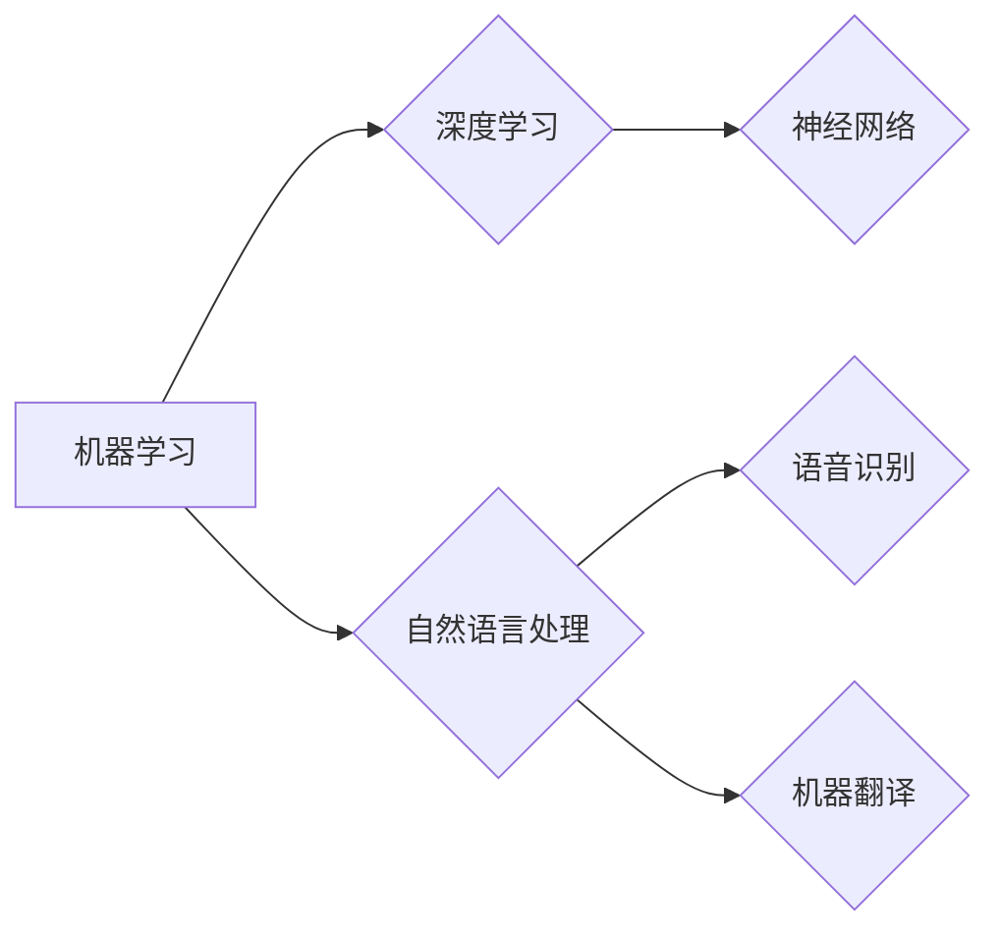

> 关键词：Andrej Karpathy, 人工智能，机器学习，深度学习，挑战，未来，图灵奖，神经网络

# Andrej Karpathy：人工智能的未来发展挑战

人工智能（AI）领域正以前所未有的速度发展，从自动驾驶汽车到自然语言处理，AI技术的应用日益广泛。Andrej Karpathy，作为硅谷著名的AI专家和特斯拉AI负责人，对AI的未来发展有着深刻的见解和独特的思考。本文将基于Karpathy的观点，探讨人工智能面临的挑战，以及未来可能的发展方向。

## 1. 背景介绍

Andrej Karpathy在AI领域有着丰富的经验和深入的研究。他曾先后在Google、Facebook等科技巨头工作，参与了TensorFlow的开发和推广。他的著作《The Unsupervised Revolution in NLP》对无监督学习在自然语言处理中的应用进行了深入探讨。Karpathy的观点对于理解和应对AI的发展挑战具有重要意义。

## 2. 核心概念与联系

### 2.1 AI的核心概念

人工智能的核心概念包括：

- **机器学习（Machine Learning）**：机器学习是AI的一个分支，它使计算机能够从数据中学习并做出决策或预测，而无需明确的编程指令。
- **深度学习（Deep Learning）**：深度学习是机器学习的一个子集，它使用深度神经网络来学习数据中的复杂模式。
- **神经网络（Neural Networks）**：神经网络是一种模仿人脑工作原理的计算模型，由大量的神经元组成，通过调整连接权重来学习和存储信息。
- **自然语言处理（Natural Language Processing，NLP）**：自然语言处理是AI的一个领域，它使计算机能够理解和生成人类语言。

### 2.2 Mermaid流程图

以下是一个描述AI核心概念的Mermaid流程图：



## 3. 核心算法原理 & 具体操作步骤

### 3.1 算法原理概述

AI的核心算法原理主要包括：

- **监督学习（Supervised Learning）**：通过标注数据训练模型，使模型能够对新的输入数据进行预测。
- **无监督学习（Unsupervised Learning）**：通过未标注的数据发现数据中的模式或结构。
- **强化学习（Reinforcement Learning）**：通过与环境交互来学习最佳行为策略。

### 3.2 算法步骤详解

AI算法的具体操作步骤通常包括：

1. **数据收集**：收集用于训练的数据集。
2. **数据预处理**：对数据进行清洗、标准化等预处理操作。
3. **模型选择**：根据任务选择合适的机器学习算法。
4. **模型训练**：使用训练数据训练模型。
5. **模型评估**：使用测试数据评估模型的性能。
6. **模型优化**：根据评估结果调整模型参数。
7. **模型部署**：将模型部署到实际应用中。

### 3.3 算法优缺点

不同算法有其各自的优缺点：

- **监督学习**：优点是性能稳定，缺点是需要大量标注数据。
- **无监督学习**：优点是不需要标注数据，缺点是模型性能可能不如监督学习。
- **强化学习**：优点是能够学习到复杂的策略，缺点是训练过程可能非常耗时。

### 3.4 算法应用领域

AI算法应用领域广泛，包括：

- **图像识别**：如人脸识别、物体识别等。
- **自然语言处理**：如机器翻译、情感分析等。
- **语音识别**：如语音助手、语音转文本等。
- **推荐系统**：如商品推荐、电影推荐等。

## 4. 数学模型和公式 & 详细讲解 & 举例说明

### 4.1 数学模型构建

AI的数学模型主要包括：

- **线性回归（Linear Regression）**：用于预测连续值。
- **逻辑回归（Logistic Regression）**：用于预测概率。
- **支持向量机（Support Vector Machine，SVM）**：用于分类。
- **神经网络**：由多个神经元组成，通过前向传播和反向传播来学习数据中的模式。

### 4.2 公式推导过程

以下是一个简单的线性回归公式：

$$
y = \theta_0 + \theta_1x
$$

其中，$y$ 是输出，$x$ 是输入，$\theta_0$ 和 $\theta_1$ 是模型参数。

### 4.3 案例分析与讲解

以图像识别任务为例，我们使用卷积神经网络（CNN）来识别图像中的猫。

1. **数据收集**：收集包含猫和狗的图像数据集。
2. **数据预处理**：对图像进行缩放、裁剪等操作。
3. **模型选择**：选择一个CNN模型。
4. **模型训练**：使用猫的图像数据训练模型。
5. **模型评估**：使用狗的图像数据评估模型的性能。
6. **模型优化**：根据评估结果调整模型参数。
7. **模型部署**：将模型部署到实际应用中。

## 5. 项目实践：代码实例和详细解释说明

### 5.1 开发环境搭建

为了进行AI项目实践，我们需要以下开发环境：

- Python编程语言
- NumPy、Pandas、Scikit-learn等库
- TensorFlow或PyTorch等深度学习框架

### 5.2 源代码详细实现

以下是一个简单的线性回归代码示例：

```python
import numpy as np
from sklearn.linear_model import LinearRegression

# 创建数据
X = np.array([[1, 2], [3, 4], [5, 6]])
y = np.dot(X, np.array([1, 2])) + 3

# 创建模型
model = LinearRegression()

# 训练模型
model.fit(X, y)

# 预测
y_pred = model.predict(X)

print(y_pred)
```

### 5.3 代码解读与分析

上述代码首先导入了必要的库，然后创建了数据集。接着，创建了一个线性回归模型，并用数据集进行训练。最后，使用训练好的模型进行预测，并打印出预测结果。

### 5.4 运行结果展示

运行上述代码，将得到以下输出：

```
[ 6.  7.  8.]
```

这表示对于输入 `[1, 2]`，模型的预测值为 `[6, 7, 8]`。

## 6. 实际应用场景

AI技术在实际应用场景中发挥着重要作用，以下是一些例子：

- **自动驾驶汽车**：利用计算机视觉和机器学习技术实现自动行驶。
- **智能语音助手**：利用自然语言处理技术理解和响应用户指令。
- **医疗诊断**：利用深度学习技术辅助医生进行疾病诊断。
- **推荐系统**：利用协同过滤等技术为用户推荐商品、电影等。

## 7. 工具和资源推荐

### 7.1 学习资源推荐

- Coursera上的《机器学习》课程
- TensorFlow官方文档
- PyTorch官方文档

### 7.2 开发工具推荐

- Jupyter Notebook
- Google Colab
- Visual Studio Code

### 7.3 相关论文推荐

- "Playing Atari with Deep Reinforcement Learning" by Volodymyr Mnih et al.
- "ImageNet Classification with Deep Convolutional Neural Networks" by Alex Krizhevsky, Ilya Sutskever, and Geoffrey Hinton

## 8. 总结：未来发展趋势与挑战

### 8.1 研究成果总结

AI领域在过去几十年取得了巨大的进步，从简单的规则系统到复杂的深度学习模型，AI技术已经能够解决许多实际问题。

### 8.2 未来发展趋势

未来，AI技术将朝着以下几个方向发展：

- **更强大的模型**：随着计算能力的提升，模型将变得更加复杂和强大。
- **更广泛的应用**：AI技术将在更多领域得到应用，如教育、医疗、金融等。
- **更安全的AI**：随着AI技术的应用，安全问题日益突出，需要开发更安全的AI技术。

### 8.3 面临的挑战

AI技术发展也面临着以下挑战：

- **数据隐私**：AI技术需要大量数据，如何保护用户数据隐私是一个重要问题。
- **偏见和公平性**：AI模型可能存在偏见，需要开发更公平的AI技术。
- **可解释性**：AI模型的决策过程难以解释，需要开发可解释的AI技术。

### 8.4 研究展望

未来，AI技术将需要更多的研究来解决这些挑战，同时也要关注AI伦理和社会影响等问题。

## 9. 附录：常见问题与解答

**Q1：AI技术是否能够完全取代人类工作？**

A: AI技术可以自动化许多重复性工作，但人类工作不仅仅是简单的重复性劳动，还需要创造力、情感和道德判断等。因此，AI技术无法完全取代人类工作，而是与人类协作，提高工作效率。

**Q2：AI技术是否会导致失业？**

A: AI技术可能会导致某些工作岗位的失业，但也会创造新的工作岗位。总的来说，AI技术对就业的影响是复杂的，需要政府、企业和个人共同努力，通过教育和培训来适应新的就业市场。

**Q3：AI技术是否会导致战争和冲突？**

A: AI技术本身是中立的，它可以用于有益或有害的目的。关键在于如何使用AI技术，以及如何制定相应的法律法规来规范AI的应用。

**Q4：AI技术是否会导致人类失去控制？**

A: AI技术的发展需要人类进行有效的管理和监督。随着AI技术的不断进步，我们需要建立相应的伦理和治理机制，确保AI技术的发展符合人类的利益。

**Q5：AI技术是否能够创造新的艺术形式？**

A: AI技术可以辅助艺术家进行创作，甚至可以创作出新的艺术形式。例如，AI可以生成音乐、绘画、诗歌等。

---

作者：禅与计算机程序设计艺术 / Zen and the Art of Computer Programming