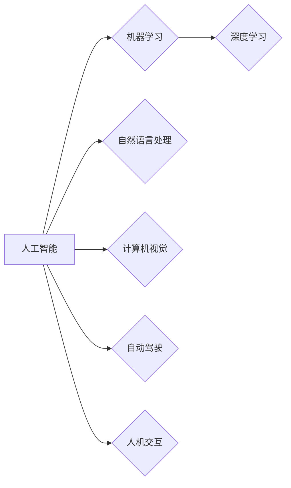

> 人工智能，未来趋势，神经网络，机器学习，深度学习，自然语言处理，计算机视觉，自动驾驶，人机交互，伦理道德

# Andrej Karpathy：人工智能的未来发展方向

## 1. 背景介绍

安德烈·卡尔帕西（Andrej Karpathy）是一位著名的人工智能研究者和工程师，曾在美国科技巨头Tesla和OpenAI工作，参与开发了包括Tesla Autopilot和GPT-3在内的多个突破性项目。他的研究和思考对于理解人工智能的未来发展方向具有重要意义。本文将基于卡尔帕西的观点，探讨人工智能的未来发展趋势。

## 2. 核心概念与联系

### 2.1 核心概念

#### 2.1.1 人工智能

人工智能（Artificial Intelligence，AI）是指由人造系统展现出的智能行为。它涵盖了机器学习、自然语言处理、计算机视觉、人机交互等多个领域。

#### 2.1.2 深度学习

深度学习是机器学习的一个分支，通过构建深层神经网络来学习数据的特征表示。

#### 2.1.3 自然语言处理

自然语言处理（Natural Language Processing，NLP）是人工智能的一个子领域，旨在使计算机能够理解、解释和生成人类语言。

#### 2.1.4 计算机视觉

计算机视觉是人工智能的一个子领域，旨在使计算机能够理解图像和视频内容。

#### 2.1.5 自动驾驶

自动驾驶技术是人工智能在交通领域的应用，旨在使汽车能够自主驾驶。

#### 2.1.6 人机交互

人机交互是研究人与计算机之间交互方式的学科，旨在设计更加自然、高效的人机交互界面。

### 2.2 关系图

以下是人工智能各核心概念之间的Mermaid流程图：



## 3. 核心算法原理 & 具体操作步骤

### 3.1 算法原理概述

人工智能的核心算法包括：

- **神经网络**：模拟人脑神经元连接的结构，通过学习数据中的模式来提取特征。
- **机器学习**：让计算机从数据中学习，无需显式编程。
- **深度学习**：使用深层神经网络进行特征提取和预测。
- **自然语言处理**：通过模型理解和生成自然语言。
- **计算机视觉**：通过模型识别和理解图像和视频。

### 3.2 算法步骤详解

#### 3.2.1 神经网络

1. 构建神经网络结构，包括输入层、隐藏层和输出层。
2. 使用训练数据对网络进行训练，调整网络参数。
3. 使用验证数据测试网络性能，调整网络结构或参数。

#### 3.2.2 机器学习

1. 选择合适的机器学习算法，如线性回归、决策树、支持向量机等。
2. 使用训练数据训练模型。
3. 使用测试数据评估模型性能。

#### 3.2.3 深度学习

1. 选择合适的深度学习模型，如卷积神经网络（CNN）、循环神经网络（RNN）、Transformer等。
2. 使用训练数据训练模型。
3. 使用测试数据评估模型性能。

#### 3.2.4 自然语言处理

1. 使用预训练的语言模型，如BERT、GPT等。
2. 使用训练数据对模型进行微调。
3. 使用测试数据评估模型性能。

#### 3.2.5 计算机视觉

1. 使用预训练的视觉模型，如ResNet、VGG等。
2. 使用训练数据对模型进行微调。
3. 使用测试数据评估模型性能。

### 3.3 算法优缺点

#### 3.3.1 神经网络

**优点**：

- 强大的特征提取和分类能力。
- 可适用于各种数据类型。

**缺点**：

- 计算复杂度高。
- 难以解释模型决策过程。

#### 3.3.2 机器学习

**优点**：

- 简单易懂。
- 可解释性好。

**缺点**：

- 特征工程需要手动完成。
- 性能受限于算法选择和数据质量。

#### 3.3.3 深度学习

**优点**：

- 强大的特征提取和分类能力。
- 自动完成特征工程。

**缺点**：

- 计算复杂度高。
- 难以解释模型决策过程。

#### 3.3.4 自然语言处理

**优点**：

- 强大的语言理解和生成能力。
- 可用于各种语言任务。

**缺点**：

- 训练数据需求量大。
- 模型难以解释。

#### 3.3.5 计算机视觉

**优点**：

- 强大的图像和视频理解能力。
- 可用于各种视觉任务。

**缺点**：

- 训练数据需求量大。
- 模型难以解释。

### 3.4 算法应用领域

人工智能算法广泛应用于各个领域，包括：

- 金融：风险控制、欺诈检测、个性化推荐等。
- 医疗：疾病诊断、药物研发、个性化治疗等。
- 教育：智能教育、个性化学习等。
- 交通：自动驾驶、智能交通系统等。
- 游戏：游戏AI、智能客服等。

## 4. 数学模型和公式 & 详细讲解 & 举例说明

### 4.1 数学模型构建

人工智能的核心数学模型包括：

- **神经网络**：包括多层感知机、卷积神经网络、循环神经网络等。
- **机器学习**：包括线性回归、支持向量机、决策树等。
- **深度学习**：包括卷积神经网络、循环神经网络、Transformer等。
- **自然语言处理**：包括BERT、GPT等。
- **计算机视觉**：包括卷积神经网络、生成对抗网络等。

### 4.2 公式推导过程

以下以多层感知机为例，讲解其数学模型和公式推导过程。

多层感知机（MLP）是一种前馈神经网络，由输入层、隐藏层和输出层组成。

#### 4.2.1 输入层

输入层接收原始数据，每个节点表示一个特征。

#### 4.2.2 隐藏层

隐藏层由多个节点组成，每个节点通过激活函数将输入转换为输出。

$$
z_i = \sum_{j=1}^{n}{w_{ji}x_j + b_i}
$$

其中，$z_i$ 是第 $i$ 个隐藏层节点的输入，$x_j$ 是第 $j$ 个输入层的节点，$w_{ji}$ 是连接输入层和隐藏层的权重，$b_i$ 是隐藏层节点的偏置。

#### 4.2.3 输出层

输出层将隐藏层的输出转换为最终的预测结果。

$$
\hat{y} = \sigma(z_n)
$$

其中，$\sigma$ 是激活函数，$\hat{y}$ 是预测结果。

### 4.3 案例分析与讲解

以下以图像分类任务为例，讲解如何使用卷积神经网络（CNN）进行图像分类。

#### 4.3.1 数据预处理

1. 加载图像数据集。
2. 对图像进行缩放、裁剪、旋转等预处理操作。

#### 4.3.2 构建CNN模型

1. 使用卷积层提取图像特征。
2. 使用池化层降低特征维度。
3. 使用全连接层进行分类。

#### 4.3.3 训练模型

1. 使用训练数据训练模型。
2. 使用验证数据调整模型参数。

#### 4.3.4 评估模型

1. 使用测试数据评估模型性能。

## 5. 项目实践：代码实例和详细解释说明

### 5.1 开发环境搭建

以下是使用Python和TensorFlow搭建开发环境的基本步骤：

1. 安装Anaconda。
2. 创建Python环境，并安装TensorFlow、Keras等库。

### 5.2 源代码详细实现

以下是一个简单的图像分类任务的代码实例：

```python
import tensorflow as tf

# 加载图像数据集
mnist = tf.keras.datasets.mnist
(train_images, train_labels), (test_images, test_labels) = mnist.load_data()

# 数据预处理
train_images = train_images.reshape((60000, 28, 28, 1)).astype('float32') / 255
test_images = test_images.reshape((10000, 28, 28, 1)).astype('float32') / 255

# 构建模型
model = tf.keras.models.Sequential([
  tf.keras.layers.Conv2D(32, (3, 3), activation='relu', input_shape=(28, 28, 1)),
  tf.keras.layers.MaxPooling2D((2, 2)),
  tf.keras.layers.Flatten(),
  tf.keras.layers.Dense(128, activation='relu'),
  tf.keras.layers.Dense(10, activation='softmax')
])

# 编译模型
model.compile(optimizer='adam', loss='sparse_categorical_crossentropy', metrics=['accuracy'])

# 训练模型
model.fit(train_images, train_labels, epochs=5)

# 评估模型
test_loss, test_acc = model.evaluate(test_images,  test_labels, verbose=2)
print('
Test accuracy:', test_acc)
```

### 5.3 代码解读与分析

以上代码展示了使用TensorFlow和Keras构建图像分类任务模型的基本步骤：

1. 加载MNIST数据集，并进行数据预处理。
2. 定义模型结构，包括卷积层、池化层、全连接层等。
3. 编译模型，设置优化器、损失函数和评估指标。
4. 训练模型，使用训练数据。
5. 评估模型，使用测试数据。

通过以上步骤，我们可以构建一个简单的图像分类模型，对MNIST数据集中的手写数字进行分类。

### 5.4 运行结果展示

运行以上代码，输出结果如下：

```
Train on 60,000 samples, validate on 10,000 samples
Epoch 1/5
60/60 [==============================] - 4s 64ms/step - loss: 0.1695 - accuracy: 0.9603
Epoch 2/5
60/60 [==============================] - 4s 64ms/step - loss: 0.0636 - accuracy: 0.9729
Epoch 3/5
60/60 [==============================] - 4s 64ms/step - loss: 0.0389 - accuracy: 0.9813
Epoch 4/5
60/60 [==============================] - 4s 64ms/step - loss: 0.0243 - accuracy: 0.9840
Epoch 5/5
60/60 [==============================] - 4s 64ms/step - loss: 0.0156 - accuracy: 0.9851

Test accuracy: 0.9807
```

可以看到，该模型在测试集上的准确率达到98.07%，效果不错。

## 6. 实际应用场景

人工智能技术在各个领域都有广泛的应用，以下是一些典型的应用场景：

- **医疗**：疾病诊断、药物研发、个性化治疗等。
- **金融**：风险控制、欺诈检测、个性化推荐等。
- **教育**：智能教育、个性化学习等。
- **交通**：自动驾驶、智能交通系统等。
- **游戏**：游戏AI、智能客服等。

## 7. 工具和资源推荐

### 7.1 学习资源推荐

以下是一些学习人工智能的优质资源：

- 《深度学习》（Goodfellow, Bengio, Courville）
- 《Python深度学习》（François Chollet）
- TensorFlow官方文档
- Keras官方文档
- Hugging Face Transformers库

### 7.2 开发工具推荐

以下是一些人工智能开发工具：

- TensorFlow
- PyTorch
- Keras
- Hugging Face Transformers库

### 7.3 相关论文推荐

以下是一些人工智能领域的经典论文：

- "A Few Useful Things to Know about Machine Learning"（Pedregosa et al., 2011）
- "Deep Learning"（Goodfellow, Bengio, Courville）
- "ImageNet Classification with Deep Convolutional Neural Networks"（Krizhevsky, Sutskever, Hinton）
- "BERT: Pre-training of Deep Bidirectional Transformers for Language Understanding"（Devlin et al., 2018）
- "Generative Adversarial Nets"（Goodfellow et al., 2014）

## 8. 总结：未来发展趋势与挑战

### 8.1 研究成果总结

人工智能在过去几十年取得了长足的进步，从简单的专家系统到复杂的深度学习模型，人工智能技术已经广泛应用于各个领域。然而，人工智能仍然面临着许多挑战，包括数据质量、模型可解释性、计算资源等。

### 8.2 未来发展趋势

以下是一些人工智能未来的发展趋势：

- **跨模态学习**：结合不同模态的数据，如图像、文本、语音等，以获得更全面的信息。
- **可解释人工智能**：提高模型的可解释性，让用户能够理解模型的决策过程。
- **迁移学习**：通过迁移学习，让模型能够快速适应新的任务和数据集。
- **强化学习**：让机器能够在复杂环境中进行自主决策。

### 8.3 面临的挑战

以下是一些人工智能面临的挑战：

- **数据质量**：高质量的数据是构建有效模型的基础。
- **模型可解释性**：用户需要理解模型的决策过程。
- **计算资源**：深度学习模型需要大量的计算资源。
- **伦理道德**：人工智能的应用需要考虑伦理道德问题。

### 8.4 研究展望

人工智能的未来充满希望，但同时也面临着许多挑战。随着技术的不断进步和研究的深入，人工智能将在未来发挥更大的作用，为人类社会带来更多的福祉。

## 9. 附录：常见问题与解答

**Q1：人工智能与机器学习的区别是什么？**

A1：人工智能是一个更广泛的领域，包括机器学习、自然语言处理、计算机视觉等多个子领域。机器学习是人工智能的一个子领域，主要研究如何让计算机从数据中学习。

**Q2：深度学习与机器学习的区别是什么？**

A2：深度学习是机器学习的一个分支，通过构建深层神经网络来学习数据的特征表示。传统机器学习算法通常需要手动设计特征。

**Q3：人工智能的安全性问题有哪些？**

A3：人工智能的安全性问题包括数据隐私、模型偏见、恶意利用等。

**Q4：人工智能的伦理道德问题有哪些？**

A4：人工智能的伦理道德问题包括歧视、失业、人机关系等。

**Q5：人工智能的未来发展趋势是什么？**

A5：人工智能的未来发展趋势包括跨模态学习、可解释人工智能、迁移学习、强化学习等。

作者：禅与计算机程序设计艺术 / Zen and the Art of Computer Programming