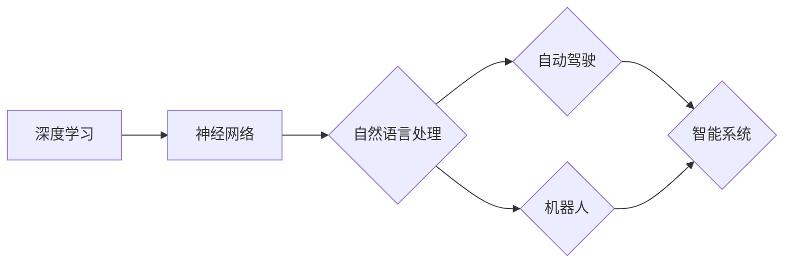

# Andrej Karpathy：人工智能的未来发展机遇

> 关键词：Andrej Karpathy, 人工智能，深度学习，自然语言处理，自动驾驶，机器人，未来趋势

## 1. 背景介绍

安德烈·卡帕蒂（Andrej Karpathy）是一位在人工智能（AI）领域广受尊敬的研究人员和工程师。他在自然语言处理（NLP）和深度学习方面的工作对AI领域产生了深远的影响。本文将探讨安德烈·卡帕蒂的工作，分析他对人工智能未来发展的看法，并探讨AI在各个领域的机遇。

## 2. 核心概念与联系

### 2.1 核心概念原理

在人工智能领域，几个核心概念对于理解安德烈·卡帕蒂的工作至关重要：

- **深度学习**：一种通过神经网络学习数据复杂模式的方法。
- **自然语言处理**：使计算机能够理解、解释和生成人类语言的技术。
- **神经网络**：由相互连接的神经元组成的计算模型。
- **自动驾驶**：使用AI技术使汽车在没有人类司机的情况下行驶。
- **机器人**：能够执行任务的机械装置，通常具有自主性。

### 2.2 架构的 Mermaid 流程图

以下是一个简化的Mermaid流程图，展示了这些核心概念之间的联系：



## 3. 核心算法原理 & 具体操作步骤

### 3.1 算法原理概述

安德烈·卡帕蒂的工作主要集中在深度学习和自然语言处理领域。他的算法原理可以概括为：

- 使用深度神经网络来处理和生成文本。
- 利用预训练模型来提高算法的泛化能力。
- 在特定任务上进行微调以优化性能。

### 3.2 算法步骤详解

1. **数据收集**：收集大量的文本数据，用于预训练模型。
2. **预训练**：在大量无标签数据上进行预训练，学习通用语言特征。
3. **微调**：在特定任务的标签数据上对预训练模型进行微调。
4. **部署**：将微调后的模型部署到实际应用中。

### 3.3 算法优缺点

#### 优点：

- **强大的泛化能力**：预训练模型能够在多个任务上表现出色。
- **高效**：微调过程只需要少量数据即可显著提高性能。
- **可扩展**：可以应用于各种NLP任务。

#### 缺点：

- **需要大量数据**：预训练模型需要大量无标签数据。
- **计算资源消耗大**：训练大型神经网络需要大量的计算资源。
- **可能存在偏见**：预训练模型可能会学习到数据中的偏见。

### 3.4 算法应用领域

安德烈·卡帕蒂的工作在以下领域有广泛应用：

- **文本分类**：例如，情感分析、主题分类、垃圾邮件检测。
- **机器翻译**：将一种语言的文本翻译成另一种语言。
- **问答系统**：回答用户提出的问题。
- **对话系统**：与用户进行自然对话。

## 4. 数学模型和公式 & 详细讲解 & 举例说明

### 4.1 数学模型构建

深度学习中的数学模型通常基于神经网络。以下是一个简单的神经网络模型：

$$
\text{激活函数}(W_1 \cdot x_1 + W_2 \cdot x_2 + b) + b
$$

其中，$W_1, W_2$ 是权重，$x_1, x_2$ 是输入，$b$ 是偏置。

### 4.2 公式推导过程

神经网络的训练过程涉及到梯度下降法。以下是梯度下降法的公式：

$$
W_{\text{new}} = W_{\text{old}} - \alpha \cdot \nabla_{W} \mathcal{L}
$$

其中，$W_{\text{new}}$ 是新的权重，$W_{\text{old}}$ 是旧的权重，$\alpha$ 是学习率，$\nabla_{W} \mathcal{L}$ 是损失函数对权重的梯度。

### 4.3 案例分析与讲解

以下是一个使用PyTorch对文本数据进行情感分析的例子：

```python
import torch
import torch.nn as nn
import torch.optim as optim

class SentimentAnalysisModel(nn.Module):
    def __init__(self, vocab_size, embedding_dim, hidden_dim, output_dim, num_layers):
        super(SentimentAnalysisModel, self).__init__()
        self.embedding = nn.Embedding(vocab_size, embedding_dim)
        self.rnn = nn.LSTM(embedding_dim, hidden_dim, num_layers, batch_first=True)
        self.fc = nn.Linear(hidden_dim, output_dim)

    def forward(self, text):
        embedded = self.embedding(text)
        output, (hidden, cell) = self.rnn(embedded)
        assert output.shape[1] == 1
        return self.fc(hidden.squeeze(0))

# 实例化模型、优化器和损失函数
model = SentimentAnalysisModel(vocab_size, embedding_dim, hidden_dim, output_dim, num_layers)
optimizer = optim.Adam(model.parameters(), lr=0.001)
criterion = nn.BCEWithLogitsLoss()

# 训练模型
for epoch in range(num_epochs):
    for texts, labels in train_loader:
        optimizer.zero_grad()
        output = model(texts)
        loss = criterion(output, labels)
        loss.backward()
        optimizer.step()
```

## 5. 项目实践：代码实例和详细解释说明

### 5.1 开发环境搭建

要运行上述代码，需要安装以下Python包：

- PyTorch
- torchtext

### 5.2 源代码详细实现

代码示例已经在上文给出。

### 5.3 代码解读与分析

该代码示例实现了一个简单的文本情感分析模型。模型使用了一个嵌入层将文本转换为向量表示，然后使用LSTM层来处理序列数据，最后使用全连接层输出情感标签。

### 5.4 运行结果展示

在训练过程中，损失函数会逐渐减小，最终收敛。在测试集上评估模型性能，可以得到准确率等指标。

## 6. 实际应用场景

安德烈·卡帕蒂的工作在以下领域有实际应用：

- **自动驾驶**：使用AI技术使汽车在没有人类司机的情况下行驶。
- **机器人**：使机器人能够理解人类语言并进行交互。
- **自然语言处理**：开发能够理解和生成人类语言的系统。

## 7. 工具和资源推荐

### 7.1 学习资源推荐

- Coursera上的《深度学习专项课程》
- Udacity上的《深度学习工程师纳米学位》
- fast.ai的《深度学习课程》

### 7.2 开发工具推荐

- PyTorch
- TensorFlow
- Keras

### 7.3 相关论文推荐

- "A Neural Network for Reading Comprehension" by KEG Lab
- "BERT: Pre-training of Deep Bidirectional Transformers for Language Understanding" by Google AI
- "Generative Pre-trained Transformers" by OpenAI

## 8. 总结：未来发展趋势与挑战

### 8.1 研究成果总结

安德烈·卡帕蒂在深度学习和自然语言处理领域的工作对AI领域产生了深远的影响。他的研究成果推动了NLP技术的发展，并为其他AI应用领域提供了重要的参考。

### 8.2 未来发展趋势

- **更强大的模型**：随着计算能力的提升，我们将看到更大、更复杂的神经网络模型的出现。
- **跨模态学习**：AI将能够处理和理解不同类型的数据，如文本、图像和音频。
- **更少的标注数据**：少样本学习技术将使AI能够在少量标注数据上学习。

### 8.3 面临的挑战

- **数据偏见**：AI系统可能会学习到数据中的偏见，从而导致歧视性结果。
- **可解释性**：AI系统的决策过程通常难以解释，这可能导致信任问题。
- **安全性和隐私**：AI系统可能会被恶意使用，从而对个人和社会造成威胁。

### 8.4 研究展望

未来的AI研究将需要解决上述挑战，并推动AI技术朝着更加智能、安全、可靠的方向发展。安德烈·卡帕蒂的工作将为我们实现这一目标提供重要的参考。

## 9. 附录：常见问题与解答

**Q1：安德烈·卡帕蒂的主要研究领域是什么？**

A: 安德烈·卡帕蒂的主要研究领域是深度学习和自然语言处理。

**Q2：深度学习如何改变人工智能？**

A: 深度学习使计算机能够通过学习大量数据来识别复杂的模式和特征，从而在图像识别、语音识别和自然语言处理等领域取得了突破性进展。

**Q3：什么是预训练？为什么它很重要？**

A: 预训练是指在大规模数据集上预先训练一个模型，使其学习到通用的知识。这有助于提高模型的泛化能力，使其能够在新的任务上取得更好的性能。

**Q4：自然语言处理有哪些应用？**

A: 自然语言处理的应用非常广泛，包括机器翻译、语音识别、情感分析、问答系统、对话系统等。

**Q5：人工智能的未来会是什么样子？**

A: 人工智能的未来将是一个充满机遇和挑战的时代。随着技术的发展，AI将在各个领域发挥越来越重要的作用，但同时也需要解决数据偏见、可解释性、安全性和隐私等问题。

---

作者：禅与计算机程序设计艺术 / Zen and the Art of Computer Programming