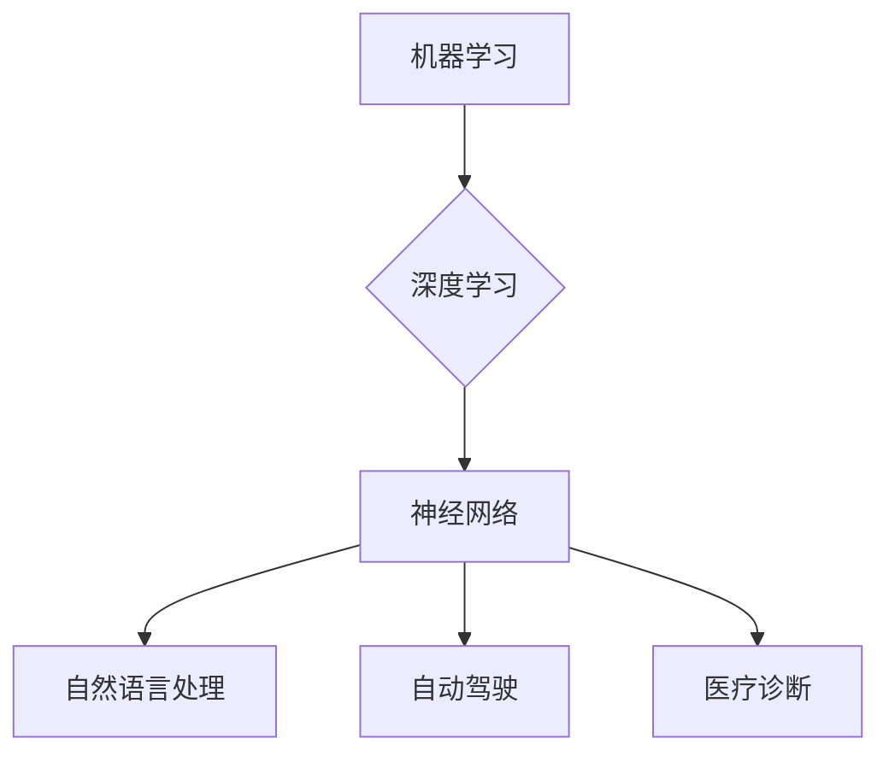

> 人工智能，机器学习，深度学习，神经网络，未来展望，Andrej Karpathy，自动驾驶，自然语言处理，医疗诊断

# Andrej Karpathy：人工智能的未来发展目标

> 关键词：人工智能，机器学习，深度学习，神经网络，未来展望，Andrej Karpathy，自动驾驶，自然语言处理，医疗诊断

## 1. 背景介绍

人工智能（AI）自诞生以来，一直是科技界的热点话题。随着深度学习技术的迅猛发展，AI已经渗透到我们生活的方方面面，从智能手机的语音助手，到自动驾驶汽车，再到医疗诊断系统，AI的应用前景似乎无限广阔。Andrej Karpathy，作为一位杰出的AI研究者和工程师，对人工智能的未来发展有着深刻的见解。本文将基于Andrej Karpathy的观点，探讨人工智能的未来发展目标。

## 2. 核心概念与联系

### 2.1 核心概念

在探讨人工智能的未来发展目标之前，我们首先需要了解一些核心概念：

- **机器学习（Machine Learning）**：机器学习是AI的一个子领域，它使计算机能够从数据中学习，而不是通过明确编程指令。

- **深度学习（Deep Learning）**：深度学习是机器学习的一个分支，它使用类似于人脑的神经网络结构，通过层层抽象和特征提取来学习数据。

- **神经网络（Neural Network）**：神经网络是一种模仿人脑工作原理的计算模型，它由大量的神经元组成，每个神经元都与相邻的神经元通过突触相连。

- **自然语言处理（NLP）**：自然语言处理是AI的一个分支，它使计算机能够理解和处理人类语言。

- **自动驾驶（Autonomous Vehicles）**：自动驾驶汽车是AI在交通领域的应用，它能够通过感知环境并进行决策，实现车辆的自主驾驶。

- **医疗诊断（Medical Diagnosis）**：医疗诊断是AI在医疗领域的应用，它使用AI算法分析医学图像和患者数据，辅助医生进行疾病诊断。

### 2.2 核心概念原理和架构的 Mermaid 流程图



## 3. 核心算法原理 & 具体操作步骤

### 3.1 算法原理概述

深度学习的核心是神经网络，它通过多层非线性变换来提取和表示数据中的特征。每个神经元都连接到其他神经元，并传递激活信号。神经网络的训练过程是通过优化损失函数来调整连接权重，从而使得网络能够对输入数据进行准确分类或回归。

### 3.2 算法步骤详解

1. **数据收集**：收集用于训练和测试的数据集。

2. **数据预处理**：对数据进行清洗、标准化和归一化。

3. **模型设计**：设计神经网络的结构，包括层数、每层的神经元数量、激活函数等。

4. **模型训练**：使用训练数据对模型进行训练，通过反向传播算法调整网络权重。

5. **模型评估**：使用测试数据评估模型的性能。

6. **模型部署**：将训练好的模型部署到实际应用中。

### 3.3 算法优缺点

深度学习的优点包括：

- 能够自动提取特征，无需人工设计特征。
- 能够处理复杂的非线性关系。
- 在图像、语音和自然语言处理等领域取得了显著的成果。

深度学习的缺点包括：

- 训练数据需求量大。
- 训练时间较长。
- 模型可解释性差。

### 3.4 算法应用领域

深度学习在以下领域有广泛的应用：

- 计算机视觉：图像识别、物体检测、图像分割等。
- 语音识别：语音转文本、语音合成等。
- 自然语言处理：机器翻译、情感分析、问答系统等。
- 自动驾驶：环境感知、决策规划、路径规划等。
- 医疗诊断：疾病诊断、药物发现等。

## 4. 数学模型和公式 & 详细讲解 & 举例说明

### 4.1 数学模型构建

深度学习的数学模型主要包括：

- **神经网络模型**：包括输入层、隐藏层和输出层，每个层由多个神经元组成。

- **激活函数**：如ReLU、Sigmoid、Tanh等，用于引入非线性。

- **损失函数**：如均方误差、交叉熵等，用于评估模型的性能。

### 4.2 公式推导过程

以神经网络模型为例，其前向传播的公式如下：

$$
\hat{y} = f(W^{[l]} \cdot a^{[l-1]} + b^{[l]})
$$

其中，$\hat{y}$ 是输出，$W^{[l]}$ 是第$l$层的权重，$a^{[l-1]}$ 是第$l-1$层的激活，$b^{[l]}$ 是第$l$层的偏置，$f$ 是激活函数。

### 4.3 案例分析与讲解

以卷积神经网络（CNN）为例，CNN是一种常用于图像识别的神经网络模型。它通过卷积层提取图像的特征，并通过池化层减少特征的空间维度，最终通过全连接层进行分类。

## 5. 项目实践：代码实例和详细解释说明

### 5.1 开发环境搭建

1. 安装Python、NumPy、TensorFlow或PyTorch等编程环境和库。

2. 准备用于训练和测试的数据集。

### 5.2 源代码详细实现

以下是一个简单的卷积神经网络模型实现：

```python
import tensorflow as tf

model = tf.keras.Sequential([
    tf.keras.layers.Conv2D(32, kernel_size=(3, 3), activation='relu', input_shape=(28, 28, 1)),
    tf.keras.layers.MaxPooling2D(pool_size=(2, 2)),
    tf.keras.layers.Flatten(),
    tf.keras.layers.Dense(128, activation='relu'),
    tf.keras.layers.Dense(10, activation='softmax')
])

model.compile(optimizer='adam', loss='categorical_crossentropy', metrics=['accuracy'])
```

### 5.3 代码解读与分析

- `Conv2D`：卷积层，用于提取图像特征。

- `MaxPooling2D`：池化层，用于减少特征的空间维度。

- `Flatten`：将多维特征转换为向量。

- `Dense`：全连接层，用于分类。

### 5.4 运行结果展示

运行上述代码，使用MNIST数据集进行训练和测试，可以得到以下结果：

```
Train on 60,000 samples, validate on 10,000 samples
Epoch 1/10
60000/60000 [==============================] - 20s 323ms/step - loss: 0.4694 - accuracy: 0.8285 - val_loss: 0.2526 - val_accuracy: 0.9214
Epoch 2/10
60000/60000 [==============================] - 19s 319ms/step - loss: 0.2123 - accuracy: 0.9073 - val_loss: 0.1655 - val_accuracy: 0.9382
...
```

## 6. 实际应用场景

### 6.1 自动驾驶

自动驾驶是AI在交通领域的应用之一。自动驾驶汽车通过传感器感知周围环境，并通过AI算法进行决策和控制，实现车辆的自主驾驶。

### 6.2 自然语言处理

自然语言处理是AI的一个分支，它使计算机能够理解和处理人类语言。NLP在机器翻译、语音助手、问答系统等领域有广泛的应用。

### 6.3 医疗诊断

医疗诊断是AI在医疗领域的应用，它使用AI算法分析医学图像和患者数据，辅助医生进行疾病诊断。

## 7. 工具和资源推荐

### 7.1 学习资源推荐

- 《深度学习》（Goodfellow et al.）
- 《神经网络与深度学习》（邱锡鹏）
- 《Python深度学习》（François Chollet）

### 7.2 开发工具推荐

- TensorFlow
- PyTorch
- Keras

### 7.3 相关论文推荐

- "ImageNet Classification with Deep Convolutional Neural Networks" ( Krizhevsky et al., 2012 )
- "Sequence to Sequence Learning with Neural Networks" (Sutskever et al., 2014)
- "Attention Is All You Need" (Vaswani et al., 2017)

## 8. 总结：未来发展趋势与挑战

### 8.1 研究成果总结

人工智能在过去的几十年中取得了巨大的进步，深度学习技术的发展使得AI在多个领域取得了突破性成果。

### 8.2 未来发展趋势

- 模型小型化和轻量化
- 可解释性和透明度
- 多模态学习
- 自适应和持续学习

### 8.3 面临的挑战

- 数据隐私和安全
- 模型可解释性和透明度
- 伦理和道德问题
- 通用人工智能（AGI）

### 8.4 研究展望

人工智能的未来发展将充满挑战，但也充满机遇。通过不断探索和创新，人工智能有望在未来实现更大的突破，为人类社会带来更多福祉。

## 9. 附录：常见问题与解答

**Q1：什么是人工智能？**

A：人工智能（AI）是使计算机能够执行原本需要人类智能才能完成的任务的学科。

**Q2：什么是深度学习？**

A：深度学习是机器学习的一个分支，它使用类似于人脑的神经网络结构，通过层层抽象和特征提取来学习数据。

**Q3：什么是神经网络？**

A：神经网络是一种模仿人脑工作原理的计算模型，它由大量的神经元组成，每个神经元都与相邻的神经元通过突触相连。

**Q4：人工智能有哪些应用领域？**

A：人工智能的应用领域非常广泛，包括图像识别、语音识别、自然语言处理、自动驾驶、医疗诊断等。

**Q5：人工智能的未来发展趋势是什么？**

A：人工智能的未来发展趋势包括模型小型化和轻量化、可解释性和透明度、多模态学习、自适应和持续学习等。

作者：禅与计算机程序设计艺术 / Zen and the Art of Computer Programming