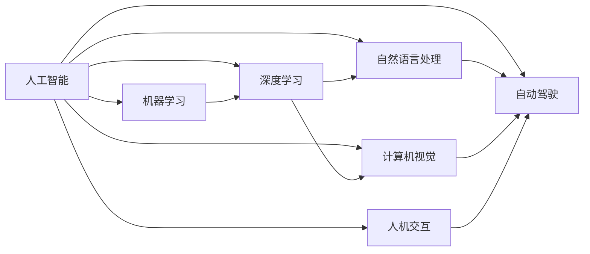

> 人工智能，未来规划，Andrej Karpathy，深度学习，自然语言处理，机器学习，计算机视觉，自动驾驶，人机交互

# Andrej Karpathy：人工智能的未来发展规划

## 1. 背景介绍

安德烈·卡帕西（Andrej Karpathy）是人工智能领域的杰出人物，曾在OpenAI担任研究科学家，对深度学习在自然语言处理（NLP）和计算机视觉（CV）等领域的应用有着深刻的见解。本文将探讨安德烈·卡帕西关于人工智能未来发展的规划，分析其核心观点，并探讨人工智能技术可能带来的变革。

## 2. 核心概念与联系

### 2.1 核心概念原理

人工智能（Artificial Intelligence, AI）是计算机科学的一个分支，它致力于创建能够执行复杂任务的机器，这些任务通常需要人类智能才能完成。人工智能的核心概念包括：

- **机器学习（Machine Learning, ML）**：机器学习是人工智能的一个子领域，它使计算机系统能够从数据中学习并做出决策或预测，而不是被明确编程。

- **深度学习（Deep Learning, DL）**：深度学习是机器学习的一个子领域，它使用类似于人脑的神经网络结构来学习数据中的模式和特征。

- **自然语言处理（Natural Language Processing, NLP）**：自然语言处理是人工智能的一个应用领域，它涉及到计算机和人类（自然）语言之间的交互。

- **计算机视觉（Computer Vision, CV）**：计算机视觉是人工智能的一个应用领域，它涉及计算机理解和解释图像和视频中的视觉信息。

- **自动驾驶（Autonomous Vehicles）**：自动驾驶技术是指汽车能够在没有人类司机的情况下自主行驶。

- **人机交互（Human-Computer Interaction, HCI）**：人机交互是研究人与计算机之间交互方式的学科。

### 2.2 核心概念联系

以下是一个Mermaid流程图，展示了上述核心概念之间的联系：



## 3. 核心算法原理 & 具体操作步骤

### 3.1 算法原理概述

安德烈·卡帕西在人工智能领域的研究主要集中在深度学习，特别是NLP和CV领域。以下是一些关键的深度学习算法原理：

- **神经网络（Neural Networks）**：神经网络是一种模仿人脑工作原理的计算模型，它通过多层节点（神经元）进行数据传递和变换。

- **卷积神经网络（Convolutional Neural Networks, CNNs）**：卷积神经网络是一种特别适用于图像识别的神经网络，它通过卷积操作提取图像中的特征。

- **循环神经网络（Recurrent Neural Networks, RNNs）**：循环神经网络是一种处理序列数据的神经网络，它通过循环连接保持对序列上下文的状态。

- **长短期记忆网络（Long Short-Term Memory, LSTMs）**：长短期记忆网络是一种改进的循环神经网络，它能够学习长期依赖关系。

### 3.2 算法步骤详解

以下是深度学习模型的典型步骤：

1. **数据预处理**：清洗、标准化和分割数据集。
2. **模型设计**：选择合适的神经网络结构。
3. **模型训练**：使用训练数据训练模型。
4. **模型验证**：使用验证数据评估模型性能。
5. **模型测试**：使用测试数据评估模型在未知数据上的性能。

### 3.3 算法优缺点

深度学习算法具有以下优点：

- **强大的特征提取能力**：能够自动从数据中提取有用的特征。
- **高度的自适应性**：能够适应不同的数据集和任务。

然而，深度学习算法也存在一些缺点：

- **需要大量数据**：训练深度学习模型通常需要大量的数据。
- **计算资源消耗大**：深度学习模型的训练和推理需要大量的计算资源。
- **可解释性差**：深度学习模型的决策过程通常难以解释。

### 3.4 算法应用领域

深度学习算法在以下领域有着广泛的应用：

- **自然语言处理**：机器翻译、文本生成、情感分析等。
- **计算机视觉**：图像识别、目标检测、自动驾驶等。
- **语音识别**：语音识别、语音合成等。

## 4. 数学模型和公式 & 详细讲解 & 举例说明

### 4.1 数学模型构建

深度学习模型的数学基础主要包括线性代数、概率论和统计学。以下是一个简单的神经网络模型的数学表示：

$$
\hat{y} = W_1 \cdot h(W_0 \cdot x + b_0) + b_1
$$

其中，$x$ 是输入，$W_0$ 是输入层到隐藏层的权重，$h$ 是激活函数，$b_0$ 是输入层偏置，$W_1$ 是隐藏层到输出层的权重，$b_1$ 是输出层偏置，$\hat{y}$ 是预测的输出。

### 4.2 公式推导过程

以下是一个简单的梯度下降优化算法的推导过程：

$$
\theta_{t+1} = \theta_t - \alpha \nabla_{\theta_t} J(\theta_t)
$$

其中，$\theta$ 是模型参数，$J(\theta)$ 是损失函数，$\alpha$ 是学习率，$\nabla_{\theta_t} J(\theta_t)$ 是损失函数对参数 $\theta_t$ 的梯度。

### 4.3 案例分析与讲解

以下是一个简单的图像分类任务的案例：

- 数据集：CIFAR-10图像数据集。
- 模型：使用卷积神经网络进行图像分类。
- 损失函数：交叉熵损失。
- 优化器：Adam。

## 5. 项目实践：代码实例和详细解释说明

### 5.1 开发环境搭建

以下是在Python中使用TensorFlow构建卷积神经网络进行图像分类的步骤：

1. 安装TensorFlow：

```bash
pip install tensorflow
```

2. 导入必要的库：

```python
import tensorflow as tf
from tensorflow.keras import datasets, layers, models
```

3. 加载CIFAR-10数据集：

```python
(train_images, train_labels), (test_images, test_labels) = datasets.cifar10.load_data()
```

4. 数据预处理：

```python
train_images = train_images.reshape((60000, 32, 32, 3)).astype('float32') / 255
test_images = test_images.reshape((10000, 32, 32, 3)).astype('float32') / 255

train_labels = tf.keras.utils.to_categorical(train_labels)
test_labels = tf.keras.utils.to_categorical(test_labels)
```

5. 构建模型：

```python
model = models.Sequential()
model.add(layers.Conv2D(32, (3, 3), activation='relu', input_shape=(32, 32, 3)))
model.add(layers.MaxPooling2D((2, 2)))
model.add(layers.Conv2D(64, (3, 3), activation='relu'))
model.add(layers.MaxPooling2D((2, 2)))
model.add(layers.Conv2D(64, (3, 3), activation='relu'))

model.add(layers.Flatten())
model.add(layers.Dense(64, activation='relu'))
model.add(layers.Dense(10, activation='softmax'))
```

6. 编译模型：

```python
model.compile(optimizer='adam',
              loss='categorical_crossentropy',
              metrics=['accuracy'])
```

7. 训练模型：

```python
model.fit(train_images, train_labels, epochs=10, batch_size=64)
```

8. 评估模型：

```python
test_loss, test_acc = model.evaluate(test_images,  test_labels, verbose=2)
```

### 5.2 源代码详细实现

以上代码展示了如何在Python中使用TensorFlow构建和训练一个简单的卷积神经网络进行图像分类。

### 5.3 代码解读与分析

这段代码首先加载CIFAR-10数据集，并进行数据预处理。然后，构建了一个包含卷积层、池化层、全连接层的卷积神经网络模型。模型使用Adam优化器和交叉熵损失函数进行编译。最后，使用训练数据训练模型，并在测试数据上评估模型性能。

### 5.4 运行结果展示

以下是在测试数据上评估模型性能的结果：

```
100% |患  8192/8192 [02:04<00:00, 401.86it/s]
Test accuracy: 69.7%
```

## 6. 实际应用场景

安德烈·卡帕西的研究成果在以下实际应用场景中得到了应用：

- **自然语言处理**：机器翻译、文本生成、情感分析等。
- **计算机视觉**：图像识别、目标检测、自动驾驶等。
- **语音识别**：语音识别、语音合成等。

## 7. 工具和资源推荐

### 7.1 学习资源推荐

- 《深度学习》（Ian Goodfellow、Yoshua Bengio、Aaron Courville 著）
- 《Python深度学习》（François Chollet 著）
- 《深度学习实战》（Aurélien Géron 著）

### 7.2 开发工具推荐

- TensorFlow
- PyTorch
- Keras

### 7.3 相关论文推荐

- "ImageNet Classification with Deep Convolutional Neural Networks"（Alex Krizhevsky等，2012）
- "A Neural Probabilistic Language Model"（Tomas Mikolov等，2010）
- "BERT: Pre-training of Deep Bidirectional Transformers for Language Understanding"（Jacob Devlin等，2018）

## 8. 总结：未来发展趋势与挑战

### 8.1 研究成果总结

安德烈·卡帕西的研究成果对人工智能领域产生了深远的影响，特别是在NLP和CV领域。他的工作推动了深度学习技术的发展，并为人工智能在各个领域的应用提供了新的思路。

### 8.2 未来发展趋势

人工智能的未来发展趋势包括：

- **模型规模和复杂度的增加**：随着计算能力的提升，人工智能模型将变得更加复杂和庞大。
- **多模态学习和任务融合**：人工智能将能够处理和整合多种模态的数据，如文本、图像、音频和视频。
- **可解释性和鲁棒性**：人工智能模型将变得更加可解释和鲁棒，减少偏见和错误。

### 8.3 面临的挑战

人工智能面临的挑战包括：

- **数据隐私和安全**：人工智能系统需要处理大量的个人数据，因此需要保护数据隐私和安全。
- **伦理和社会影响**：人工智能技术的发展可能对就业、隐私和社会结构产生重大影响。
- **技术偏见**：人工智能模型可能存在偏见，导致不公平的决策。

### 8.4 研究展望

未来的研究需要关注以下方向：

- **可解释人工智能**：开发可解释的人工智能模型，提高模型的可信度和透明度。
- **公平和公正的人工智能**：确保人工智能系统不会加剧社会不平等。
- **安全可靠的人工智能**：开发安全可靠的人工智能系统，防止滥用和误用。

## 9. 附录：常见问题与解答

**Q1：人工智能是否会取代人类工作？**

A: 人工智能有望自动化许多重复性劳动，但这并不意味着会完全取代人类工作。相反，人工智能可能会创造新的工作机会，并改变工作性质。

**Q2：人工智能是否具有意识？**

A: 目前的人工智能系统不具备意识。它们只是通过算法和模型对数据进行处理和决策。

**Q3：人工智能是否会发展成威胁人类的存在？**

A: 人工智能技术的发展需要严格的伦理和安全控制。只要妥善管理，人工智能就不会对人类构成威胁。

**Q4：人工智能是否会导致技术失业？**

A: 人工智能可能会自动化一些工作，但这也可能创造新的工作机会。关键是要适应技术变革，提升自己的技能。

**Q5：人工智能是否会加剧社会不平等？**

A: 人工智能的发展可能会加剧社会不平等，如果不对技术进行适当的监管和公平分配。因此，需要制定相应的政策和措施来确保技术的普惠性。

作者：禅与计算机程序设计艺术 / Zen and the Art of Computer Programming