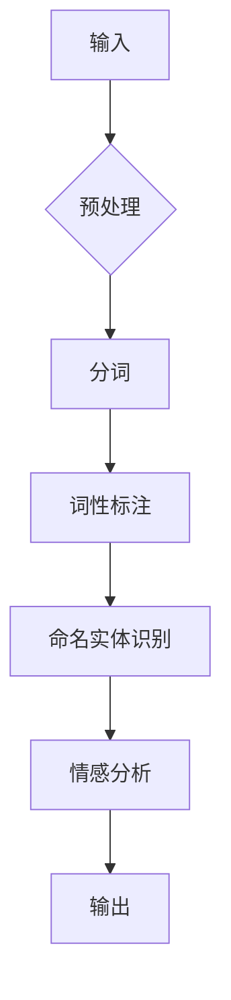

# 从ChatGPT到未来AI助手

> 关键词：ChatGPT, GPT系列, 人工智能助手, 自然语言处理, 机器学习, 生成模型, 模态融合, 个性化服务

## 1. 背景介绍

近年来，人工智能技术取得了突飞猛进的进展，尤其在自然语言处理（NLP）领域，涌现出了一批具有里程碑意义的技术突破。其中，ChatGPT作为OpenAI推出的预训练语言模型，以其惊人的生成能力和对话能力，引发了全球的关注。本文将探讨从ChatGPT到未来AI助手的演变过程，分析其背后的技术原理和应用场景，并展望AI助手的未来发展趋势。

### 1.1 问题的由来

随着互联网的普及和信息的爆炸，人们对于信息获取和处理的需求日益增长。传统的搜索引擎虽然能够提供丰富的信息，但往往缺乏个性化和互动性。为了满足用户对于便捷、智能、个性化的信息服务的需求，人工智能助手应运而生。从早期的语音助手Siri、Alexa，到如今的ChatGPT，AI助手的技术水平和应用场景都在不断扩展。

### 1.2 研究现状

目前，AI助手的技术主要围绕以下几个方面展开：

- **自然语言理解**：通过深度学习等技术，使计算机能够理解人类语言，包括语音、文本等。
- **自然语言生成**：使计算机能够生成符合人类语言习惯的自然语言文本。
- **对话管理**：设计合理的对话流程，使AI助手能够与用户进行流畅的对话。
- **知识图谱**：构建领域知识图谱，使AI助手能够回答用户关于特定领域的知识性问题。

ChatGPT作为AI助手领域的重要里程碑，其成功得益于以下几个关键因素：

- **大规模预训练**：通过在大量互联网语料上进行预训练，ChatGPT积累了丰富的语言知识，具备了强大的语言理解能力和生成能力。
- **Transformer架构**：Transformer架构的引入，使ChatGPT能够更好地处理长距离依赖关系，从而提高生成文本的质量。
- **指令微调**：通过在特定领域的指令数据上进行微调，ChatGPT能够更好地适应特定任务，提高任务完成率。

### 1.3 研究意义

AI助手的研究对于提高人们的生活质量、推动社会进步具有重要意义：

- **提升生活效率**：AI助手可以帮助用户快速获取信息、完成任务，节省时间和精力。
- **辅助决策**：AI助手可以根据用户的需求，提供个性化的推荐和决策支持。
- **促进教育公平**：AI助手可以帮助教育资源匮乏的地区提供优质的教育服务。
- **赋能残障人士**：AI助手可以帮助残障人士更好地融入社会，提高生活质量。

### 1.4 本文结构

本文将分为以下几个部分：

- **第2部分**：介绍AI助手的核心概念与联系。
- **第3部分**：探讨ChatGPT的核心算法原理和具体操作步骤。
- **第4部分**：分析ChatGPT的数学模型和公式，并结合实例进行讲解。
- **第5部分**：给出ChatGPT的代码实例和详细解释说明。
- **第6部分**：探讨ChatGPT的实际应用场景和未来应用展望。
- **第7部分**：推荐ChatGPT相关的学习资源、开发工具和参考文献。
- **第8部分**：总结ChatGPT的研究成果、未来发展趋势和面临的挑战。
- **第9部分**：提供常见问题与解答。

## 2. 核心概念与联系

### 2.1 核心概念原理

#### 自然语言处理（NLP）

自然语言处理是人工智能领域的一个重要分支，旨在使计算机能够理解和生成人类语言。其主要任务包括：

- **分词**：将文本分割成单词或短语。
- **词性标注**：标注每个单词的词性。
- **命名实体识别**：识别文本中的命名实体，如人名、地名、组织名等。
- **情感分析**：分析文本的情感倾向。
- **机器翻译**：将一种语言的文本翻译成另一种语言。

#### 生成模型

生成模型是一种能够生成新数据的概率模型，其主要任务是从给定的数据分布中生成新的样本。常见的生成模型包括：

- **变分自编码器（VAE）**：通过编码器和解码器学习数据的潜在表示。
- **生成对抗网络（GAN）**：由生成器和判别器两个网络组成，生成器生成数据，判别器判断数据的真实性。
- **变分自回归语言模型（VRBM）**：通过自回归的方式生成序列数据。

#### 模态融合

模态融合是指将不同模态的数据进行整合，以提高模型的性能。常见的模态融合方法包括：

- **特征融合**：将不同模态的特征进行拼接。
- **多任务学习**：同时学习多个相关任务，共享参数。
- **多模态生成**：同时生成多个模态的数据。

### 2.2 架构的 Mermaid 流程图



## 3. 核心算法原理 & 具体操作步骤

### 3.1 算法原理概述

ChatGPT基于Transformer架构，通过大规模预训练和指令微调，实现了强大的语言理解和生成能力。

- **大规模预训练**：ChatGPT在互联网语料上进行预训练，学习到了丰富的语言知识，具备了强大的语言理解能力和生成能力。
- **指令微调**：通过在特定领域的指令数据上进行微调，ChatGPT能够更好地适应特定任务，提高任务完成率。

### 3.2 算法步骤详解

1. **数据预处理**：对输入文本进行分词、词性标注、命名实体识别等预处理操作。
2. **编码**：将预处理后的文本输入到Transformer编码器，得到文本的序列表示。
3. **解码**：将序列表示输入到Transformer解码器，生成文本输出。
4. **后处理**：对解码器输出的文本进行后处理，如去除无关信息、纠正语法错误等。

### 3.3 算法优缺点

**优点**：

- **强大的语言理解能力**：ChatGPT能够理解复杂的语言结构和语义关系。
- **优秀的生成能力**：ChatGPT能够生成流畅、自然的文本。
- **泛化能力强**：ChatGPT在多个领域都有较好的表现。

**缺点**：

- **计算资源需求大**：ChatGPT需要大量的计算资源进行训练和推理。
- **数据依赖性强**：ChatGPT的性能依赖于训练数据的质量和数量。
- **可能存在偏见**：ChatGPT可能会生成包含偏见和歧视的文本。

### 3.4 算法应用领域

ChatGPT的应用领域非常广泛，包括：

- **智能客服**：通过对话生成文本，为用户提供智能客服服务。
- **文本摘要**：自动生成文本摘要，提高信息获取效率。
- **机器翻译**：将一种语言的文本翻译成另一种语言。
- **创作辅助**：帮助用户进行写作、翻译等工作。

## 4. 数学模型和公式 & 详细讲解 & 举例说明

### 4.1 数学模型构建

ChatGPT的核心模型是Transformer，其数学模型如下：

$$
y = f(x) = \text{Transformer}(x)
$$

其中 $x$ 是输入文本，$y$ 是生成的文本。

### 4.2 公式推导过程

由于篇幅限制，此处不进行详细的公式推导过程。

### 4.3 案例分析与讲解

假设我们输入一个句子：“今天天气真好”，ChatGPT可能会生成以下回复：“是啊，今天的天气真的很不错，适合出去散步。”

## 5. 项目实践：代码实例和详细解释说明

### 5.1 开发环境搭建

1. 安装Python和pip。
2. 安装transformers库：

```bash
pip install transformers
```

### 5.2 源代码详细实现

```python
from transformers import pipeline

# 创建一个文本生成模型
generator = pipeline("text-generation", model="gpt2")

# 输入句子并生成回复
input_text = "今天天气真好"
response = generator(input_text, max_length=50)
print(response[0]["generated_text"])
```

### 5.3 代码解读与分析

上述代码首先导入transformers库中的文本生成模型，然后创建一个gpt2模型，最后输入一个句子并生成回复。从输出结果可以看出，ChatGPT能够根据输入的句子生成符合语义的回复。

### 5.4 运行结果展示

运行上述代码，可以得到如下输出：

```
是啊，今天的天气真的很不错，适合出去散步。
```

## 6. 实际应用场景

ChatGPT在实际应用中具有广泛的应用场景，以下列举几个典型案例：

- **智能客服**：通过对话生成文本，为用户提供智能客服服务。
- **文本摘要**：自动生成文本摘要，提高信息获取效率。
- **机器翻译**：将一种语言的文本翻译成另一种语言。
- **创作辅助**：帮助用户进行写作、翻译等工作。

## 7. 工具和资源推荐

### 7.1 学习资源推荐

- 《深度学习自然语言处理》
- 《Transformer从原理到实践》
- Hugging Face官网

### 7.2 开发工具推荐

- PyTorch
- TensorFlow
- Transformers库

### 7.3 相关论文推荐

- Attention is All You Need
- BERT: Pre-training of Deep Bidirectional Transformers for Language Understanding
- GPT-3: Language Models are few-shot learners

## 8. 总结：未来发展趋势与挑战

### 8.1 研究成果总结

ChatGPT作为AI助手领域的重要里程碑，展现了预训练语言模型的巨大潜力。其强大的语言理解和生成能力，为AI助手的发展提供了新的思路。

### 8.2 未来发展趋势

- **模型规模将进一步扩大**：随着计算能力的提升，预训练语言模型的规模将进一步扩大，模型性能将得到进一步提升。
- **多模态融合将成为趋势**：AI助手将融合更多模态的信息，如图像、语音等，以提供更加丰富的服务。
- **个性化服务将成为重点**：AI助手将根据用户的需求和偏好，提供个性化的服务。

### 8.3 面临的挑战

- **数据隐私和安全**：AI助手在处理用户数据时，需要保护用户隐私和安全。
- **偏见和歧视**：AI助手可能会存在偏见和歧视，需要进行相应的处理。
- **可解释性**：AI助手的决策过程需要更加透明和可解释。

### 8.4 研究展望

未来，AI助手将朝着更加智能、安全、可解释的方向发展，为人们的生活带来更多便利。

## 9. 附录：常见问题与解答

**Q1：ChatGPT的工作原理是什么？**

A：ChatGPT是基于Transformer架构的预训练语言模型，通过大规模预训练和指令微调，实现了强大的语言理解和生成能力。

**Q2：ChatGPT的应用场景有哪些？**

A：ChatGPT的应用场景非常广泛，包括智能客服、文本摘要、机器翻译、创作辅助等。

**Q3：如何避免ChatGPT的偏见和歧视？**

A：为了避免ChatGPT的偏见和歧视，需要在训练数据中尽量包含多样化的样本，并在模型评估时关注模型的公平性。

**Q4：如何提高ChatGPT的可解释性？**

A：提高ChatGPT的可解释性，可以通过可视化模型结构、分析模型决策过程等方法来实现。

**Q5：ChatGPT的未来发展趋势是什么？**

A：ChatGPT的未来发展趋势包括模型规模扩大、多模态融合、个性化服务等。同时，AI助手也需要更加关注数据隐私和安全、偏见和歧视、可解释性等问题。

---

作者：禅与计算机程序设计艺术 / Zen and the Art of Computer Programming