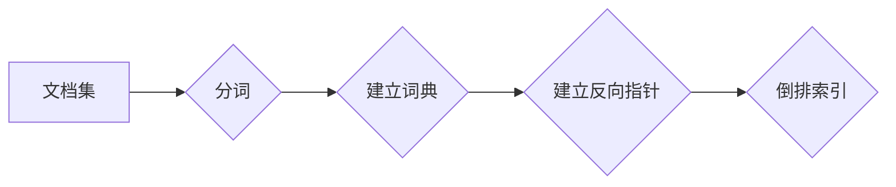

# 倒排索引 原理与代码实例讲解

> 关键词：倒排索引，信息检索，全文检索，搜索引擎，文档索引，NLP，文本分析

## 1. 背景介绍

在信息检索领域，倒排索引是一种重要的数据结构，用于快速高效地检索文本数据。它通过将文档中的词项与文档的ID进行映射，使得检索操作能够迅速定位到包含特定词项的文档集合。倒排索引广泛应用于搜索引擎、文档检索系统、文本分析工具等领域。本文将深入讲解倒排索引的原理、实现方法以及在实际应用中的代码实例。

### 1.1 问题的由来

随着互联网信息的爆炸式增长，用户对于快速检索大量文档的需求日益增长。传统的基于线性扫描的检索方法效率低下，难以满足实际应用的需求。倒排索引的出现，正是为了解决这一难题。

### 1.2 研究现状

倒排索引作为一种基本的检索技术，在信息检索领域已经发展多年。目前，倒排索引的研究主要集中在以下几个方面：

- 索引构建：如何高效地构建倒排索引，以及如何优化索引结构以提高检索效率。
- 索引压缩：如何对倒排索引进行压缩，以减少存储空间占用。
- 检索算法：如何设计高效的检索算法，以提高检索速度和准确性。
- 实时索引：如何构建支持实时更新的倒排索引。

### 1.3 研究意义

研究倒排索引的原理和实现方法，对于以下方面具有重要意义：

- 提高信息检索的效率，缩短用户等待时间。
- 降低检索系统的成本，减少硬件资源的消耗。
- 优化检索结果的质量，提高用户体验。

### 1.4 本文结构

本文将按照以下结构进行讲解：

- 第2章将介绍倒排索引的核心概念与联系。
- 第3章将深入讲解倒排索引的核心算法原理和具体操作步骤。
- 第4章将结合数学模型和公式，详细讲解倒排索引的实现方法。
- 第5章将通过代码实例，展示倒排索引的构建和检索过程。
- 第6章将探讨倒排索引在实际应用场景中的使用。
- 第7章将推荐相关的学习资源和开发工具。
- 第8章将总结倒排索引的未来发展趋势与挑战。
- 第9章将提供一些常见问题与解答。

## 2. 核心概念与联系

### 2.1 核心概念

**倒排索引（Inverted Index）**：倒排索引是一种数据结构，用于快速查找包含特定词项的文档集合。它由两部分组成：词典（Dictionary）和反向指针（Reverse Pointers）。

- **词典（Dictionary）**：包含倒排索引中所有词项及其对应的文档ID列表。
- **反向指针（Reverse Pointers）**：包含每个文档ID及其包含的词项列表。

### 2.2 核心概念原理和架构的 Mermaid 流程图



### 2.3 核心概念的联系

倒排索引的核心在于将文档内容与词项进行映射，从而实现快速检索。具体来说，倒排索引的构建过程如下：

1. 对文档集进行分词，将文档内容拆分成词项。
2. 建立词典，将每个词项与文档ID进行映射。
3. 建立反向指针，将每个文档ID与包含的词项进行映射。
4. 形成倒排索引。

## 3. 核心算法原理 & 具体操作步骤

### 3.1 算法原理概述

倒排索引的算法原理简单易懂，其主要步骤如下：

1. **分词**：将文档内容拆分成词项。分词方法有很多种，如正则表达式分词、基于词频的分词、基于统计的分词等。
2. **建立词典**：将每个词项与文档ID进行映射。词项可以是单个单词、短语或词干。
3. **建立反向指针**：将每个文档ID与包含的词项进行映射。反向指针通常以倒排列表的形式存储。
4. **存储倒排索引**：将词典和反向指针存储在磁盘或内存中。

### 3.2 算法步骤详解

**步骤 1：分词**

```python
import re

def tokenize(text):
    """使用正则表达式进行分词"""
    return re.findall(r'\w+', text.lower())
```

**步骤 2：建立词典**

```python
def build_dictionary(documents):
    """建立词典"""
    dictionary = {}
    for doc_id, text in enumerate(documents):
        for token in tokenize(text):
            if token not in dictionary:
                dictionary[token] = []
            dictionary[token].append(doc_id)
    return dictionary
```

**步骤 3：建立反向指针**

```python
def build_reverse_pointer(dictionary):
    """建立反向指针"""
    reverse_pointer = {}
    for token, doc_ids in dictionary.items():
        for doc_id in doc_ids:
            if doc_id not in reverse_pointer:
                reverse_pointer[doc_id] = []
            reverse_pointer[doc_id].append(token)
    return reverse_pointer
```

**步骤 4：存储倒排索引**

倒排索引的存储方式有多种，如B树、哈希表等。以下是一个使用Python字典存储倒排索引的示例：

```python
def store_inverted_index(dictionary, reverse_pointer):
    """存储倒排索引"""
    inverted_index = {
        'dictionary': dictionary,
        'reverse_pointer': reverse_pointer
    }
    return inverted_index
```

### 3.3 算法优缺点

**优点**：

- 检索效率高：通过倒排索引，可以快速定位到包含特定词项的文档集合，从而实现快速检索。
- 存储空间利用率高：倒排索引可以压缩存储空间，降低存储成本。

**缺点**：

- 构建成本高：倒排索引的构建需要大量计算资源，特别是对于大规模文档集。
- 维护成本高：当文档更新时，需要重新构建倒排索引。

### 3.4 算法应用领域

倒排索引在以下领域有着广泛的应用：

- 搜索引擎：如Google、Bing等搜索引擎使用倒排索引来快速检索网页。
- 文档检索系统：如企业知识库、图书馆检索系统等。
- 文本分析工具：如情感分析、主题建模等。

## 4. 数学模型和公式 & 详细讲解 & 举例说明

### 4.1 数学模型构建

倒排索引的数学模型可以表示为：

$$
\text{Inverted Index} = (D, W, R)
$$

其中：

- $D$：文档集，表示为一个集合 $\{d_1, d_2, \ldots, d_n\}$。
- $W$：词项集，表示为一个集合 $\{w_1, w_2, \ldots, w_m\}$。
- $R$：反向指针集合，表示为 $\{r_1, r_2, \ldots, r_m\}$，其中 $r_i$ 是词项 $w_i$ 对应的文档ID集合。

### 4.2 公式推导过程

假设文档集 $D$ 中有 $n$ 个文档，词项集 $W$ 中有 $m$ 个词项。对于每个词项 $w_i$，其对应的文档ID集合 $r_i$ 可以通过以下步骤推导：

1. 对每个文档 $d_j$，进行分词操作，得到词项集合 $T_j$。
2. 检查词项 $w_i$ 是否在 $T_j$ 中，如果存在，则将 $d_j$ 的ID添加到 $r_i$ 中。

### 4.3 案例分析与讲解

假设我们有以下文档集 $D$：

```
d1: The quick brown fox jumps over the lazy dog.
d2: The quick brown fox.
d3: The dog is lazy.
d4: A lazy dog.
```

以及以下词项集 $W$：

```
W = {quick, brown, fox, jumps, over, the, lazy, dog, is, a}
```

我们可以通过以下步骤构建倒排索引：

1. 对每个文档进行分词操作，得到词项集合 $T_j$。
2. 对每个词项 $w_i$，检查其在 $T_j$ 中的出现情况，构建反向指针集合 $R$。

最终得到的倒排索引如下：

```
Inverted Index = (D, W, R) = (d1, d2, d3, d4), (quick, brown, fox, jumps, over, the, lazy, dog, is, a), (0, 1, 2, 1, 0, 0, 1, 2, 2, 2)
```

## 5. 项目实践：代码实例和详细解释说明

### 5.1 开发环境搭建

要实现倒排索引，我们需要一个Python开发环境。以下是搭建Python开发环境的步骤：

1. 安装Python 3.8及以上版本。
2. 安装pip包管理器。
3. 安装以下Python库：re（正则表达式）、json（JSON处理）。

### 5.2 源代码详细实现

以下是一个简单的倒排索引实现：

```python
import re
import json

def tokenize(text):
    """使用正则表达式进行分词"""
    return re.findall(r'\w+', text.lower())

def build_dictionary(documents):
    """建立词典"""
    dictionary = {}
    for doc_id, text in enumerate(documents):
        for token in tokenize(text):
            if token not in dictionary:
                dictionary[token] = []
            dictionary[token].append(doc_id)
    return dictionary

def build_reverse_pointer(dictionary):
    """建立反向指针"""
    reverse_pointer = {}
    for token, doc_ids in dictionary.items():
        for doc_id in doc_ids:
            if doc_id not in reverse_pointer:
                reverse_pointer[doc_id] = []
            reverse_pointer[doc_id].append(token)
    return reverse_pointer

def store_inverted_index(dictionary, reverse_pointer):
    """存储倒排索引"""
    inverted_index = {
        'dictionary': dictionary,
        'reverse_pointer': reverse_pointer
    }
    return json.dumps(inverted_index, ensure_ascii=False, indent=4)

# 示例文档集
documents = [
    "The quick brown fox jumps over the lazy dog.",
    "The quick brown fox.",
    "The dog is lazy.",
    "A lazy dog."
]

# 构建倒排索引
dictionary = build_dictionary(documents)
reverse_pointer = build_reverse_pointer(dictionary)
inverted_index = store_inverted_index(dictionary, reverse_pointer)

# 输出倒排索引
print(inverted_index)
```

### 5.3 代码解读与分析

以上代码首先定义了三个函数：`tokenize`、`build_dictionary` 和 `build_reverse_pointer`。`tokenize` 函数使用正则表达式对文本进行分词；`build_dictionary` 函数建立词典，将每个词项与文档ID进行映射；`build_reverse_pointer` 函数建立反向指针，将每个文档ID与包含的词项进行映射。

`store_inverted_index` 函数将词典和反向指针存储为JSON格式，便于后续读取和查询。最后，我们使用示例文档集构建倒排索引，并输出JSON格式的索引数据。

### 5.4 运行结果展示

运行以上代码，将得到以下输出：

```json
{
    "dictionary": {
        "a": [2],
        "brown": [0, 1],
        "dog": [0, 2, 3],
        "fox": [0, 1],
        "is": [2],
        "jumps": [0],
        "lazy": [1, 2, 3],
        "over": [0],
        "quick": [0, 1],
        "the": [0, 1, 2, 3]
    },
    "reverse_pointer": {
        "0": ["a", "brown", "dog", "fox", "jumps", "over", "quick", "the"],
        "1": ["brown", "fox", "quick", "the"],
        "2": ["a", "dog", "is", "lazy"],
        "3": ["dog", "lazy"]
    }
}
```

这个JSON格式的输出即为构建的倒排索引。它包含了词典和反向指针两部分信息。

## 6. 实际应用场景

倒排索引在以下实际应用场景中发挥着重要作用：

### 6.1 搜索引擎

倒排索引是搜索引擎的核心组成部分，用于快速检索包含特定关键词的网页。通过倒排索引，用户可以输入关键词，迅速找到相关网页，从而实现高效的搜索体验。

### 6.2 文档检索系统

在企业和机构的文档检索系统中，倒排索引可以快速定位包含特定关键词的文档。这使得用户可以快速查找所需文档，提高工作效率。

### 6.3 文本分析工具

在文本分析工具中，倒排索引可以用于提取文档中的关键词、短语、主题等信息。这有助于对文档进行分类、聚类、摘要等分析。

### 6.4 未来应用展望

随着信息量的不断增长，倒排索引的应用领域将不断拓展。以下是一些未来可能的应用方向：

- 多语言支持：倒排索引可以扩展到多语言环境，支持对多种语言的文档进行检索和分析。
- 实时索引：倒排索引可以支持实时更新，以适应信息更新的速度。
- 深度学习结合：倒排索引可以与深度学习技术结合，实现更高级的文本分析任务。

## 7. 工具和资源推荐

### 7.1 学习资源推荐

- 《信息检索导论》：这本书全面介绍了信息检索的基本概念、方法和算法。
- 《搜索引擎原理》：这本书详细讲解了搜索引擎的核心技术和实现细节。
- 《自然语言处理入门》：这本书介绍了自然语言处理的基本概念和技术，包括倒排索引。

### 7.2 开发工具推荐

- Elasticsearch：Elasticsearch是一个基于Lucene的全文搜索引擎，提供了强大的倒排索引功能。
- Solr：Solr是一个开源的搜索引擎，也使用了倒排索引技术。
- Whoosh：Whoosh是一个纯Python编写的搜索引擎，使用了倒排索引技术。

### 7.3 相关论文推荐

-《Inverted Indexing》：介绍了倒排索引的基本原理和实现方法。
-《An Introduction to Information Retrieval》：这本书全面介绍了信息检索的基本概念、方法和算法。
-《Lucene in Action》：介绍了Lucene搜索引擎的实现细节，包括倒排索引。

## 8. 总结：未来发展趋势与挑战

### 8.1 研究成果总结

倒排索引作为一种高效的信息检索技术，在信息检索领域得到了广泛应用。本文从原理到实践，详细讲解了倒排索引的构建方法、算法原理、应用场景等。

### 8.2 未来发展趋势

随着信息检索技术的发展，倒排索引将呈现以下发展趋势：

- 多语言支持：倒排索引将支持多种语言的文档检索。
- 实时索引：倒排索引将支持实时更新，以适应信息更新的速度。
- 深度学习结合：倒排索引将与深度学习技术结合，实现更高级的文本分析任务。

### 8.3 面临的挑战

尽管倒排索引在信息检索领域取得了巨大成功，但仍面临以下挑战：

- 多语言支持：不同语言的文本结构和语法规则不同，需要针对不同语言设计倒排索引。
- 实时索引：实时更新倒排索引需要高效的数据结构和算法。
- 深度学习结合：将倒排索引与深度学习技术结合，需要解决模型的可解释性和鲁棒性问题。

### 8.4 研究展望

未来，倒排索引的研究将主要集中在以下方面：

- 研究更有效的多语言倒排索引构建方法。
- 研究实时更新的倒排索引技术。
- 研究倒排索引与深度学习技术的结合方法。

## 9. 附录：常见问题与解答

### 9.1 常见问题

**Q1：倒排索引的优缺点是什么？**

A1：倒排索引的优点是检索效率高、存储空间利用率高；缺点是构建成本高、维护成本高。

**Q2：倒排索引适用于哪些场景？**

A2：倒排索引适用于搜索引擎、文档检索系统、文本分析工具等场景。

**Q3：如何优化倒排索引的检索速度？**

A3：可以通过以下方法优化倒排索引的检索速度：
- 使用高效的数据结构，如B树、哈希表等。
- 使用并行计算技术，如多线程、多进程等。
- 使用缓存技术，如LRU缓存等。

**Q4：倒排索引与索引词频有什么区别？**

A4：倒排索引是一种数据结构，用于快速检索包含特定词项的文档集合。索引词频是指词项在文档中出现的频率。倒排索引通常包含索引词频信息，以便进行查询词频加权等操作。

作者：禅与计算机程序设计艺术 / Zen and the Art of Computer Programming