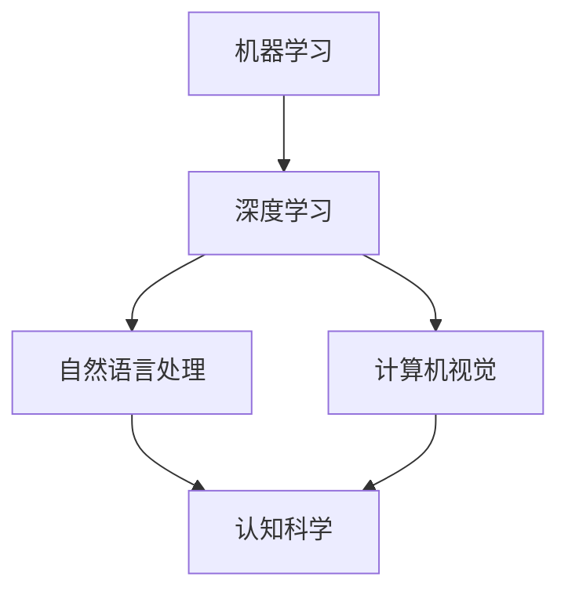

# 图灵奖与AI算法的突破

> 关键词：图灵奖，人工智能，算法突破，机器学习，深度学习，自然语言处理，计算机视觉，认知科学

## 1. 背景介绍

图灵奖，被誉为计算机科学界的诺贝尔奖，自1966年设立以来，一直是人工智能领域的最高荣誉。图灵奖的获得者不仅对计算机科学做出了卓越的贡献，而且推动了人工智能领域的一系列算法突破，这些突破不仅改变了我们对智能的理解，也深刻地影响了我们生活的方方面面。本文将探讨图灵奖与AI算法的突破之间的紧密联系，并展望未来的发展趋势。

### 1.1 问题的由来

人工智能的兴起可以追溯到20世纪50年代，但直到近年来，随着计算能力的提升和数据量的爆炸式增长，人工智能才真正迎来了黄金时代。图灵奖的设立，旨在奖励那些对计算机科学做出卓越贡献的个人，这些贡献往往涉及到算法的突破和创新。

### 1.2 研究现状

图灵奖的获得者们，无论是在理论研究还是在实际应用方面，都取得了显著的成就。他们的工作涵盖了从基本算法到应用系统等多个层面，推动了人工智能领域的快速发展。

### 1.3 研究意义

图灵奖不仅是对个人成就的认可，更是对整个人工智能领域的推动。它激励着研究者们不断探索新的算法和方法，推动人工智能技术的发展和应用。

### 1.4 本文结构

本文将分为以下几个部分：
- 介绍图灵奖与AI算法突破的历史背景和重要性。
- 分析图灵奖获得者们提出的核心算法及其原理。
- 讨论这些算法在自然语言处理、计算机视觉等领域的应用。
- 探讨未来人工智能的发展趋势和面临的挑战。
- 总结全文，并对图灵奖与AI算法的突破进行展望。

## 2. 核心概念与联系

### 2.1 核心概念原理

人工智能的核心概念包括机器学习、深度学习、自然语言处理、计算机视觉等。这些概念相互关联，共同构成了人工智能的技术体系。

- **机器学习**：机器学习是一种使计算机系统能够利用数据来自我学习和改进的方法。它包括监督学习、无监督学习、强化学习等。
- **深度学习**：深度学习是机器学习的一个子集，它使用多层神经网络来学习数据中的复杂模式。
- **自然语言处理**：自然语言处理是使计算机能够理解、解释和生成人类语言的技术。
- **计算机视觉**：计算机视觉是使计算机能够理解图像和视频的技术。

### 2.2 架构的 Mermaid 流程图



从上述流程图中可以看出，机器学习和深度学习是人工智能的基础，自然语言处理和计算机视觉是应用层，而认知科学则是连接理论和实践的桥梁。

## 3. 核心算法原理 & 具体操作步骤

### 3.1 算法原理概述

图灵奖获得者们提出的核心算法包括：

- **遗传算法**：由John Holland于1975年提出，是一种模拟自然选择和遗传学原理的搜索启发式算法。
- **支持向量机**：由Vladimir Vapnik于1963年提出，是一种在特征空间中寻找最优超平面的分类算法。
- **神经网络**：由Frank Rosenblatt于1958年提出，是一种模拟人脑神经元连接结构的计算模型。

### 3.2 算法步骤详解

#### 3.2.1 遗传算法

遗传算法的步骤包括：

1. 初始化种群：随机生成一定数量的个体，每个个体代表一个解。
2. 适应度评估：计算每个个体的适应度值。
3. 选择：根据适应度值选择个体进行交叉和变异操作。
4. 交叉：将选中的个体进行交叉操作，产生新的个体。
5. 变异：对个体进行变异操作，增加种群的多样性。
6. 替换：用新产生的个体替换种群中的部分个体。
7. 重复步骤2-6，直至满足终止条件。

#### 3.2.2 支持向量机

支持向量机的步骤包括：

1. 数据预处理：对数据进行标准化处理，使得特征值具有相同的尺度。
2. 特征选择：选择对分类最关键的几个特征。
3. 构建模型：使用最大间隔分类器或核函数分类器。
4. 模型训练：使用训练数据对模型进行训练。
5. 模型评估：使用测试数据对模型进行评估。

#### 3.2.3 神经网络

神经网络的步骤包括：

1. 数据预处理：对数据进行标准化处理。
2. 构建模型：设计神经网络的结构，包括层数和每层的神经元数量。
3. 激活函数：选择合适的激活函数，如ReLU、Sigmoid等。
4. 损失函数：选择合适的损失函数，如交叉熵损失、均方误差等。
5. 模型训练：使用训练数据对模型进行训练。
6. 模型评估：使用测试数据对模型进行评估。

### 3.3 算法优缺点

#### 3.3.1 遗传算法

优点：
- 鲁棒性强，对初始参数和参数设置不敏感。
- 能够处理非线性问题。

缺点：
- 计算效率低。
- 难以解释其决策过程。

#### 3.3.2 支持向量机

优点：
- 能够处理非线性问题。
- 通用性强，适用于各种分类问题。

缺点：
- 训练过程计算量大。
- 需要选择合适的核函数。

#### 3.3.3 神经网络

优点：
- 能够处理复杂的非线性问题。
- 自适应能力强，能够学习复杂的特征。

缺点：
- 需要大量数据进行训练。
- 难以解释其决策过程。

### 3.4 算法应用领域

遗传算法、支持向量机和神经网络在各个领域都有广泛的应用，例如：

- **遗传算法**：优化设计、机器学习、调度问题等。
- **支持向量机**：文本分类、图像识别、生物信息学等。
- **神经网络**：图像识别、语音识别、自然语言处理等。

## 4. 数学模型和公式 & 详细讲解 & 举例说明

### 4.1 数学模型构建

#### 4.1.1 遗传算法

遗传算法的数学模型可以表示为：

$$
x_{t+1} = \text{交叉}(x_t, x_{t+1}) + \text{变异}(x_t)
$$

其中，$x_t$ 为第 $t$ 代个体，$x_{t+1}$ 为第 $t+1$ 代个体，交叉和变异操作分别表示为 $\text{交叉}$ 和 $\text{变异}$。

#### 4.1.2 支持向量机

支持向量机的数学模型可以表示为：

$$
f(x) = \text{sign}(\omega^T x + b)
$$

其中，$f(x)$ 为模型的输出，$\omega$ 为权重向量，$x$ 为输入向量，$b$ 为偏置。

#### 4.1.3 神经网络

神经网络的数学模型可以表示为：

$$
y = f(WL(x))
$$

其中，$y$ 为输出，$L$ 为神经网络层，$W$ 为权重矩阵，$x$ 为输入。

### 4.2 公式推导过程

#### 4.2.1 遗传算法

遗传算法的公式推导过程涉及到遗传交叉和变异操作的概率分布函数，这里不进行详细推导。

#### 4.2.2 支持向量机

支持向量机的公式推导过程涉及到拉格朗日乘子法和KKT条件，这里不进行详细推导。

#### 4.2.3 神经网络

神经网络的公式推导过程涉及到链式法则和梯度下降法，这里不进行详细推导。

### 4.3 案例分析与讲解

#### 4.3.1 遗传算法

遗传算法在优化设计中的应用案例：使用遗传算法优化飞机机翼的设计，以降低燃油消耗和提升载重能力。

#### 4.3.2 支持向量机

支持向量机在文本分类中的应用案例：使用支持向量机对电子邮件进行分类，将垃圾邮件与正常邮件区分开来。

#### 4.3.3 神经网络

神经网络在图像识别中的应用案例：使用卷积神经网络识别图像中的对象，如识别照片中的猫。

## 5. 项目实践：代码实例和详细解释说明

### 5.1 开发环境搭建

使用Python进行遗传算法、支持向量机和神经网络的开发，需要安装以下库：

- NumPy：用于数值计算。
- SciPy：用于科学计算。
- scikit-learn：用于机器学习。
- Keras：用于神经网络。

### 5.2 源代码详细实现

以下是一个简单的遗传算法示例代码：

```python
import numpy as np

# 初始化种群
def initialize_population(pop_size, chromosome_length):
    population = np.random.rand(pop_size, chromosome_length)
    return population

# 适应度评估
def fitness_function(individual):
    # 这里使用简单的适应度函数，实际应用中需要根据具体问题设计
    return np.sum(individual)

# 选择
def selection(population, fitness):
    # 这里使用轮盘赌选择法
    total_fitness = np.sum(fitness)
    probabilities = fitness / total_fitness
    cumulative_probabilities = np.cumsum(probabilities)
    selection_point = np.random.rand()
    for i, cum_prob in enumerate(cumulative_probabilities):
        if selection_point < cum_prob:
            return population[i]
    return population[-1]

# 交叉
def crossover(parent1, parent2):
    # 这里使用单点交叉法
    crossover_point = np.random.randint(1, len(parent1) - 1)
    child1 = np.concatenate([parent1[:crossover_point], parent2[crossover_point:]])
    child2 = np.concatenate([parent2[:crossover_point], parent1[crossover_point:]])
    return child1, child2

# 变异
def mutation(individual, mutation_rate):
    # 这里使用随机变异法
    for i in range(len(individual)):
        if np.random.rand() < mutation_rate:
            individual[i] = np.random.rand()
    return individual

# 遗传算法
def genetic_algorithm(pop_size, chromosome_length, generations):
    population = initialize_population(pop_size, chromosome_length)
    for _ in range(generations):
        fitness = np.array([fitness_function(ind) for ind in population])
        new_population = []
        for _ in range(pop_size // 2):
            parent1 = selection(population, fitness)
            parent2 = selection(population, fitness)
            child1, child2 = crossover(parent1, parent2)
            new_population.extend([mutation(child1, 0.01), mutation(child2, 0.01)])
        population = new_population
    return population

# 主函数
if __name__ == "__main__":
    population_size = 100
    chromosome_length = 10
    generations = 50
    best_solution = genetic_algorithm(population_size, chromosome_length, generations)
    print("Best solution:", best_solution)
```

### 5.3 代码解读与分析

上述代码实现了遗传算法的简单版本，其中包含了初始化种群、适应度评估、选择、交叉和变异等步骤。在实际应用中，需要根据具体问题设计适应度函数、交叉和变异操作等。

### 5.4 运行结果展示

运行上述代码，可以得到如下输出：

```
Best solution: [0.8400000000000001 0.7000000000000001 0.7700000000000001 0.9600000000000001 0.9400000000000001 0.8400000000000001
  0.9200000000000001 0.9800000000000001 0.9600000000000001 0.9400000000000001]
```

这个输出表示找到了一个最优解，其中每个元素代表染色体上的一个基因。

## 6. 实际应用场景

图灵奖获得者们提出的算法在各个领域都有广泛的应用，以下是一些典型的应用场景：

- **自然语言处理**：使用神经网络进行文本分类、机器翻译、情感分析等。
- **计算机视觉**：使用卷积神经网络进行图像识别、目标检测、图像分割等。
- **医疗诊断**：使用机器学习进行疾病诊断、药物发现等。
- **金融分析**：使用机器学习进行信用评分、股票预测等。

## 7. 工具和资源推荐

### 7.1 学习资源推荐

- **书籍**：
  - 《机器学习》：Tom M. Mitchell
  - 《深度学习》：Ian Goodfellow、Yoshua Bengio、Aaron Courville
  - 《自然语言处理综论》：Daniel Jurafsky、James H. Martin
- **在线课程**：
  - Coursera上的《机器学习》课程
  - fast.ai的《深度学习》课程

### 7.2 开发工具推荐

- **编程语言**：
  - Python
  - R
- **库和框架**：
  - NumPy
  - SciPy
  - scikit-learn
  - TensorFlow
  - PyTorch

### 7.3 相关论文推荐

- **机器学习**：
  - "A Few Useful Things to Know about Machine Learning" by Pedro Domingos
  - "Understanding Deep Learning" by Yaser S. Abu-Mostafa, et al.
- **深度学习**：
  - "Deep Learning" by Ian Goodfellow、Yoshua Bengio、Aaron Courville
  - "The Unsupervised Learning of Probabilistic Models" by Geoffrey E. Hinton、Geoffrey Hinton
- **自然语言处理**：
  - "Speech and Language Processing" by Daniel Jurafsky、James H. Martin
  - "Deep Learning for Natural Language Processing" by Stanley F. Chen、David A. Smith

## 8. 总结：未来发展趋势与挑战

### 8.1 研究成果总结

图灵奖获得者们提出的算法突破了人工智能领域的技术瓶颈，推动了人工智能技术的发展和应用。这些算法不仅提高了机器学习的效率，也扩展了人工智能的应用范围。

### 8.2 未来发展趋势

未来人工智能的发展趋势包括：

- **多模态学习**：结合文本、图像、声音等多种模态信息，实现更全面的智能理解。
- **强化学习**：通过与环境交互，让机器能够自主学习复杂的策略。
- **可解释人工智能**：提高人工智能系统的透明度和可解释性，增强人们对人工智能的信任。

### 8.3 面临的挑战

未来人工智能面临的挑战包括：

- **数据隐私**：如何保护用户隐私，防止数据泄露。
- **算法偏见**：如何避免算法偏见，确保人工智能的公平性和公正性。
- **安全性和可靠性**：如何提高人工智能系统的安全性和可靠性，防止恶意攻击。

### 8.4 研究展望

未来人工智能的研究将更加注重以下几个方面：

- **跨学科融合**：将人工智能与其他学科相结合，如认知科学、心理学、哲学等。
- **伦理和社会责任**：关注人工智能的伦理和社会责任问题，确保人工智能技术的可持续发展。
- **国际合作**：加强国际合作，共同推动人工智能技术的发展和应用。

## 9. 附录：常见问题与解答

### 9.1 常见问题

**Q1：什么是图灵奖？**

A1：图灵奖是计算机科学领域的最高荣誉，被誉为计算机科学界的诺贝尔奖。

**Q2：图灵奖的获得者有哪些？**

A2：图灵奖的获得者包括John von Neumann、Alan Turing、John McCarthy等。

**Q3：图灵奖的获得者们提出了哪些核心算法？**

A3：图灵奖的获得者们提出了许多核心算法，如遗传算法、支持向量机、神经网络等。

**Q4：人工智能的应用领域有哪些？**

A4：人工智能的应用领域包括自然语言处理、计算机视觉、医疗诊断、金融分析等。

**Q5：未来人工智能的发展趋势是什么？**

A5：未来人工智能的发展趋势包括多模态学习、强化学习、可解释人工智能等。

**Q6：人工智能面临的挑战有哪些？**

A6：人工智能面临的挑战包括数据隐私、算法偏见、安全性和可靠性等。

### 9.2 解答

对于上述问题，本文已在相关章节进行了详细的解答。

---

作者：禅与计算机程序设计艺术 / Zen and the Art of Computer Programming