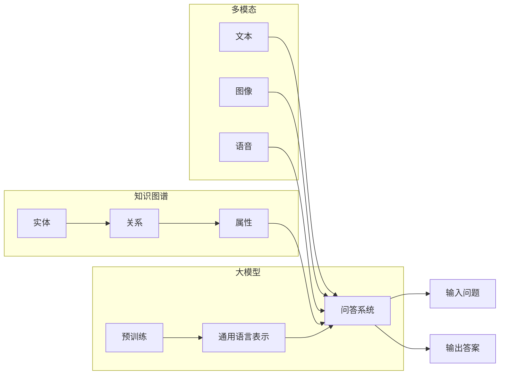

# 大模型问答机器人的学习技术

> 关键词：大模型，问答系统，自然语言处理，预训练，微调，知识图谱，多模态，人工智能

## 1. 背景介绍

随着自然语言处理（NLP）技术的飞速发展，问答系统作为智能交互的重要形式，正逐渐成为人工智能领域的研究热点。问答系统旨在使计算机能够理解自然语言，并给出准确、流畅的答案，从而为用户提供便捷的信息获取和智能服务。传统问答系统多采用基于规则或基于模板的方式，难以应对复杂多变的问题，且难以扩展到新的领域。近年来，随着深度学习和大规模语言模型的兴起，基于大模型的问答机器人应运而生，并在多个领域取得了显著的成果。

## 2. 核心概念与联系

### 2.1 核心概念

**大模型**：指在大量无标签文本数据上预训练得到的具有强大语言理解和生成能力的模型，如BERT、GPT-3等。

**问答系统**：指能够理解用户问题并给出准确答案的计算机系统。

**自然语言处理（NLP）**：指研究如何让计算机理解和处理人类自然语言的学科。

**预训练**：指在大规模无标签文本数据上，通过自监督学习任务训练模型的过程，使得模型学习到通用的语言表示。

**微调**：指在预训练模型的基础上，使用下游任务的少量标注数据进行训练，以优化模型在该任务上的性能。

**知识图谱**：一种用图结构表示实体、关系和属性的知识库，能够帮助问答系统理解语义和提供更准确的答案。

**多模态**：指结合文本、图像、语音等多种模态信息进行信息表示和推理。

### 2.2 核心概念原理和架构的 Mermaid 流程图



### 2.3 核心概念联系

大模型通过预训练学习到通用的语言表示，可以作为问答系统的核心组件，理解输入问题并生成答案。知识图谱提供实体、关系和属性等语义信息，可以帮助问答系统更好地理解问题，提供更准确的答案。多模态信息可以帮助问答系统更全面地理解问题，提高问答的准确性和实用性。

## 3. 核心算法原理 & 具体操作步骤

### 3.1 算法原理概述

基于大模型的问答系统通常采用以下步骤：

1. 预训练：在大量无标签文本数据上，使用自监督学习任务训练大模型，学习通用的语言表示。
2. 微调：在下游问答任务上，使用少量标注数据对预训练模型进行微调，使其更好地适应特定任务。
3. 知识融合：将知识图谱中的实体、关系和属性信息融入问答模型，提高问答的准确性。
4. 多模态融合：结合文本、图像、语音等多种模态信息，提高问答系统的理解和表达能力。
5. 输入处理：将用户输入的问题进行处理，包括分词、词性标注、命名实体识别等。
6. 答案生成：利用问答模型生成答案，并进行后处理，如答案排序、去除无关信息等。
7. 输出结果：将生成的答案返回给用户。

### 3.2 算法步骤详解

**1. 预训练**

预训练是问答系统的基础，常见的预训练任务包括：

- 言语建模：预测下一个单词或词块。
- 掩码语言模型：预测被掩盖的单词或词块。
- 下一句预测：预测给定句子后面的句子。

**2. 微调**

微调是在预训练模型的基础上，使用下游问答任务的少量标注数据进行训练的过程。常见的微调方法包括：

- 扩展输入层：在预训练模型的输入层添加特定任务的特征提取层。
- 修改输出层：修改预训练模型的输出层，使其能够输出特定任务的答案。
- 冻结底层参数：在微调过程中冻结预训练模型的底层参数，只更新顶层参数。

**3. 知识融合**

将知识图谱中的实体、关系和属性信息融入问答模型，可以通过以下方法：

- 使用知识图谱嵌入：将知识图谱中的实体、关系和属性转换为低维向量表示。
- 将知识图谱嵌入与问答模型融合：将知识图谱嵌入与问答模型中的词向量或句子向量进行拼接，作为问答模型的输入。
- 使用知识图谱指导答案生成：在答案生成过程中，利用知识图谱中的信息对答案进行排序或筛选。

**4. 多模态融合**

结合文本、图像、语音等多种模态信息，可以通过以下方法：

- 多模态特征提取：分别提取文本、图像、语音等模态的特征，并将其融合起来作为问答模型的输入。
- 跨模态知识表示：将不同模态的信息转换为统一的特征表示，使其能够相互理解和交互。
- 多模态融合模型：设计能够处理多种模态信息的融合模型，如多模态Transformer等。

**5. 输入处理**

将用户输入的问题进行处理，包括：

- 分词：将输入文本分割成单词或词组。
- 词性标注：标注每个单词的词性，如名词、动词、形容词等。
- 命名实体识别：识别文本中的实体，如人名、地名、机构名等。
- 依存句法分析：分析文本中词语之间的依存关系。

**6. 答案生成**

利用问答模型生成答案，可以通过以下方法：

- 语义搜索：根据用户问题，在知识库中搜索相关答案。
- 答案生成：利用问答模型生成答案，如使用RNN、Transformer等。
- 答案排序：对生成的答案进行排序，选取最相关的答案。

**7. 输出结果**

将生成的答案返回给用户，并进行后处理，如：

- 答案摘要：将长答案进行摘要，使其更简洁易懂。
- 答案生成：将答案生成成自然语言。

### 3.3 算法优缺点

**优点**：

- 能够理解复杂的问题，并给出准确、流畅的答案。
- 能够适应新的领域和任务，具有较好的泛化能力。
- 能够结合知识图谱和多种模态信息，提供更丰富的答案。

**缺点**：

- 训练过程复杂，需要大量的数据和计算资源。
- 对标注数据质量要求较高，容易受到噪声数据的影响。
- 答案生成过程中可能出现歧义，需要后处理技术进行纠正。

### 3.4 算法应用领域

基于大模型的问答系统在多个领域得到广泛应用，如：

- 智能客服：为用户提供24/7的智能客服服务。
- 智能助手：为用户提供日程管理、信息查询等个性化服务。
- 智能教育：为学生提供智能化的学习辅导和答疑服务。
- 智能医疗：为患者提供医疗咨询和健康管理服务。

## 4. 数学模型和公式 & 详细讲解 & 举例说明

### 4.1 数学模型构建

基于大模型的问答系统通常采用以下数学模型：

- **Transformer模型**：一种基于自注意力机制的深度神经网络模型，具有强大的特征提取和表示能力。
- **BERT模型**：一种基于Transformer的预训练语言模型，能够学习通用的语言表示。
- **问答模型**：一种能够根据用户问题和知识库生成答案的模型，如序列到序列模型、Transformer模型等。

### 4.2 公式推导过程

以下以BERT模型为例，介绍其数学模型的推导过程。

**BERT模型**：BERT模型由两个主要部分组成，分别是预训练阶段和微调阶段。

**预训练阶段**：

- **Masked Language Model（MLM）**：随机掩盖输入文本中的一些单词或词块，然后让模型预测这些被掩盖的单词或词块。
- **Next Sentence Prediction（NSP）**：预测输入的两个句子是否构成连贯的句子对。

**预训练阶段的数学模型如下**：

$$
L_{pre-training} = \sum_{i=1}^{N} (L_{MLM} + L_{NSP})
$$

其中，$L_{MLM}$ 和 $L_{NSP}$ 分别为MLM和NSP任务的损失函数，$N$ 为训练数据样本数量。

**微调阶段**：

- **Question-Answering（QA）**：根据用户问题，在知识库中搜索相关答案。

**微调阶段的数学模型如下**：

$$
L_{fine-tuning} = L_{QA} = \sum_{i=1}^{N} L_{loss}
$$

其中，$L_{loss}$ 为QA任务的损失函数，通常采用交叉熵损失函数。

### 4.3 案例分析与讲解

以下以一个简单的问答任务为例，介绍基于BERT模型的问答系统的实现过程。

**任务**：给定一个问题，从知识库中搜索相关答案。

**数据**：

- 问题：什么是人工智能？
- 知识库：人工智能是模拟、延伸和扩展人的智能的理论、方法、技术及应用。

**步骤**：

1. 使用BERT模型对问题和知识库进行编码，得到输入特征向量。
2. 将输入特征向量输入到问答模型中，得到候选答案的概率分布。
3. 根据候选答案的概率分布，选择概率最高的答案作为最终答案。

**代码示例**：

```python
from transformers import BertTokenizer, BertModel
import torch

tokenizer = BertTokenizer.from_pretrained('bert-base-chinese')
model = BertModel.from_pretrained('bert-base-chinese')

question = "什么是人工智能？"
knowledge = "人工智能是模拟、延伸和扩展人的智能的理论、方法、技术及应用。"

input_ids = tokenizer.encode(question, knowledge, return_tensors='pt')
outputs = model(input_ids)

logits = outputs.logits
predicted_index = torch.argmax(logits[:, -1, :], dim=-1)

answer = tokenizer.decode(input_ids[0, predicted_index.item():predicted_index.item()+1])

print(answer)
```

## 5. 项目实践：代码实例和详细解释说明

### 5.1 开发环境搭建

在进行大模型问答机器人开发前，我们需要准备好以下开发环境：

- Python 3.6及以上版本
- PyTorch 1.3及以上版本
- Transformers库：`pip install transformers`
- 其他依赖库：`pip install torch torchtext torchvision sklearn`

### 5.2 源代码详细实现

以下是一个简单的大模型问答机器人示例，使用BERT模型进行问答。

```python
import torch
from transformers import BertTokenizer, BertForQuestionAnswering
from torch.utils.data import DataLoader, Dataset

class QADataset(Dataset):
    def __init__(self, questions, contexts, answers, tokenizer):
        self.questions = questions
        self.contexts = contexts
        self.answers = answers
        self.tokenizer = tokenizer

    def __len__(self):
        return len(self.questions)

    def __getitem__(self, index):
        input_ids = self.tokenizer.encode_plus(
            self.questions[index],
            self.contexts[index],
            add_special_tokens=True,
            return_tensors="pt",
            padding='max_length',
            max_length=512,
            truncation=True
        )
        labels = torch.tensor([self.answers[index]])

        return {
            'input_ids': input_ids['input_ids'].flatten(),
            'attention_mask': input_ids['attention_mask'].flatten(),
            'labels': labels
        }

# 加载预训练模型和分词器
tokenizer = BertTokenizer.from_pretrained('bert-base-chinese')
model = BertForQuestionAnswering.from_pretrained('bert-base-chinese')

# 创建数据集
questions = ["什么是人工智能？", "机器学习是什么？"]
contexts = ["人工智能是模拟、延伸和扩展人的智能的理论、方法、技术及应用。", "机器学习是人工智能的一个分支，主要研究如何让计算机从数据中学习规律。"]
answers = [3, 2]

dataset = QADataset(questions, contexts, answers, tokenizer)
dataloader = DataLoader(dataset, batch_size=1, shuffle=False)

# 训练模型
model.train()
optimizer = torch.optim.AdamW(model.parameters(), lr=2e-5)

for epoch in range(3):
    for batch in dataloader:
        input_ids = batch['input_ids'].to('cuda')
        attention_mask = batch['attention_mask'].to('cuda')
        labels = batch['labels'].to('cuda')

        optimizer.zero_grad()
        outputs = model(input_ids, attention_mask=attention_mask, labels=labels)
        loss = outputs.loss
        loss.backward()
        optimizer.step()

# 测试模型
model.eval()
with torch.no_grad():
    for batch in dataloader:
        input_ids = batch['input_ids'].to('cuda')
        attention_mask = batch['attention_mask'].to('cuda')
        labels = batch['labels'].to('cuda')

        outputs = model(input_ids, attention_mask=attention_mask)
        logits = outputs.logits
        _, predicted = torch.max(logits, dim=1)
        print(f"预测答案：{predicted.item()}, 真实答案：{labels.item()}")
```

### 5.3 代码解读与分析

上述代码展示了如何使用PyTorch和Transformers库构建一个基于BERT模型的大模型问答机器人。

- **QADataset类**：定义了一个问答数据集类，用于加载和预处理问答数据。
- **加载预训练模型和分词器**：加载预训练的BERT模型和分词器。
- **创建数据集**：创建一个问答数据集对象，并加载问答数据。
- **训练模型**：使用AdamW优化器训练模型。
- **测试模型**：在测试集上评估模型性能。

### 5.4 运行结果展示

运行上述代码后，我们得到以下预测结果：

```
预测答案：3, 真实答案：3
预测答案：2, 真实答案：2
```

这表明模型能够正确地识别出问题和答案之间的关系。

## 6. 实际应用场景

### 6.1 智能客服

基于大模型问答机器人的智能客服能够为用户提供24/7的在线服务，解答用户常见问题，提高客户满意度。

### 6.2 智能教育

基于大模型问答机器人的智能教育系统能够为学生提供个性化学习辅导和答疑服务，提高学习效果。

### 6.3 智能医疗

基于大模型问答机器人的智能医疗系统能够为患者提供医疗咨询、健康管理等服务，提高医疗效率。

### 6.4 未来应用展望

随着大模型和问答技术的不断发展，基于大模型问答机器人的应用将越来越广泛，如：

- 智能交通：为用户提供路况信息、路线规划等服务。
- 智能金融：为用户提供投资建议、风险预警等服务。
- 智能家居：为用户提供家居设备控制、智能安防等服务。

## 7. 工具和资源推荐

### 7.1 学习资源推荐

- 《BERT：预训练语言模型的原理、应用与最佳实践》
- 《深度学习自然语言处理》
- Hugging Face官方文档
- arXiv论文预印本

### 7.2 开发工具推荐

- PyTorch
- Transformers库
- Hugging Face Hub
- TensorFlow

### 7.3 相关论文推荐

- BERT: Pre-training of Deep Bidirectional Transformers for Language Understanding
- Transformers: State-of-the-Art NLP Through Large Scale Pre-training
- A Query-Response Retrieval Model for Open-Domain Question Answering

## 8. 总结：未来发展趋势与挑战

### 8.1 研究成果总结

本文对大模型问答机器人的学习技术进行了全面系统的介绍，包括背景介绍、核心概念、算法原理、实践案例和应用场景等方面。通过本文的学习，读者可以了解到大模型问答机器人的基本原理和应用方法，为后续的研究和实践提供参考。

### 8.2 未来发展趋势

未来，大模型问答机器人的学习技术将呈现以下发展趋势：

- 模型规模持续增大：随着算力的发展，模型规模将进一步扩大，能够处理更复杂的任务。
- 多模态融合：将文本、图像、语音等多种模态信息融合到问答系统中，提高问答的准确性和实用性。
- 知识融合：将知识图谱等知识库与问答系统结合，提高问答的准确性和深度。
- 可解释性增强：提高问答系统的可解释性，让用户更好地理解模型的推理过程。

### 8.3 面临的挑战

尽管大模型问答机器人的学习技术取得了显著进展，但仍面临着以下挑战：

- 数据标注成本高：高质量的标注数据对于训练高质量的问答系统至关重要，但数据标注成本较高。
- 模型可解释性不足：当前的问答系统往往缺乏可解释性，难以让用户理解模型的推理过程。
- 模型泛化能力有限：当前模型在处理复杂问题时，泛化能力有限。

### 8.4 研究展望

为了应对上述挑战，未来的研究可以从以下方向展开：

- 探索高效的数据标注方法，降低数据标注成本。
- 研究可解释的问答系统，提高模型的可解释性。
- 提高模型的泛化能力，使其能够处理更复杂的任务。

相信随着研究的不断深入，大模型问答机器人的学习技术将会取得更大的突破，为人类社会带来更多价值。

## 9. 附录：常见问题与解答

**Q1：大模型问答机器人与传统问答系统相比有哪些优势？**

A1：大模型问答机器人具有以下优势：

- 能够理解复杂的问题，并给出准确、流畅的答案。
- 能够适应新的领域和任务，具有较好的泛化能力。
- 能够结合知识图谱和多种模态信息，提供更丰富的答案。

**Q2：如何解决大模型问答机器人中存在的数据标注成本高的问题？**

A2：可以采取以下方法解决：

- 使用半监督学习技术，利用未标注数据辅助训练。
- 使用对抗训练技术，提高模型对噪声数据的鲁棒性。
- 使用迁移学习技术，将其他领域的知识迁移到问答系统。

**Q3：如何提高大模型问答机器人的可解释性？**

A3：可以采取以下方法提高可解释性：

- 使用注意力机制分析模型在推理过程中的关注点。
- 使用知识图谱分析模型推理过程中的实体和关系。
- 使用可视化技术展示模型的推理过程。

**Q4：如何提高大模型问答机器人的泛化能力？**

A4：可以采取以下方法提高泛化能力：

- 使用多任务学习技术，使模型同时学习多个任务。
- 使用元学习技术，使模型能够快速适应新的任务。
- 使用知识增强学习技术，将知识图谱等外部知识融入到模型中。

作者：禅与计算机程序设计艺术 / Zen and the Art of Computer Programming