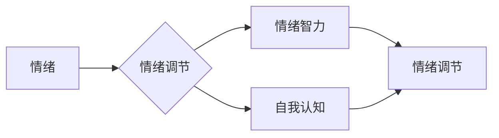

# 如何进行情绪管理：如何控制自己的情绪和行为？

> 关键词：情绪管理，情绪控制，心理调节，认知行为疗法，情绪调节技巧，情绪智力，自我认知

## 1. 背景介绍

在快节奏的现代生活中，情绪管理已成为一个至关重要的能力。它不仅影响我们的心理健康，还深刻地影响着我们的工作表现、人际关系和社会功能。情绪管理不佳可能导致焦虑、抑郁、压力过大等问题，甚至影响身体健康。因此，掌握有效的情绪管理技巧对于个人的全面发展至关重要。

### 1.1 问题的由来

随着社会竞争的加剧和压力的增加，越来越多的人开始关注情绪管理。工作压力、人际关系矛盾、生活事件等都是触发情绪波动的原因。如何在这些压力面前保持冷静，如何控制自己的情绪和行为，成为了许多人迫切需要解决的问题。

### 1.2 研究现状

情绪管理是一个跨学科的研究领域，涉及心理学、社会学、神经科学等多个学科。目前，情绪管理的研究主要集中在以下几个方面：

- **认知行为疗法（CBT）**：强调认知在情绪调节中的作用，认为情绪问题是认知偏差造成的。
- **情绪智力（EQ）**：强调情绪感知、理解、运用、管理和调节等能力。
- **自我认知**：关注个体对自己情绪的认识和评价。
- **情绪调节技巧**：提供具体的技巧和方法，帮助个体更好地管理自己的情绪。

### 1.3 研究意义

情绪管理的研究对于提高个体的生活质量、促进社会和谐具有重要意义。它有助于：

- **改善心理健康**：减少焦虑、抑郁等心理问题的发生。
- **提高工作效率**：保持良好的情绪状态，提高工作效率和创造力。
- **增强人际关系**：改善人际沟通，增强人际关系的稳定性。
- **促进个人成长**：帮助个体更好地认识自我，实现自我提升。

### 1.4 本文结构

本文将从以下几个方面对情绪管理进行探讨：

- 核心概念与联系
- 核心算法原理与具体操作步骤
- 数学模型和公式
- 项目实践
- 实际应用场景
- 工具和资源推荐
- 总结与展望

## 2. 核心概念与联系

### 2.1 核心概念

#### 情绪

情绪是指个体对某些事件或刺激的主观体验，通常伴随着生理和心理反应。情绪可以分为积极情绪（如快乐、满足）和消极情绪（如愤怒、悲伤）。

#### 情绪调节

情绪调节是指个体在面对情绪刺激时，通过认知、行为和生理调节手段，调整情绪状态的过程。

#### 情绪智力

情绪智力是指个体感知、理解、运用、管理和调节情绪的能力。

#### 自我认知

自我认知是指个体对自己情绪、性格、价值观等方面的认识。

### 2.2 联系

情绪、情绪调节、情绪智力和自我认知之间存在着密切的联系。情绪是情绪调节的触发因素，情绪调节需要情绪智力和自我认知的参与。



## 3. 核心算法原理 & 具体操作步骤

### 3.1 算法原理概述

情绪管理算法的核心原理是通过认知、行为和生理调节手段，帮助个体识别、理解、接受和调节情绪。

### 3.2 算法步骤详解

#### 步骤1：情绪识别

- **自我观察**：通过自我观察和反思，识别自己的情绪状态。
- **生理反馈**：通过心率、血压等生理指标，辅助识别情绪状态。

#### 步骤2：情绪理解

- **情绪标签**：给当前的情绪状态贴上标签，如愤怒、悲伤等。
- **情绪原因分析**：分析触发情绪的原因，如工作压力、人际关系等。

#### 步骤3：情绪接受

- **接受现实**：接受当前的情绪状态，不要抗拒或逃避。
- **情绪接纳**：认识到情绪是人的自然反应，不必过度自责。

#### 步骤4：情绪调节

- **认知重构**：通过改变对事件的认知，调整情绪状态。
- **行为调节**：通过改变行为，如运动、放松等，调节情绪。
- **生理调节**：通过深呼吸、冥想等生理调节方法，缓解情绪。

### 3.3 算法优缺点

#### 优点

- **实用性**：算法提供了一系列实用的情绪调节技巧，易于操作。
- **个性化**：根据个体差异，算法可以提供个性化的情绪管理方案。

#### 缺点

- **依赖性**：过度依赖算法可能导致个体缺乏自我情绪管理能力。
- **局限性**：算法可能无法完全解决复杂的情绪问题。

### 3.4 算法应用领域

情绪管理算法可以应用于以下领域：

- **心理健康**：帮助个体改善心理健康，减少心理问题的发生。
- **工作效率**：提高工作效率，减少工作压力。
- **人际关系**：改善人际关系，增强人际沟通。
- **个人成长**：促进个人成长，提升生活质量。

## 4. 数学模型和公式

情绪管理涉及的心理过程可以通过数学模型和公式进行描述。

### 4.1 数学模型构建

情绪管理模型可以看作是一个非线性动态系统，其状态由情绪、认知、行为和生理等因素共同决定。

$$
\text{状态} = f(\text{情绪}, \text{认知}, \text{行为}, \text{生理})
$$

### 4.2 公式推导过程

情绪管理模型的推导过程涉及到心理学、社会学、神经科学等多个学科的理论和方法。

### 4.3 案例分析与讲解

以一个工作压力导致的焦虑情绪为例，我们可以通过以下步骤进行分析和讲解：

- **情绪识别**：通过自我观察和生理反馈，识别出焦虑情绪。
- **情绪理解**：分析工作压力是导致焦虑的原因。
- **情绪接受**：接受焦虑情绪，不要抗拒。
- **情绪调节**：通过认知重构，认识到工作压力是暂时的，可以通过调整工作方式来缓解压力。

## 5. 项目实践：代码实例和详细解释说明

### 5.1 开发环境搭建

情绪管理项目可以使用Python进行开发，需要安装以下库：

- **NumPy**：用于数值计算。
- **Matplotlib**：用于数据可视化。
- **Pandas**：用于数据处理。

### 5.2 源代码详细实现

以下是一个简单的情绪管理Python代码实例：

```python
import numpy as np
import matplotlib.pyplot as plt

# 情绪状态
emotions = ['快乐', '愤怒', '悲伤', '焦虑']

# 情绪评分
scores = [8, 5, 3, 7]

# 绘制情绪状态图
plt.bar(emotions, scores, color=['green', 'red', 'blue', 'orange'])
plt.xlabel('情绪')
plt.ylabel('评分')
plt.title('情绪状态')
plt.show()
```

### 5.3 代码解读与分析

这段代码首先定义了一个情绪列表和对应的评分。然后，使用Matplotlib库绘制了一个柱状图，展示了不同情绪的评分。通过可视化，我们可以直观地看到自己的情绪状态。

### 5.4 运行结果展示

运行上述代码，将得到一个柱状图，展示了不同情绪的评分。

## 6. 实际应用场景

### 6.1 心理咨询

情绪管理算法可以应用于心理咨询领域，帮助咨询师评估来访者的情绪状态，提供个性化的情绪管理方案。

### 6.2 企业培训

情绪管理算法可以应用于企业培训，帮助员工提高情绪智力，提升工作效率。

### 6.3 家庭教育

情绪管理算法可以应用于家庭教育，帮助家长和孩子更好地理解和调节情绪。

## 7. 工具和资源推荐

### 7.1 学习资源推荐

- **书籍**：《情绪智力》、《情绪勇气》
- **网站**：Coursera、edX

### 7.2 开发工具推荐

- **Python库**：NumPy、Matplotlib、Pandas

### 7.3 相关论文推荐

- **《情绪智力的构成及其对人际关系的影响》**
- **《情绪调节的神经基础》**

## 8. 总结：未来发展趋势与挑战

### 8.1 研究成果总结

情绪管理研究取得了显著成果，为个体和社会带来了积极影响。

### 8.2 未来发展趋势

- **跨学科研究**：进一步整合心理学、社会学、神经科学等多学科的研究成果。
- **技术融合**：将情绪管理算法与人工智能、虚拟现实等技术相结合。
- **个性化应用**：开发更加个性化的情绪管理方案。

### 8.3 面临的挑战

- **数据隐私**：如何保护情绪管理过程中产生的数据隐私。
- **算法偏见**：如何避免情绪管理算法中的偏见和歧视。
- **伦理问题**：如何确保情绪管理算法的伦理性和社会价值。

### 8.4 研究展望

情绪管理研究将继续深入，为个体和社会带来更多福祉。

## 9. 附录：常见问题与解答

**Q1：如何判断自己的情绪状态？**

A：可以通过自我观察和生理反馈来判断自己的情绪状态。例如，可以通过观察自己的面部表情、身体语言和生理指标（如心率、血压）来识别情绪。

**Q2：如何改善情绪管理能力？**

A：可以通过以下方法改善情绪管理能力：

- **学习情绪管理知识**：了解情绪的本质和调节方法。
- **练习情绪调节技巧**：通过冥想、放松训练等方法调节情绪。
- **寻求专业帮助**：如果情绪问题严重，可以寻求心理咨询师的帮助。

**Q3：情绪管理算法是否可以替代心理咨询？**

A：情绪管理算法可以作为心理咨询的辅助工具，但不能完全替代心理咨询。心理咨询师可以提供更深入的心理分析和干预。

**Q4：情绪管理技术是否会侵犯个人隐私？**

A：情绪管理技术在应用过程中需要严格保护个人隐私，避免数据泄露和滥用。

**Q5：情绪管理技术是否会导致过度依赖？**

A：情绪管理技术可以作为辅助工具，帮助个体更好地管理情绪，但过度依赖可能导致个体缺乏自我情绪管理能力。

作者：禅与计算机程序设计艺术 / Zen and the Art of Computer Programming