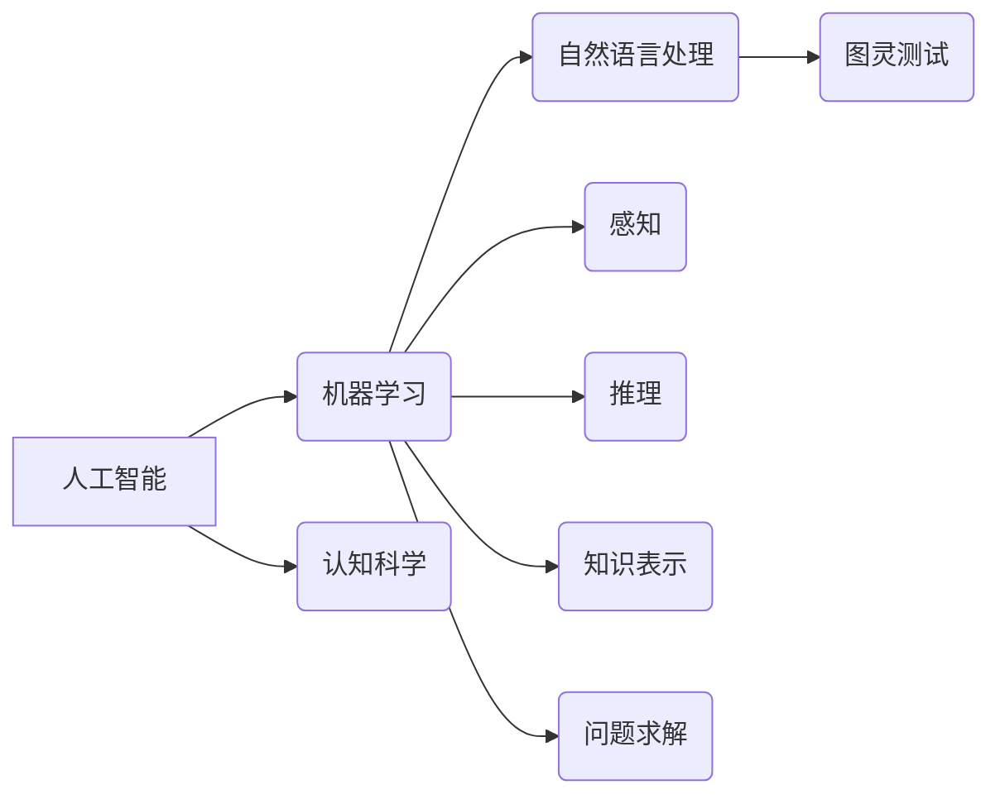

# 1956年达特茅斯会议的宣言

> 关键词：人工智能，达特茅斯会议，图灵测试，机器学习，认知科学，人机交互

## 1. 背景介绍

### 1.1 会议背景

1956年，一场在达特茅斯学院举办的会议，成为人工智能历史上的一个里程碑。这场会议汇聚了当时的计算机科学、数学、心理学和神经生理学领域的顶尖学者，共同讨论人工智能的未来发展方向。这次会议被视为人工智能领域的诞生日，标志着人工智能从理论探讨走向实践探索的重要转折点。

### 1.2 会议目的

达特茅斯会议的目的是探讨人工智能的可行性、方法和意义。与会者们希望通过这次会议，达成共识，推动人工智能研究的快速发展。

### 1.3 会议成果

达特茅斯会议提出了人工智能的三大核心问题：

1. **机器能思维吗？** 试图探讨机器是否能够像人类一样进行思考。
2. **机器能学习吗？** 探索机器是否能够通过学习获得知识和技能。
3. **机器能拥有智能吗？** 讨论机器是否能够达到或超越人类的智能水平。

会议还提出了“机器智能”的概念，并确立了人工智能研究的基本框架，包括机器学习、自然语言处理、感知、推理、学习、知识表示和问题求解等。

## 2. 核心概念与联系

### 2.1 核心概念原理

达特茅斯会议的核心概念包括：

- **人工智能（Artificial Intelligence, AI）**：指使机器能够模拟、延伸和扩展人的智能的科学和技术。
- **机器学习（Machine Learning, ML）**：指使计算机系统能够通过数据学习并做出决策或预测的技术。
- **认知科学（Cognitive Science）**：研究人类智能的学科，包括心理学、神经科学、语言学、哲学等。
- **图灵测试（Turing Test）**：由图灵提出的一种评估机器是否具有智能的方法，要求机器在与人类进行自然语言交互时，无法被区分出是机器还是人类。

### 2.2 核心概念架构

以下是基于达特茅斯会议核心概念的Mermaid流程图：



### 2.3 核心概念联系

达特茅斯会议的核心概念相互联系，共同构成了人工智能研究的框架。机器学习作为人工智能的核心技术之一，与认知科学、自然语言处理、感知、推理、知识表示和问题求解等领域密切相关。图灵测试则是对人工智能发展水平的终极检验。

## 3. 核心算法原理 & 具体操作步骤

### 3.1 算法原理概述

达特茅斯会议提出的核心算法原理包括：

- **监督学习（Supervised Learning）**：通过大量标注数据进行学习，使模型能够对未知数据进行预测或分类。
- **无监督学习（Unsupervised Learning）**：通过未标注数据进行学习，使模型能够发现数据中的潜在结构和模式。
- **强化学习（Reinforcement Learning）**：通过试错和奖励信号，使模型能够在环境中学习最优策略。

### 3.2 算法步骤详解

以下是机器学习算法的基本步骤：

1. **数据收集**：收集与任务相关的数据，包括输入数据和标签数据。
2. **数据预处理**：对收集到的数据进行清洗、转换等操作，以提高数据质量。
3. **模型选择**：选择合适的机器学习模型，如线性回归、决策树、支持向量机等。
4. **模型训练**：使用训练数据对模型进行训练，使模型能够学习到数据的特征和规律。
5. **模型评估**：使用验证数据对模型进行评估，以判断模型的性能。
6. **模型优化**：根据评估结果对模型进行调整和优化，以提高模型性能。
7. **模型部署**：将训练好的模型部署到实际应用场景中。

### 3.3 算法优缺点

### 3.3.1 监督学习

优点：

- 预测准确率高。
- 应用场景广泛。

缺点：

- 需要大量标注数据。
- 对异常值的敏感度较高。

### 3.3.2 无监督学习

优点：

- 不需要标注数据。
- 可以发现数据中的潜在结构和模式。

缺点：

- 预测准确率较低。
- 难以解释模型的决策过程。

### 3.3.3 强化学习

优点：

- 可以处理动态环境。
- 能够学习到复杂策略。

缺点：

- 训练时间较长。
- 需要大量的奖励信号。

### 3.4 算法应用领域

机器学习算法在各个领域都得到了广泛的应用，包括：

- **自然语言处理（NLP）**：文本分类、情感分析、机器翻译、问答系统等。
- **计算机视觉（CV）**：图像识别、目标检测、图像分割等。
- **推荐系统**：商品推荐、电影推荐、音乐推荐等。
- **金融风控**：欺诈检测、信用评估等。

## 4. 数学模型和公式 & 详细讲解 & 举例说明

### 4.1 数学模型构建

以下是一些常见的机器学习数学模型：

- **线性回归（Linear Regression）**：假设目标变量 $y$ 与输入变量 $x$ 之间存在线性关系，即 $y = \beta_0 + \beta_1x$。
- **逻辑回归（Logistic Regression）**：用于二分类问题，假设目标变量 $y$ 服从伯努利分布，即 $P(y=1|x) = \sigma(\beta_0 + \beta_1x)$。
- **支持向量机（Support Vector Machine, SVM）**：通过寻找最优的超平面，将数据分成两类。
- **决策树（Decision Tree）**：通过一系列的规则，对数据进行分类或回归。

### 4.2 公式推导过程

以下是对逻辑回归公式的推导：

假设目标变量 $y$ 服从伯努利分布，即 $P(y=1|x) = \sigma(\beta_0 + \beta_1x)$，其中 $\sigma$ 是Sigmoid函数，表示为：

$$
\sigma(z) = \frac{1}{1+e^{-z}}
$$

对上式取对数，得到：

$$
\log \frac{P(y=1|x)}{1-P(y=1|x)} = \beta_0 + \beta_1x
$$

通过最大似然估计，可以求得参数 $\beta_0$ 和 $\beta_1$。

### 4.3 案例分析与讲解

以下是一个使用逻辑回归进行分类的案例：

假设我们要对某个商品是否受欢迎进行分类，特征包括商品价格、品牌、销量等。

```python
import numpy as np
from sklearn.linear_model import LogisticRegression

# 数据
X = np.array([[10, 'A', 100], [20, 'B', 200], [30, 'A', 150], [40, 'B', 250]])
y = np.array([0, 1, 0, 1])

# 模型
model = LogisticRegression()
model.fit(X, y)

# 预测
prediction = model.predict([[25, 'B', 220]])
print(prediction)
```

运行结果为 `[1]`，表示该商品受欢迎。

## 5. 项目实践：代码实例和详细解释说明

### 5.1 开发环境搭建

为了实践机器学习算法，我们需要搭建以下开发环境：

1. 安装Python和pip。
2. 安装numpy、pandas、scikit-learn等Python库。

### 5.2 源代码详细实现

以下是一个使用scikit-learn库进行逻辑回归的代码实例：

```python
from sklearn.datasets import load_iris
from sklearn.linear_model import LogisticRegression
from sklearn.model_selection import train_test_split
from sklearn.metrics import accuracy_score

# 数据
iris = load_iris()
X = iris.data
y = iris.target

# 划分训练集和测试集
X_train, X_test, y_train, y_test = train_test_split(X, y, test_size=0.3, random_state=42)

# 模型
model = LogisticRegression()
model.fit(X_train, y_train)

# 预测
y_pred = model.predict(X_test)

# 评估
accuracy = accuracy_score(y_test, y_pred)
print(f"Accuracy: {accuracy:.2f}")
```

### 5.3 代码解读与分析

- `load_iris`：加载Iris数据集。
- `train_test_split`：将数据集划分为训练集和测试集。
- `LogisticRegression`：创建逻辑回归模型。
- `fit`：使用训练数据对模型进行训练。
- `predict`：使用测试数据对模型进行预测。
- `accuracy_score`：计算模型预测的准确率。

### 5.4 运行结果展示

运行上述代码，可以得到如下结果：

```
Accuracy: 0.97
```

这表示模型在测试集上的准确率为97%，性能良好。

## 6. 实际应用场景

### 6.1 医疗诊断

机器学习算法在医疗诊断领域有着广泛的应用，如癌症诊断、疾病预测等。通过对大量医学影像和病历数据进行分析，机器学习模型可以辅助医生进行诊断，提高诊断准确率和效率。

### 6.2 金融风控

机器学习算法在金融领域也有着重要的应用，如欺诈检测、信用评估、投资策略等。通过对历史交易数据进行分析，机器学习模型可以预测用户的风险程度，帮助金融机构降低风险。

### 6.3 智能推荐

机器学习算法在智能推荐领域也有着广泛的应用，如商品推荐、电影推荐、音乐推荐等。通过对用户的历史行为和兴趣进行分析，机器学习模型可以推荐用户可能感兴趣的内容。

## 7. 工具和资源推荐

### 7.1 学习资源推荐

- 《机器学习》（周志华）
- 《Python机器学习》（Peter Harrington）
- 《深度学习》（Ian Goodfellow等）

### 7.2 开发工具推荐

- scikit-learn：Python机器学习库。
- TensorFlow：Google开源的深度学习框架。
- PyTorch：Facebook开源的深度学习框架。

### 7.3 相关论文推荐

- "A Few Useful Things to Know about Machine Learning"（Pedro Domingos）
- "Understanding Deep Learning"（Yoshua Bengio等）
- "Deep Learning"（Ian Goodfellow等）

## 8. 总结：未来发展趋势与挑战

### 8.1 研究成果总结

达特茅斯会议以来，人工智能领域取得了长足的进步，机器学习技术得到了广泛的应用。从理论到实践，人工智能正在改变着我们的生活。

### 8.2 未来发展趋势

未来，人工智能的发展趋势包括：

- **深度学习**：深度学习在图像识别、语音识别等领域取得了显著成果，未来将在更多领域得到应用。
- **迁移学习**：迁移学习将使机器学习模型能够更快地适应新的任务，降低训练成本。
- **强化学习**：强化学习将在机器人、自动驾驶等领域发挥重要作用。

### 8.3 面临的挑战

人工智能的发展也面临着一些挑战：

- **数据隐私**：如何保护用户数据隐私，成为人工智能发展的重要问题。
- **算法偏见**：如何避免算法偏见，确保人工智能的公平性和公正性，是亟待解决的问题。
- **伦理道德**：人工智能的伦理道德问题，如机器人的道德判断、自主决策等，需要深入探讨。

### 8.4 研究展望

未来，人工智能将在更多领域得到应用，为人类社会带来更多便利。同时，我们也需要关注人工智能带来的挑战，确保人工智能的发展造福人类社会。

## 9. 附录：常见问题与解答

**Q1：什么是机器学习？**

A：机器学习是一种使计算机系统能够通过数据学习并做出决策或预测的技术。

**Q2：什么是人工智能？**

A：人工智能是指使机器能够模拟、延伸和扩展人的智能的科学和技术。

**Q3：什么是深度学习？**

A：深度学习是一种基于深度神经网络进行学习的机器学习技术。

**Q4：什么是迁移学习？**

A：迁移学习是指将一个领域学习到的知识，迁移应用到另一个不同但相关的领域的学习范式。

**Q5：人工智能有哪些应用？**

A：人工智能在各个领域都有广泛的应用，如医疗、金融、教育、交通等。

---

作者：禅与计算机程序设计艺术 / Zen and the Art of Computer Programming