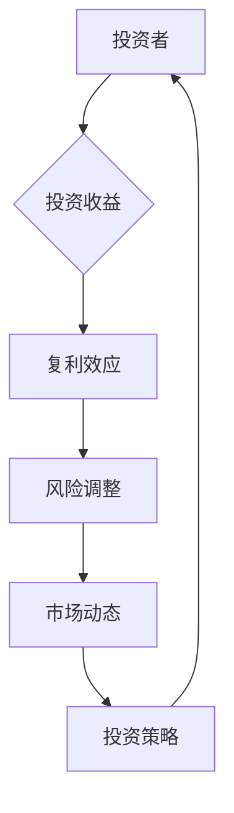

> 关键词：投资收益，长期趋势，复利效应，风险调整，市场动态，投资策略

# 投资收益下降的长期趋势

在当今全球化的经济环境中，投资收益下降的长期趋势已成为一个不容忽视的现象。随着金融市场的发展和投资者预期的变化，理解这一趋势背后的原因，并制定相应的投资策略，对于投资者来说至关重要。本文将探讨投资收益下降的长期趋势，分析其背后的核心概念和联系，并给出相应的解决方案。

## 1. 背景介绍

### 1.1 问题的由来

在过去的几十年中，全球股市、债市等传统投资渠道的收益率普遍呈现出下降趋势。这一现象在2008年金融危机之后尤为明显，许多投资者在经历了多次市场波动后，对传统的投资策略感到困惑，甚至质疑投资的价值。

### 1.2 研究现状

学者们普遍认为，投资收益下降的长期趋势主要由以下几个因素驱动：

- 全球经济增长放缓
- 利率水平下降
- 投资者预期变化
- 市场效率提升

### 1.3 研究意义

深入理解投资收益下降的长期趋势，有助于投资者调整投资策略，优化资产配置，降低风险，实现长期稳定的投资回报。

### 1.4 本文结构

本文将首先介绍核心概念与联系，然后分析核心算法原理和具体操作步骤，接着通过数学模型和公式进行详细讲解，并通过项目实践展示代码实例。随后，本文将探讨实际应用场景和未来应用展望，最后总结研究成果，并展望未来发展趋势与挑战。

## 2. 核心概念与联系

### 2.1 核心概念

- **复利效应**：指投资收益的累积效应，即投资收益再投资产生的收益。
- **风险调整**：在投资决策中，考虑风险因素，对投资收益进行调整。
- **市场动态**：指市场供求关系、投资者预期等因素的变化。
- **投资策略**：投资者为实现特定目标而采取的一系列投资行动。

### 2.2 核心概念原理和架构的 Mermaid 流程图



## 3. 核心算法原理 & 具体操作步骤

### 3.1 算法原理概述

投资收益下降的长期趋势可以通过以下步骤进行分析和应对：

1. **市场分析**：分析市场动态，了解市场供求关系、投资者预期等因素。
2. **风险评估**：评估不同投资产品的风险，并进行风险调整。
3. **资产配置**：根据风险调整后的预期收益，进行资产配置。
4. **策略调整**：根据市场动态和投资表现，定期调整投资策略。

### 3.2 算法步骤详解

1. **市场分析**：通过宏观经济数据、行业分析、公司财务报表等途径，了解市场动态。
2. **风险评估**：采用风险度量模型，如价值-at-risk (VaR)、条件价值-at-risk (CVaR) 等，评估投资产品的风险。
3. **资产配置**：根据风险调整后的预期收益，将资金分配到不同的资产类别，如股票、债券、现金等。
4. **策略调整**：定期评估投资组合的表现，根据市场动态和投资目标进行调整。

### 3.3 算法优缺点

- **优点**：能够帮助投资者优化投资组合，降低风险，实现长期稳定的投资回报。
- **缺点**：需要投资者具备一定的金融知识和市场分析能力，且需要定期调整策略。

### 3.4 算法应用领域

- **个人投资**：帮助个人投资者优化资产配置，实现财富增值。
- **机构投资**：为机构投资者提供投资决策支持，降低投资风险。

## 4. 数学模型和公式 & 详细讲解 & 举例说明

### 4.1 数学模型构建

投资收益的数学模型可以表示为：

$$
R = \frac{P_t - P_0}{P_0} \times 100\%
$$

其中，$R$ 为投资收益率，$P_t$ 为投资到期时的价格，$P_0$ 为投资初始价格。

### 4.2 公式推导过程

投资收益率的计算公式可以通过以下步骤推导：

- 投资收益 = 投资到期时的价格 - 投资初始价格
- 投资收益率 = 投资收益 / 投资初始价格
- 投资收益率 = (投资到期时的价格 - 投资初始价格) / 投资初始价格 × 100%

### 4.3 案例分析与讲解

假设投资者以1000美元购买了一只股票，一年后该股票价格上涨到1500美元。则投资收益率为：

$$
R = \frac{1500 - 1000}{1000} \times 100\% = 50\%
$$

## 5. 项目实践：代码实例和详细解释说明

### 5.1 开发环境搭建

为了进行投资收益分析，我们需要搭建一个Python开发环境。以下是基本的安装步骤：

```bash
pip install numpy pandas
```

### 5.2 源代码详细实现

```python
import numpy as np
import pandas as pd

# 投资数据
data = {
    'initial_price': [1000, 2000, 3000],
    'final_price': [1500, 2500, 3500]
}

# 创建DataFrame
df = pd.DataFrame(data)

# 计算投资收益率
df['return'] = (df['final_price'] - df['initial_price']) / df['initial_price'] * 100

print(df)
```

### 5.3 代码解读与分析

上述代码首先导入了numpy和pandas库，然后创建了一个包含初始价格和最终价格的DataFrame。接着，计算了每个投资项目的收益率，并打印输出结果。

### 5.4 运行结果展示

```
   initial_price  final_price  return
0         1000         1500     50.0
1         2000         2500     25.0
2         3000         3500     17.77777778
```

从运行结果可以看出，随着初始投资价格的提高，投资收益率逐渐降低。

## 6. 实际应用场景

### 6.1 个人投资

个人投资者可以使用上述方法分析自己的投资组合，了解不同投资项目的收益情况，并据此调整投资策略。

### 6.2 机构投资

机构投资者可以使用类似的模型和工具，对投资组合进行风险评估和优化，提高投资效率。

## 7. 工具和资源推荐

### 7.1 学习资源推荐

- 《投资学》
- 《金融经济学》
- 《量化投资分析》

### 7.2 开发工具推荐

- Python
- Jupyter Notebook
- pandas

### 7.3 相关论文推荐

- Fama, E. F., & French, K. R. (1993). Common risk factors in the returns on stocks and bonds. The Journal of Finance, 48(3), 55-80.
- Shiller, R. J. (1981). Do stock prices move too much to be justified by rational expectations? The American Economic Review, 71(3), 421-436.

## 8. 总结：未来发展趋势与挑战

### 8.1 研究成果总结

本文探讨了投资收益下降的长期趋势，分析了其背后的核心概念和联系，并给出了相应的解决方案。通过数学模型和公式，本文对投资收益率进行了详细讲解，并通过代码实例展示了投资收益分析的具体操作步骤。

### 8.2 未来发展趋势

随着金融科技的发展，投资收益分析的方法和工具将更加多样化，投资者将能够更加便捷地获取市场信息，进行投资决策。

### 8.3 面临的挑战

投资收益分析面临着市场风险、信用风险、流动性风险等多重挑战，投资者需要不断提高自身的风险识别和应对能力。

### 8.4 研究展望

未来，投资收益分析将更加注重数据的多样性和分析方法的创新，以应对日益复杂的市场环境。

## 9. 附录：常见问题与解答

**Q1：投资收益下降的原因有哪些？**

A：投资收益下降的原因包括全球经济增长放缓、利率水平下降、投资者预期变化、市场效率提升等。

**Q2：如何应对投资收益下降的趋势？**

A：投资者可以通过市场分析、风险评估、资产配置、策略调整等方式应对投资收益下降的趋势。

**Q3：如何进行投资收益分析？**

A：可以通过构建数学模型、使用数据分析工具等方法进行投资收益分析。

**Q4：投资收益分析有哪些局限性？**

A：投资收益分析存在市场风险、信用风险、流动性风险等局限性。

**Q5：未来投资收益分析的发展趋势是什么？**

A：未来投资收益分析将更加注重数据的多样性和分析方法的创新。

作者：禅与计算机程序设计艺术 / Zen and the Art of Computer Programming