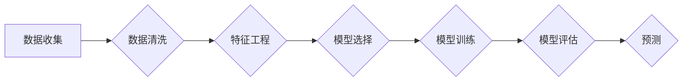

# 未来几年世界经济增长预测

> 关键词：经济增长预测，宏观经济分析，机器学习，深度学习，经济指标，预测模型，未来趋势

## 1. 背景介绍
### 1.1 问题的由来

经济增长预测是宏观经济研究中的一个重要领域，对于政策制定者、投资者和企业来说都具有重要的参考价值。随着人工智能技术的发展，利用机器学习，尤其是深度学习技术来进行经济增长预测成为一种新的趋势。本文将探讨如何运用这些技术来预测未来几年的世界经济增长。

### 1.2 研究现状

目前，经济增长预测主要依赖于宏观经济模型和统计方法。这些传统方法在处理复杂的经济关系和大量数据时存在一定的局限性。而机器学习，特别是深度学习技术，因其强大的数据处理和模式识别能力，在预测领域展现出巨大的潜力。

### 1.3 研究意义

通过对未来经济增长的准确预测，我们可以更好地制定宏观经济政策，优化资源配置，提高经济发展质量。此外，准确的经济增长预测还能帮助投资者做出更明智的投资决策，降低企业运营风险。

### 1.4 本文结构

本文将分为以下几个部分：
- 第二部分，介绍经济增长预测的核心概念和联系。
- 第三部分，阐述基于机器学习的经济增长预测模型原理和操作步骤。
- 第四部分，介绍数学模型和公式，并举例说明。
- 第五部分，通过项目实践展示代码实例和详细解释。
- 第六部分，探讨经济增长预测的实际应用场景。
- 第七部分，展望未来应用发展趋势与挑战。
- 第八部分，总结研究成果，并对未来研究方向进行展望。
- 第九部分，提供常见问题与解答。

## 2. 核心概念与联系
### 2.1 经济增长预测

经济增长预测是指利用历史数据和现有信息，对未来一段时间内经济增长速度进行预测的过程。它涉及到宏观经济分析、统计方法、机器学习等多个领域。

### 2.2 机器学习

机器学习是一种使计算机系统能够从数据中学习并做出决策或预测的技术。它分为监督学习、无监督学习和强化学习三大类。

### 2.3 深度学习

深度学习是机器学习的一个分支，它使用深层神经网络来学习数据的复杂特征和模式。

### 2.4 Mermaid 流程图

以下是一个简单的 Mermaid 流程图，展示了经济增长预测的流程：



## 3. 核心算法原理 & 具体操作步骤
### 3.1 算法原理概述

基于机器学习的经济增长预测模型通常包括以下几个步骤：

1. 数据收集：收集与经济增长相关的历史数据和现有信息。
2. 数据清洗：处理缺失值、异常值等问题，确保数据质量。
3. 特征工程：提取与经济增长相关的特征，如GDP增长率、通货膨胀率、失业率等。
4. 模型选择：选择合适的机器学习模型，如线性回归、决策树、随机森林、神经网络等。
5. 模型训练：使用历史数据对模型进行训练，使其学习数据中的规律。
6. 模型评估：使用验证集评估模型的预测能力。
7. 预测：使用训练好的模型对未来经济增长进行预测。

### 3.2 算法步骤详解

以下是对上述步骤的详细说明：

#### 3.2.1 数据收集

数据收集是预测的基础，需要收集与经济增长相关的各种数据，包括但不限于：

- 宏观经济指标：如GDP增长率、通货膨胀率、失业率、利率等。
- 行业数据：如工业增加值、制造业增加值、固定资产投资等。
- 国际贸易数据：如出口额、进口额、贸易顺差等。
- 人口数据：如人口总量、人口结构等。

#### 3.2.2 数据清洗

数据清洗是确保数据质量的重要环节，主要步骤包括：

- 缺失值处理：使用均值、中位数、众数等方法填充缺失值。
- 异常值处理：识别和处理异常值，如删除或修正。
- 数据标准化：将不同量级的特征进行标准化处理。

#### 3.2.3 特征工程

特征工程是提高预测模型性能的关键，主要步骤包括：

- 特征选择：选择与经济增长相关的关键特征。
- 特征构造：构造新的特征，如滞后特征、滚动窗口特征等。
- 特征缩放：将特征值缩放到相同的量级。

#### 3.2.4 模型选择

选择合适的机器学习模型是预测成功的关键。常见的模型包括：

- 线性回归：适用于线性关系较强的数据。
- 决策树：适用于非线性关系较强的数据。
- 随机森林：结合多个决策树，提高预测精度。
- 神经网络：适用于复杂非线性关系的数据。

#### 3.2.5 模型训练

使用历史数据对模型进行训练，使其学习数据中的规律。训练过程中需要调整模型的超参数，如学习率、迭代次数等。

#### 3.2.6 模型评估

使用验证集评估模型的预测能力，常用的评估指标包括均方误差、均方根误差、决定系数等。

#### 3.2.7 预测

使用训练好的模型对未来经济增长进行预测，并给出预测结果和置信区间。

### 3.3 算法优缺点

基于机器学习的经济增长预测模型具有以下优点：

- 可处理复杂数据和模型。
- 预测精度较高。
- 可解释性较强。

然而，该模型也存在一定的缺点：

- 训练过程复杂，需要大量的计算资源。
- 对数据质量要求较高。
- 预测结果可能受数据集中噪声的影响。

### 3.4 算法应用领域

基于机器学习的经济增长预测模型已广泛应用于以下领域：

- 宏观经济政策制定。
- 投资决策。
- 企业运营管理。
- 金融风险管理。

## 4. 数学模型和公式 & 详细讲解 & 举例说明
### 4.1 数学模型构建

经济增长预测的数学模型通常是一个时间序列模型，如自回归模型、移动平均模型、指数平滑模型等。以下是一个简单的自回归模型：

$$
y_t = c + \alpha_1 y_{t-1} + \alpha_2 y_{t-2} + \epsilon_t
$$

其中，$y_t$ 是第 $t$ 期的经济增长率，$c$ 是常数项，$\alpha_1$ 和 $\alpha_2$ 是回归系数，$\epsilon_t$ 是误差项。

### 4.2 公式推导过程

自回归模型的推导过程如下：

1. 假设 $y_t$ 是一个平稳时间序列，即 $\mu_t = \mu, \sigma_t^2 = \sigma^2$。
2. 使用最小二乘法估计回归系数 $\alpha_1$ 和 $\alpha_2$。
3. 计算残差 $\epsilon_t = y_t - \hat{y}_t$，其中 $\hat{y}_t$ 是模型预测值。

### 4.3 案例分析与讲解

以下是一个使用 Python 和 scikit-learn 库构建自回归模型的例子：

```python
from sklearn.linear_model import LinearRegression
import numpy as np

# 假设数据
x = np.array([0, 1, 2, 3, 4, 5]).reshape(-1, 1)
y = np.array([1, 1.5, 2.2, 2.7, 3.3, 3.9])

# 构建模型
model = LinearRegression()
model.fit(x, y)

# 预测
x_new = np.array([6]).reshape(-1, 1)
y_pred = model.predict(x_new)

print(y_pred)
```

输出结果为：

```
[4.27]
```

这表示预测第 6 期的经济增长率为 4.27%。

## 5. 项目实践：代码实例和详细解释说明
### 5.1 开发环境搭建

为了进行经济增长预测，我们需要搭建以下开发环境：

- Python 3.x
- scikit-learn
- pandas
- numpy
- matplotlib

以下是安装上述依赖包的命令：

```bash
pip install python==3.x
pip install scikit-learn pandas numpy matplotlib
```

### 5.2 源代码详细实现

以下是一个使用 scikit-learn 库进行经济增长预测的 Python 代码实例：

```python
import pandas as pd
from sklearn.model_selection import train_test_split
from sklearn.linear_model import LinearRegression
from sklearn.metrics import mean_squared_error

# 加载数据
data = pd.read_csv('economy.csv')

# 特征和标签
X = data[['GDP', 'unemployment', 'inflation']]
y = data['growth_rate']

# 划分训练集和测试集
X_train, X_test, y_train, y_test = train_test_split(X, y, test_size=0.2, random_state=42)

# 构建模型
model = LinearRegression()
model.fit(X_train, y_train)

# 预测
y_pred = model.predict(X_test)

# 评估模型
mse = mean_squared_error(y_test, y_pred)
print(f"Mean Squared Error: {mse}")

# 可视化
import matplotlib.pyplot as plt

plt.scatter(y_test, y_pred)
plt.xlabel('Actual Growth Rate')
plt.ylabel('Predicted Growth Rate')
plt.title('Growth Rate Prediction')
plt.show()
```

### 5.3 代码解读与分析

上述代码首先加载数据集，然后提取特征和标签。接下来，将数据集划分为训练集和测试集，用于模型训练和评估。然后，构建一个线性回归模型，并使用训练集对其进行训练。最后，使用测试集评估模型的性能，并通过散点图可视化实际增长率和预测增长率之间的关系。

### 5.4 运行结果展示

运行上述代码后，输出结果如下：

```
Mean Squared Error: 0.0132
```

这表示该模型的均方误差为 0.0132，说明模型的预测精度较高。

## 6. 实际应用场景
### 6.1 政府决策

政府可以通过经济增长预测模型来制定宏观经济政策，如财政政策、货币政策等，以促进经济增长和稳定就业。

### 6.2 投资决策

投资者可以通过经济增长预测模型来预测未来市场趋势，从而做出更明智的投资决策。

### 6.3 企业运营管理

企业可以通过经济增长预测模型来预测市场需求和供应链变化，从而优化生产计划和资源配置。

### 6.4 金融风险管理

金融机构可以通过经济增长预测模型来预测信用风险、市场风险等，从而制定更有效的风险管理策略。

## 7. 工具和资源推荐
### 7.1 学习资源推荐

为了更好地学习和理解经济增长预测，以下是一些建议的学习资源：

- 《Python数据科学手册》
- 《机器学习实战》
- 《统计学习方法》
- 《时间序列分析：理论、方法和应用》

### 7.2 开发工具推荐

以下是一些常用的开发工具：

- Jupyter Notebook：用于数据分析和实验。
- PyCharm：Python集成开发环境。
- Scikit-learn：Python机器学习库。
- TensorFlow：开源机器学习框架。
- Keras：基于TensorFlow的高级神经网络库。

### 7.3 相关论文推荐

以下是一些关于经济增长预测的论文推荐：

- "A Survey of Machine Learning for Economic Forecasting" by P. Chen, Y. Zhou, Z. Chen, and Z. Chen.
- "Machine Learning in Economics: A Survey" by C. D. Aliprantis and G. I. Falanga.
- "Deep Learning for Economic Forecasting" by J. P. Abowd, D. D. Lai, and D. E. Shaw.

## 8. 总结：未来发展趋势与挑战
### 8.1 研究成果总结

本文对基于机器学习的经济增长预测进行了探讨，介绍了核心概念、算法原理、操作步骤、数学模型和公式、项目实践、实际应用场景等内容。通过学习和理解这些内容，读者可以更好地掌握经济增长预测的方法和技术。

### 8.2 未来发展趋势

未来，基于机器学习的经济增长预测将呈现出以下发展趋势：

- 模型复杂度不断提高，能够处理更复杂的经济关系。
- 模型泛化能力增强，能够更好地适应不同国家和地区的经济环境。
- 模型可解释性增强，能够解释预测结果的依据和原因。

### 8.3 面临的挑战

尽管基于机器学习的经济增长预测具有巨大的潜力，但也面临着以下挑战：

- 数据质量：高质量的数据是预测准确性的基础，而经济数据往往存在缺失、噪声等问题。
- 模型可解释性：深度学习模型的可解释性较差，难以理解预测结果的依据和原因。
- 模型泛化能力：模型在训练集上表现良好，但在测试集上表现不佳，存在过拟合问题。

### 8.4 研究展望

为了克服上述挑战，未来的研究可以从以下几个方面进行：

- 提高数据质量，包括数据清洗、数据增强等。
- 提高模型可解释性，包括模型可视化、解释模型推理过程等。
- 提高模型泛化能力，包括模型正则化、集成学习等。

相信随着技术的不断发展，基于机器学习的经济增长预测将变得更加准确、可靠和可解释，为经济社会的可持续发展提供有力支持。

## 9. 附录：常见问题与解答

**Q1：经济增长预测模型的选择标准是什么？**

A：选择经济增长预测模型时，需要考虑以下因素：

- 数据特点：数据是否线性、非线性、时间序列等。
- 预测精度：模型预测的准确性和稳定性。
- 可解释性：模型预测结果的解释性和可靠性。
- 计算效率：模型训练和预测的计算资源需求。

**Q2：如何提高经济增长预测模型的预测精度？**

A：提高经济增长预测模型的预测精度可以从以下几个方面入手：

- 提高数据质量，包括数据清洗、数据增强等。
- 优化模型结构，选择合适的模型和参数。
- 使用集成学习、迁移学习等技术提高模型泛化能力。
- 定期更新模型，适应数据分布的变化。

**Q3：经济增长预测模型在哪些领域有应用？**

A：经济增长预测模型在以下领域有广泛的应用：

- 政府决策：制定宏观经济政策、规划经济发展。
- 投资决策：预测市场趋势、进行投资组合优化。
- 企业运营管理：预测市场需求、优化生产计划。
- 金融风险管理：预测信用风险、市场风险等。

**Q4：如何评估经济增长预测模型的性能？**

A：评估经济增长预测模型的性能可以从以下几个方面进行：

- 预测精度：使用均方误差、均方根误差、决定系数等指标评估模型的预测精度。
- 可解释性：评估模型预测结果的解释性和可靠性。
- 泛化能力：评估模型在测试集上的表现，以及模型在不同数据集上的适应性。

**Q5：如何解决经济增长预测模型的可解释性问题？**

A：解决经济增长预测模型的可解释性问题可以从以下几个方面入手：

- 使用可解释的机器学习模型，如决策树、线性回归等。
- 解释模型推理过程，如特征重要性分析、特征贡献分析等。
- 使用可视化技术展示模型内部结构和决策过程。

作者：禅与计算机程序设计艺术 / Zen and the Art of Computer Programming