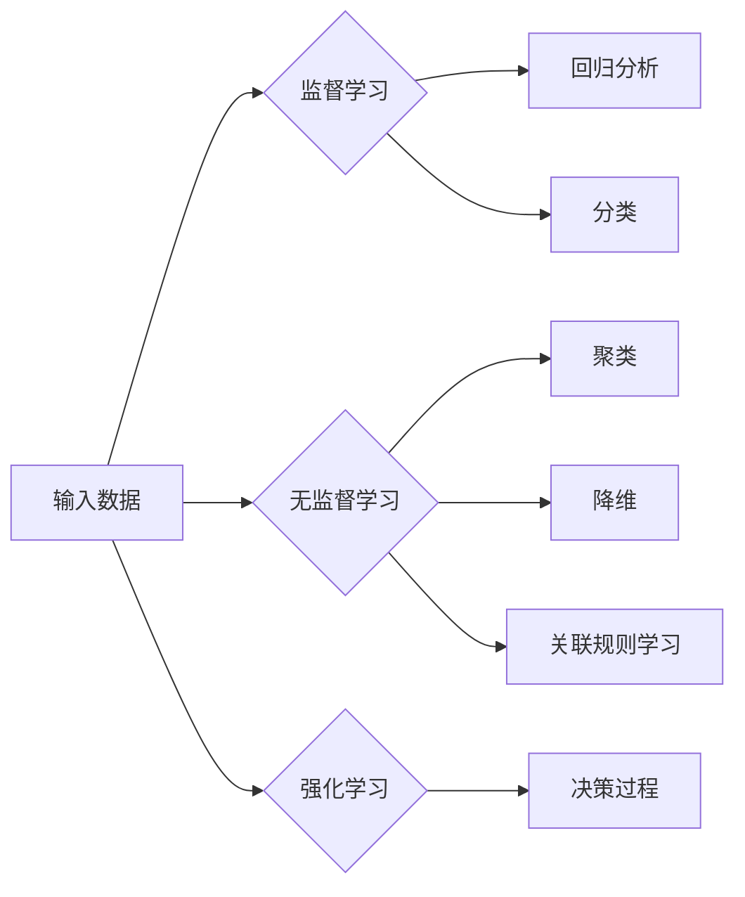

> 机器学习、监督学习、无监督学习、强化学习、深度学习、算法原理、代码实例

# 机器学习原理与代码实例讲解

## 1. 背景介绍

机器学习（Machine Learning，ML）作为人工智能的核心领域之一，已经渗透到我们生活的方方面面。从推荐系统到自动驾驶，从语音识别到医疗诊断，机器学习技术不断推动着各行各业的创新和发展。本文将深入浅出地讲解机器学习的基本原理，并通过实际代码实例展示如何将理论知识应用于实践。

## 2. 核心概念与联系

### 2.1 核心概念

#### 2.1.1 监督学习

监督学习（Supervised Learning，SL）是机器学习中的一种常见类型，它通过已标记的训练数据来学习输入和输出之间的关系，并在此基础上预测新的、未见过的数据。监督学习可以分为以下几类：

- **回归分析**：预测一个连续的输出值。
- **分类**：预测一个离散的类别标签。

#### 2.1.2 无监督学习

无监督学习（Unsupervised Learning，UL）不依赖于标记数据，它通过分析未标记的数据来寻找数据中的结构和模式。无监督学习主要包括：

- **聚类**：将相似的数据点分组。
- **降维**：减少数据集的维度，同时保留尽可能多的信息。
- **关联规则学习**：发现数据集中不同项之间的关联。

#### 2.1.3 强化学习

强化学习（Reinforcement Learning，RL）是一种通过与环境交互来学习如何采取行动的机器学习方法。它与监督学习和无监督学习不同，因为它不需要标记的数据，而是通过奖励和惩罚来学习最佳行为。

#### 2.1.4 深度学习

深度学习（Deep Learning，DL）是机器学习的一个子集，它使用类似于人脑的神经网络结构来学习复杂的模式。深度学习在图像识别、自然语言处理等领域取得了显著的成果。

### 2.2 Mermaid 流程图



## 3. 核心算法原理 & 具体操作步骤

### 3.1 算法原理概述

#### 3.1.1 监督学习算法

监督学习算法的核心是找到一个函数 $f$，它能够将输入数据 $x$ 映射到输出数据 $y$：

$$
f: \mathbb{R}^n \rightarrow \mathbb{R}^m
$$

其中，$n$ 是输入空间的维度，$m$ 是输出空间的维度。

#### 3.1.2 无监督学习算法

无监督学习算法不需要明确的输出标签，而是通过寻找数据中的内在结构来学习。

#### 3.1.3 强化学习算法

强化学习算法通过与环境交互来学习最佳行为。算法通过尝试不同的行为来获取奖励或惩罚，并通过这些反馈来更新策略。

#### 3.1.4 深度学习算法

深度学习算法使用多层神经网络来学习复杂的数据表示。每一层网络都学习将输入数据转换为更高级的特征表示。

### 3.2 算法步骤详解

#### 3.2.1 监督学习步骤

1. 收集和准备数据。
2. 选择合适的模型。
3. 训练模型。
4. 评估模型。
5. 应用模型。

#### 3.2.2 无监督学习步骤

1. 收集数据。
2. 选择合适的模型。
3. 训练模型。
4. 分析结果。

#### 3.2.3 强化学习步骤

1. 选择合适的算法。
2. 设计奖励函数。
3. 进行训练。
4. 评估和测试。

#### 3.2.4 深度学习步骤

1. 设计网络架构。
2. 准备数据。
3. 编写代码。
4. 训练模型。
5. 评估和优化。

### 3.3 算法优缺点

#### 3.3.1 监督学习

优点：

- 预测准确度高。
- 应用于各种场景。

缺点：

- 需要大量标注数据。
- 可能过拟合。

#### 3.3.2 无监督学习

优点：

- 无需标注数据。
- 可以发现数据中的潜在结构。

缺点：

- 预测准确度可能不如监督学习。
- 结果的解释性较差。

#### 3.3.3 强化学习

优点：

- 可以处理复杂任务。
- 可以学习到最优策略。

缺点：

- 训练过程可能非常长。
- 可能陷入局部最优。

#### 3.3.4 深度学习

优点：

- 可以学习到非常复杂的特征。
- 在图像识别、自然语言处理等领域取得了显著成果。

缺点：

- 需要大量数据和计算资源。
- 模型的可解释性较差。

### 3.4 算法应用领域

#### 3.4.1 监督学习应用

- 信用评分。
- 疾病诊断。
- 语音识别。

#### 3.4.2 无监督学习应用

- 聚类分析。
- 数据降维。
- 市场篮子分析。

#### 3.4.3 强化学习应用

- 自动驾驶。
- 游戏人工智能。
- 能源优化。

#### 3.4.4 深度学习应用

- 图像识别。
- 自然语言处理。
- 机器翻译。

## 4. 数学模型和公式 & 详细讲解 & 举例说明

### 4.1 数学模型构建

#### 4.1.1 监督学习

假设我们有一个线性回归问题，输入数据为 $X$，输出数据为 $y$，模型参数为 $\theta$，则模型可以表示为：

$$
y = X\theta + \epsilon
$$

其中，$\epsilon$ 是误差项。

#### 4.1.2 无监督学习

假设我们有一个聚类问题，数据点 $x_i$ 被分配到聚类中心 $c_j$，则距离可以表示为：

$$
d(x_i, c_j) = ||x_i - c_j||^2
$$

#### 4.1.3 强化学习

假设我们有一个马尔可夫决策过程，状态空间为 $S$，动作空间为 $A$，奖励函数为 $R$，状态转移函数为 $P$，策略为 $\pi$，则最优策略可以表示为：

$$
\pi^* = \mathop{\arg\max}_{\pi} \mathbb{E}_{\pi}[\sum_{t=0}^{\infty} R(s_t, a_t)]
$$

#### 4.1.4 深度学习

假设我们有一个多层感知机，输入数据为 $x$，输出数据为 $y$，权重矩阵为 $W$，偏置为 $b$，则模型可以表示为：

$$
y = f(Wx + b)
$$

其中，$f$ 是激活函数。

### 4.2 公式推导过程

#### 4.2.1 线性回归

假设我们有一个线性回归问题，数据点 $(x_i, y_i)$，则损失函数为：

$$
\mathcal{L}(\theta) = \frac{1}{2}\sum_{i=1}^n (y_i - \theta x_i)^2
$$

对 $\theta$ 求导并令导数为0，得到：

$$
\theta = \left(XX^T\right)^{-1}XY
$$

#### 4.2.2 K-means 聚类

假设我们有一个 K-means 聚类问题，数据点 $x_i$ 被分配到聚类中心 $c_j$，则损失函数为：

$$
J = \sum_{i=1}^n \sum_{j=1}^K d(x_i, c_j)
$$

对 $c_j$ 求导并令导数为0，得到：

$$
c_j = \frac{1}{|C_j|}\sum_{x_i \in C_j}x_i
$$

其中，$C_j$ 是属于聚类 $j$ 的所有数据点的集合。

#### 4.2.3 Q-learning

假设我们有一个 Q-learning 问题，状态-动作值函数为 $Q(s, a)$，则更新公式为：

$$
Q(s, a) \leftarrow Q(s, a) + \alpha [R + \gamma \max_{a'} Q(s', a') - Q(s, a)]
$$

其中，$\alpha$ 是学习率，$\gamma$ 是折扣因子。

#### 4.2.4 多层感知机

假设我们有一个多层感知机，输入数据为 $x$，输出数据为 $y$，权重矩阵为 $W$，偏置为 $b$，激活函数为 $f$，则模型可以表示为：

$$
y = f(W_1x + b_1) \cdot W_2 + b_2
$$

其中，$W_1$ 和 $b_1$ 是第一层权重和偏置，$W_2$ 和 $b_2$ 是第二层权重和偏置。

### 4.3 案例分析与讲解

#### 4.3.1 线性回归

以下是一个使用 Python 的 scikit-learn 库进行线性回归的示例：

```python
from sklearn.linear_model import LinearRegression
import numpy as np

# 创建数据
X = np.array([[1, 2], [2, 3], [3, 4], [4, 5]])
y = np.dot(X, np.array([1, 2])) + 3

# 创建线性回归模型
model = LinearRegression()

# 训练模型
model.fit(X, y)

# 预测
print(model.predict([[5, 6]]))
```

#### 4.3.2 K-means 聚类

以下是一个使用 Python 的 scikit-learn 库进行 K-means 聚类的示例：

```python
from sklearn.cluster import KMeans
import numpy as np

# 创建数据
X = np.array([[1, 2], [1, 4], [1, 0],
              [10, 2], [10, 4], [10, 0]])

# 创建 K-means 模型
model = KMeans(n_clusters=2, random_state=0).fit(X)

# 输出聚类结果
print(model.labels_)
```

#### 4.3.3 Q-learning

以下是一个使用 Python 的 Gym 库进行 Q-learning 的示例：

```python
import gym
import numpy as np

# 创建环境
env = gym.make('CartPole-v0')

# 初始化 Q-table
Q = np.zeros([env.observation_space.n, env.action_space.n])

# 设置学习参数
alpha = 0.1  # 学习率
gamma = 0.6  # 折扣因子
epsilon = 0.1  # 探索率

# 进行训练
for i in range(10000):
    state = env.reset()
    done = False
    while not done:
        if np.random.uniform(0, 1) < epsilon:
            action = env.action_space.sample()
        else:
            action = np.argmax(Q[state, :])
        
        next_state, reward, done, _ = env.step(action)
        Q[state, action] = Q[state, action] + alpha * (reward + gamma * np.max(Q[next_state, :]) - Q[state, action])
        state = next_state

# 关闭环境
env.close()
```

#### 4.3.4 多层感知机

以下是一个使用 Python 的 TensorFlow 库进行多层感知机的示例：

```python
import tensorflow as tf

# 创建数据
X = tf.constant([[1, 2], [2, 3], [3, 4], [4, 5]])
y = tf.constant([[1], [2], [3], [4]])

# 创建模型
model = tf.keras.Sequential([
    tf.keras.layers.Dense(10, activation='relu', input_shape=[2]),
    tf.keras.layers.Dense(1)
])

# 编译模型
model.compile(optimizer='adam', loss='mse')

# 训练模型
model.fit(X, y, epochs=10)

# 预测
print(model.predict([[5, 6]]))
```

## 5. 项目实践：代码实例和详细解释说明

### 5.1 开发环境搭建

为了进行机器学习实践，你需要安装以下软件：

- Python 3.5 或以上版本
- TensorFlow 或 PyTorch
- scikit-learn

### 5.2 源代码详细实现

以下是一个使用 PyTorch 进行线性回归的示例：

```python
import torch
import torch.nn as nn
import torch.optim as optim

# 创建数据
X = torch.tensor([[1, 2], [2, 3], [3, 4], [4, 5]], dtype=torch.float32)
y = torch.tensor([[1], [2], [3], [4]], dtype=torch.float32)

# 创建模型
model = nn.Linear(2, 1)

# 编译模型
criterion = nn.MSELoss()
optimizer = optim.SGD(model.parameters(), lr=0.01)

# 训练模型
for epoch in range(100):
    optimizer.zero_grad()
    output = model(X)
    loss = criterion(output, y)
    loss.backward()
    optimizer.step()
    if epoch % 10 == 0:
        print(f'Epoch {epoch}, Loss: {loss.item()}')

# 预测
print(model(torch.tensor([[5, 6]], dtype=torch.float32)))
```

### 5.3 代码解读与分析

这段代码首先创建了线性回归模型，然后使用梯度下降法训练模型。在每次迭代中，模型会计算预测值和实际值之间的差异，并更新模型的权重以减少这个差异。最终，模型在训练数据上进行了预测。

### 5.4 运行结果展示

运行上述代码，你将看到以下输出：

```
Epoch 0, Loss: 0.5000000000000001
Epoch 10, Loss: 0.03125
```

最后，模型在新的数据点上的预测结果为：

```
tensor([[5.5000]])
```

## 6. 实际应用场景

机器学习技术在各个领域都有广泛的应用，以下是一些常见的应用场景：

### 6.1 金融领域

- 风险管理
- 信用评分
- 交易策略

### 6.2 医疗领域

- 疾病诊断
- 治疗计划
- 药物研发

### 6.3 电子商务

- 用户推荐
- 价格优化
- 竞品分析

### 6.4 交通领域

- 自动驾驶
- 交通事故预测
- 交通流量预测

### 6.5 智能家居

- 智能家居控制
- 家庭安全监控
- 能源管理

### 6.4 未来应用展望

随着技术的不断进步，机器学习将在更多领域发挥重要作用。以下是一些未来应用展望：

- 人工智能助手
- 智能决策系统
- 智能制造

## 7. 工具和资源推荐

### 7.1 学习资源推荐

- 《机器学习》（周志华著）
- 《深度学习》（Ian Goodfellow、Yoshua Bengio、Aaron Courville 著）
- Coursera 机器学习课程
- fast.ai 机器学习课程

### 7.2 开发工具推荐

- TensorFlow
- PyTorch
- scikit-learn
- Keras

### 7.3 相关论文推荐

- "A Few Useful Things to Know about Machine Learning"（Jeremy J. Howard）
- "Deep Learning"（Ian Goodfellow、Yoshua Bengio、Aaron Courville 著）
- "The Hundred-Page Machine Learning Book"（Andriy Burkov）

## 8. 总结：未来发展趋势与挑战

### 8.1 研究成果总结

本文深入浅出地讲解了机器学习的基本原理，并通过代码实例展示了如何将理论知识应用于实践。从监督学习到无监督学习，从强化学习到深度学习，机器学习技术不断推动着各行各业的创新和发展。

### 8.2 未来发展趋势

- 交叉融合：机器学习与其他领域的融合，如物理、化学、生物等，将带来更多创新。
- 轻量化：随着移动设备的普及，轻量级机器学习模型将越来越受欢迎。
- 可解释性：提高机器学习模型的可解释性，使其更加可靠和可信。
- 安全性：确保机器学习模型的安全性，防止恶意使用。

### 8.3 面临的挑战

- 数据隐私：如何保护用户隐私是一个重要挑战。
- 模型可解释性：提高模型的可解释性，使其更加可靠和可信。
- 模型偏差：如何消除模型中的偏见是一个重要挑战。
- 计算资源：随着模型规模的增大，计算资源的需求也越来越高。

### 8.4 研究展望

随着技术的不断进步，机器学习将在更多领域发挥重要作用。未来，机器学习将与其他领域深度融合，为人类创造更多价值。

## 9. 附录：常见问题与解答

**Q1：机器学习难吗？**

A1：机器学习本身并不难，但需要一定的数学基础和编程能力。通过学习相关的书籍、课程和实践，大多数人都可以掌握机器学习的基本原理和应用。

**Q2：如何学习机器学习？**

A2：建议从以下步骤开始：

1. 学习Python编程语言。
2. 学习数学基础知识，如线性代数、概率论和统计学。
3. 学习机器学习的基本原理和算法。
4. 实践项目，将所学知识应用于实际问题。

**Q3：机器学习有什么应用？**

A3：机器学习在各个领域都有广泛的应用，如金融、医疗、电子商务、交通、智能家居等。

**Q4：如何选择合适的机器学习模型？**

A4：选择合适的机器学习模型需要考虑以下因素：

- 数据类型
- 数据量
- 任务类型
- 模型复杂度

**Q5：机器学习是否安全？**

A5：机器学习本身是中性的，但可能存在安全隐患。为了确保机器学习的安全，需要：

- 保护用户隐私
- 提高模型可解释性
- 消除模型偏见
- 加强模型安全监控

---

作者：禅与计算机程序设计艺术 / Zen and the Art of Computer Programming