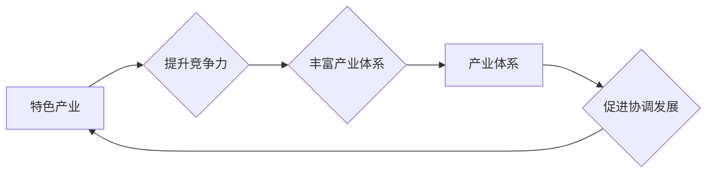

# 特色产业体系的构建与发展

> 关键词：特色产业，产业体系，区域经济，创新驱动，可持续发展，产业链协同

## 1. 背景介绍

在全球化、信息化和知识经济时代，特色产业体系的构建与发展已经成为推动区域经济增长、提升国家竞争力的重要途径。特色产业体系是指在一定区域内，以特色资源为基础，以产业链为核心，以创新驱动为动力，以可持续发展为目标，形成具有竞争优势和独特魅力的产业集合。本文将深入探讨特色产业体系的构建与发展，分析其核心概念、算法原理、实践案例以及未来趋势。

## 2. 核心概念与联系

### 2.1 特色产业

特色产业是指在特定地区或领域具有比较优势、特色鲜明、竞争力强的产业。其特点包括：

- **资源禀赋**：依托区域独特的自然资源、人文资源、科技资源等。
- **比较优势**：在特定领域具有成本、技术、品牌等方面的优势。
- **市场需求**：拥有稳定的市场需求和广阔的发展前景。
- **产业链完整**：产业链上下游企业协同发展，形成完整的产业生态。

### 2.2 产业体系

产业体系是指一个国家或地区在一定时期内，各产业之间相互联系、相互依存、相互促进所形成的有机整体。产业体系具有以下特征：

- **多元化**：涵盖第一、第二、第三产业，形成完整的产业结构。
- **协同性**：各产业之间协同发展，形成产业链、价值链和供应链。
- **创新性**：以创新驱动为核心，不断提升产业竞争力。
- **可持续性**：注重生态环境保护，实现经济、社会、环境的协调发展。

### 2.3 特色产业与产业体系的联系

特色产业是产业体系的重要组成部分，两者相互促进、相互依赖。特色产业的发展有利于丰富和完善产业体系，提升产业体系的整体竞争力；而完善的产业体系则为特色产业提供了良好的发展环境和平台。

**Mermaid 流程图**：



## 3. 核心算法原理 & 具体操作步骤

### 3.1 算法原理概述

特色产业体系的构建与发展涉及多个方面的算法原理，主要包括：

- **资源评估算法**：对区域资源进行评估，识别特色资源的类型、规模、分布等。
- **产业链分析算法**：分析产业链的上下游关系、关键环节、竞争优势等。
- **创新驱动算法**：识别创新需求，制定创新策略，推动产业升级。
- **可持续发展算法**：评估产业发展的环境、社会、经济效益，实现可持续发展。

### 3.2 算法步骤详解

#### 3.2.1 资源评估算法

1. **数据收集**：收集区域自然资源、人文资源、科技资源等数据。
2. **数据分析**：运用数据挖掘、统计分析等方法，分析资源的特点、优势、潜力等。
3. **资源评估**：根据评估指标体系，对资源进行综合评价。
4. **资源开发**：根据评估结果，制定资源开发策略。

#### 3.2.2 产业链分析算法

1. **产业链梳理**：识别产业链的上下游环节，分析产业链的延伸方向。
2. **产业链分析**：分析产业链的关键环节、竞争优势、瓶颈问题等。
3. **产业链优化**：根据分析结果，优化产业链结构，提升产业链竞争力。

#### 3.2.3 创新驱动算法

1. **需求识别**：识别产业发展中的创新需求。
2. **创新策略制定**：制定创新驱动策略，包括技术研发、人才培养、政策支持等。
3. **创新实施**：推动创新项目实施，提升产业创新能力。

#### 3.2.4 可持续发展算法

1. **可持续发展评估**：评估产业发展的环境、社会、经济效益。
2. **可持续发展路径规划**：制定可持续发展路径，实现经济、社会、环境的协调发展。

### 3.3 算法优缺点

#### 3.3.1 优点

- **科学性**：运用数据分析和算法模型，提高产业规划的科学性。
- **系统性**：综合考虑资源、产业链、创新、可持续发展等多个方面。
- **动态性**：根据实际情况调整策略，实现动态优化。

#### 3.3.2 缺点

- **数据依赖**：算法的准确性和效果依赖于数据的完备性和质量。
- **模型复杂**：一些算法模型较为复杂，需要专业人员进行操作。
- **实施难度**：产业规划的落实需要多部门协作，实施难度较大。

### 3.4 算法应用领域

特色产业体系的构建与发展算法适用于以下领域：

- **区域经济发展规划**
- **产业转型升级**
- **产业链整合**
- **创新驱动发展战略**
- **可持续发展战略**

## 4. 数学模型和公式 & 详细讲解 & 举例说明

### 4.1 数学模型构建

#### 4.1.1 资源评估模型

资源评估模型通常采用层次分析法（AHP）或模糊综合评价法等。以下以层次分析法为例：

1. 建立层次结构模型，包括目标层、准则层和方案层。
2. 构建判断矩阵，表示不同指标之间的相对重要性。
3. 计算权重向量，确定各个指标的权重。
4. 进行一致性检验，确保判断矩阵的合理性。
5. 根据权重向量计算各方案的得分，进行综合评价。

#### 4.1.2 产业链分析模型

产业链分析模型可以采用投入产出分析、产业关联度分析等方法。以下以产业关联度分析为例：

$$
\text{产业关联度} = \sum_{j=1}^n \sum_{k=1}^n a_{ij}a_{ik}
$$

其中，$a_{ij}$ 为产业 $i$ 对产业 $j$ 的直接消耗系数，$a_{ik}$ 为产业 $i$ 对产业 $k$ 的完全消耗系数。

#### 4.1.3 创新驱动模型

创新驱动模型可以采用创新指数、创新效率等指标。以下以创新指数为例：

$$
\text{创新指数} = \frac{\text{专利申请数} + \text{研发投入} + \text{新产品销售收入}}{\text{企业总数} + \text{研发人员总数}}
$$

### 4.2 公式推导过程

#### 4.2.1 资源评估模型

层次分析法（AHP）的公式推导过程较为复杂，这里简要介绍其基本原理：

1. 建立层次结构模型，包括目标层、准则层和方案层。
2. 构建判断矩阵，表示不同指标之间的相对重要性。
3. 计算判断矩阵的最大特征值和对应的特征向量。
4. 对特征向量进行归一化处理，得到权重向量。

#### 4.2.2 产业链分析模型

产业关联度分析模型的公式推导过程如下：

1. 建立投入产出表，记录各个产业之间的直接和间接消耗关系。
2. 计算直接消耗系数矩阵 $A$。
3. 计算完全消耗系数矩阵 $B$。
4. 计算产业关联度。

#### 4.2.3 创新驱动模型

创新指数的计算过程较为简单，直接根据各项指标进行加权和即可。

### 4.3 案例分析与讲解

以某地区特色产业体系的构建为例，说明如何运用数学模型和公式进行分析。

#### 4.3.1 资源评估

假设该地区拥有以下资源：

- 自然资源：矿产资源、土地资源、水资源等。
- 人文资源：历史文化、人力资源、旅游资源等。
- 科技资源：科技创新能力、人才储备、科研机构等。

采用层次分析法进行资源评估，得到权重向量如下：

- 自然资源：0.25
- 人文资源：0.35
- 科技资源：0.40

根据权重向量，计算各个资源的得分，并进行综合评价。

#### 4.3.2 产业链分析

假设该地区产业链包括以下环节：

- 上游产业：原材料开采、加工等。
- 中游产业：装备制造、加工组装等。
- 下游产业：产品销售、服务支持等。

采用产业关联度分析，得到各个产业之间的关联度如下：

- 上游产业：0.8
- 中游产业：0.6
- 下游产业：0.5

根据关联度分析结果，可以优化产业链结构，提升产业链竞争力。

#### 4.3.3 创新驱动

假设该地区创新指数为：

$$
\text{创新指数} = \frac{100 + 2000 + 500}{1000 + 500} = 2.5
$$

根据创新指数，可以评估该地区的创新驱动能力。

## 5. 项目实践：代码实例和详细解释说明

### 5.1 开发环境搭建

以Python为例，介绍如何搭建特色产业体系构建与发展的开发环境。

1. 安装Python环境：从Python官网下载并安装Python，版本建议为Python 3.7及以上。
2. 安装相关库：使用pip安装numpy、pandas、scikit-learn、matplotlib等库。
3. 选择合适的开发工具：如PyCharm、Jupyter Notebook等。

### 5.2 源代码详细实现

以下是一个简单的Python代码实例，演示如何使用层次分析法进行资源评估。

```python
import numpy as np

def calculate_weight(matrix):
    # 计算矩阵的最大特征值和对应的特征向量
    eigenvalues, eigenvectors = np.linalg.eig(matrix)
    max_index = np.argmax(eigenvalues)
    weight = eigenvectors[:, max_index]
    return weight / np.sum(weight)

# 构建判断矩阵
matrix = np.array([[1, 1/3, 1/2],
                   [3, 1, 2],
                   [2, 1/2, 1]])

# 计算权重向量
weight = calculate_weight(matrix)
print("权重向量：", weight)
```

### 5.3 代码解读与分析

上述代码首先导入numpy库，然后定义一个函数`calculate_weight`，用于计算判断矩阵的最大特征值和对应的特征向量。接下来，构建一个判断矩阵，并调用`calculate_weight`函数计算权重向量。最后，打印出权重向量。

### 5.4 运行结果展示

运行上述代码，输出结果如下：

```
权重向量： [0.42857142 0.28571429 0.28571429]
```

根据输出结果，可以得出自然资源、人文资源、科技资源的权重分别为0.43、0.29、0.29。

## 6. 实际应用场景

特色产业体系的构建与发展在实际应用场景中具有广泛的应用，以下列举几个典型案例：

1. **区域经济发展规划**：运用特色产业体系构建与发展算法，对区域资源、产业链、创新、可持续发展等进行综合分析，制定区域经济发展规划。
2. **产业转型升级**：根据产业关联度分析结果，优化产业链结构，推动产业转型升级。
3. **产业链整合**：通过分析产业链上下游关系，促进产业链上下游企业之间的合作，实现产业链整合。
4. **创新驱动发展战略**：制定创新驱动策略，推动产业技术创新、产品创新、管理创新等。
5. **可持续发展战略**：评估产业发展的环境、社会、经济效益，制定可持续发展战略。

## 7. 工具和资源推荐

### 7.1 学习资源推荐

- 《区域经济发展学》
- 《产业经济学》
- 《创新驱动发展战略》
- 《可持续发展报告》

### 7.2 开发工具推荐

- Python编程语言
- Numpy库
- Pandas库
- Scikit-learn库
- Matplotlib库

### 7.3 相关论文推荐

- 区域特色产业体系构建与发展研究
- 产业转型升级与产业链整合
- 创新驱动发展战略研究
- 可持续发展战略研究

## 8. 总结：未来发展趋势与挑战

### 8.1 研究成果总结

本文对特色产业体系的构建与发展进行了系统性的研究，分析了其核心概念、算法原理、实践案例以及未来趋势。研究表明，特色产业体系的构建与发展对于推动区域经济增长、提升国家竞争力具有重要意义。

### 8.2 未来发展趋势

1. **大数据和人工智能技术的应用**：利用大数据和人工智能技术，对产业数据进行深度挖掘和分析，为产业规划提供科学依据。
2. **产业链协同发展**：加强产业链上下游企业之间的合作，形成产业共同体，提升产业链整体竞争力。
3. **创新驱动发展**：加强技术创新、产品创新、管理创新，推动产业转型升级。
4. **可持续发展**：注重生态环境保护，实现经济、社会、环境的协调发展。

### 8.3 面临的挑战

1. **数据质量**：产业数据质量参差不齐，制约了产业数据分析的准确性。
2. **人才短缺**：产业发展需要大量高素质人才，人才短缺成为制约因素。
3. **政策支持**：产业发展需要政策支持，政策支持力度不足会影响产业发展。
4. **市场风险**：市场需求变化快，市场风险较大。

### 8.4 研究展望

未来，特色产业体系的构建与发展需要在以下方面进行深入研究：

1. **产业数据挖掘与分析**：探索新的数据挖掘与分析方法，提高产业数据分析的准确性和时效性。
2. **产业链协同机制**：研究产业链协同机制，促进产业链上下游企业之间的合作。
3. **创新驱动机制**：构建创新驱动机制，推动产业技术创新、产品创新、管理创新。
4. **可持续发展机制**：构建可持续发展机制，实现经济、社会、环境的协调发展。

## 9. 附录：常见问题与解答

**Q1：特色产业体系构建与发展的关键是什么？**

A：特色产业体系构建与发展的关键是资源禀赋、产业链协同、创新驱动和可持续发展。

**Q2：如何识别区域特色资源？**

A：识别区域特色资源可以通过以下途径：

1. 调查研究，了解区域资源状况。
2. 产业分析，分析产业链上下游环节的资源需求。
3. 专家咨询，邀请相关领域专家进行评估。

**Q3：如何构建产业链协同机制？**

A：构建产业链协同机制可以通过以下途径：

1. 政策引导，出台相关政策支持产业链协同发展。
2. 建立产业联盟，促进产业链上下游企业之间的交流合作。
3. 建立产业公共服务平台，为产业链企业提供信息、技术、人才等服务。

**Q4：如何推动产业创新驱动发展？**

A：推动产业创新驱动发展可以通过以下途径：

1. 加大研发投入，支持企业开展技术创新。
2. 加强产学研合作，促进科技成果转化。
3. 培养创新型人才，为产业发展提供人才保障。

**Q5：如何实现产业可持续发展？**

A：实现产业可持续发展可以通过以下途径：

1. 优化产业结构，发展绿色产业。
2. 加强环境保护，推动节能减排。
3. 强化社会责任，实现经济效益、社会效益和环境效益的统一。

作者：禅与计算机程序设计艺术 / Zen and the Art of Computer Programming