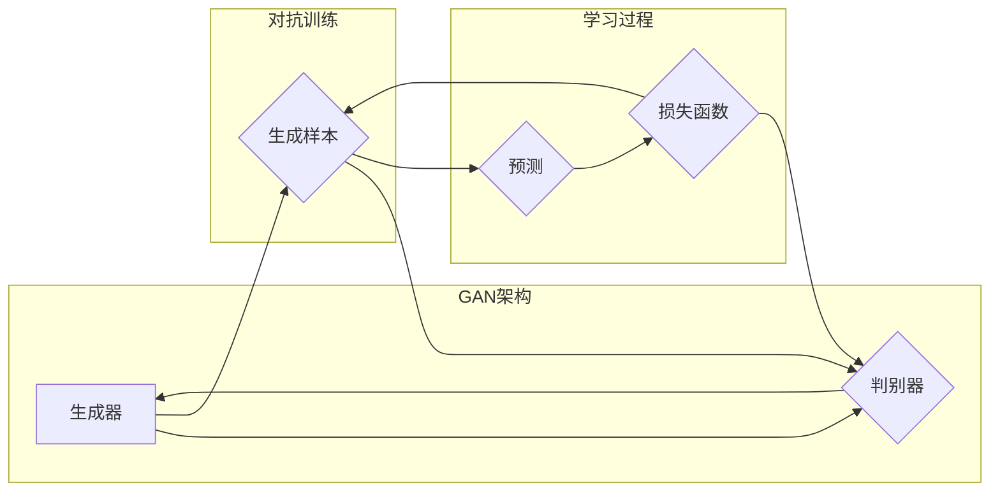

# 生成对抗网络GAN原理与代码实例讲解

> 关键词：生成对抗网络，GAN，深度学习，生成模型，判别器，生成器，对抗训练，生成质量，图像生成，数据增强

## 1. 背景介绍

生成对抗网络（Generative Adversarial Networks，GANs）是深度学习领域的一种重要模型，由Ian Goodfellow等人在2014年提出。GANs通过对抗训练的方式学习数据分布，能够生成与真实数据非常相似的数据样本。由于其在图像生成、数据增强、风格迁移等领域的广泛应用，GANs成为了深度学习研究的热点之一。

### 1.1 问题的由来

在机器学习领域，生成模型旨在学习数据分布，并能够根据该分布生成新的数据样本。传统的生成模型如高斯混合模型（Gaussian Mixture Model，GMM）、变分自编码器（Variational Autoencoder，VAE）等，在生成质量、灵活性以及处理复杂分布方面存在局限性。

GANs通过引入对抗训练的思想，解决了传统生成模型的诸多问题，能够在许多任务上生成高质量的数据样本。

### 1.2 研究现状

近年来，随着深度学习技术的飞速发展，GANs在图像生成、视频生成、音频生成等领域取得了显著的成果。同时，针对GANs的优化算法、稳定性、可控性等方面也进行了深入研究，涌现出了许多改进的GAN变体。

### 1.3 研究意义

GANs的研究具有重要的理论意义和应用价值：

- **理论意义**：GANs为生成模型提供了一种新的思路，推动了生成模型领域的发展。
- **应用价值**：GANs在图像生成、数据增强、风格迁移等领域的应用，为许多实际问题提供了解决方案。

### 1.4 本文结构

本文将介绍GANs的原理、算法步骤、数学模型、代码实现以及实际应用场景，旨在帮助读者全面了解GANs及其应用。

## 2. 核心概念与联系

### 2.1 Mermaid 流程图



### 2.2 核心概念

- **生成器（Generator）**：生成器是GANs中的一个神经网络，其目标是生成与真实数据分布相似的数据样本。
- **判别器（Discriminator）**：判别器是GANs中的另一个神经网络，其目标是区分真实数据和生成数据。
- **对抗训练**：生成器和判别器在对抗训练过程中相互竞争，生成器试图生成更难以被判别器识别的样本，而判别器则试图准确识别样本的真实性。
- **损失函数**：损失函数用于衡量生成器生成的样本与真实样本之间的差异，以及判别器对样本真实性的判断准确度。

## 3. 核心算法原理 & 具体操作步骤

### 3.1 算法原理概述

GANs通过对抗训练的方式学习数据分布。生成器生成数据样本，判别器判断样本的真实性。两者在对抗训练过程中相互竞争，生成器试图生成更难以被识别的样本，而判别器则试图提高识别准确度。

### 3.2 算法步骤详解

1. 初始化生成器和判别器：使用随机权重初始化生成器和判别器。
2. 生成器生成样本：生成器根据随机噪声生成数据样本。
3. 判别器判断样本真实性：判别器对生成器和真实数据样本进行判断。
4. 计算损失函数：根据判别器的判断结果，计算生成器和判别器的损失函数。
5. 更新生成器和判别器参数：根据损失函数的梯度，更新生成器和判别器的参数。
6. 重复步骤2-5，直至模型收敛。

### 3.3 算法优缺点

**优点**：

- 能够生成高质量的数据样本。
- 能够处理复杂的数据分布。
- 可以应用于各种数据类型，如图像、视频、音频等。

**缺点**：

- 训练过程不稳定，容易出现模式崩溃（mode collapse）和梯度消失（gradient vanishing）等问题。
- 难以理解生成器的内部机制。

### 3.4 算法应用领域

- 图像生成：生成逼真的图像、艺术作品、卡通等。
- 数据增强：生成训练数据，提高模型的泛化能力。
- 风格迁移：将一种风格迁移到另一种风格，如将照片转换为油画风格。

## 4. 数学模型和公式 & 详细讲解 & 举例说明

### 4.1 数学模型构建

GANs的数学模型由以下两部分组成：

- **生成器**：$G(z) = F(z; \theta_G)$，其中 $z$ 是输入噪声向量，$F(z; \theta_G)$ 是生成器的参数化映射函数。
- **判别器**：$D(x; \theta_D) = \sigma(W_D \cdot \phi(x; \theta_D) + b_D)$，其中 $x$ 是真实数据样本，$W_D$ 和 $b_D$ 是判别器的权重和偏置，$\phi(x; \theta_D)$ 是判别器的参数化映射函数，$\sigma$ 是Sigmoid激活函数。

### 4.2 公式推导过程

GANs的目标是最小化以下损失函数：

$$
\min_G \max_D V(G,D) = \min_G \max_D \mathbb{E}_{z \sim p(z)}[\log D(G(z))] + \mathbb{E}_{x \sim p(x)}[\log(1 - D(x))]
$$

其中，$p(z)$ 是噪声分布，$p(x)$ 是真实数据分布。

### 4.3 案例分析与讲解

以生成逼真图像为例，生成器 $G$ 生成图像 $x^G$，判别器 $D$ 判断图像 $x^G$ 的真实性。当 $D(x^G) \approx 1$ 时，表示生成器生成的图像非常真实；当 $D(x^G) \approx 0$ 时，表示生成器生成的图像与真实图像差异较大。

## 5. 项目实践：代码实例和详细解释说明

### 5.1 开发环境搭建

1. 安装深度学习框架（如TensorFlow或PyTorch）。
2. 安装GAN相关的库（如GANimation）。

### 5.2 源代码详细实现

以下是一个使用PyTorch实现的简单GAN示例：

```python
import torch
import torch.nn as nn
import torch.optim as optim
from torchvision import datasets, transforms
from torchvision.utils import save_image

# 定义生成器
class Generator(nn.Module):
    def __init__(self):
        super(Generator, self).__init__()
        self.model = nn.Sequential(
            nn.Linear(100, 256),
            nn.LeakyReLU(0.2, inplace=True),
            nn.Linear(256, 512),
            nn.LeakyReLU(0.2, inplace=True),
            nn.Linear(512, 1024),
            nn.LeakyReLU(0.2, inplace=True),
            nn.Linear(1024, 784),
            nn.Tanh()
        )

    def forward(self, z):
        return self.model(z)

# 定义判别器
class Discriminator(nn.Module):
    def __init__(self):
        super(Discriminator, self).__init__()
        self.model = nn.Sequential(
            nn.Linear(784, 1024),
            nn.LeakyReLU(0.2, inplace=True),
            nn.Linear(1024, 512),
            nn.LeakyReLU(0.2, inplace=True),
            nn.Linear(512, 256),
            nn.LeakyReLU(0.2, inplace=True),
            nn.Linear(256, 1),
            nn.Sigmoid()
        )

    def forward(self, x):
        return self.model(x)

# 设置超参数
batch_size = 64
lr = 0.0002
epochs = 50

# 创建数据集和数据加载器
transform = transforms.Compose([
    transforms.ToTensor(),
    transforms.Normalize((0.5, 0.5, 0.5), (0.5, 0.5, 0.5))
])
dataset = datasets.MNIST(root='./data', train=True, download=True, transform=transform)
dataloader = torch.utils.data.DataLoader(dataset, batch_size=batch_size, shuffle=True)

# 初始化生成器和判别器
generator = Generator()
discriminator = Discriminator()

# 损失函数和优化器
criterion = nn.BCELoss()
optimizer_g = optim.Adam(generator.parameters(), lr=lr)
optimizer_d = optim.Adam(discriminator.parameters(), lr=lr)

# 训练过程
for epoch in range(epochs):
    for i, (images, _) in enumerate(dataloader):
        # 训练判别器
        optimizer_d.zero_grad()
        real_images = images.to(device)
        fake_images = generator(noise(z)).to(device)
        real_loss = criterion(discriminator(real_images), torch.ones_like(discriminator(real_images)))
        fake_loss = criterion(discriminator(fake_images.detach()), torch.zeros_like(discriminator(fake_images.detach())))
        d_loss = real_loss + fake_loss
        d_loss.backward()
        optimizer_d.step()

        # 训练生成器
        optimizer_g.zero_grad()
        fake_loss = criterion(discriminator(fake_images), torch.ones_like(discriminator(fake_images)))
        g_loss = fake_loss
        g_loss.backward()
        optimizer_g.step()

        # 输出训练信息
        if i % 100 == 0:
            print(f'Epoch [{epoch}/{epochs}], Step [{i}/{len(dataloader)}], d_loss: {d_loss.item():.4f}, g_loss: {g_loss.item():.4f}')

    # 保存生成图像
    save_image(fake_images.data, f'images/{epoch}.png', nrow=10, normalize=True)

# 生成器参数保存
torch.save(generator.state_dict(), 'generator.pth')
torch.save(discriminator.state_dict(), 'discriminator.pth')
```

### 5.3 代码解读与分析

1. **生成器和判别器定义**：使用PyTorch定义了生成器和判别器的神经网络结构。
2. **数据集和数据加载器**：使用MNIST数据集作为训练数据，并使用ToTensor和Normalize进行预处理。
3. **损失函数和优化器**：使用BCELoss作为损失函数，使用Adam作为优化器。
4. **训练过程**：循环迭代地训练生成器和判别器，通过反向传播更新参数。
5. **保存生成图像**：在每个epoch结束后，保存生成的图像。
6. **保存模型参数**：将生成器和判别器的参数保存到文件中。

### 5.4 运行结果展示

在训练过程中，可以看到生成器生成的图像质量逐渐提高，直至收敛。

## 6. 实际应用场景

### 6.1 图像生成

GANs在图像生成领域取得了显著成果，可以生成各种类型的图像，如图像到图像、图像到视频、图像到3D模型等。

### 6.2 数据增强

GANs可以生成大量训练数据，提高模型的泛化能力。

### 6.3 风格迁移

GANs可以将一种风格迁移到另一种风格，如将照片转换为油画风格。

## 7. 工具和资源推荐

### 7.1 学习资源推荐

- 《生成对抗网络：原理、算法与应用》
- 《深度学习与生成模型》
- GANimation：https://github.com/charlesq34/GANimation

### 7.2 开发工具推荐

- PyTorch：https://pytorch.org/
- TensorFlow：https://www.tensorflow.org/

### 7.3 相关论文推荐

- Generative Adversarial Nets (Goodfellow et al., 2014)
- Unsupervised Representation Learning with Deep Convolutional Generative Adversarial Networks (Radford et al., 2015)
- Instance Normalization: The missing ingredient for fast stylized GANs (Ulyanov et al., 2016)

## 8. 总结：未来发展趋势与挑战

### 8.1 研究成果总结

GANs作为一种新兴的生成模型，在图像生成、数据增强、风格迁移等领域取得了显著的成果。然而，GANs仍然面临着一些挑战，如训练不稳定、生成质量差、模型可解释性差等。

### 8.2 未来发展趋势

- 研究更加稳定、高效的GANs算法。
- 提高生成质量，生成更加真实、多样化的数据样本。
- 提高模型可解释性，理解生成过程的内在机制。
- 将GANs应用于更多领域，如音频、视频、文本等。

### 8.3 面临的挑战

- 训练不稳定，容易出现模式崩溃和梯度消失等问题。
- 生成质量难以保证，生成的数据样本可能存在模糊、不真实等问题。
- 模型可解释性差，难以理解生成过程的内在机制。

### 8.4 研究展望

随着研究的不断深入，GANs将在更多领域发挥重要作用，为人工智能的发展做出更大的贡献。

## 9. 附录：常见问题与解答

**Q1：GANs的原理是什么？**

A：GANs是一种基于对抗训练的生成模型，由生成器和判别器两个神经网络组成。生成器生成数据样本，判别器判断样本的真实性。两者在对抗训练过程中相互竞争，生成器试图生成更难以被识别的样本，而判别器则试图提高识别准确度。

**Q2：GANs在哪些领域有应用？**

A：GANs在图像生成、数据增强、风格迁移等领域有广泛的应用。

**Q3：如何解决GANs训练不稳定的问题？**

A：可以使用以下方法解决GANs训练不稳定的问题：

- 使用权重剪裁（weight clipping）技术。
- 使用更稳定的优化器，如AdamW。
- 使用梯度惩罚（gradient penalty）技术。
- 使用Wasserstein GANs或LSGANs等改进的GANs变体。

**Q4：如何提高GANs生成质量？**

A：可以使用以下方法提高GANs生成质量：

- 使用更复杂的网络结构。
- 使用更长的训练时间。
- 使用数据增强技术。
- 使用改进的GANs变体，如StyleGAN2。

**Q5：GANs与VAE有什么区别？**

A：GANs和VAE都是生成模型，但它们在原理和目标上有所不同。

- GANs的目的是生成与真实数据分布相似的数据样本，而VAE的目的是学习数据分布的潜在空间表示。
- GANs的生成质量通常比VAE更好，但训练不稳定，且模型可解释性差。

作者：禅与计算机程序设计艺术 / Zen and the Art of Computer Programming