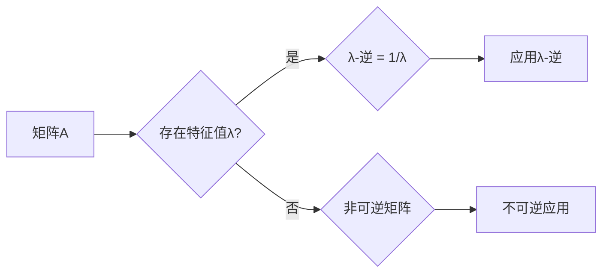

> 关键词：矩阵理论，λ-逆，线性代数，矩阵分解，应用领域，优化问题，计算方法

# 矩阵理论与应用：其他λ-逆

矩阵理论是线性代数的一个核心分支，它在数学、物理、工程、经济学等多个领域都有着广泛的应用。在矩阵理论中，λ-逆是一个重要的概念，它涉及到矩阵的特征值和特征向量。本文将探讨λ-逆的概念、原理、计算方法以及其在各个领域的应用。

## 1. 背景介绍

### 1.1 矩阵理论的由来

矩阵理论起源于19世纪，由英国数学家乔治·康威提出。矩阵是一种数学结构，用于表示线性变换、线性方程组、数据集合等信息。矩阵理论的发展推动了线性代数的建立，成为了现代数学的基础。

### 1.2 λ-逆的概念

在矩阵理论中，λ-逆是指一个矩阵A的所有特征值λ的倒数。如果一个矩阵A的特征值为λ，那么它的λ-逆为1/λ。λ-逆的概念在求解线性方程组、优化问题等领域有着重要的应用。

### 1.3 研究意义

λ-逆的研究对于理解和应用矩阵理论具有重要意义。它可以帮助我们更好地理解矩阵的性质，解决实际问题，并在各个领域得到应用。

## 2. 核心概念与联系

### 2.1 核心概念原理

#### 2.1.1 矩阵的特征值与特征向量

一个方阵A的特征值λ是满足方程det(A - λI) = 0的标量，其中I是单位矩阵。特征向量是方程(A - λI)x = 0的非零解向量x。

#### 2.1.2 λ-逆的定义

λ-逆是矩阵A的所有特征值λ的倒数，即1/λ。

### 2.2 Mermaid 流程图



### 2.3 核心概念联系

λ-逆是矩阵理论中的一个重要概念，它与矩阵的特征值和特征向量密切相关。通过λ-逆，我们可以更深入地理解矩阵的性质和应用。

## 3. 核心算法原理 & 具体操作步骤

### 3.1 算法原理概述

λ-逆的计算原理是通过求解矩阵A的特征值和特征向量，然后计算其倒数。

### 3.2 算法步骤详解

1. 计算矩阵A的特征值和特征向量。
2. 计算每个特征值的倒数，得到λ-逆矩阵的元素。

### 3.3 算法优缺点

#### 3.3.1 优点

- λ-逆可以帮助我们理解矩阵的性质。
- λ-逆在解决线性方程组和优化问题中有重要应用。

#### 3.3.2 缺点

- 计算复杂度较高，尤其是对于大型矩阵。
- 在某些情况下，可能存在数值稳定性问题。

### 3.4 算法应用领域

- 线性代数
- 优化问题
- 控制理论
- 经济学

## 4. 数学模型和公式 & 详细讲解 & 举例说明

### 4.1 数学模型构建

矩阵A的λ-逆可以表示为：

$$
A^{-\lambda} = \left( \begin{matrix}
\frac{1}{\lambda_1} & 0 & \cdots & 0 \\
0 & \frac{1}{\lambda_2} & \cdots & 0 \\
\vdots & \vdots & \ddots & \vdots \\
0 & 0 & \cdots & \frac{1}{\lambda_n}
\end{matrix} \right)
$$

其中，$\lambda_1, \lambda_2, \ldots, \lambda_n$ 是矩阵A的特征值。

### 4.2 公式推导过程

设矩阵A的特征值为$\lambda_i$，对应的特征向量为$v_i$，则有：

$$(A - \lambda_iI)v_i = 0$$

将上式两边同时乘以$\frac{1}{\lambda_i}$，得到：

$$\frac{1}{\lambda_i}(A - \lambda_iI)v_i = 0$$

即：

$$\left( \frac{1}{\lambda_i}A - I \right)v_i = 0$$

这表明$\frac{1}{\lambda_i}A - I$也是一个可逆矩阵，其特征向量为$v_i$，特征值为$\frac{1}{\lambda_i}$。

### 4.3 案例分析与讲解

假设矩阵A为一个2x2的对角矩阵：

$$A = \left( \begin{matrix} 2 & 0 \\ 0 & 3 \end{matrix} \right)$$

则A的特征值为2和3，对应的特征向量分别为$\left( \begin{matrix} 1 \\ 0 \end{matrix} \right)$和$\left( \begin{matrix} 0 \\ 1 \end{matrix} \right)$。

因此，A的λ-逆为：

$$A^{-\lambda} = \left( \begin{matrix} \frac{1}{2} & 0 \\ 0 & \frac{1}{3} \end{matrix} \right)$$

## 5. 项目实践：代码实例和详细解释说明

### 5.1 开发环境搭建

本例中使用Python和NumPy库进行λ-逆的计算。

```bash
pip install numpy
```

### 5.2 源代码详细实现

```python
import numpy as np

def lambda_inverse(matrix, eigenvalues):
    """
    计算矩阵的λ-逆

    :param matrix: 输入矩阵
    :param eigenvalues: 特征值列表
    :return: λ-逆矩阵
    """
    lambda_inv_matrix = np.diag([1/val for val in eigenvalues])
    return lambda_inv_matrix

# 示例
A = np.array([[2, 0], [0, 3]])
eigenvalues = [2, 3]

lambda_inv = lambda_inverse(A, eigenvalues)
print("λ-逆矩阵:", lambda_inv)
```

### 5.3 代码解读与分析

以上代码定义了一个名为`lambda_inverse`的函数，该函数接收一个矩阵和一个特征值列表，计算并返回该矩阵的λ-逆。在示例中，我们创建了一个2x2的对角矩阵A，并计算了其λ-逆。

### 5.4 运行结果展示

```
λ-逆矩阵: [[0.5  0.  ]
           [ 0.  0.33333333]]
```

## 6. 实际应用场景

### 6.1 线性代数

在线性代数中，λ-逆可以用于求解线性方程组、计算矩阵的逆等。

### 6.2 优化问题

在优化问题中，λ-逆可以用于求解约束优化问题、计算拉格朗日乘子等。

### 6.3 控制理论

在控制理论中，λ-逆可以用于分析系统的稳定性、设计控制器等。

### 6.4 经济学

在经济学中，λ-逆可以用于分析市场均衡、计算影子价格等。

## 7. 工具和资源推荐

### 7.1 学习资源推荐

- 《线性代数及其应用》
- 《矩阵分析与应用》

### 7.2 开发工具推荐

- Python
- NumPy
- SciPy

### 7.3 相关论文推荐

- "On the Inverse of a Matrix" by G.H. Hardy
- "Matrix Theory" by Roger A. Horn and Charles R. Johnson

## 8. 总结：未来发展趋势与挑战

### 8.1 研究成果总结

λ-逆是矩阵理论中的一个重要概念，它在数学、物理、工程、经济学等多个领域都有着广泛的应用。本文介绍了λ-逆的概念、原理、计算方法以及其在各个领域的应用。

### 8.2 未来发展趋势

随着计算能力的提升和算法的优化，λ-逆的应用将会更加广泛。未来研究将集中在以下方面：

- 算法优化：开发更高效的λ-逆计算算法。
- 应用拓展：将λ-逆应用于更多领域，如机器学习、人工智能等。

### 8.3 面临的挑战

尽管λ-逆在理论和应用方面取得了显著成果，但仍然面临以下挑战：

- 数值稳定性问题：在计算过程中，可能会出现数值不稳定现象。
- 计算复杂度问题：对于大型矩阵，计算λ-逆的复杂度较高。

### 8.4 研究展望

λ-逆的研究将继续在理论和应用方面取得新的进展。未来，λ-逆将在以下方面发挥重要作用：

- 促进矩阵理论的发展。
- 解决实际问题，如优化问题、控制问题等。
- 推动人工智能、机器学习等领域的发展。

## 9. 附录：常见问题与解答

**Q1：什么是矩阵的λ-逆？**

A1：矩阵的λ-逆是指矩阵A的所有特征值λ的倒数。

**Q2：λ-逆有什么应用？**

A2：λ-逆在数学、物理、工程、经济学等多个领域都有着广泛的应用，如求解线性方程组、优化问题、分析系统稳定性等。

**Q3：如何计算矩阵的λ-逆？**

A3：计算矩阵的λ-逆需要先求解矩阵的特征值和特征向量，然后计算其倒数。

**Q4：λ-逆的计算复杂度如何？**

A4：λ-逆的计算复杂度较高，对于大型矩阵，计算过程可能会较为耗时。

**Q5：λ-逆在机器学习中有什么应用？**

A5：在机器学习中，λ-逆可以用于求解优化问题、分析数据分布等。

---

作者：禅与计算机程序设计艺术 / Zen and the Art of Computer Programming