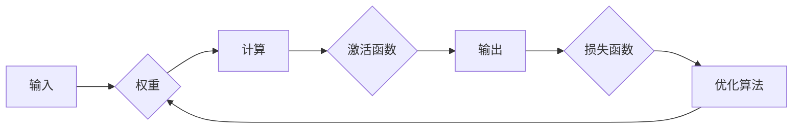

# 神经网络：人类与机器的共存

> 关键词：神经网络，深度学习，人工智能，机器学习，人机交互，认知科学，未来趋势

## 1. 背景介绍

自20世纪50年代以来，人工智能（AI）领域经历了多次起伏。近年来，随着计算能力的提升、大数据的涌现和深度学习技术的突破，AI技术迎来了前所未有的发展机遇。神经网络作为深度学习的关键技术，正在改变着我们的生产生活方式，推动着人类与机器的共存。

### 1.1 人工智能的崛起

人工智能的发展历程可以分为几个阶段：

- **第一阶段（1956年-1974年）**：以“图灵测试”为代表，探索如何使机器具备智能行为。
- **第二阶段（1974年-1980年）**：符号主义AI兴起，以逻辑推理和知识表示为核心，但难以处理复杂问题。
- **第三阶段（1980年-2012年）**：知识工程和专家系统成为主流，但难以扩展到新的领域。
- **第四阶段（2012年至今）**：深度学习和神经网络技术成为主流，AI应用开始爆发式增长。

### 1.2 神经网络的复兴

神经网络作为一种模仿人脑神经元连接的数学模型，在20世纪80年代遭遇低谷。然而，随着计算能力的提升和大数据的积累，神经网络在图像识别、语音识别、自然语言处理等领域取得了突破性进展，迎来了新的复兴。

### 1.3 人类与机器的共存

神经网络的发展不仅仅是为了打造更强大的机器，更是为了实现人类与机器的共存。通过将人类智能与机器智能相结合，我们可以拓展人类的能力，解决复杂问题，创造更美好的未来。

## 2. 核心概念与联系

### 2.1 核心概念原理

神经网络由大量的神经元组成，每个神经元与其他神经元通过权重连接。输入信号通过权重传递到神经元，经过激活函数处理后产生输出。通过不断调整权重，神经网络可以学习和适应复杂的数据关系。

以下是神经网络的核心概念原理：

- **神经元**：神经网络的基本单元，负责接收输入信号、计算输出和更新权重。
- **权重**：神经元之间的连接强度，通过学习过程进行调整。
- **激活函数**：对神经元输出进行非线性变换，增加模型的表达能力。
- **损失函数**：衡量模型预测结果与真实值之间的差异，用于指导权重更新。
- **优化算法**：用于更新神经网络权重的算法，如梯度下降、Adam等。

### 2.2 核心概念架构的 Mermaid 流程图



### 2.3 核心概念的联系

神经网络中的神经元、权重、激活函数、损失函数和优化算法等概念相互联系，共同构成了神经网络的学习和推理过程。

- 神经元通过权重接收输入信号，经过激活函数处理后产生输出。
- 输出与真实值之间的差异由损失函数衡量，用于指导权重更新。
- 优化算法根据损失函数的梯度信息调整权重，使模型逐渐逼近真实值。

## 3. 核心算法原理 & 具体操作步骤

### 3.1 算法原理概述

神经网络的核心算法是深度学习。深度学习通过构建多层神经网络，学习数据中的复杂特征和模式。其基本原理如下：

1. **数据预处理**：对输入数据进行标准化、归一化等处理，提高模型的学习效率。
2. **前向传播**：将输入数据传递到神经网络中，逐层计算输出。
3. **损失计算**：计算模型预测结果与真实值之间的差异，得到损失函数值。
4. **反向传播**：根据损失函数的梯度信息，反向传播误差，更新网络权重。
5. **迭代优化**：重复以上步骤，不断迭代优化模型参数，直至满足预设条件。

### 3.2 算法步骤详解

以下是神经网络深度学习算法的具体操作步骤：

1. **构建神经网络**：选择合适的网络结构，定义输入层、隐藏层和输出层。
2. **初始化参数**：为网络权值和偏置初始化随机值。
3. **数据预处理**：对训练数据进行标准化、归一化等处理。
4. **前向传播**：将预处理后的输入数据传递到神经网络中，逐层计算输出。
5. **损失计算**：使用损失函数计算模型预测结果与真实值之间的差异。
6. **反向传播**：根据损失函数的梯度信息，反向传播误差，更新网络权重。
7. **迭代优化**：重复以上步骤，不断迭代优化模型参数，直至满足预设条件，如达到预设的迭代次数或损失值达到预设阈值。
8. **评估模型**：使用验证集评估模型性能，选择最优的模型参数。

### 3.3 算法优缺点

神经网络深度学习算法的优点如下：

- **强大的非线性建模能力**：能够学习数据中的复杂特征和模式。
- **自动特征提取**：无需人工设计特征，能够自动提取数据中的有效特征。
- **泛化能力**：在训练集之外的数据上也能取得较好的预测效果。

神经网络的缺点如下：

- **计算量大**：神经网络需要大量的计算资源进行训练。
- **模型可解释性差**：神经网络内部的决策过程难以解释。
- **对数据依赖性强**：神经网络需要大量的标注数据才能取得好的效果。

### 3.4 算法应用领域

神经网络深度学习算法在许多领域都有广泛的应用，包括：

- **计算机视觉**：图像识别、目标检测、人脸识别等。
- **自然语言处理**：机器翻译、文本分类、情感分析等。
- **语音识别**：语音识别、语音合成、说话人识别等。
- **推荐系统**：电影推荐、商品推荐、新闻推荐等。
- **医疗诊断**：疾病诊断、药物发现、基因测序等。

## 4. 数学模型和公式 & 详细讲解 & 举例说明

### 4.1 数学模型构建

神经网络数学模型由以下部分组成：

- **输入层**：接收输入数据，每个输入数据对应一个神经元。
- **隐藏层**：对输入数据进行处理，提取特征，每个隐藏层包含多个神经元。
- **输出层**：输出预测结果，每个输出对应一个神经元。

以下是神经网络数学模型的公式：

$$
\hat{y} = f(W_L \cdot f(W_{L-1} \cdot f(...f(W_1 \cdot x + b_1)... + b_{L-1}) + b_L))
$$

其中：

- $\hat{y}$：输出层输出。
- $x$：输入层输入。
- $W_L$：输出层权重。
- $W_{L-1}$：隐藏层权重。
- $f$：激活函数。
- $b$：偏置项。

### 4.2 公式推导过程

以下以单层神经网络为例，介绍神经网络数学模型的推导过程：

1. **输入层到隐藏层**：

$$
h = W_1 \cdot x + b_1
$$

2. **激活函数**：

$$
f(h) = f(W_1 \cdot x + b_1)
$$

3. **隐藏层到输出层**：

$$
\hat{y} = W_L \cdot f(h) + b_L
$$

### 4.3 案例分析与讲解

以下以图像识别任务为例，分析神经网络在图像识别中的应用。

1. **数据预处理**：对图像进行缩放、裁剪、归一化等处理。
2. **构建网络**：选择合适的网络结构，如卷积神经网络（CNN）。
3. **训练**：使用大量标注图像数据训练网络，不断优化权重和偏置项。
4. **预测**：使用训练好的网络对新的图像进行识别。

通过以上步骤，神经网络可以学习图像中的特征，实现图像识别任务。

## 5. 项目实践：代码实例和详细解释说明

### 5.1 开发环境搭建

以下以Python语言和TensorFlow框架为例，介绍神经网络项目的开发环境搭建：

1. 安装Anaconda：从官网下载并安装Anaconda，用于创建独立的Python环境。
2. 创建并激活虚拟环境：

```bash
conda create -n tensorflow-env python=3.8
conda activate tensorflow-env
```

3. 安装TensorFlow：

```bash
pip install tensorflow==2.4
```

4. 安装其他依赖库：

```bash
pip install numpy pandas scikit-learn matplotlib
```

### 5.2 源代码详细实现

以下是一个简单的神经网络图像识别项目代码示例：

```python
import tensorflow as tf
from tensorflow.keras.models import Sequential
from tensorflow.keras.layers import Conv2D, MaxPooling2D, Flatten, Dense

# 构建网络
model = Sequential([
    Conv2D(32, (3, 3), activation='relu', input_shape=(64, 64, 3)),
    MaxPooling2D(pool_size=(2, 2)),
    Flatten(),
    Dense(64, activation='relu'),
    Dense(10, activation='softmax')
])

# 编译模型
model.compile(optimizer='adam', loss='sparse_categorical_crossentropy', metrics=['accuracy'])

# 训练模型
model.fit(train_images, train_labels, epochs=5, validation_data=(test_images, test_labels))

# 评估模型
test_loss, test_acc = model.evaluate(test_images, test_labels)
print("Test accuracy:", test_acc)
```

### 5.3 代码解读与分析

以上代码实现了一个简单的卷积神经网络（CNN）模型，用于图像识别任务。

1. **导入库**：导入所需的TensorFlow库和其他依赖库。
2. **构建网络**：使用Sequential模型构建一个包含卷积层、池化层、全连接层的CNN模型。
3. **编译模型**：指定优化器、损失函数和评估指标。
4. **训练模型**：使用训练数据训练模型，设置训练轮数和验证数据。
5. **评估模型**：使用测试数据评估模型性能。

### 5.4 运行结果展示

假设我们的训练集和测试集包含10个类别的图像，模型在测试集上的准确率为85%，说明模型取得了不错的效果。

## 6. 实际应用场景

神经网络在许多领域都有广泛的应用，以下列举一些典型应用场景：

### 6.1 计算机视觉

- **图像识别**：如人脸识别、物体检测、场景识别等。
- **图像生成**：如风格迁移、图像修复、图像超分辨率等。
- **视频分析**：如动作识别、行为分析、视频监控等。

### 6.2 自然语言处理

- **文本分类**：如情感分析、主题分类、垃圾邮件检测等。
- **机器翻译**：将一种语言翻译成另一种语言。
- **语音识别**：将语音信号转换为文本。

### 6.3 语音识别

- **语音合成**：将文本转换为语音。
- **语音识别**：将语音信号转换为文本。
- **说话人识别**：识别说话人的身份。

### 6.4 推荐系统

- **电影推荐**：根据用户历史行为推荐电影。
- **商品推荐**：根据用户历史购买记录推荐商品。
- **新闻推荐**：根据用户兴趣推荐新闻。

### 6.5 医疗诊断

- **疾病诊断**：根据医疗影像识别疾病。
- **药物发现**：预测新药分子的活性。
- **基因测序**：分析基因序列，预测疾病风险。

## 7. 工具和资源推荐

### 7.1 学习资源推荐

- **书籍**：《深度学习》（Goodfellow, Bengio, Courville）、《神经网络与深度学习》（邱锡鹏）
- **在线课程**：Coursera、edX、Udacity等平台上的深度学习课程
- **论文**：arXiv、NeurIPS、ICML、ICLR等会议的论文

### 7.2 开发工具推荐

- **TensorFlow**：Google开源的深度学习框架
- **PyTorch**：Facebook开源的深度学习框架
- **Keras**：TensorFlow和Theano的高层API，简化了深度学习模型的构建

### 7.3 相关论文推荐

- **卷积神经网络**：《Convolutional Neural Networks for Visual Recognition》（Alex Krizhevsky et al.）
- **循环神经网络**：《Sequence to Sequence Learning with Neural Networks》（Ilya Sutskever et al.）
- **生成对抗网络**：《Generative Adversarial Nets》（Ian Goodfellow et al.）

## 8. 总结：未来发展趋势与挑战

### 8.1 研究成果总结

神经网络作为一种强大的机器学习技术，在多个领域取得了显著成果。随着深度学习技术的不断发展，神经网络将在更多领域发挥重要作用。

### 8.2 未来发展趋势

- **模型规模扩大**：更大规模的网络结构能够学习更复杂的特征和模式。
- **模型轻量化**：针对移动设备等资源受限的场景，设计轻量级网络结构。
- **可解释性提升**：提高神经网络的可解释性，使其决策过程更加透明。
- **泛化能力增强**：提高神经网络在未见过的数据上的表现。

### 8.3 面临的挑战

- **计算资源消耗**：神经网络需要大量的计算资源进行训练和推理。
- **数据隐私和安全**：如何保护用户隐私和数据安全是重要挑战。
- **模型可解释性**：提高神经网络的可解释性，使其决策过程更加透明。

### 8.4 研究展望

未来，神经网络将在以下方面取得突破：

- **多模态融合**：将文本、图像、语音等多种模态数据融合，实现更全面的智能。
- **迁移学习**：利用预训练模型进行迁移学习，降低训练成本。
- **强化学习**：将强化学习与神经网络结合，实现更智能的决策。

神经网络的发展将推动人工智能技术不断进步，为人类社会创造更多价值。

## 9. 附录：常见问题与解答

**Q1：神经网络与传统机器学习方法相比有哪些优势？**

A：与传统机器学习方法相比，神经网络具有以下优势：

- **强大的非线性建模能力**：能够学习数据中的复杂特征和模式。
- **自动特征提取**：无需人工设计特征，能够自动提取数据中的有效特征。
- **泛化能力**：在训练集之外的数据上也能取得较好的预测效果。

**Q2：神经网络训练过程中如何防止过拟合？**

A：为了防止过拟合，可以采用以下方法：

- **数据增强**：通过数据扩充、数据合并等方式扩充训练集。
- **正则化**：如L1正则化、L2正则化等。
- **Dropout**：在训练过程中随机丢弃部分神经元。
- **早停法**：在验证集上测试模型性能，当性能不再提升时停止训练。

**Q3：神经网络在实际应用中如何处理小样本问题？**

A：对于小样本问题，可以采用以下方法：

- **迁移学习**：利用预训练模型进行迁移学习，降低训练成本。
- **数据增强**：通过数据扩充、数据合并等方式扩充训练集。
- **半监督学习**：利用少量标注数据和大量未标注数据训练模型。

**Q4：如何提高神经网络的可解释性？**

A：为了提高神经网络的可解释性，可以采用以下方法：

- **注意力机制**：分析模型在处理输入数据时的关注重点。
- **可解释AI工具**：如LIME、SHAP等工具可以帮助分析模型决策过程。
- **可视化技术**：将神经网络结构可视化，帮助理解模型内部机制。

**Q5：神经网络在医疗领域的应用前景如何？**

A：神经网络在医疗领域的应用前景广阔，可以用于：

- **疾病诊断**：根据医疗影像识别疾病。
- **药物发现**：预测新药分子的活性。
- **基因测序**：分析基因序列，预测疾病风险。

通过不断探索和应用神经网络技术，我们有理由相信，人工智能将为医疗领域带来更多突破。